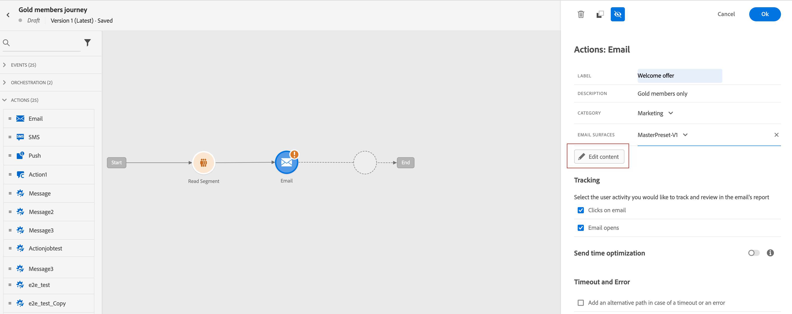

# Create an email {#configure-email}

>[!CONTEXTUALHELP]
>id="ajo_message_email"
>title="Email creation"
>abstract="Define your email parameters in just three simple steps."

To create an email, follow the steps below:

1. Add an **[!UICONTROL Email]** action in a journey or a campaign:

>[!BEGINTABS]

>[!TAB Add an Email to a Journey]

1. Open your journey, then drag and drop an Email activity from the **[!UICONTROL Actions]** section of the palette.

    

1. Provide basic information on your message (label, description, category), then choose the channel surface to use.

    

    For more information on how to configure a journey, refer to [this page](../building-journeys/journey-gs.md)

>[!TAB Add an email to a Campaign]

1. Create a new scheduled or API-triggered campaign, select **[!UICONTROL Email]** as your action and choose the channel surface to use. [Learn more on Email configuration](email-settings.md).

   

1. Click **[!UICONTROL Create]**.

1. From the **[!UICONTROL Properties]** section, edit your Campaign's **[!UICONTROL Title]** and **[!UICONTROL Description]**.

    

1. Click the **[!UICONTROL Select audience]** button to define the audience to target from the list of available Adobe Experience Platform segments. [Learn more](../segment/about-segments.md).

1. In the **[!UICONTROL Identity namespace]** field, choose the namespace to use in order to identify the individuals from the selected segment. [Learn more](../event/about-creating.md#select-the-namespace).

    

1. Campaigns are designed to be executed on a specific date or on a recurring frequency. Learn how to configure the **[!UICONTROL Schedule]** of your campaign in [this section](../campaigns/create-campaign.md#schedule). 

1. From the **[!UICONTROL Action triggers]** menu, choose the **[!UICONTROL Frequency]** of your email:

    * Once
    * Daily
    * Weekly
    * Monthly

>[!ENDTABS]

2. From the journey or campaign configuration screen, click the **[!UICONTROL Edit content]** button to configure the email content. [Design an email](design-emails.md)

3. Once your message content has been defined, you can use test profiles to preview and test it. 

4. When your email is ready, complete the configuration of your [journey](../building-journeys/journey-gs.md) or [campaign](../campaigns/create-campaign.md) to send it.

    To track the behavior of your recipients through email openings and/or interactions, make sure that the dedicated options in the tracking section are enabled in the [email activity](../building-journeys/journeys-message.md) or [campaign](../campaigns/create-campaign.md). 

## Define your email content{#email-content}

Use [!DNL Journey Optimizer] Email Designer to [design your email from scratch](../design/create-email-content.md). If you have an existing content, you can [import it in the Email Designer](../design/existing-content.md), or [code your own content](../design/code-content.md) in [!DNL Journey Optimizer]. 

[!DNL Journey Optimizer] comes with a set of [built-in templates](../design/email-templates.md) to help you start. Any email can also be saved as a template.

Use [!DNL Journey Optimizer] Expression editor to personalize your messages with profiles' data. For more on personalization, refer to [this section](../personalization/personalize.md).

Adapt the content of your messages to the targeted profiles by using [!DNL Journey Optimizer] dynamic content capabilities. [Get started with dynamic content](../personalization/get-started-dynamic-content.md)

## Email tracking{#email-tracking}

If you want to track the behavior of your recipients through openings and/or clicks on links, enable the following options: **[!UICONTROL Email opens]** and **[!UICONTROL Click on email]**. 

Learn more about tracking in [this section](../design/message-tracking.md).

## Validate your email content{#email-content-validate}

Control the rendering of your email, and check personalization settings with test profiles, using the preview section on the left-hand side. For more on this, refer to [this section](../design/preview.md).

You must also check alerts in the upper section of the editor.  Some of them are simple warnings, but others can prevent you from using the message. Learn more in [this section](alerts.md).

>[!NOTE]
>
>The **[!UICONTROL From email]** and **[!UICONTROL From name]** are determined by the **[!UICONTROL Surface]** that has been selected when [creating the message](get-started-content.md).

