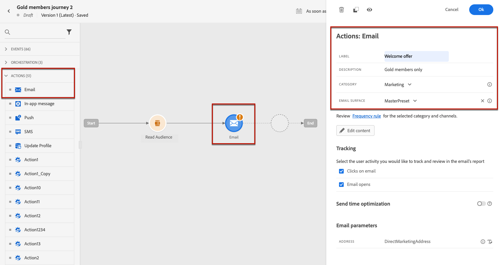
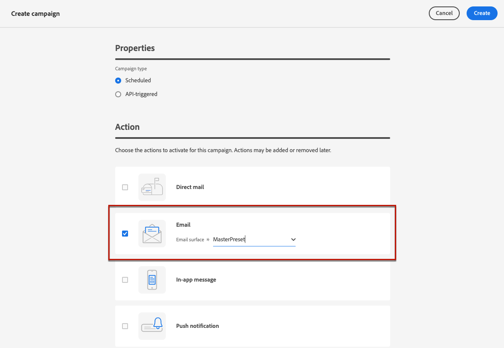
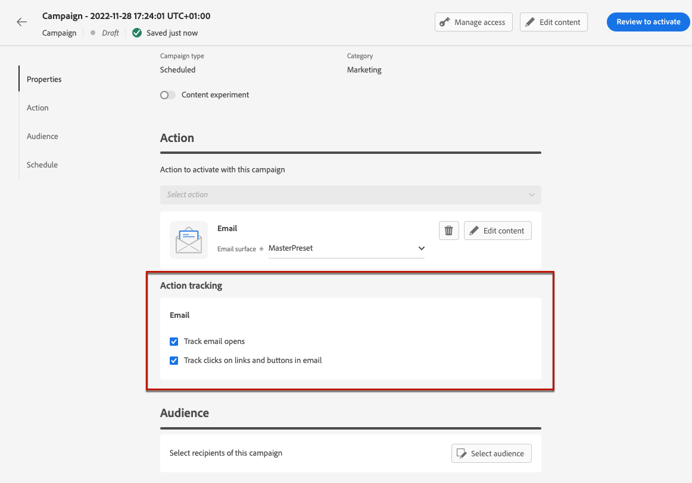
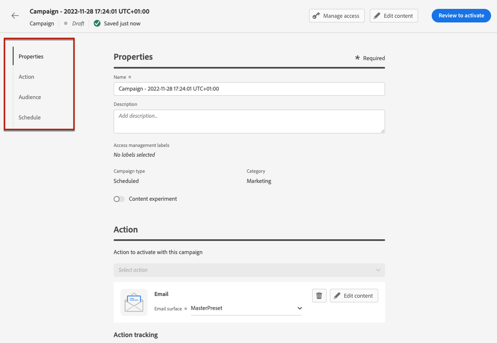

# Create an email {#create-email}

>[!CONTEXTUALHELP]
>id="ajo_message_email"
>title="Email creation"
>abstract="Define your email parameters in just three simple steps."

To create an email, follow the steps below.

1. Add an **[!UICONTROL Email]** action to a journey or a campaign, and follow the steps below according to your case.

>[!BEGINTABS]

>[!TAB Add an email to a journey]

Open your journey, then drag and drop an **[!UICONTROL Email]** activity from the **[!UICONTROL Actions]** section of the palette. Provide basic information on your message (label, description, category), then choose the [email surface](email-settings.md) to use.

For more information on how to configure a journey, refer to [this page](../building-journeys/journey-gs.md).

>[!TAB Add an email to a campaign]

Create a new scheduled or API-triggered campaign, select **[!UICONTROL Email]** as your action and choose the [email surface](email-settings.md) to use.

   
<!--
    From the **[!UICONTROL Action]** section, specify if you want to track how your recipients react to your delivery: you can track email opens, and/or clicks on links and buttons in your email.
    
-->

Click **[!UICONTROL Create]** and complete the steps to create an email campaign.

For more information on how to configure a campaign, refer to [this page](../campaigns/get-started-with-campaigns.md).

>[!ENDTABS]

1. From the journey or campaign configuration screen, click the **[!UICONTROL Edit content]** button to configure the email content. [Learn more](design-emails.md)

    >[!NOTE]
    >
    >Use [!DNL Journey Optimizer] Email Designer to [design your email from scratch](../design/create-email-content.md). If you have an existing content, you can [import it in the Email Designer](../design/existing-content.md), or [code your own content](../design/code-content.md) in [!DNL Journey Optimizer]. [!DNL Journey Optimizer] also comes with a set of [built-in templates](email-templates.md) to help you start.

1. Once your message content has been defined, you can preview it to control the rendering of your email, and check personalization settings with test profiles. [Learn more](preview.md)

1. When your email is ready, complete the configuration of your [journey](../building-journeys/journey-gs.md) or [campaign](../campaigns/create-campaign.md) to send it.

    >[!NOTE]
    >
    >To track the behavior of your recipients through email openings and/or interactions, make sure that the dedicated options in the **[!UICONTROL Tracking]** section are enabled in the journey's [email activity](../building-journeys/journeys-message.md) or in the email [campaign](../campaigns/create-campaign.md).

<!--

## Define your email content {#email-content}

Use [!DNL Journey Optimizer] Email Designer to [design your email from scratch](../email/create-email-content.md). If you have an existing content, you can [import it in the Email Designer](../design/existing-content.md), or [code your own content](../design/code-content.md) in [!DNL Journey Optimizer]. 

[!DNL Journey Optimizer] comes with a set of [built-in templates](email-templates.md) to help you start. Any email can also be saved as a template.

Use [!DNL Journey Optimizer] Expression editor to personalize your messages with profiles' data. For more on personalization, refer to [this section](../personalization/personalize.md).

Adapt the content of your messages to the targeted profiles by using [!DNL Journey Optimizer] dynamic content capabilities. [Get started with dynamic content](../personalization/get-started-dynamic-content.md)

## Email tracking {#email-tracking}

If you want to track the behavior of your recipients through openings and/or clicks on links, enable the following options: **[!UICONTROL Email opens]** and **[!UICONTROL Click on email]**. 

Learn more about tracking in [this section](message-tracking.md).

## Validate your email content {#email-content-validate}

Control the rendering of your email, and check personalization settings with test profiles, using the preview section on the left-hand side. For more on this, refer to [this section](preview.md).

You must also check alerts in the upper section of the editor.  Some of them are simple warnings, but others can prevent you from using the message. Learn more in [this section](alerts.md).

-->

