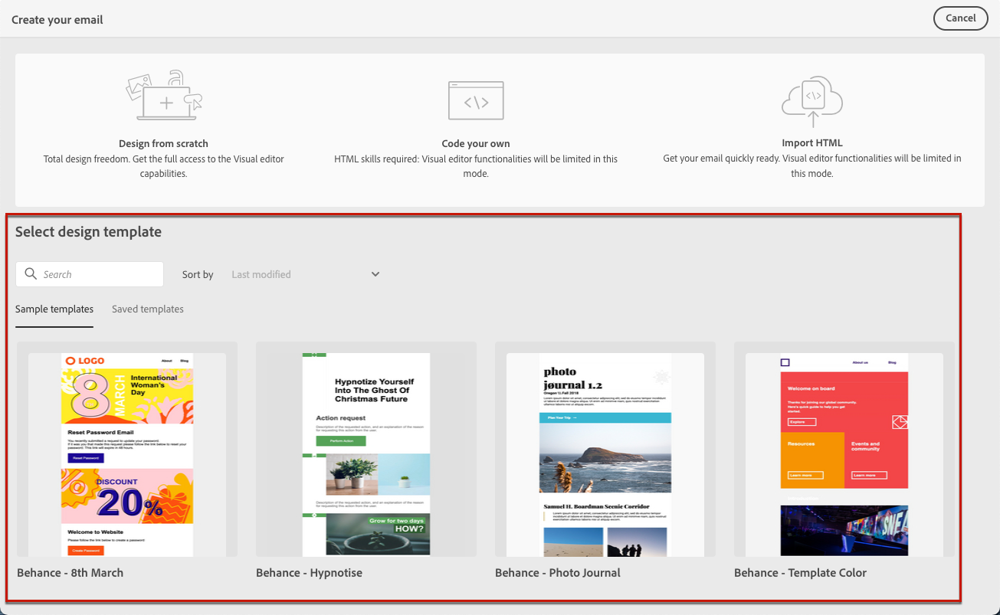
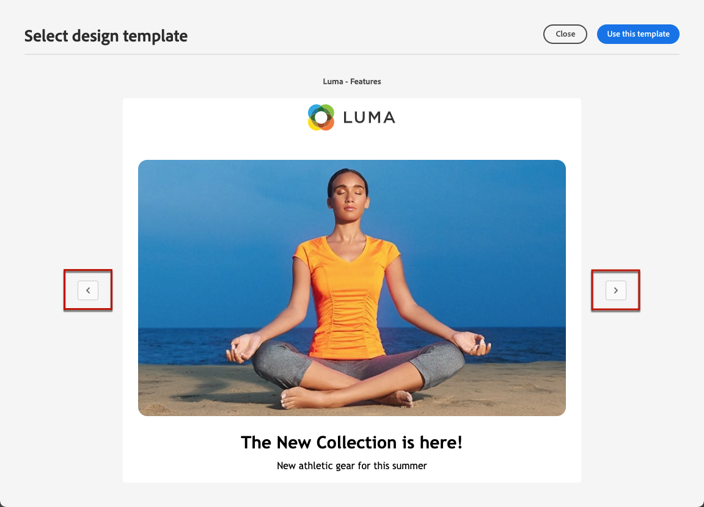
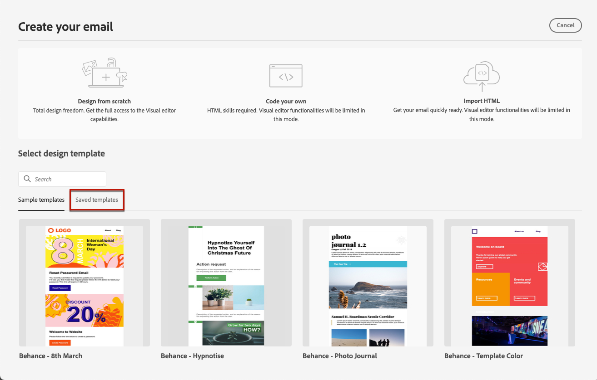
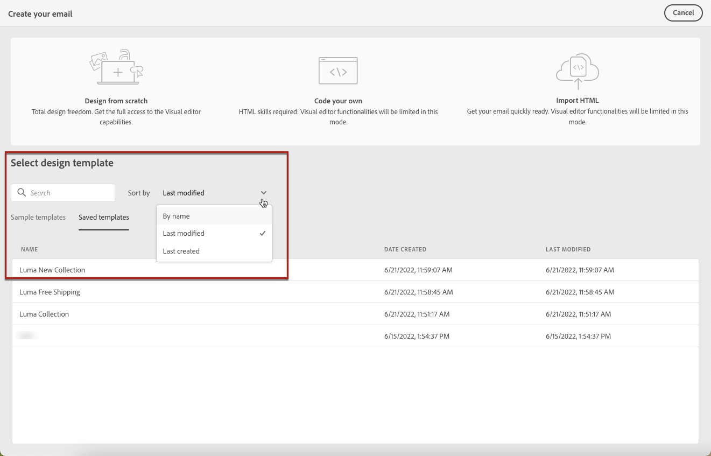

# Work with email templates {#email-templates}

From the **[!UICONTROL Create your email]** screen, use the **[!UICONTROL Select design template]** section to start building your content from a template.

You can choose from:
* Sample templates. [Learn more](#use-sample-template)
* Content templates that:
    * You created from scratch using the **[!UICONTROL Content templates]** menu. [Learn more](content-templates.md#create-content-templates)
    * You saved as template from an email content. [Learn more](content-templates.md#save-as-template)

## Use a sample template {#use-sample-template}

The [!DNL Journey Optimizer] interface offes 20 out-of-the-box email templates that you can choose from.

1. Access the Email Designer from the email **[!UICONTROL Edit content]** screen. [Learn more](get-started-email-design.md).

1. On the **[!UICONTROL Create your email]** screen, the **[!UICONTROL Sample templates]** tab is selected by default.

1. Select the template of your choice from the list.

1. Once selected, you can navigate between all the sample templates using the right and left arrrows.

    

1. Click **[!UICONTROL Use this template]** on top right of the screen.

1. Edit your content as desired using the Email Designer.

## Use a saved template {#use-saved-template}

To start building your content, you can also use a custom template that you created either from the [content template](content-templates.md#create-content-templates) list, either from a journey or a campaign using the [Save as template](content-templates.md#save-as-template) option. Follow the steps below.

1. Access the Email Designer from the email **[!UICONTROL Edit content]** screen. [Learn more](get-started-email-design.md).

1. On the **[!UICONTROL Create your email screen]**, the **[!UICONTROL Sample templates]** tab is selected by default. Select the **[!UICONTROL Saved templates]** tab.

    

1.  The list of all previously [saved templates](content-templates.md#save-as-template) displays. You can sort them **[!UICONTROL By name]**, **[!UICONTROL Last modified]** and **[!UICONTROL Last created]**.

    

1. Select the template of your choice from the list.

1. Once selected, you can navigate between all the saved templates using the right and left arrrows.

    

1. Click **[!UICONTROL Use this email]** on top right of the screen.

1. Edit your content as desired using the Email Designer.
