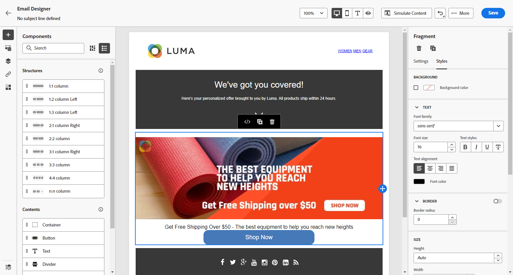

# Import your email content {#existing-content}

[!DNL Journey Optimizer] allows you to import existing HTML content to design your emails. This content can be:

* An **HTML file** with an incorporated style sheet;
* A **.zip folder** including an HTML file, the style sheet (.css) and images.

    >[!NOTE]
    >
    >There are no constraints on the .zip file structure. However, references must be relative and fit with the tree structure of the .zip folder.

To import a file containing HTML content, follow the steps below:

1. From the Email Designer home page, select **[!UICONTROL Import HTML]**.

    

1. Drag and drop the HTML or .zip file containing your HTML content and click **[!UICONTROL Import]**.

    

1. Once the HTML content is uploaded, your content will be in **[!UICONTROL Compatibility mode]**. 

    In this mode, you can only personalize your text, add links, or include assets to your content.

1. To be able to leverage the Email Designer content components, access the **[!UICONTROL HTML converter]** tab and click **[!UICONTROL Convert]**.

    

    >[!NOTE]
    >
    > Using a `<table>` tag as the first layer in an HTML file can cause style loss, including background and width settings in the top layer tag.

1. You can now personalize your imported file as needed with the Email Designer functionalities [Learn more](content-from-scratch.md).

## How-to video {#video}

Learn how to import existing HTML content, tweak the design, add mirror page and unsubscribe links, and how to code your content.

>[!VIDEO](https://video.tv.adobe.com/v/334102?quality=12)
