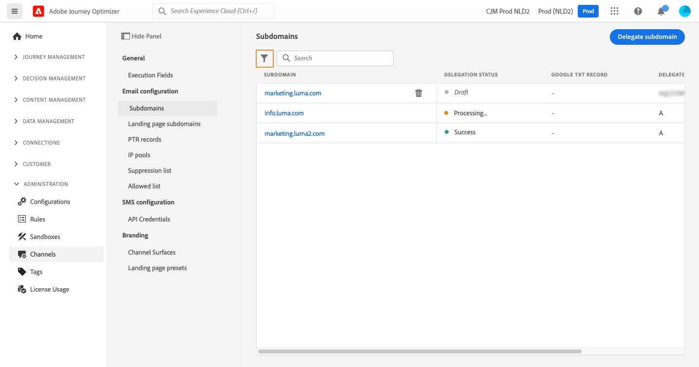
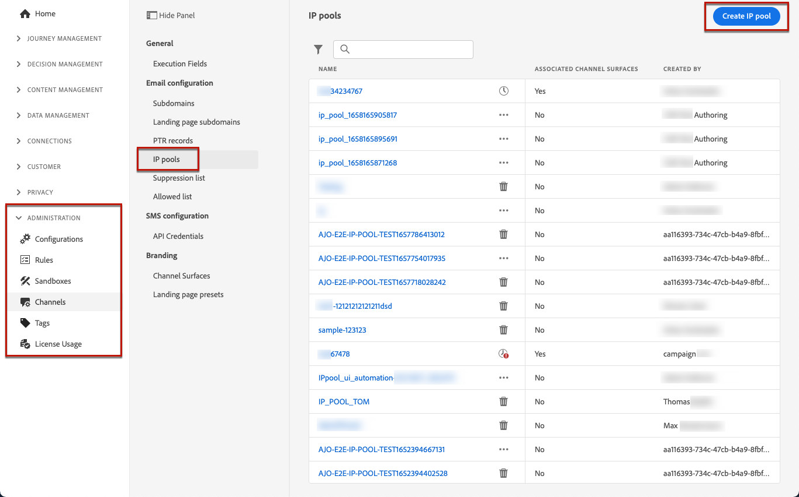
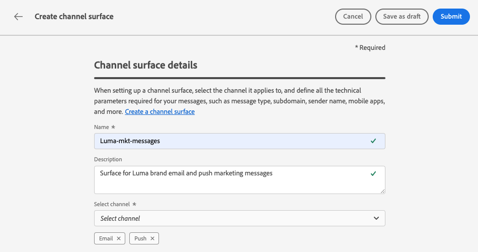
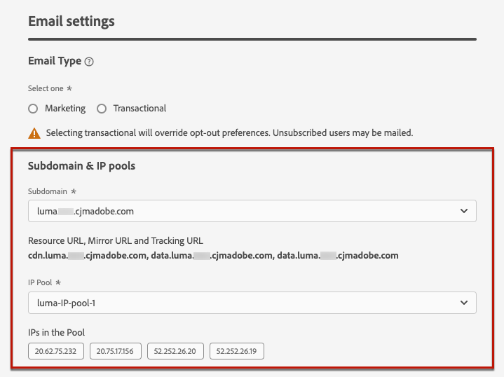
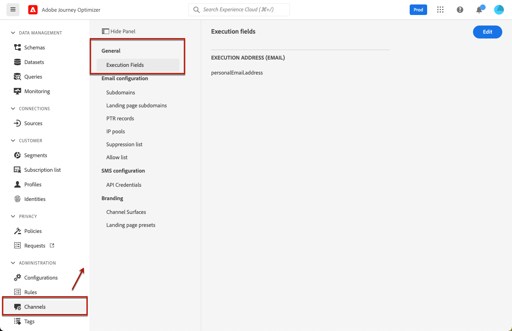
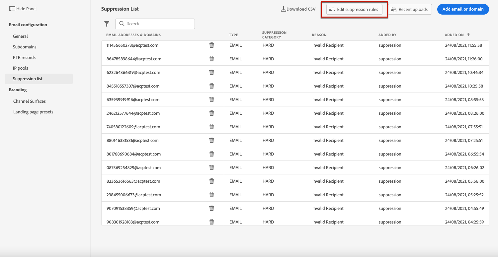

# Get started with email configuration {#get-starte-email-config}

To be able to send emails through journeys and campaigns in [!DNL Journey Optimizer], you need to go through a number of configuration steps.

1. To ensure optimal deliverability and protect your reputation, start by delegating to Adobe the subdomains you are going to use to send your emails with [!DNL Journey Optimizer]. These subdomains will determine elements such as the web pages to be tracked and the mirror page URLs. [Learn more](../configuration/about-subdomain-delegation.md)

    

1. Improve your email deliverability and reputation by grouping together IP addresses provisioned with your instance. [Learn more](../configuration/ip-pools.md)

    

1. Create channel surfaces and select the **[!UICONTROL Email]** channel. [Learn more](../configuration/channel-surfaces.md)

    

1. In each email channel surface, configure all the technical parameters required to deliver emails. [Learn more](email-settings.md)

    * This is where you select the subdomain to use to send the emails and the IP pools to associate with the surface. [Learn more](email-settings.md#subdomains-and-ip-pools)

    
    
    * The **[!UICONTROL Sender email]** and **[!UICONTROL Error email]** addresses must use the current selected delegated subdomain. [Learn more](email-settings.md#email-header)

    

1. Determine which email address to use in priority for your recipients when several addresses are available in Adobe Experience Platform. [Learn more](../configuration/primary-email-addresses.md)

    

1. Manage the number of days during which retries are performed before sending email addresses to the suppression list. [Learn more](../configuration/manage-suppression-list.md)

    
