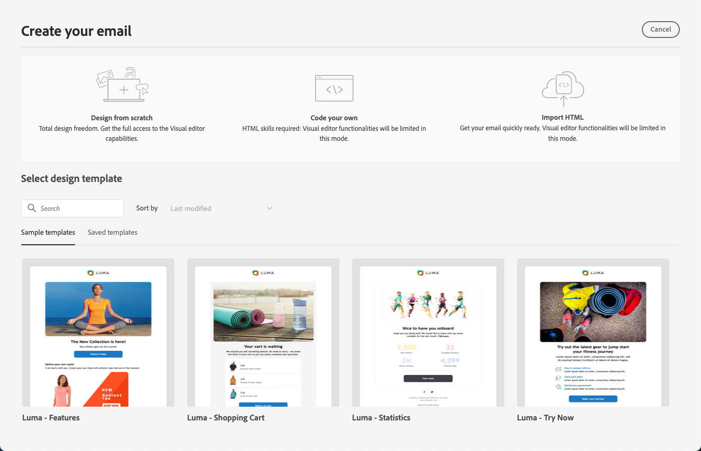
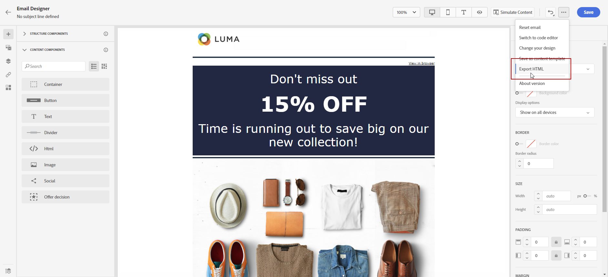

# Get started with email design {#get-started-content-design}

You can import an existing content in [!DNL Journey Optimizer] or leverage content design capabilities:

* Use [!DNL Journey Optimizer] **email designing capabilities** to design or import responsive emails. [Learn more](content-from-scratch.md)

* Leverage **Adobe Experience Manager Assets Essentials** to enrich your emails, build and manage your own assets database. [Learn more](../content-management/assets-essentials.md)

* Find **Adobe Stock photos** to build your content and improve your email design. [Learn more](../content-management/stock.md)

* Enhance customers' experience by creating personalized and dynamic messages based on their profile attributes. Learn more about [personalization](../personalization/personalize.md) and [dynamic content](../personalization/get-started-dynamic-content.md).

➡️ [Discover this feature in video](#video)

## Email design best practices {#best-practices}

When sending emails, it's important to consider that recipients may forward them, which can sometimes cause issues with the email's rendering. This is particularly true when using CSS classes that may not be supported by the email provider used for forwarding, for example, if you're using the "is-desktop-hidden" CSS class to hide an image on mobile devices.

To minimize these rendering issues, we recommend keeping your email design structure as simple as possible. Try to use a single design that works well for both desktop and mobile devices, and avoid using complex CSS classes or other design elements that may not be fully supported by all email clients. By following these best practices, you can help ensure that your emails are consistently rendered correctly, regardless of how they are viewed or forwarded by recipients.

## Key steps to create email content {#key-steps}

Once you have [added an email](create-email.md) to a journey or a campaign, you can start creating your email content.

1. From the journey or campaign configuration screen, go through the **[!UICONTROL Edit content]** screen to access the Email Designer. [Learn more](create-email.md#define-email-content)

    

1. On the Email Designer home page, choose how you want to design your email from the following options:

    * **Design your email from scratch** through the email designer's interface and leverage images from [Adobe Experience Manager Assets Essentials](../content-management/assets-essentials.md). Learn how to design your email content in [this section](content-from-scratch.md).

    * **Code or paste raw HTML** directly in the email designer. Learn how to code your own content in [this section](code-content.md).
    
        >[!NOTE]
        >
        >In a campaign, you can also select the **[!UICONTROL Code Editor]** button from the **[!UICONTROL Edit content]** screen. [Learn more](create-email.md#define-email-content)

    * **Import existing HTML content** from a file or a .zip folder. Learn how to import an email content in [this section](existing-content.md).

    * **Select an existing content** from a list of built-in or custom templates. Learn how to work with email templates [this section](../email/use-email-templates.md).

    

1. Once your email content has been defined and personalized, you can export your content for validation or for later use. Click **[!UICONTROL Export HTML]** to save on your computer a zip file which will include your HTML and assets.

   

## How-to videos {#video}

Learn how to create email content with the message editor.

>[!VIDEO](https://video.tv.adobe.com/v/334150?quality=12)

Learn how to configure content experiments to A/B test and explore email content best drives your business objectives.

>[!VIDEO](https://video.tv.adobe.com/v/3419893)
