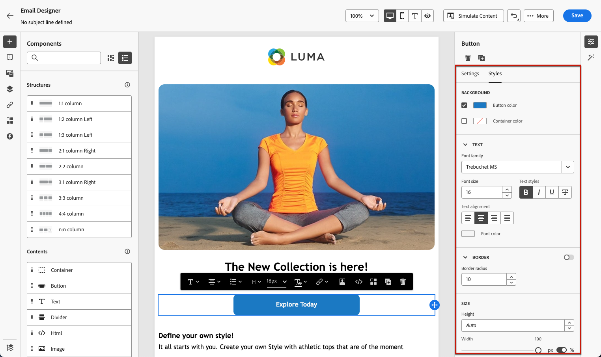

# Get started with email style {#get-started-email-style}

Once you started creating your email content in [!DNL Journey Optimizer], you can adjust a number of styling parameters and attributes from the Email Designer **[!UICONTROL Styles]** pane.

You can either apply your changes to the email body, to a structure component or to a content component.

Follow the links below to discover how to adjust some of the style settings in your email.

* Learn how to [personalize your email background](backgrounds.md)
* Learn how to [manage vertical alignment and padding](alignment-and-padding.md)
* Learn how to [customize inline styling attributes](inline-styling.md)
