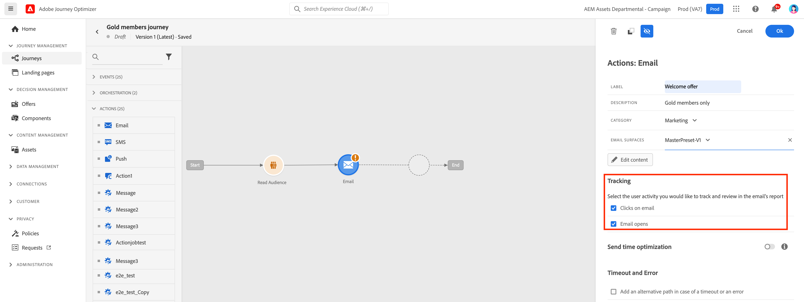
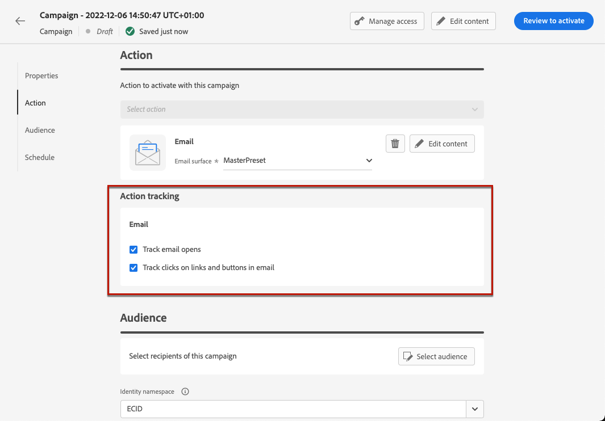
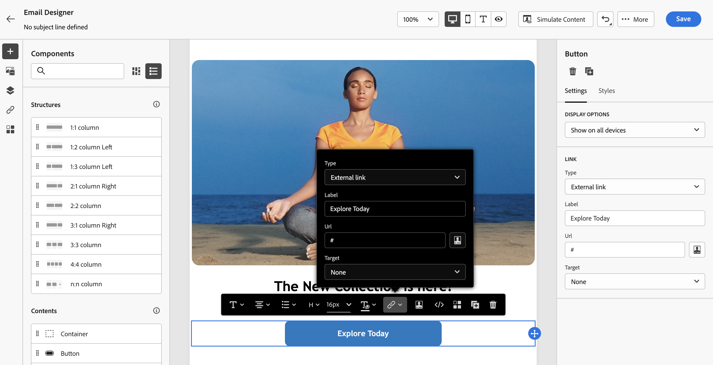
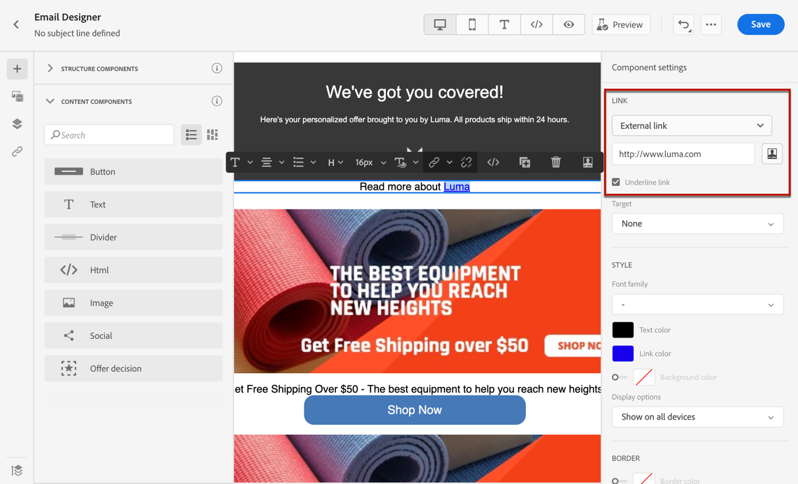
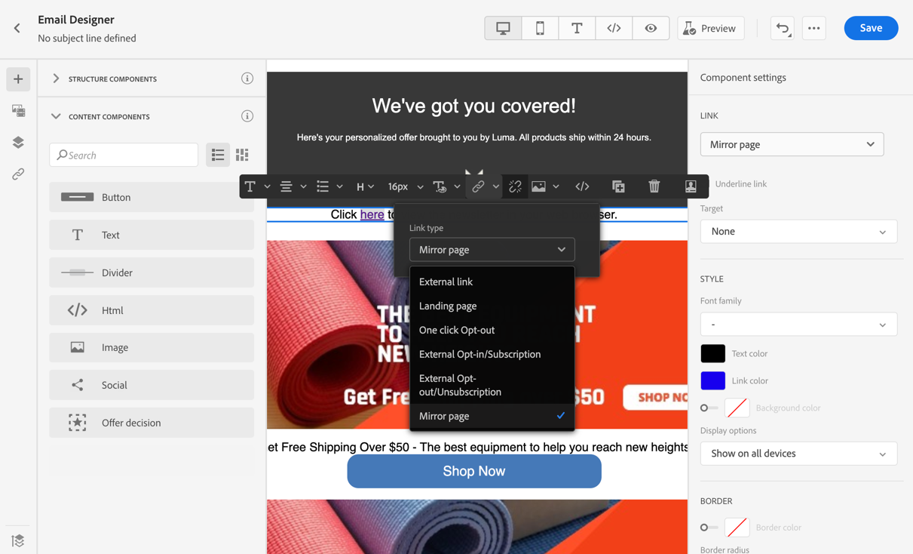
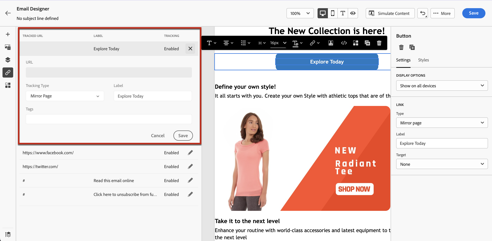
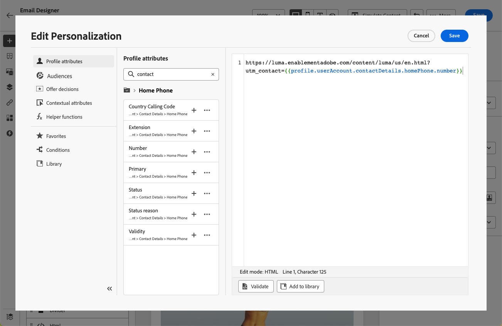

# Add links and track messages {#tracking}

Use [!DNL Journey Optimizer] to add links to your content and track the messages sent in order to monitor the behavior of your recipients.

## Enable tracking {#enable-tracking}

You can enable tracking at the email message level by checking the **[!UICONTROL Email opens]** and/or **[!UICONTROL Click on email]** options when creating your message inside a journey or a campaign.

>[!BEGINTABS]

>[!TAB Enable tracking in a journey]

>[!TAB Enable tracking in a campaign]

>[!ENDTABS]

>[!NOTE]
>
>Both options are enabled by default.

This will let you track the behavior of your recipients through:

* **[!UICONTROL Email opens]**: Messages that have been opened.
* **[!UICONTROL Click on email]**: Clicks on links in an email.

## Insert links {#insert-links}

When designing a message, you can add links to your content.

>[!NOTE]
>
>When [tracking is enabled](#enable-tracking), all links included in the message content are tracked.

To insert links into your email content, follow the steps below:

1. Select an element and click **[!UICONTROL Insert link]** from the contextual toolbar.

    

1. Choose the type of link you want to create:

    * **[!UICONTROL External link]**: Insert a link to an external URL.

    * **[!UICONTROL Landing page]**: Insert a link to a landing page. [Learn more ](../landing-pages/get-started-lp.md)

    * **[!UICONTROL One click Opt-out]**: Insert a link to enable users to quickly unsubscribe from your communications without the need to confirm opting out. [Learn more](email-opt-out.md#one-click-opt-out).

    * **[!UICONTROL External Opt-in/Subscription]**: Insert a link to accept receiving communications from your brand.

    * **[!UICONTROL External Opt-out/Unsubscription]**: Insert a link to unsubscribe from receiving communications from your brand. Learn more on opt-out management in [this section](email-opt-out.md#opt-out-management).

    * **[!UICONTROL Mirror page]**: Add a link to display the email content in a web browser. [Learn more](#mirror-page)

1. Enter the desired URL in the corresponding field, or select a landing page, and define the link settings and styles. [Learn more](#adjust-links)

    >[!NOTE]
    >
    >For interpreting URLs, [!DNL Journey Optimizer] complies with the URI syntax ([RFC 3986 standard](https://datatracker.ietf.org/doc/html/rfc3986)), which disables some special international characters in URLs. When trying to send the proof or email, if you are returned an error involving a URL added to your content, you can URL encode the string as a workaround.

1. You can personalize your links. [Learn more](../personalization/personalization-syntax.md#perso-urls)

1. Save your changes.

1. Once the link is created, you can still modify it from the **[!UICONTROL Settings]** and **[!UICONTROL Styles]** panes on the right.

    

>[!NOTE]
>
>Marketing-type email messages must include an [opt-out link](../privacy/opt-out.md#opt-out-management), which is not required for transactional messages. The message category (**[!UICONTROL Marketing]** or **[!UICONTROL Transactional]**) is defined in the [channel surface](../configuration/channel-surfaces.md#email-type) when creating the message.

## Adjust links {#adjust-links}

You can make adjustments to your links using the **[!UICONTROL Settings]** and **[!UICONTROL Styles]** panes on the right. You can underline a link, edit its color and select its target.

1. In a **[!UICONTROL Text]** component where a link is inserted, select your link.

1. From the **[!UICONTROL Settings]** tab, choose how your audience will be redirected with the **[!UICONTROL Target]** drop-down:

    * **[!UICONTROL None]**: opens the link in the same frame as it was clicked (default).
    * **[!UICONTROL Blank]**: opens the link in a new window or tab.
    * **[!UICONTROL Self]**: opens the link in the same frame as it was clicked.
    * **[!UICONTROL Parent]**: opens the link in the parent frame.
    * **[!UICONTROL Top]**: opens the link in the full body of the window.

   

1. Check **[!UICONTROL Underline link]** to underline the label text of your link.

   

1. To change the color of your link, click on **[!UICONTROL Link color]** from the **[!UICONTROL Styles]** tab.

   

1. Save your changes.

## Link to a mirror page {#mirror-page}

The mirror page is an HTML page accessible online via a web browser. Its content is identical to the content of your email.

To add a link to a mirror page in your email, [insert a link](#insert-links) and select **[!UICONTROL Mirror page]** as the type of link.

The mirror page is automatically created.

>[!IMPORTANT]
>
>Mirror pages links are auto-generated and cannot be edited. They contain all the encrypted personalized data that is required to render the original email. As a result, using personalised attributes with large values may generate lengthy mirror pages URLs, which can prevent the link from working in web browsers that have a maximum URLs length.

Once the email is sent, when the recipients click the mirror page link, the content of the email is displayed in their default web browser.

>[!NOTE]
>
>In the [proof](preview.md#send-proofs) sent to the test profiles, the link to the mirror page is not active. It is only activated in the final messages.

The retention period for a mirror page is 60 days. After that delay, the mirror page will no longer be available.

## Manage tracking {#manage-tracking}

The [Email Designer](content-from-scratch.md) allows you to manage the tracked URLs, such as editing the tracking type for each link.

1. Click the **[!UICONTROL Links]** icon from the left pane to display the list of all the URLs of your content that will be tracked.

    This list enables you to have a centralized view and to locate each URL in the email content.

1. To edit a link, click the corresponding pencil icon.

1. You can modify the **[!UICONTROL Tracking Type]** if needed:

   

    For each tracked URL, you can set the tracking mode to one of these values:

    * **[!UICONTROL Tracked]**: Activates tracking on this URL.
    * **[!UICONTROL Opt out]**: Considers this URL as an opt-out or unsubscription URL.
    * **[!UICONTROL Mirror page]**: Considers this URL is a mirror page URL.
    * **[!UICONTROL Never]**: Never activates tracking of this URL. <!--This information is saved: if the URL appears again in a future message, its tracking is automatically deactivated.-->

Reporting on openings and clicks is available in the [Live report](../reports/live-report.md) and in the [Global report](../reports/global-report.md).

## URL tracking {#url-tracking}

Usually [URL tracking](email-settings.md#url-tracking) is managed at the surface level, but profile attributes are not supported. Currently the only way to do it is to [personalize URLs](../personalization/personalization-syntax.md#perso-urls) in the email designer.

To add personalized URL tracking parameters to your links, follow the steps below.

1. Select a link and click **[!UICONTROL Insert link]** from the contextual toolbar.

1. Select the personalization icon. It is only available for these types of links: **External link**, **Unsubscription link** and **Opt-Out**.

    

1. Add the URL tracking parameter and select the profile attribute of your choice from the expression editor.

    

1. Save your changes.

1. Repeat the steps above for each link you want to add this tracking parameter to.

Now when the email is sent out, this parameter will be automatically appended to the end of the URL. You can then capture this parameter in web analytics tools or in performance reports.

>[!NOTE]
>
>To verify the final URL, you can [send a proof](preview.md#send-proofs) and click the link in the content of the email once you receive the proof. The URL should display the tracking parameter. In the example above, the final URL will be: https://luma.enablementadobe.com/content/luma/us/en.html?utm_contact=profile.userAccount.contactDetails.homePhone.number
