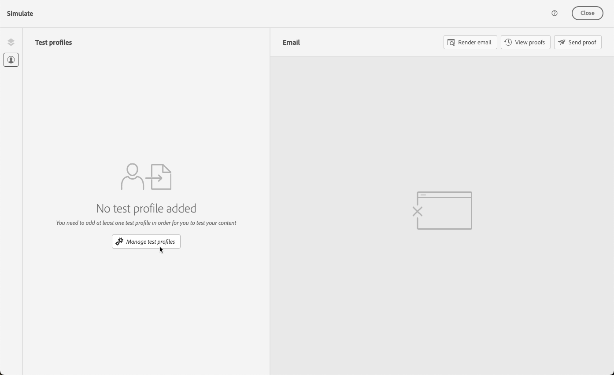
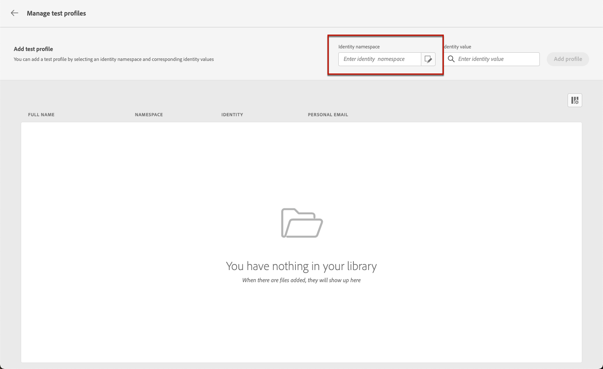
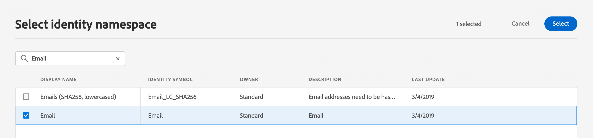
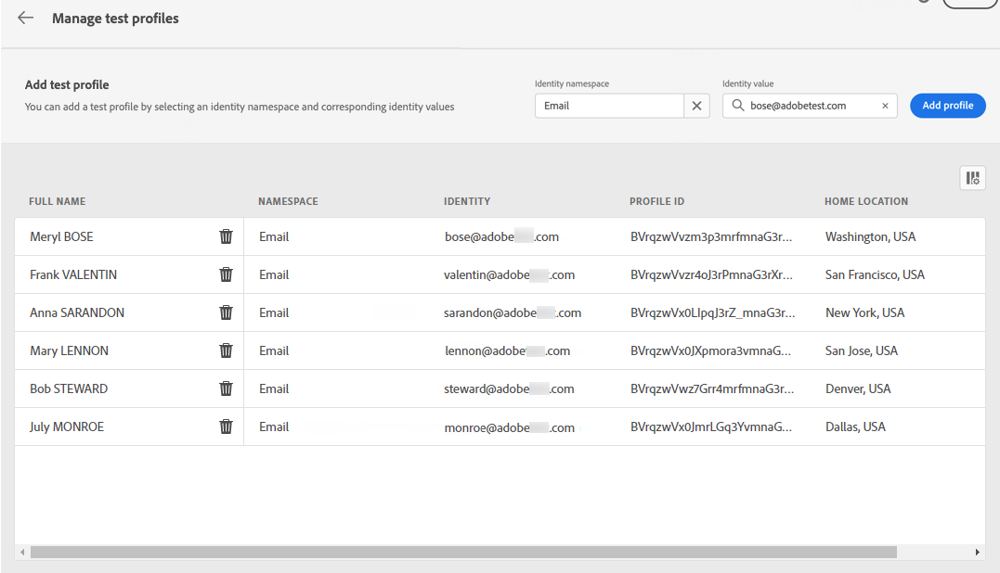
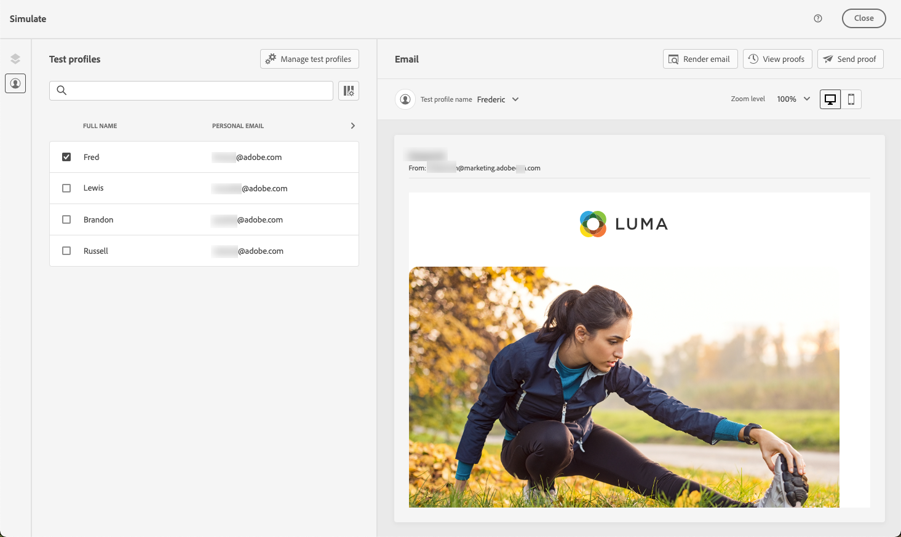
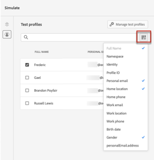
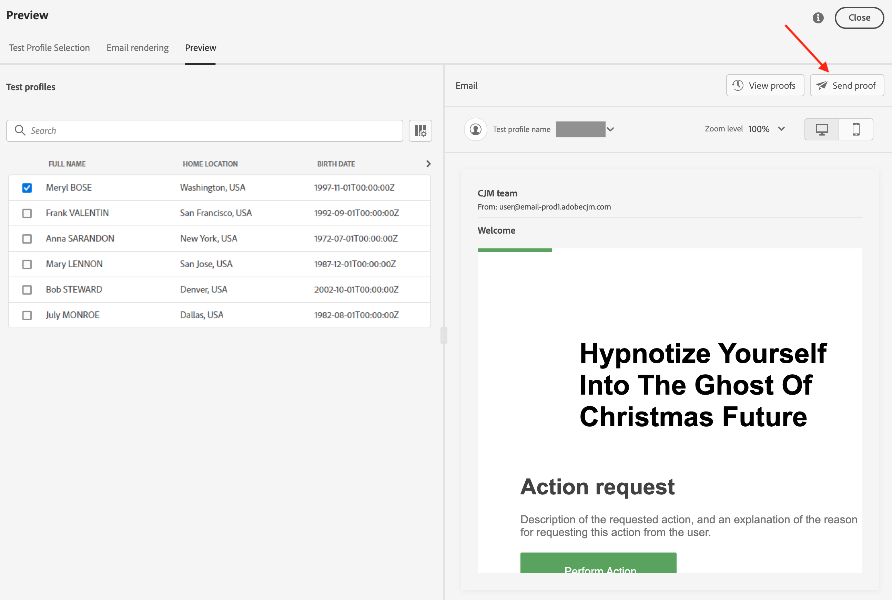
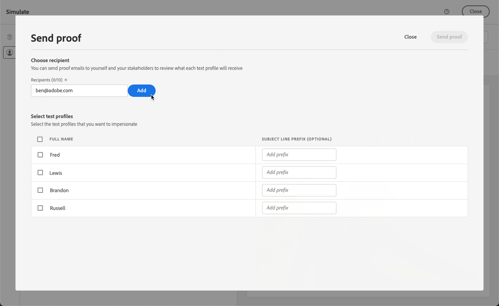
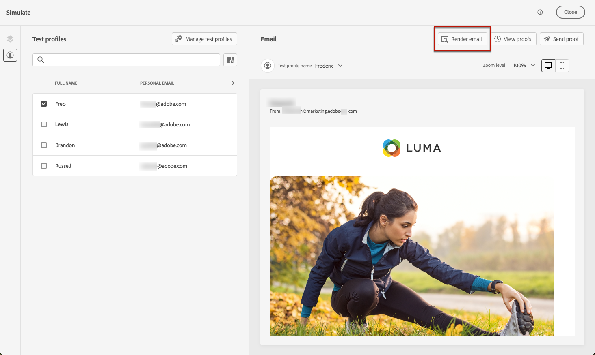

# Preview and test your email {#preview-and-proof}

>[!CONTEXTUALHELP]
>id="ac_preview_testprofiles"
>title="Preview and test your messages"
>abstract="Once your message content has been defined, you can use test profiles to preview and test it."

Once your email content has been defined, you can use test profiles to preview and test it. If you inserted [personalized content](../personalization/personalize.md), you can check how this content is displayed in the message, using test profile data.

To detect possible errors in email content or personalization settings, send proofs to test profiles. A proof should be sent each time a change is made, to validate the latest content. 

>[!CAUTION]
>
>You need to have test profiles available to be able to preview your messages and send proofs. 
>
>Learn how to create test profiles in [this page](../audience/creating-test-profiles.md). 

To test your email content, you need to:

* [Select test profiles](#select-test-profiles)
* [Check the message preview](#preview-your-messages)

You will then be able to [send proofs](#send-proofs) to your test profiles.

In addition, leverage your **Litmus** account into [!DNL Journey Optimizer] to instantly preview your **email rendering** in popular email clients. You can then ensure your email content looks great and works properly in every inbox. Learn how to unlock Litmus Email Previews in [this section](#email-rendering).

>[!CAUTION]
>
>When previewing a message or sending proofs, only profile personalization data is displayed. Personalization based on context data, such as event information, can only be tested in the context of a journey. Learn how to test personalization in [this use case](../personalization/personalization-use-case.md).

➡️ [Learn how to preview and proof your email in this video](#video-preview)

## Select test profiles {#select-test-profiles}

Use [Test profiles](../audience/creating-test-profiles.md) to target additional recipients who do not match the defined targeting criteria.

To select test profiles, follow the steps below: 

1. In the [Edit content](create-email.md#define-email-content) screen or in the Email Designer, click the **[!UICONTROL Simulate content]** button to access the test profile selection.

    

1. Select **[!UICONTROL Manage test profiles]**.

    

1. Select the namespace to use to identify test profiles by clicking the **[!UICONTROL Identity namespace]** selection icon. 

    

    Learn more about Adobe Experience Platform identity namespaces [in this section](../audience/get-started-identity.md).
    
    In the example below, we will use the **Email** namespace.

1. Use the search field to find the namespace, select it and click **[!UICONTROL Select]** 

    

1. In the **[!UICONTROL Identity value]** field, enter the value (here the email address) to identify the test profile and click **[!UICONTROL Add profile]**.

    <!---->

1. If you added personalization to your message, add other profiles so that you can test different variants of the message depending on profile data. Once added, profiles are listed under the selected fields.

    

    Based on the message personalization elements, this list displays data for each test profile in the related columns.

### Email preview {#preview-email}

Once [test profiles](#select-test-profiles) are selected, you can preview your email content. Follow the steps below:

1. In the [Edit content](create-email.md#define-email-content) screen or in the Email Designer, click the **[!UICONTROL Simulate content]** button.

1. Select a test profile. You can check the values available in the columns. Use the right/left arrows to browse data.

    

    >[!NOTE]
    >
    >To add more test profiles, select **[!UICONTROL Manage test profiles]**. [Learn more](#select-test-profiles)

1. Click the **[!UICONTROL Select data]** icon above the list to add or remove columns.

    
    
    You can see personalization fields specific to the current message at the end of the list. In this example, the profile city, first name and last name. Select those fields and make sure these values are populated in your test profiles.

1. In the message preview, personalized elements are replaced by the selected test profile data.

    For example, for this message, both email content and email subject are personalized:

    

1. Select other test profiles to preview email rendering for each variant of your message.

## Send proofs {#send-proofs}

A proof is a specific message that allows you to test a message before sending it to the main audience. Recipients of the proof are in charge of approving the message: rendering, content, personalization settings, configuration.

Once [test profiles](#select-test-profiles) are selected, you can send proofs.

1. In the **[!UICONTROL Simulate]** screen, click the **[!UICONTROL Send proof]** button.

    

1. From the **[!UICONTROL Send proof]** window, type in your recipient's email and click **[!UICONTROL Add]** to send the proof to yourself or members of your organizations.

    Note that you can add up to ten recipients for your proof delivery.

    

1. Then, select the **Test profiles** which will be used to personalize the message content. 
    
    Each recipient of the proof will receive as many messages as the number of selected test profiles. For example, if you added five recipient emails and selected ten test profiles, then you will send fifty proof messages, and each recipient will receive ten of them.

1. You can add a prefix to the subject line of the proof if needed. Only alphanumeric characters and special characters such as . - _ ( ) [ ] are allowed as prefix to the subject line.

1. Click **[!UICONTROL Send proof]**. 

    

1. Back in the  **[!UICONTROL Simulate]** screen, click the  **[!UICONTROL View proofs]** button to check status.

    

It is recommended to send proofs after each modification to the message content.

>[!NOTE]
>
>In the proof sent, the link to the mirror page is not active. It is only activated in the final messages.

## Use Email rendering {#email-rendering}

You can leverage your **Litmus** account into [!DNL Journey Optimizer] to instantly preview your **email rendering** in popular email clients.

To access Email rendering capabilities, you need to:

* Have a Litmus account
* [Select test profiles](#select-test-profiles)

Then, follow the steps below:

1. In the [Edit content](create-email.md#define-email-content) screen or in the Email Designer, click the **[!UICONTROL Simulate content]** button.

1. Select the **[!UICONTROL Render email]** button.

    

1. Click **Connect your Litmus account** on the upper right section.

    

1. Enter your credentials and sign in.

    

1. Click the **Run test** button to generate email previews.

1. Check your email content in popular desktop, mobile and web-based clients.

    

>[!CAUTION]
>
>When connecting your **Litmus** account with [!DNL Journey Optimizer], you agree that test messages are sent to Litmus: once sent, these emails are no longer managed by Adobe. As a consequence, Litmus data retention email policy applies to these emails, including personalization data that may be included in these test messages.

## How-to video {#video-preview}

Learn how to test email rendering across inboxes, how to preview your personalized emails against test profiles, and send proofs.

>[!VIDEO](https://video.tv.adobe.com/v/334239?quality=12)
