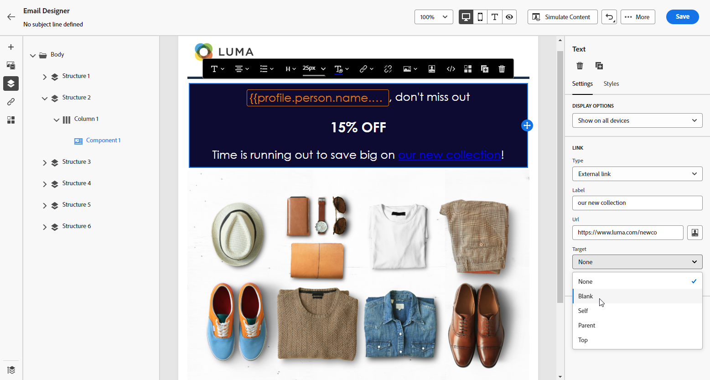
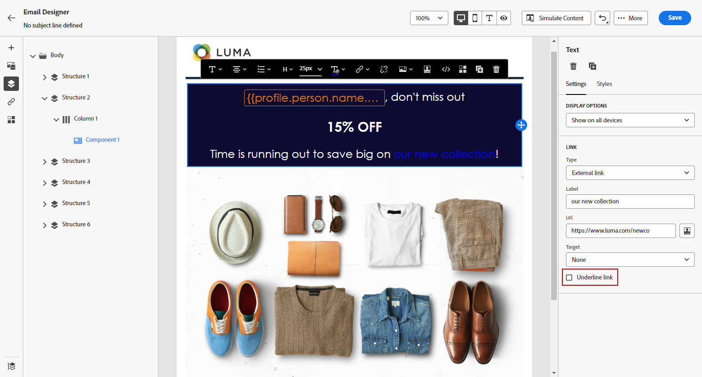
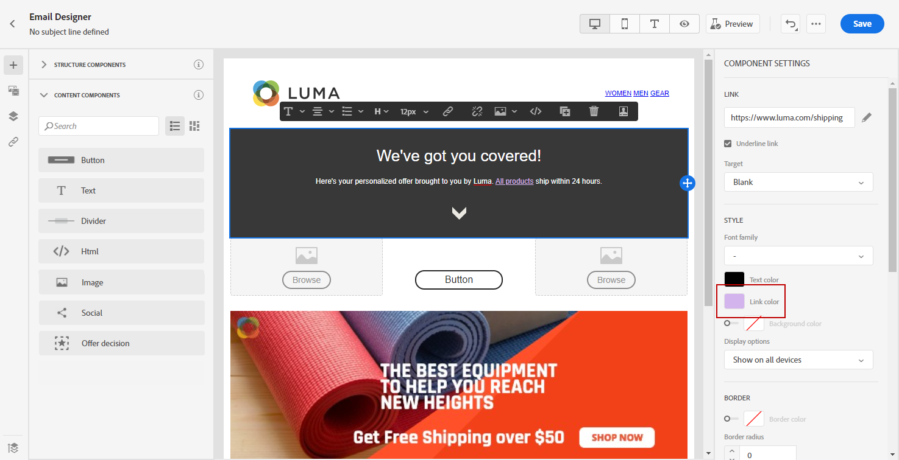

# Define a style for links {#styling-links}

You can underline a link and select its color and target in the Email Designer.

1. In a Text **[!UICONTROL Content component]** where a link is inserted, select your link.

1. From the **[!UICONTROL Settings]** tab, choose how your audience will be redirected with the **[!UICONTROL Target]** drop-down:

    * **[!UICONTROL None]**: opens the link in the same frame as it was clicked (default).
    * **[!UICONTROL Blank]**: opens the link in a new window or tab.
    * **[!UICONTROL Self]**: opens the link in the same frame as it was clicked.
    * **[!UICONTROL Parent]**: opens the link in the parent frame.
    * **[!UICONTROL Top]**: opens the link in the full body of the window.

   

1. Check **[!UICONTROL Underline link]** to underline the label text of your link.

   

1. To change the color of your link, click on **[!UICONTROL Link color]** from the **[!UICONTROL Styles]** tab.

   

1. Save your changes.
