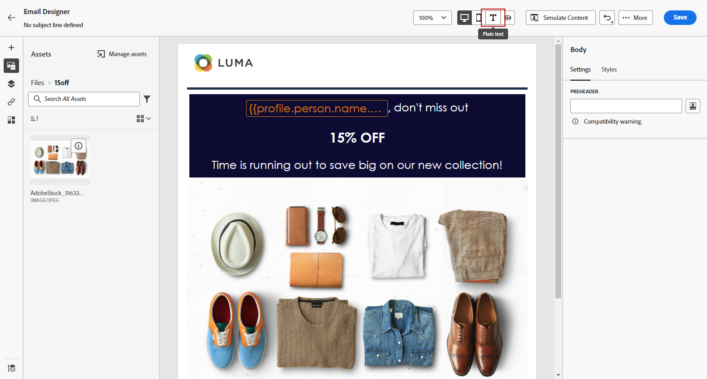
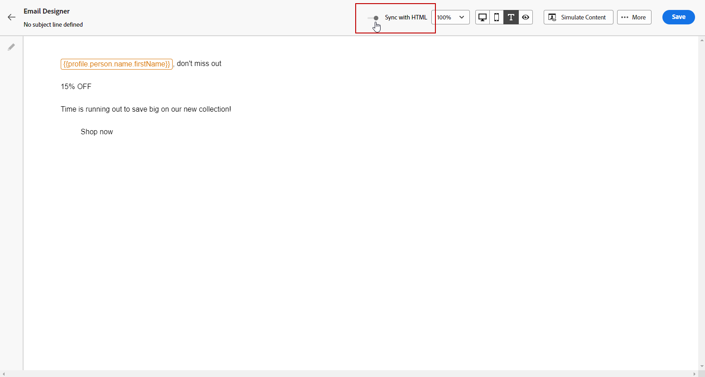
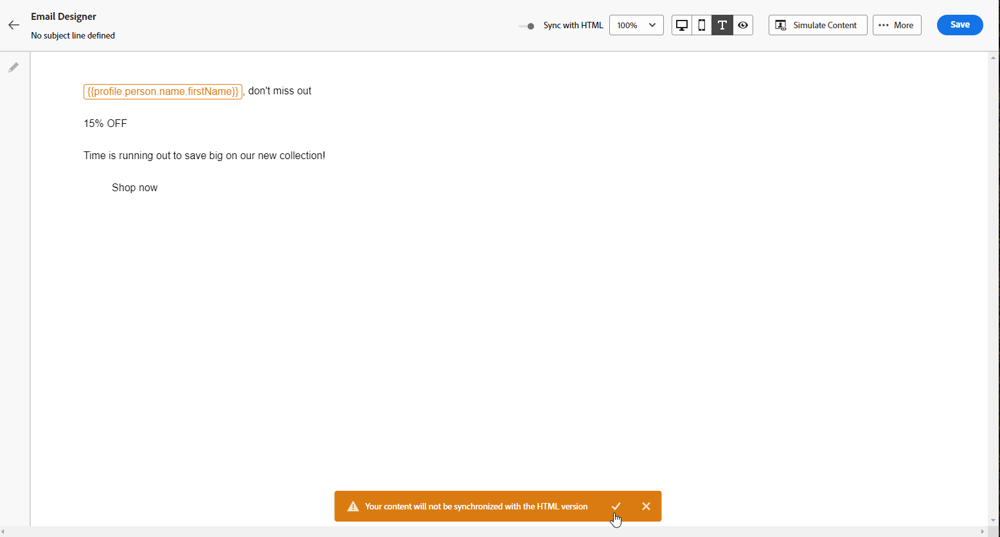

# Create the text version of an email {#text-version-email}

It is recommended to create a text version of your email body, which is used when HTML content cannot be displayed. 

By default, the Email Designer creates a **[!UICONTROL Plain text]** version of your email, including personalization fields. This  version is automatically generated and synchronized with the HTML version of your content.

If you prefer using a different content for the plain text version, follow the steps below:

1. From your email, select the **[!UICONTROL Plain text]** tab.

    

1. Use the **[!UICONTROL Sync with HTML]** toggle to disable synchronization.

    

1. Click the check mark to confirm your choice.

    

1. You can then edit the plain text version as desired.

>[!CAUTION]
>
>* Changes made in **[!UICONTROL Plain text]** view are not reflected in HTML view.
>
>*  If you re-enable the **[!UICONTROL Sync with HTML]** option  after updating your plain text content, your changes will be lost, and replaced with text content generated from the HTML version.
