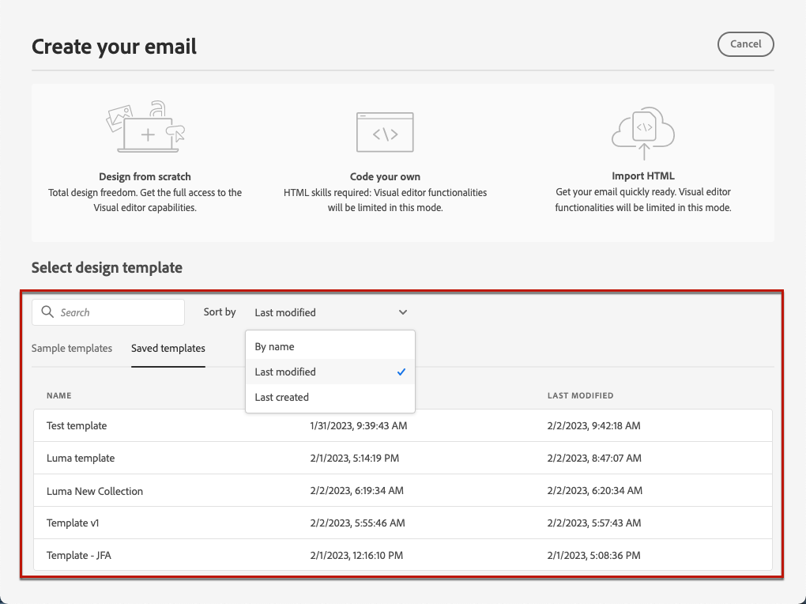

# Use email templates {#email-templates}

>[!CONTEXTUALHELP]
>id="ajo_use_template"
>title="Build content from a template"
>abstract="To start creating your email content, select either an out-of-the-box template or a custom existing template - created from scratch or saved as template from a previous email."
>additional-url="https://experienceleague.adobe.com/docs/journey-optimizer/using/personalized-dynamic-content/reusable-content/content-templates.html#create-content-templates" text="Create content templates"

From the **[!UICONTROL Create your email]** screen, use the **[!UICONTROL Select design template]** section to start building your content from a template.

You can choose from:

* **Sample templates**. The [!DNL Journey Optimizer] interface offers 20 out-of-the-box email templates that you can choose from.

* **Saved templates**. You can also use a custom template that you either:

    * Created from scratch using the **[!UICONTROL Content templates]** menu. [Learn more](../content-management/content-templates.md#create-template-from-scratch)

    * Saved from an email in a journey or a campaign using the **[!UICONTROL Save as content template]** option. [Learn more](../content-management/content-templates.md#save-as-template)

 To start building your content with one of the sample or saved templates, follow the steps below.

1. [Access the Email Designer](get-started-email-design.md) from the email **[!UICONTROL Edit content]** screen.

1. On the **[!UICONTROL Create your email]** screen, the **[!UICONTROL Sample templates]** tab is selected by default.

1. To use a custom template, go to the **[!UICONTROL Saved templates]** tab.

    

1. The list of all [content templates](../content-management/content-templates.md#create-content-templates) created on the current sandbox displays. You can sort them **[!UICONTROL By name]**, **[!UICONTROL Last modified]** and **[!UICONTROL Last created]**.

    

1. Select the template of your choice from the list.

1. Once selected, you can navigate between all the templates of one category (sample or saved depending on your selection) using the right and left arrrows.

    

1. Click **[!UICONTROL Use this template]** on top right of the screen.

1. Edit your content as desired using the Email Designer.
