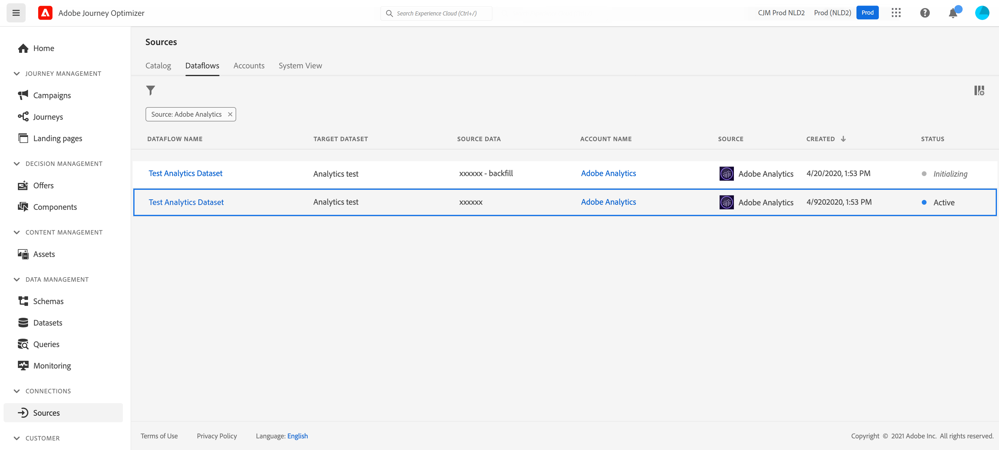

# Leverage Adobe Analytics data{#analytics-data}

You can leverage all of the Adobe Analytics behavioral event data that you are already capturing and streaming into Adobe Experience Platform in order to trigger journeys and automate experiences for your customers.

>[!NOTE]
>
>This section only applies for rule-based events and customers who need to use Adobe Analytics data.

For this to work, you need to activate, in Adobe Experience Platform, the report suite that you want to use. To do this, follow the steps below:

1. Connect to Adobe Experience Platform and browse to **[!UICONTROL Sources]**.
1. In the Adobe Analytics section, select **[!UICONTROL Add data]**: the list of available Adobe Analytics report suites is displayed.

1. Select the report suite to enable, click **[!UICONTROL Next]** and **[!UICONTROL Finish]**. 

1. Share the source Data ID with your Beta program point of contact. 

This enables the Analytics source connector for that report suite. Whenever the data comes in, it is transformed into an Experience event and sent into Adobe Experience Platform. 

Learn more about Adobe Analytics source connector in  [Adobe Experience Platform documentation](https://experienceleague.adobe.com/docs/experience-platform/sources/connectors/adobe-applications/analytics.html){target="_blank"} and [tutorial](https://experienceleague.adobe.com/docs/experience-platform/sources/ui-tutorials/create/adobe-applications/analytics.html){target="_blank"}.
