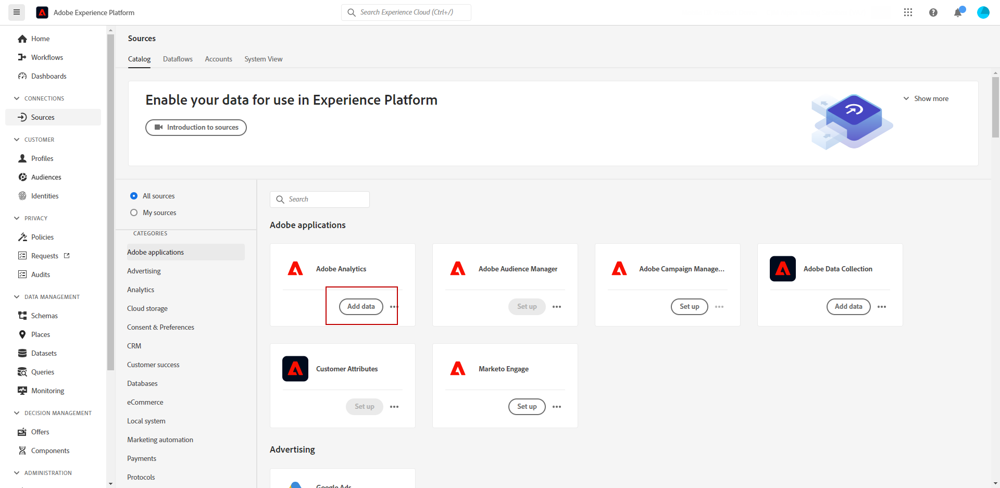
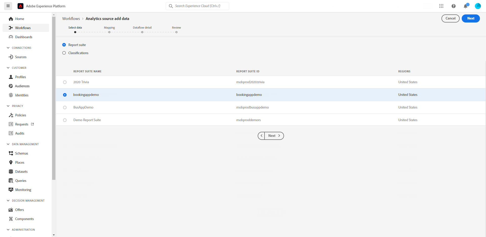
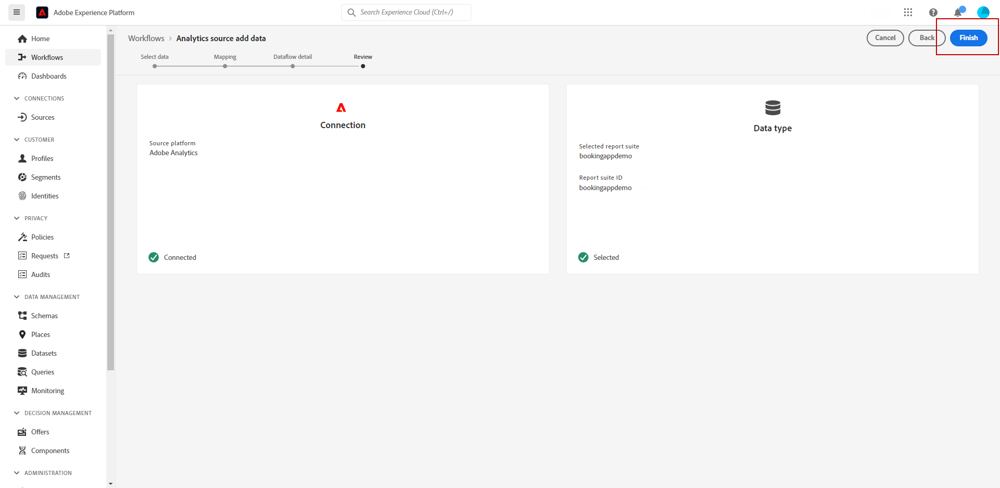
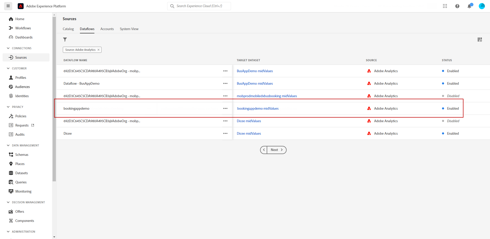
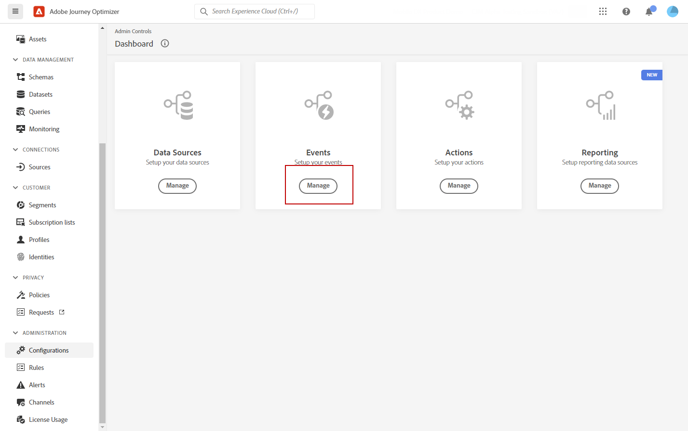
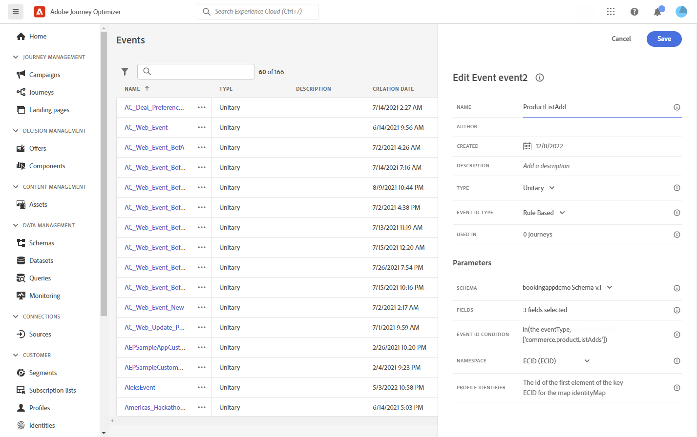
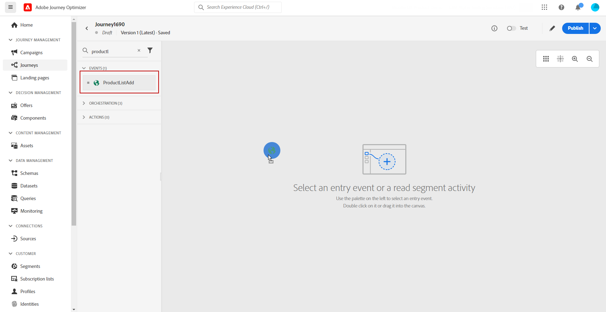
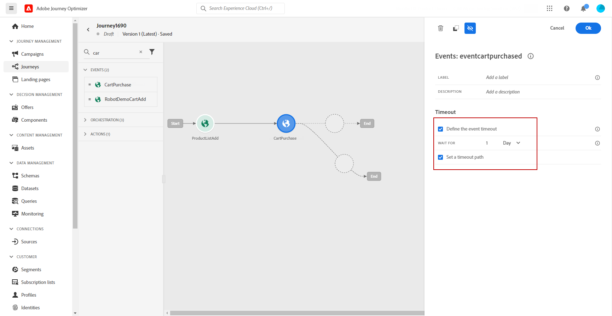
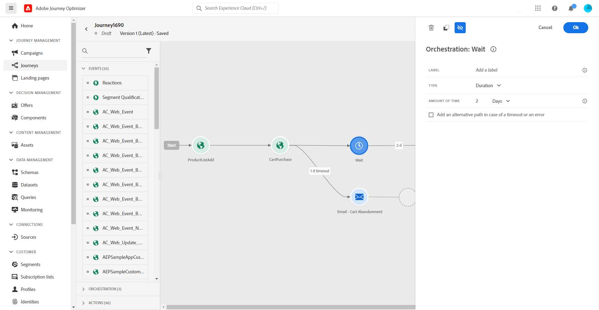
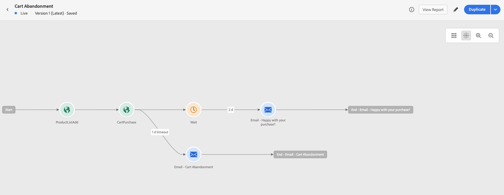

# Work with Adobe Analytics data {#analytics-data}

You can leverage all of the web behavioral event data  that you are already capturing through Adobe Analytics or Web SDK, and streaming into Adobe Experience Platform, in order to trigger journeys and automate experiences for your customers.

For this to work with Adobe Analytics, you must:

1. Activate the report suite you want to use. [Learn more](#leverage-analytics-data)
1. Enable Journey Optimizer to use the data source. [Learn more](#activate-analytics-data)
1. Add a specific event in your journey. [Learn more](#event-analytic)

>[!NOTE]
>
>This section only applies for rule-based events and customers who need to use Adobe Analytics or Web SDK data.
> 
>If you are using Adobe Customer Journey Analytics, refer to [this page](../reports/cja-ajo.md).
>

## Configure Adobe Analytics or Web SDK data {#leverage-analytics-data}

Data coming from Adobe Analytics or Adobe Experience Platform Web SDK need to be enabled to be used in your journeys.

To do this, follow the steps below:

1. Browse to the **[!UICONTROL Sources]** menu.

1. In the Adobe Analytics section, select **[!UICONTROL Add data]**

    

1. From the list of available Adobe Analytics report suites, select the **[!UICONTROL Report suite]** to enable. Then, click **[!UICONTROL Next]**.

    

1. Choose if you want to use a Default or Custom schema.

1. From the **[!UICONTROL Dataflow detail]** screen, choose a **[!UICONTROL Dataflow name]**.

1. Once your configuration is complete, click **[!UICONTROL Finish]**. 

    

This enables the Analytics source connector for that report suite. Whenever the data comes in, it is transformed into an Experience event and sent into Adobe Experience Platform. 

Learn more about Adobe Analytics source connector in  [Adobe Experience Platform documentation](https://experienceleague.adobe.com/docs/experience-platform/sources/connectors/adobe-applications/analytics.html){target="_blank"} and [tutorial](https://experienceleague.adobe.com/docs/experience-platform/sources/ui-tutorials/create/adobe-applications/analytics.html){target="_blank"}.

## Activate this configuration {#activate-analytics-data}

Once this configuration is done, contact Adobe to enable your Journey Optimizer environment to use this data source. To perform this:

1. Get the data source ID. This information is available in the user interface: browse to the data source you created from the **Dataflows** tab of the **Sources** menu. The easiest way to find it is to filter on Adobe Analytics sources.
1. Send an email to Adobe Customer Care with the following details:
    
    * Subject: Enable Journey Optimizer for Adobe Analytics events
    * Content: 
        Please enable my environment to use AA events. 
        Organization ID: "XXX@AdobeOrg"
        Data source ID: "ID: xxxxx"

1. Once you have a confirmation that your environment is ready, you can use Adobe Analytics or Adobe Experience Platform Web SDK data in your journeys.

## Create a journey with an event using Adobe Analytics or Web SDK data {#event-analytics}

You can now create an event based on Adobe Analytics or Adobe Experience Platform Web SDK data to be used in a journey.

In the example below, learn how to target users who added a product to their carts:

* If the order is completed, users receive a follow-up email two days later to ask for feedbacks.
* If the order is not completed, users receive an email to remind them to complete the order.

1. From Adobe Journey Optimizer, access the **[!UICONTROL Configuration]** menu. 

1. Then, select **[!UICONTROL Manage]** from the **[!UICONTROL Events]** card.

    

1. Click **[!UICONTROL Create event]**. The event configuration pane opens on the right side of the screen.

1. Fill in the **[!UICONTROL Event]** parameters:

    * **[!UICONTROL Name]**: Personalize the name of your **[!UICONTROL Event]**.
    * **[!UICONTROL Type]**: Choose the **[!UICONTROL Unitary]** Type. [Learn more](../event/about-events.md)
    * **[!UICONTROL Event ID type]**: Choose the **[!UICONTROL Rule based]** Event ID type. [Learn more](../event/about-events.md#event-id-type)
    * **[!UICONTROL Schema]**: Select the Analytics or WebSDK schema [created before](#leverage-analytics-data).
    * **[!UICONTROL Fields]**: Select the Payload fields. [Learn more](../event/about-creating.md#define-the-payload-fields)
    * **[!UICONTROL Event ID condition]**: Define the condition to identify the events that will trigger your journey. 
        
        Here, the Event is triggered when customers add an item to their carts.
    * **[!UICONTROL Profile Identifier]**: Choose a field from your payload fields, or define a formula, to identify the person associated to the event.

    

1. When configured, select **[!UICONTROL Save]**.

Now that the event is ready, create a journey to use it.

1. From the **[!UICONTROL Journeys]** menu, open or create a journey. For more on this, refer to [this section](../building-journeys/journey-gs.md).

1. Add your previously configured Analytics event to your journey.

    

1. Add an event which will be triggered if an order is completed.

1. From your **[!UICONTROL Event menu]**, select the **[!UICONTROL Define the event timeout]** and **[!UICONTROL Set a timeout path]** options.

    

1. From the timeout path, add an **[!UICONTROL Email]** action. This path will be used to send an email to customers who didn't complete an order to remind them that their carts are still available.

1. Add a **[!UICONTROL Wait]** activity after your main path and set it to the needed duration.

    

1. Then, add an **[!UICONTROL Email action]**. In this email, the customers will be prompted to give feedbacks on the placed order.

You can now test and publish your journey. [Learn more](../building-journeys/publishing-the-journey.md)

