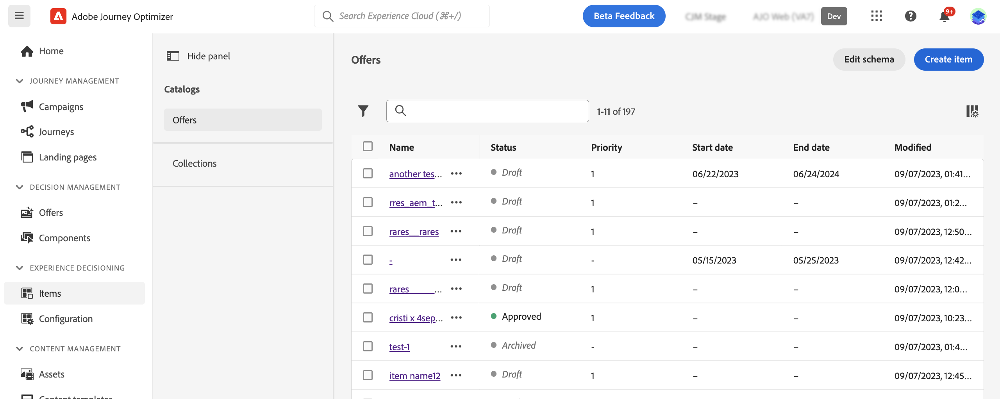
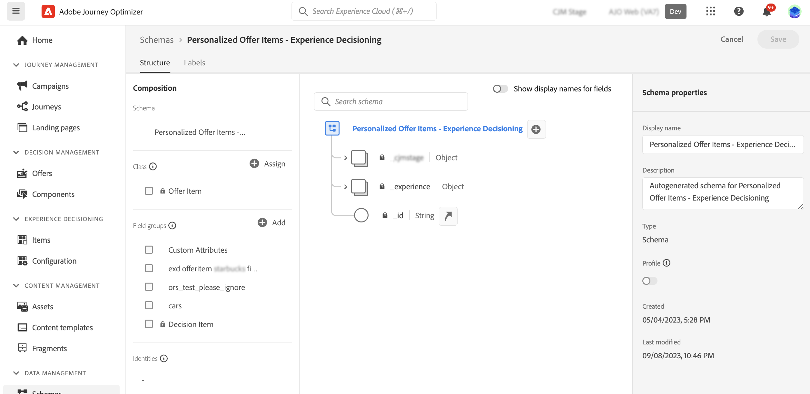
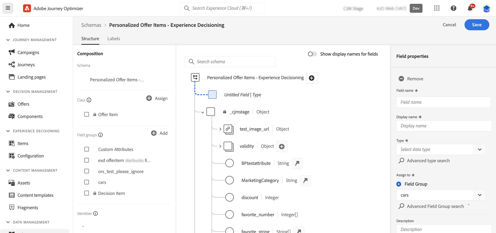

# Items catalog {#catalog}

>[!BEGINSHADEBOX]

What you'll find in this documentation guide:

* [Get started with Experience Decisioning](gs-experience-decisioning.md)
* Manage your decision items
    * **[Configure the items catalog](catalogs.md)**
    * [Create decision items](items.md)
    * [Manage items collections](collections.md)
* Configure items' selection
    * [Create decision rules](rules.md)
    * [Create ranking methods](ranking.md)
* [Create selection strategies](selection-strategies.md)
* [Create decision policies](create-decision.md)

>[!ENDSHADEBOX]

In Experience Decisioning, catalogs serve as central containers for organizing decision items. Each catalog is linked to an Adobe Experience Platform schema, encompassing all the attributes assignable to a decision item. 

For now, all created decision items are consolidated within a single "Offers" catalog, accessible via the **[!UICONTROL Items]** menu.

To access the catalog's schema where decision items' attributes are stored, follow these steps:

1. From the items list, click the **[!UICONTROL Edit schema]** button located next to the **[!UICONTROL Create item]** button.

1. The catalog's schema opens in a new tab, following the structure below:

    * The **`_experience`** node includes standard decision items attributes such as name, start and end date, and description.    
    * The **`_<imsOrg>`** node houses custom decision items attributes. By default, no custom attributes are configured, but you can add as many as needed to suit your requirements. Once done, custom attributes appear in the decision item creation screen alongside the standard attributes.

    

1. To add a custom attribute to the schema, expand the **`_<imsOrg>`** node and click the "+" button at the desired location in the structure.

    

1. Fill in the necessary fields for the added attribute and click **[!UICONTROL Apply]**.

    >[!CAUTION]
    >
    >For now, Experience Decisioning exclusively supports the data types listed below. Any field falling outside these data types will not be available for use when creating a decision item.
    >* String
    >* Boolean
    >* Number 

    Detailed information on how to work with Adobe Experience Platform schemas is available in the [XDM System documentation](https://experienceleague.adobe.com/docs/experience-platform/xdm/ui/overview.html).

1. Once your desired custom attributes are added, save the schema. The new field is now available in the item decisions creation screen, within the **[!UICONTROL Custom attributes]** section.
