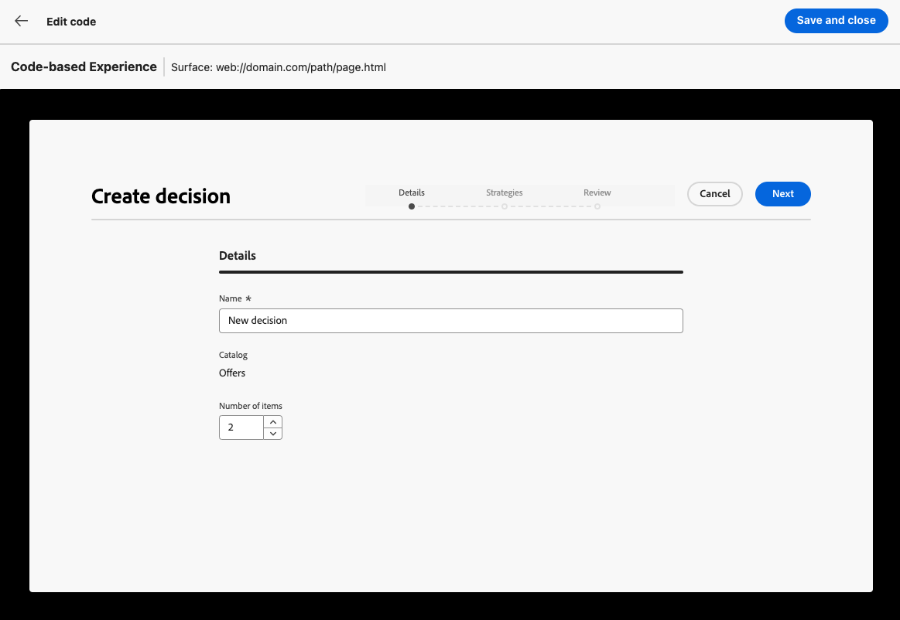
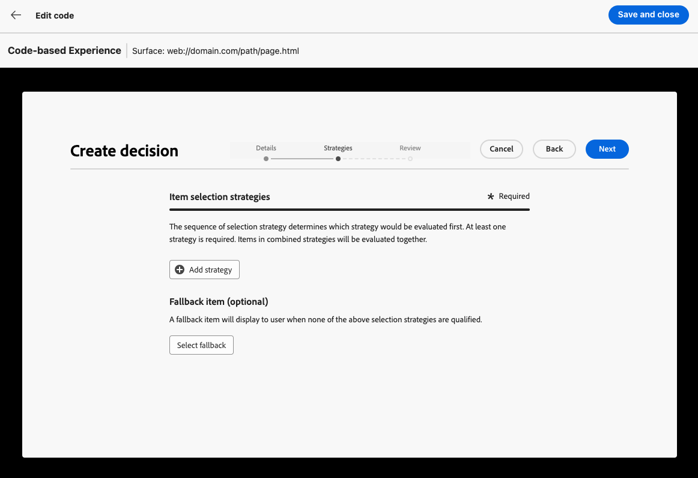
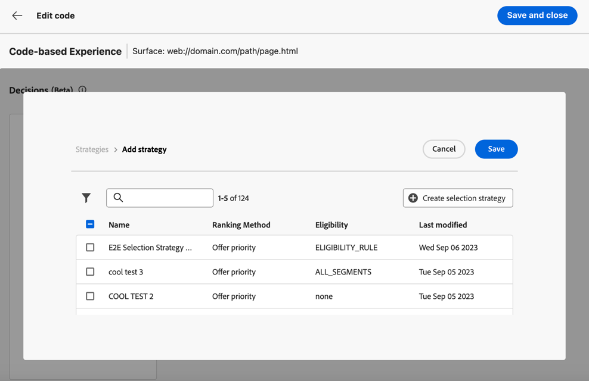
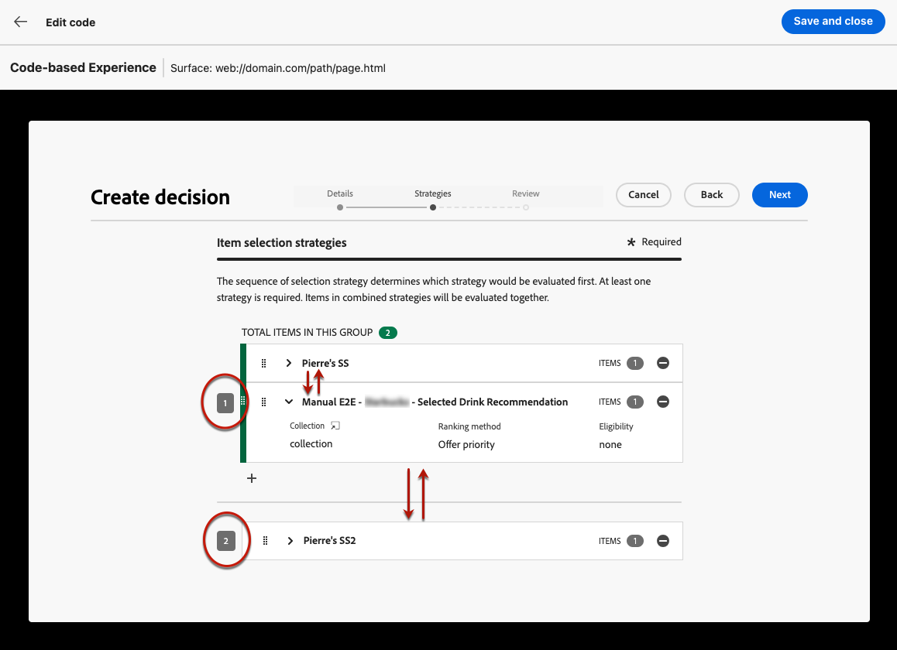
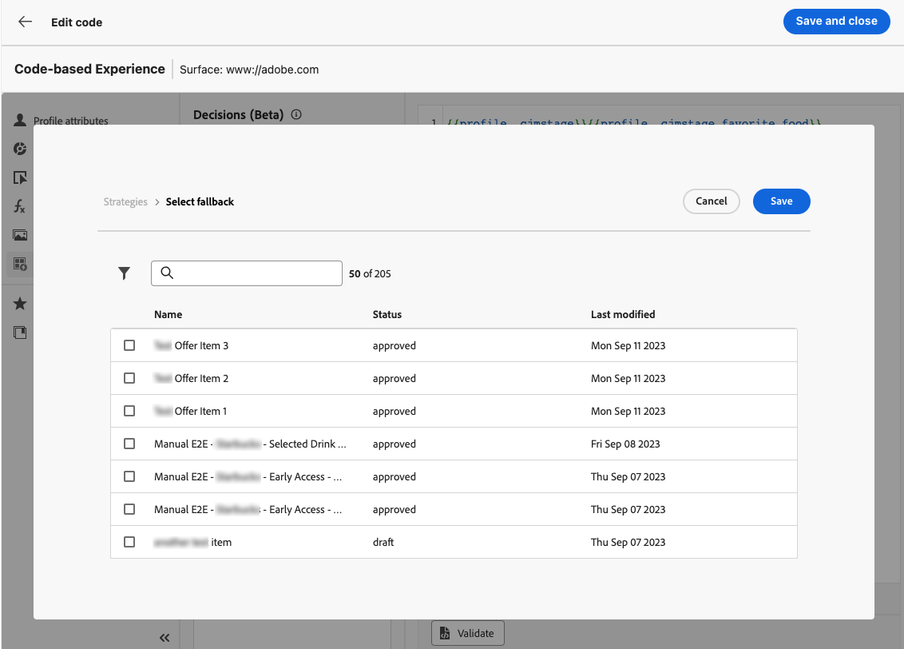
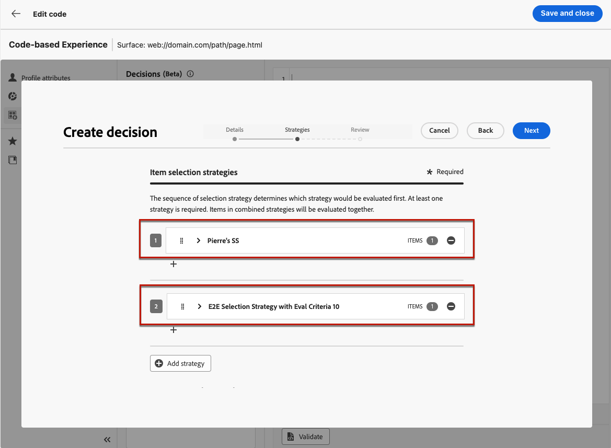
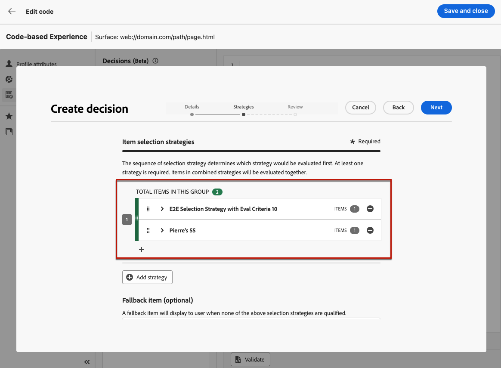
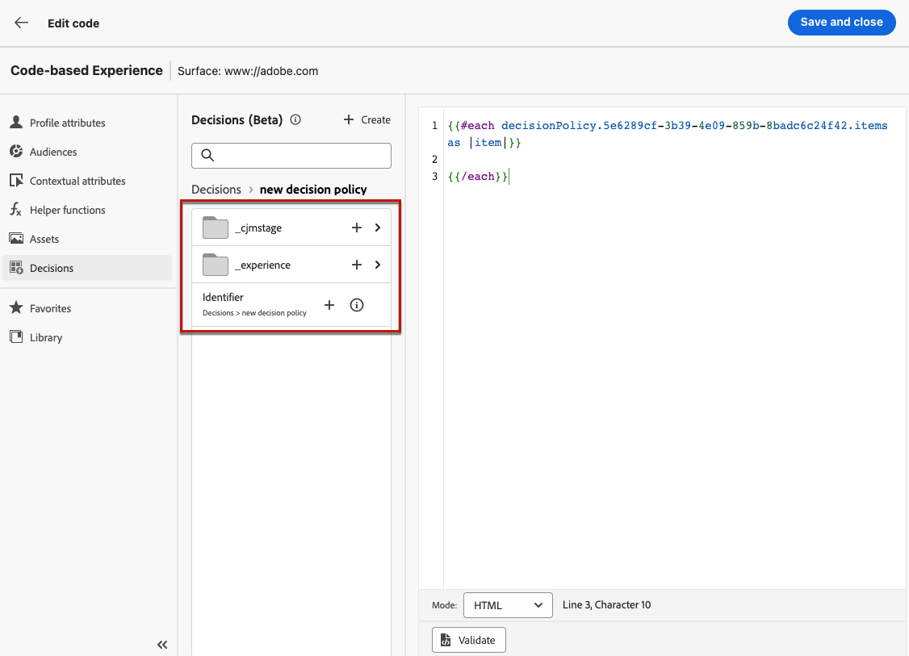
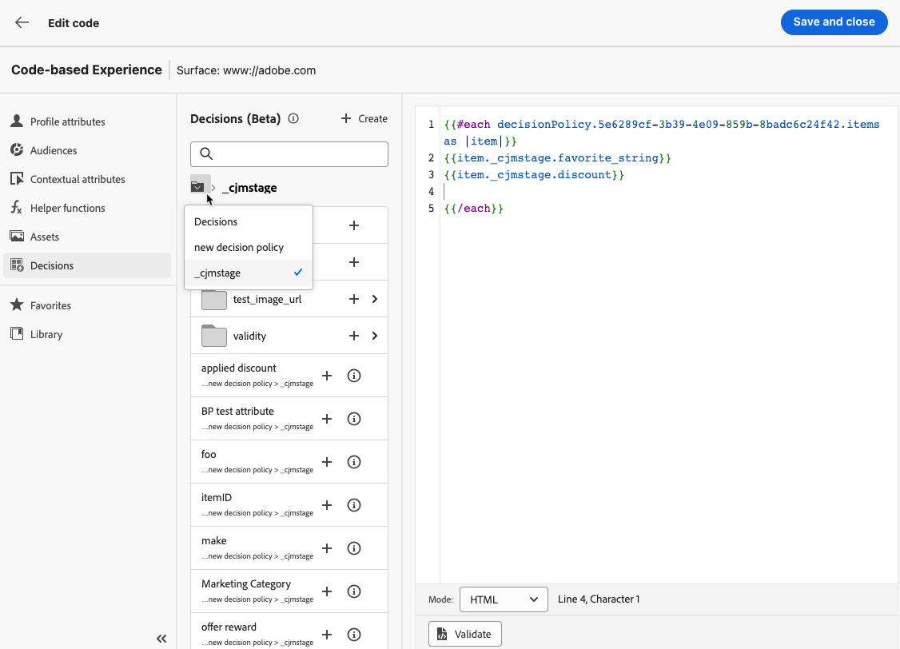

# Create decision policies {#create-decision}

>[!CONTEXTUALHELP]
>id="ajo_code_based_decision"
>title="What is a decision?"
>abstract="Decision policies leverage the experience decisioning engine in order to pick the best content to deliver, depending on the audience."
>additional-url="https://experienceleague.adobe.com/docs/journey-optimizer/using/offer-decisioning/get-started-decision/starting-offer-decisioning.html" text="About Experience decisioning"

>[!BEGINSHADEBOX]

What you'll find in this documentation guide:

* [Get started with Experience Decisioning](gs-experience-decisioning.md)
* Manage your decision items
    * [Configure the items catalog](catalogs.md)
    * [Create decision items](items.md)
    * [Manage items collections](collections.md)
* Configure items' selection
    * [Create decision rules](rules.md)
    * [Create ranking methods](ranking.md)
* [Create selection strategies](selection-strategies.md)
* **[Create decision policies](create-decision.md)**

>[!ENDSHADEBOX]

Decision policies are containers for your offers that leverage the experience decisioning engine in order to pick the best content to deliver, depending on the audience.

>[!NOTE]
>
>In the [!DNL Journey Optimizer] user interface, decision policies are labelled as decisions<!--but they are decision policies. TBC if this note is needed-->.

## Add a decision policy to a code-based campaign {#add-decision}

>[!CONTEXTUALHELP]
>id="ajo_code_based_item_number"
>title="Define the number of items to be returned"
>abstract="Select the number of decision items you want to be returned back. For example, if you select 2, the best 2 eligible offers will be presented for the current surface."

>[!CONTEXTUALHELP]
>id="ajo_code_based_fallback"
>title="Select a fallback"
>abstract="A fallback item displays to the user when none of the selection strategies defined for that decision policy are qualified."

>[!CONTEXTUALHELP]
>id="ajo_code_based_strategy"
>title="What is a strategy?"
>abstract="The sequence of selection strategy determines which strategy would be evaluated first. At least one strategy is required. Decision items in combined strategies will be evaluated together."
>additional-url="https://experienceleague.adobe.com/docs/journey-optimizer/using/offer-decisioning/get-started-decision/starting-offer-decisioning.html" text="Create strategies"
>additional-url="https://experienceleague.adobe.com/docs/journey-optimizer/using/offer-decisioning/get-started-decision/starting-offer-decisioning.html" text="Evaluation order"

To present the best dynamic offer and experience to your visitors on your website or mobile app, add a decision policy to a code-based campaign. To do so, follow the steps below.

1. Create a campaign and select the **[!UICONTROL Code-base experience (Beta)]** action. [Learn more](../code-based/create-code-based.md)

    >[!NOTE]
    >
    >The code-based experience feature is currently available as a beta to select users only.

1. From the [code editor](../code-based/create-code-based.md#edit-code), select the **[!UICONTROL Decisions]** icon and click **[!UICONTROL Create a decision]**.

    

1. Fill in the details for your decision policy: add a name and select a catalog.

    >[!NOTE]
    >
    >Currently only the default **[!UICONTROL Offers]** catalog is available.

    

1. Select the number of items you want to be returned back. For example, if you select 2, the best 2 eligible offers will be presented for the current surface. Click **[!UICONTROL Next]**

1. Use the **[!UICONTROL Add strategy]** button to define the selection strategies for your decision policy. Each strategy consists in an offer collection associated with an eligibility constraint and a ranking method to determine the offers to be shown. [Learn more](selection-strategies.md)

    

    >[!NOTE]
    >
    >At least one strategy is required. You cannot add more than 10 strategies.

1. From the **[!UICONTROL Add strategy]** screen, you can also create a strategy. The **[!UICONTROL Create selection strategy]** button redirects you to the **[!UICONTROL Experience decisioning]** > **[!UICONTROL Configurations]** menu. [Learn more](selection-strategies.md)

    

1. When adding several strategies, they will be evaluated in a specific order. The first strategy that was added to the sequence will be evaluated first, and so on. [Learn more](#evaluation-order)

    To change the default sequence, you can drag and drop the strategies and/or the groups to reorder them as wanted.

    

1. Add a fallback. A fallback item will display to user if none of the above selection strategies are qualified.

    

    You can select any item from the list, which displays all the decision items created on the current sandbox. If no selection strategy is qualified, the fallback is displayed to the user no matter the dates and eligibility constraint applied to the selected item<!--nor frequency capping when available - TO CLARIFY-->.

    >[!NOTE]
    >
    >A fallback is optional. If no fallback is selected and if no strategy is qualified, nothing will be displayed by [!DNL Journey Optimizer].

1. Save your selection and click **[!UICONTROL Create]**. The new decision policy is added under **[!UICONTROL Decisions]**.

    

Now that the decision policy is created, you can use the decision attributes inside your code-based experience content. [Learn more](#use-decision-policy)

## Evaluation order {#evaluation-order}

As described above, a strategy consists of a collection, a ranking method, and eligibility constraints.

You can:

* Set the sequential order you want for the strategies to be evaluated,
* Combine multiple strategies so they are evaluated together and not separately.

Multiple strategies and their grouping determine the priority of the strategies and ranking of eligible offers. The first strategy has the highest priority and the strategies combined within the same group have the same priority.

For example, you have two collections, one in strategy A and one in strategy B. The request is for two decision items to be sent back. Let's say there are two eligible offers from strategy A and three eligible offers from strategy B.

* If the two strategy are **not combined** or in sequential order (1 and 2), the top two eligible offers from the first strategy will be returned in the first row. If there are not two eligible offers for the first strategy, the decision engine will move on to the next strategy in sequence to find as many offers are still needed, and ultimately will return a fallback if needed.

    

* If the two collections are **evaluated at the same time**, as there are two eligible offers from strategy A and three eligible offers from strategy B, the five offers will all be stack ranged together based on the value determined by the respective ranking methods. Two offers are requested, therefore the top two eligible offers from these five offers will be returned.

    

+++ **Example with multiple strategies**

Now let's consider an example where you have multiple strategies divided into different groups.

You defined three strategies. Strategy 1 and Strategy 2 are combined together in Group 1 and Strategy 3 is independent (Group 2).

The eligible offers for each strategy and their priority (used in the ranking function evaluation) are as follows:

* Group 1:
    * Strategy 1 - (Offer 1, Offer 2, Offer 3) - Priority 1
    * Strategy 2 - (Offer 3, Offer 4, Offer 5) - Priority 1

* Group 2:
    * Strategy 3 - (Offer 5, Offer 6) - Priority 0

The highest priority strategy offers is evaluated first and added to the ranked offers list.

**Iteration 1:**

Strategy 1 and Strategy 2 offers are evaluated together (Offer 1, Offer 2, Offer 3, Offer 4, Offer 5). Let's say the result is:

Offer 1 - 10
Offer 2 - 20
Offer 3 - 30 from Strategy 1, 45 from Strategy 2. The highest of both will be considered, so 45 is taken into account.
Offer 4 - 40
Offer 5 - 50

The ranked offers are now as follows: Offer 5, Offer 3, Offer 4, Offer 2, Offer 1.

**Iteration 2:**

Strategy 3 offers are evaluated (Offer 5, Offer 6). Let's say the result is:

* Offer 5 - Will not be evaluated since it already exists in the result above.
* Offer 6 - 60

The ranked offers are now as follows: Offer 5 , Offer 3, Offer 4, Offer 2, Offer 1, Offer 6.

+++

## Use the decision policy in the code editor {#use-decision-policy}

Once created, the decision policy can be used in the [Expression editor](../code-based/create-code-based.md#edit-code). To do so, follow the steps below.

>[!NOTE]
>
>Code-based experience leverages the [!DNL Journey Optimizer] Expression editor with all its personalization and authoring capabilities. [Learn more](../personalization/personalization-build-expressions.md)

1. Click the + icon. The code corresponding to the decision policy is added. Now you can add all the decision attributes you want inside that code.

    

    >[!NOTE]
    >
    >This sequence will be repeated the number of times you want the decision policy to be returned. For example, if you chose to return back 2 items when [creating the decision](#add-decision), the same sequence will be repeated twice.

1. Click the decision policy. The decision attributes are displayed.

    These attributes are stored in the **[!UICONTROL Offers]** catalog's schema. Custom attributes are stored in the **`_<imsOrg`>** folder and standard attributes in the **`_experience`** folder. [Learn more on the Offers catalog's schema](catalogs.md)

    

1. Click each folder to expand it. Place the cursor of your mouse at the desired location and click the + icon next to the attribute you want to add. You can add as many attributes as you want to the code.

    

1. To navigate back to the decision policy root, click the folder icon.

    

1. You can also add any other attribute available in the Expression editor, such as profile attributes.

    
