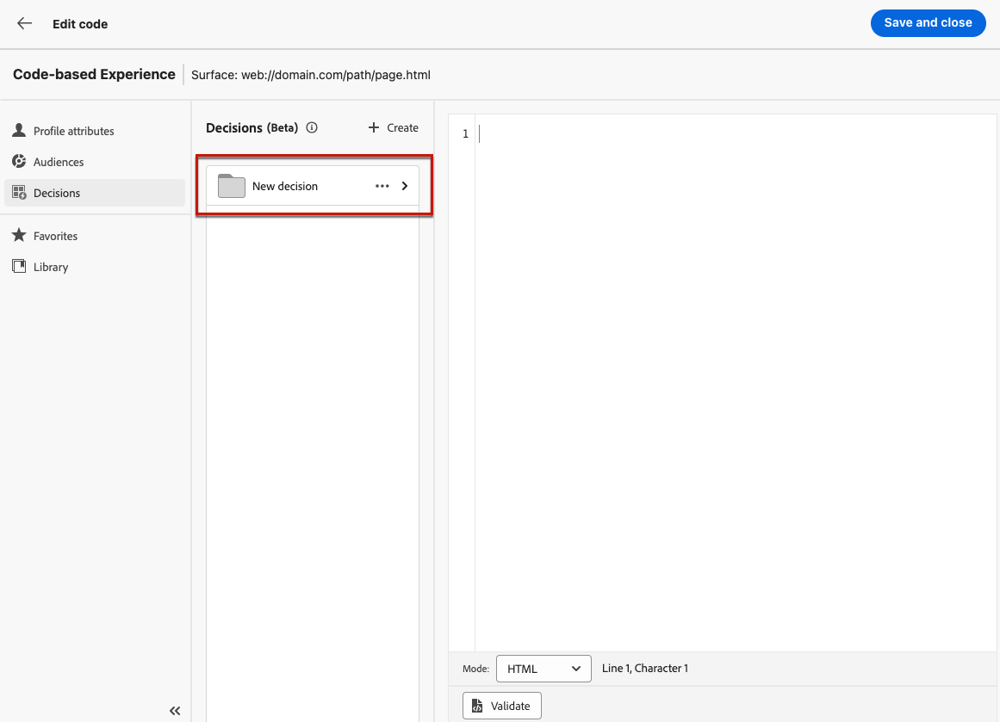
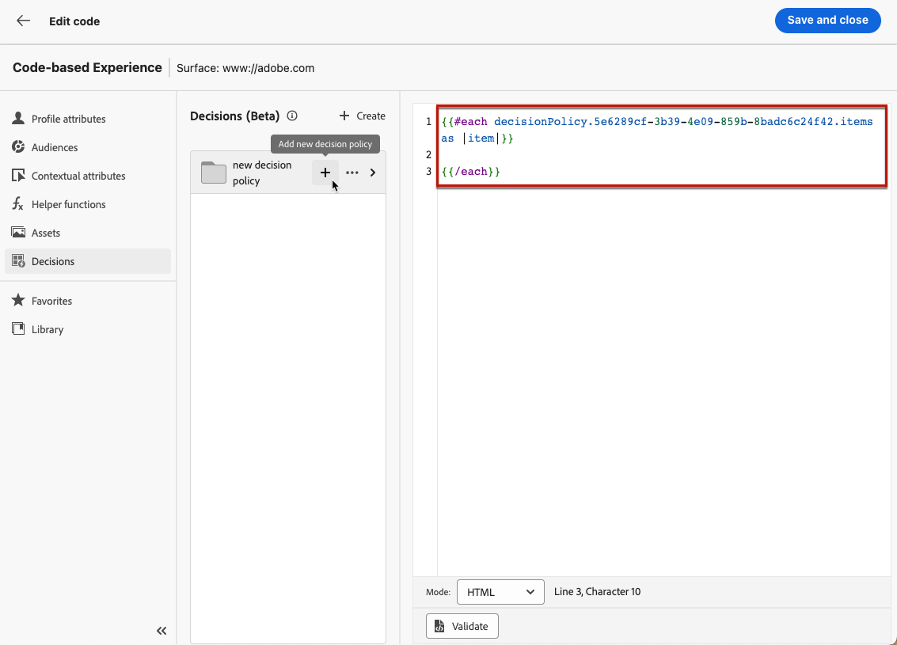
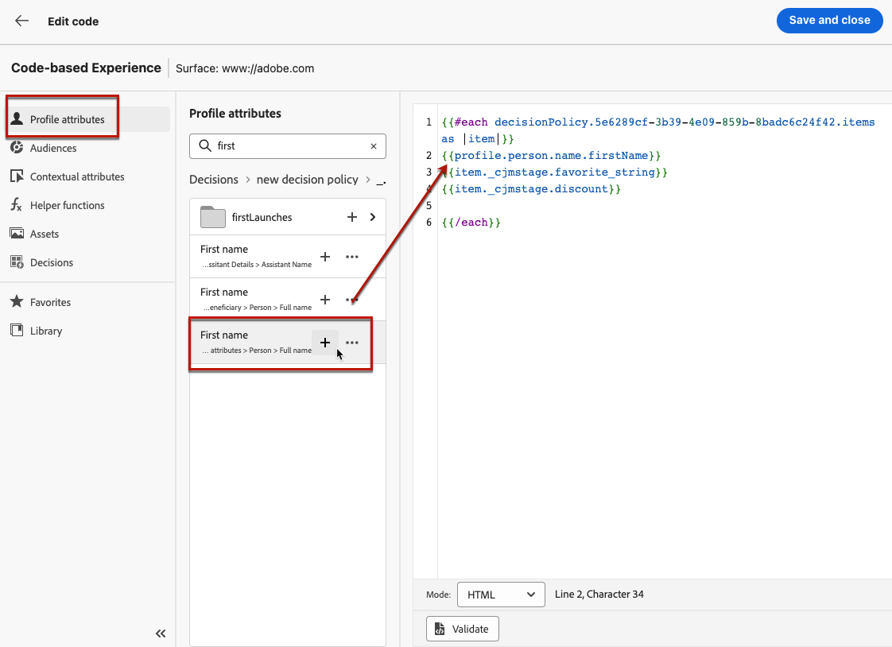

# Experience decisioning use case {#experience-decisioning-uc}

>[!BEGINSHADEBOX "What you'll find in this documentation guide"]

* [Get started with Experience Decisioning](gs-experience-decisioning.md)
* Manage your decision items: [Configure the items catalog](catalogs.md) -[Create decision items](items.md) - [Manage items collections](collections.md)
* Configure items' selection: [Create decision rules](rules.md) - [Create ranking methods](ranking.md)
* [Create selection strategies](selection-strategies.md)
* [Create decision policies](create-decision.md)

>[!ENDSHADEBOX]

In this use case, you define two delivery treatments each containing a different decision policy in order to measure which one performs best for your target audience.

## Create items and strategies

You first need to create items, group them together in collections, set up rules and ranking methods. These elements will allow you to build selection strategies.

1. Navigate to **[!UICONTROL Experience Decisioning]** > **[!UICONTROL Items]** and create several offer items. Set constraints using audiences or rules to restrict each item to specific profiles only. [Learn more](items.md)

   <!--
   1. From the items list, click the **[!UICONTROL Edit schema]** button  and edit the custom attributes if needed. [Learn how to work with catalogs](catalogs.md)-->

1. Create **collections** to categorize and group your decision items according to your preferences. [Learn more](collections.md)

1. Create **decision rules** to determine to whom a decision item can be shown. [Learn more](rules.md)

1. Create **ranking methods** and apply them within decision strategies to determine the priority order for selecting decision items. [Learn more](ranking.md)

1. Build **selection strategies** that leverage collections, decision rules, and ranking methods to identify the decision items suitable for displaying to profiles. [Learn more](selection-strategies.md)

## Create decision policies

To present the best dynamic offer and experience to your visitors on your website or mobile app, add a decision policy to a code-based campaign.

Define two delivery treatments each containing a different decision policy.

1. Create a campaign and select the **[!UICONTROL Code-base experience (Beta)]** action. [Learn more](../code-based/create-code-based.md)

   >[!NOTE]
   >
   >The code-based experience feature is currently available as a beta to select users only. To join the beta program, contact Adobe Customer Care.

1. From the campaign summary page, click **[!UICONTROL Create experiment]** to start configuring your content experiment. [Learn more](../campaigns/content-experiment.md)

1. Select the **[!UICONTROL Decisions]** icon, click **[!UICONTROL Create a decision]** and fill in the decision details. [Learn more](create-decision.md)

   

1. Define the selection strategies for your decision. Click **[!UICONTROL Add strategy]**.

1. Click **[!UICONTROL Create]**. The new decision is added under **[!UICONTROL Decisions]**.

    

1. Click the more actions icon (three dots) and select **[!UICONTROL Add]**. Now you can add all the decision attributes you want inside this.

    

1. You can also add any other attribute available in the Expression editor, such as profile attributes.

    

1. Build treatment B and repeat the steps above to create another decision.

1. Save your content.

