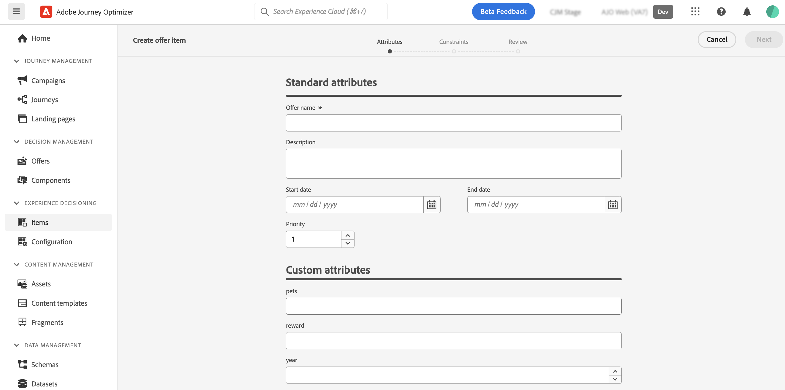
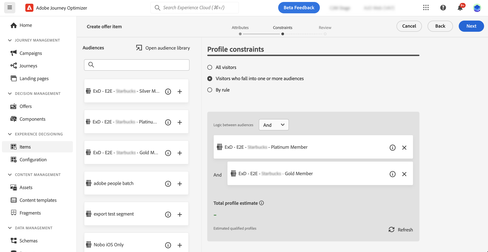
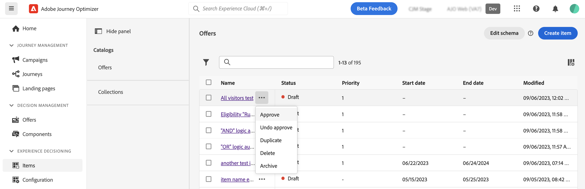

# Decision items {#items}

>[!CONTEXTUALHELP]
>id="ajo_exd_items"
>title="Manage decision items"
>abstract="Journey Optimizer allows you to create marketing offers, known as decision items, that you can create and organize into a centralized catalog and collections. Currently, all created decision items are consolidated within a single "Offers" catalog. From this screen, you can also access the catalog's schema using the **Edit schema** button and create custom attributes for your decision items."
>additional-url="https://experienceleague.adobe.com/docs/journey-optimizer/using/experience-decisioning/decision-items/catalogs.html" text="Configure the items catalog"

>[!BEGINSHADEBOX "What you'll find in this documentation guide"]

* [Get started with Experience Decisioning](gs-experience-decisioning.md)
* Manage your decision items: [Configure the items catalog](catalogs.md) - **[Create decision items](items.md)** - [Manage items collections](collections.md)
* Configure items' selection: [Create decision rules](rules.md) - [Create ranking methods](ranking.md)
* [Create selection strategies](selection-strategies.md)
* [Create decision policies](create-decision.md)

>[!ENDSHADEBOX]

Journey Optimizer allows you to create marketing offers, known as decision items, that you can create and organize into a centralized catalog and collections. They are made up of standard and custom attritbutes designed to align precisely with your needs. Additionally, they incorporate profile constraints that allow you to define to whom a decision item can be shown.

Before creating a decision item, make sure you have created a **decision rule** if you want to set conditions to determine to whom the decision item can be shown. [Learn how to create decision rules](rules.md). 

## Create your first decision item

>[!CONTEXTUALHELP]
>id="ajo_exd_item_priority"
>title="Define the decision item's priority"
>abstract="If a profile qualifies for multiple items, the priority enables to compare this decision item to others. A higher priority grants the item precedence over others."

>[!CONTEXTUALHELP]
>id="ajo_exd_item_custom_attributes"
>title="Define the custom attributes"
>abstract="Custom attributes are specific attributes tailored to your needs that you can assign to a decision item. They are created in the decision items' catalog schema. This section only displays if you have added at least one custom attribute to the catalog schema."
>additional-url="https://experienceleague.adobe.com/docs/journey-optimizer/using/experience-decisioning/decision-items/catalogs.html" text="Configure the items catalog"

>[!CONTEXTUALHELP]
>id="ajo_exd_item_constraints"
>title="Add audiences or decision rules"
>abstract="By default, all profiles are eligible to receive the decision item, but you can use audiences or rules to restrict the item to specific profiles only."
>additional-url="https://experienceleague.adobe.com/docs/journey-optimizer/using/audiences-profiles-identities/audiences/about-audiences.html" text="Use audiences"
>additional-url="https://experienceleague.adobe.com/docs/journey-optimizer/using/experience-decisioning/selection/rules.html" text="Use decision rules"

To create a decision item, follow these steps:

1. Navigate to **[!UICONTROL Experience Decisioning]** > **[!UICONTROL Items]**.

1. Define the decision item's standard attributes:

    1. Provide a name and a description.
    1. Specify start and end dates. The item will only be considered by the decisioning engine within these dates.
    1. Set the **[!UICONTROL Priority]** of the decision item compared to others, if a profile qualifies for multiple items. A higher priority grants the item precedence over others.

    

    >[!NOTE]
    >
    >The priority is an integer data type. All attributes that are integer data types should contain integer values (no decimals).

1. Custom attributes are specific attributes tailored to your needs that you can assign to a decision item. They are defined in the decision items' catalog schema. [Learn how to work with catalogs](catalogs.md)

1. Once the decision item's attributes are defined, click **[!UICONTROL Next]** to set profile constraints for the item.

    By default, all profiles will be eligible to receive the decision item, but you can use audiences or rules to restrict the item to specific profiles only, both solutions corresponding to different usages. Expand the section below for more information:

    +++Using audiences vs decisiong rules

    Basically, the output of an audience is a list of profiles, whereas a decision rule is a function executed on demand against a single profile during the decisioning process.

    * **Audiences**: On one hand, audiences are a group of Adobe Experience Platform profiles that match a certain logic based on profile attributes and experience events. However, Offer Management does not recompute the audience, which may not be up-to-date when presenting the offer.

    * **Decision rules**: On the other hand, a decision rule is based on data available in Adobe Experience Platform and determines to whom an offer can be shown. Once selected in an offer or a decision for a given placement, the rule is executed every single time a decision is made, which ensures that each profile gets the latest and the best offer.

    +++

    

    * To limit the presentation of the decision item to the members of one or several Adobe Experience Platform audiences, select the **[!UICONTROL Visitors who fall into one or multiple audiences]** option, then add one or several audiences from the left pane and combine them using the **[!UICONTROL And]** / **[!UICONTROL Or]** logical operators. [Learn more on audiences](../audience/about-audiences.md).

    * To associate a specific decision rule to the decision item, select **[!UICONTROL By rule]**, then drag the desired rule from the left pane into the central area. [Learn more on decision rules](rules.md).

    When you select audiences or decision rules, you can see information on the estimated qualified profiles. Click **[!UICONTROL Refresh]** to update data.

    >[!NOTE]
    >
    >Profile estimates are unavailable when rule parameters include data not in the profile such as context data. For example, an eligibility rule that requires the current weather to be ≥80 degrees.

1. Once the decision item's constraints are defined, click **[!UICONTROL Next]** to review and save the item.

1. The decision item now appears in the list, with the **[!UICONTROL Draft]** status. When it is ready to be presented to profiles, click the ellipsis button and select **[!UICONTROL Approve]**. 

    

## Manage decision items

From the decision items list, you can edit a decision item, change its status (**Draft**, **Approved**, **Archived**), duplicate or delete it.

To modify a decision item, open it, make your modifications and save it.

Selecting a decision item or clicking the ellipsis button enables the actions described below.

* **[!UICONTROL Approve]**: Sets the decision item's status to Approved.
* **[!UICONTROL Undo approve]**: Sets the decision item's status back to **[!UICONTROL Draft]**.
* **[!UICONTROL Duplicate]**: Creates a decision item with identical attributes and constraints. By default, the new item has the **[!UICONTROL Draft]** status.
* **[!UICONTROL Delete]**: Removes the decision item from the list.

    >[!IMPORTANT]
    >
    >Once deleted, the decision item and its content are not accessible anymore. This action cannot be undone. If the decision item is used in a collection or a decision, it cannot be deleted. You must remove the decision item from any objects first.

* **[!UICONTROL Archive]**: Sets the decision item status to **[!UICONTROL Archived]**. The decision item is still available from the list, but you cannot set its status back to **[!UICONTROL Draft]** or **[!UICONTROL Approved]**. You can only duplicate or delete it.
