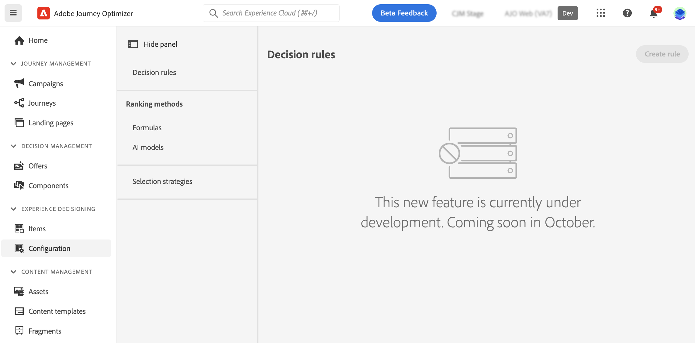

# Decision rules {#rules}

>[!CONTEXTUALHELP]
>id="ajo_exd_config_rules"
>title="Create decision rules"
>abstract="Decision rules allow you to define the audience for decision items by applying constraints, either directly at the decision item level or within a specific selection strategy. This enables you to precisely control which items should be presented to whom."

>[!BEGINSHADEBOX "What you'll find in this documentation guide"]

* [Get started with Experience Decisioning](gs-experience-decisioning.md)
* Manage your decision items: [Configure the items catalog](catalogs.md) - [Create decision items](items.md) - [Manage items collections](collections.md)
* Configure items' selection: **[Create decision rules](rules.md)** - [Create ranking methods](ranking.md)
* [Create selection strategies](selection-strategies.md)
* [Create decision policies](create-decision.md)

>[!ENDSHADEBOX]

Decision rules allow you to define the audience for decision items by applying constraints, either directly at the decision item level or within a specific selection strategy. This enables you to precisely control which items should be presented to whom.

For instance, let's consider a scenario where you have decision items featuring Yoga-related products designed for women. With decision rules, you can specigy that these items should only be displayed to profiles whose gender is 'Female' and who have indicated a 'Point of Interest' in 'Yoga'.

>[!NOTE]
>
>In addition to item and selection strategy level decision rules, you can also define your intended audience at the campaign level. [Learn more](../campaigns/create-campaign.md#audience)

The list of decision rules is accessible in the **[!UICONTROL Configuration]** / **[!UICONTROL Decisions rules]** menu.

<!---->

>[!IMPORTANT]
>
>For now, decision rules are managed using Journey Optimizer's **Decision management** menu. As a result, the **[!UICONTROL Decision rules]** list in Experience Decisioning encompasses rules created from both Journey Optimizer **[!UICONTROL Decision Management]** or **[!UICONTROL Experience Decisioning]** menus.

To create a rule, follow these steps:

1. Navigate to **[!UICONTROL Configuration]** / **[!UICONTROL Decision rules]**.
1. Journey Optimizer's Decision management user interface displays in the central area. Follow the steps detailed in the [Decision management documentation](../offers/offer-library/creating-decision-rules.md) to build your rule based on your needs.

1. Once the rule is created, it appears in the list and is available for use in decision items and selection strategies to govern the presentation of decision items to profiles.
