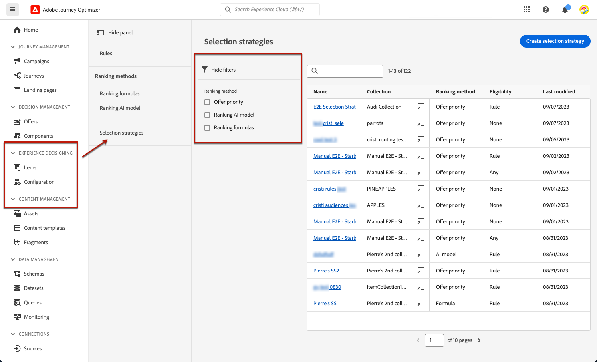
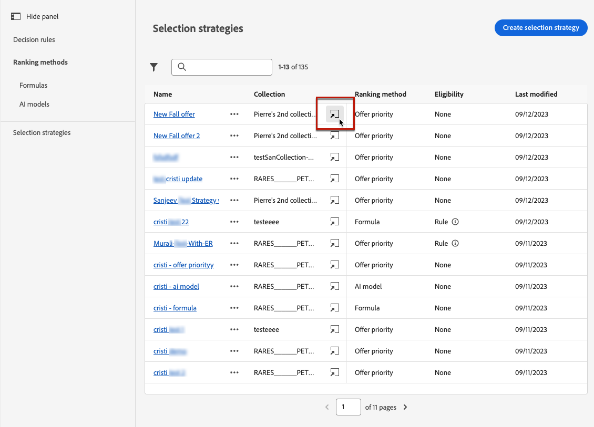
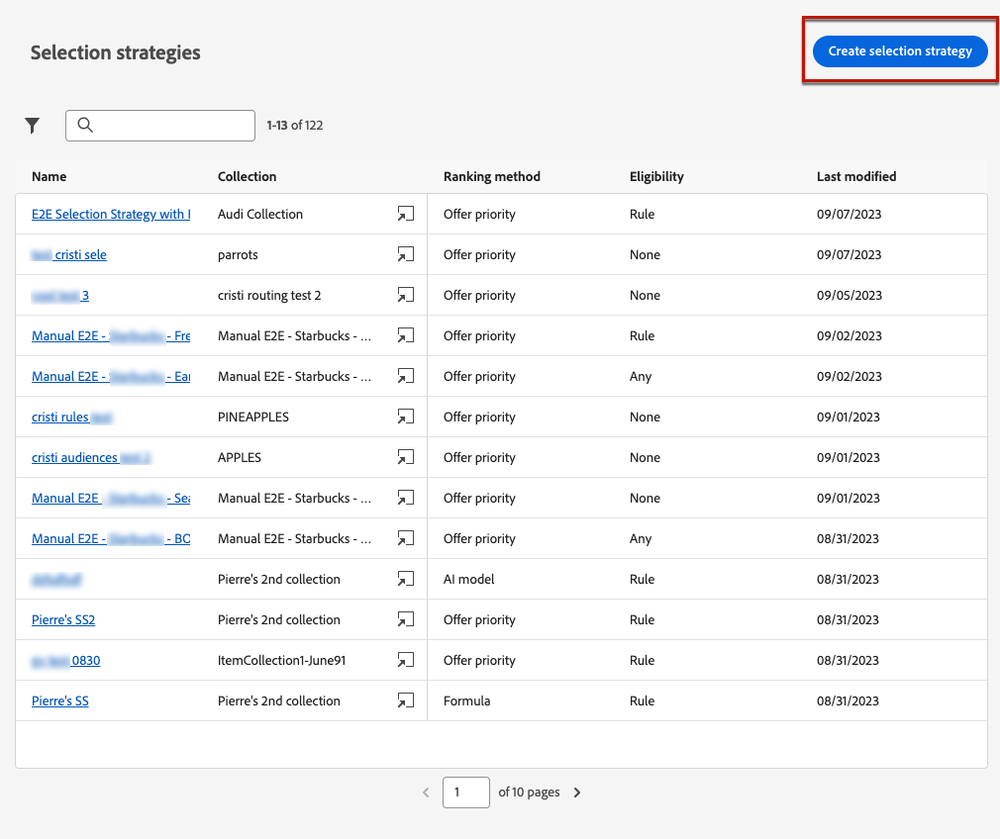
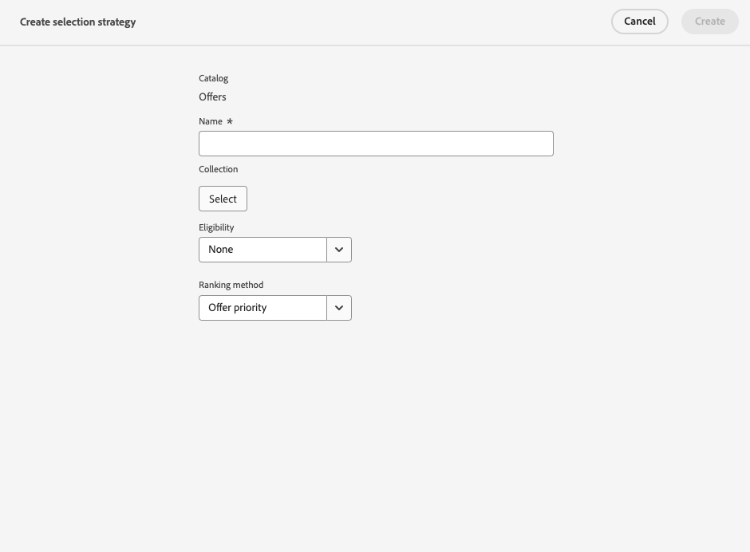
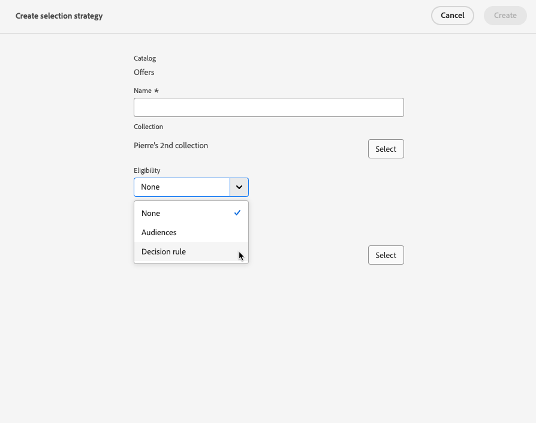
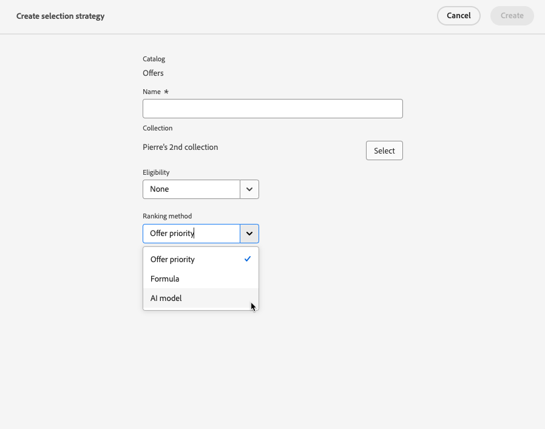
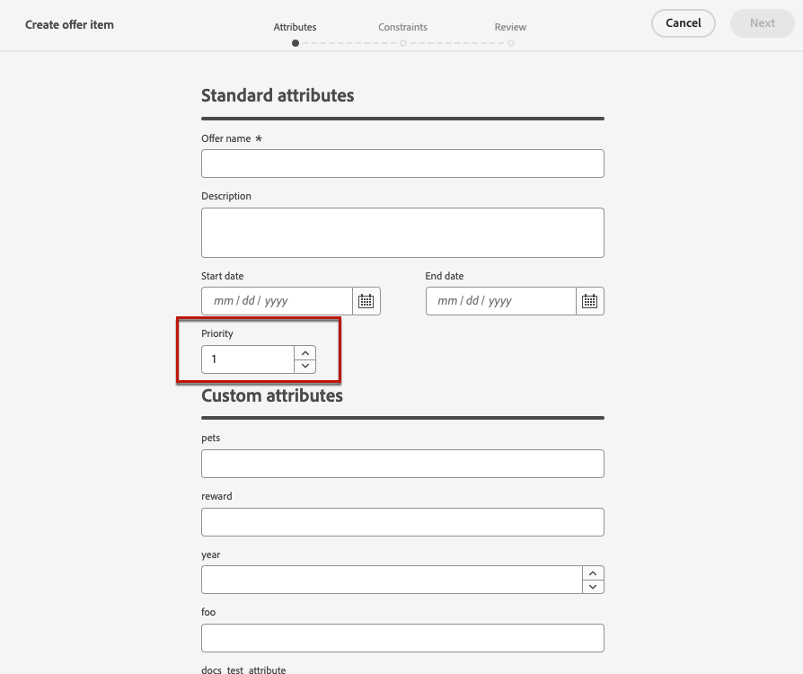

# Create selection strategies {#selection-strategies}

>[!BEGINSHADEBOX]

What you'll find in this documentation guide:

* [Get started with Experience Decisioning](gs-experience-decisioning.md)
* Manage your decision items
    * [Configure the items catalog](catalogs.md)
    * [Create decision items](items.md)
    * [Manage items collections](collections.md)
* Configure items' selection
    * [Create decision rules](rules.md)
    * [Create ranking methods](ranking.md)
* **[Create selection strategies](selection-strategies.md)**
* [Create decision policies](create-decision.md)

>[!ENDSHADEBOX]

A selection strategy is a reusable item, which consists in a collection associated with an eligibility constraint and a ranking method to determine the offers to be shown when selected in a [decision policy](create-decision.md).

## Access and manage selection strategies

1. Go to **[!UICONTROL Experience Decisioning]** > **[!UICONTROL Configuration]** > **[!UICONTROL Selection strategies]**.

1. All the selection strategies created so far are listed. Filters are available to help you retrieve strategies according to the ranking method.

    

1. Click a selection strategy name to edit it.

1. The collection, ranking method and eligibility selected for each strategy are also displayed. You can click the icon next to each collection name to directly edit a collection.

    

## Create a selection strategy

To create a selection strategy, follow the steps below.

1. From the **[!UICONTROL Selection strategies]** inventory, click **[!UICONTROL Create selection strategy]**.

    

1. Add a name for your strategy.

    >[!NOTE]
    >
    >Currently only the default **[!UICONTROL Offers]** catalog is available.

1. Fill in the details for your selection strategy, starting by the name.

    

1. Select the offer [collection](collections.md) that contains the offers to consider.

1. Use the **[!UICONTROL Eligibility]** field to restrict the selection of offers for this selection strategy.

    

    * To restrict the selection of the offers to the members of an Experience Platform audience, select **[!UICONTROL Audiences]** and choose an audience from the list. [Learn how to work with audiences](../audience/about-audiences.md)

    * If you want to add a selection constraint with a decision rule, use the **[!UICONTROL Decision rule]** option and select the rule of your choice. [Learn how to create a rule](rules.md)

1. Define the ranking method you want to use to select the best offer for each profile. [Learn more](#select-ranking-method)

    

    * By default, if multiple offers are eligible for this strategy, the [Offer priority](#offer-priority) method uses the value defined in the offers.

    * If you want to use a specific calculated score to choose which eligible offer to deliver, select [Formula](#ranking-formula) or [AI model](#ai-ranking).

1. Click **[!UICONTROL Create]**. It is now ready to be used in a [decision](create-decision.md)

## Select a ranking method {#select-ranking-method}

If several offers are eligible for a given selection strategy, you can choose the method that will select the best offer for each profile when creating a selection strategy. You can rank offers by:

* [Offer priority](#offer-priority)
* [Formula](#ranking-formula)
* [AI ranking](#ai-ranking)

### Offer priority {#offer-priority}

By default, when several offers are eligible for a given placement in a decision, the items with the highest **priority** will be delivered to the customers first.

Offers' priority scores are assigned when creating a [decision item](items.md).

### Ranking formula {#ranking-formula}

In addition to offer priority, Journey Optimizer allows you to create **ranking formulas**. These are formulas that determine which offer should be presented first for a given placement, rather than taking into account the offers' priority scores.

For example, you can boost the priority of all offers where the end date is less than 24 hours from now, or boost offers from the "running" category if the profile's point of interest is "running". Learn how to create a ranking formula in [this section](ranking.md).

Once created, you can use this formula in a selection strategy. If multiple offers are eligible to be presented when using this selection strategy, the decision will use the selected formula to calculate which offer to deliver first.

### AI ranking {#ai-ranking}

You can also use a trained model system that automatically ranks offers to display for a given profile by selecting an AI model. Learn how to create an AI model in [this section](ranking.md).

Once an AI model has been created, you can use it in a selection strategy. If multiple offers are eligible, the trained model system will determine which offer should be presented first for this selection strategy.
