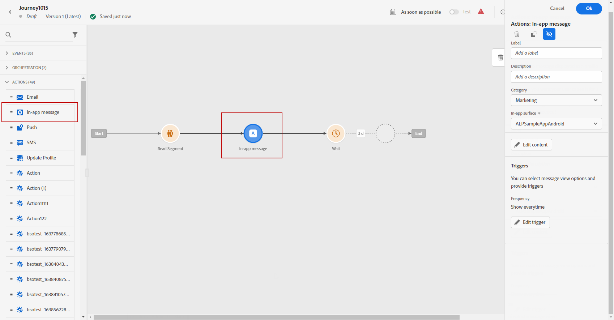
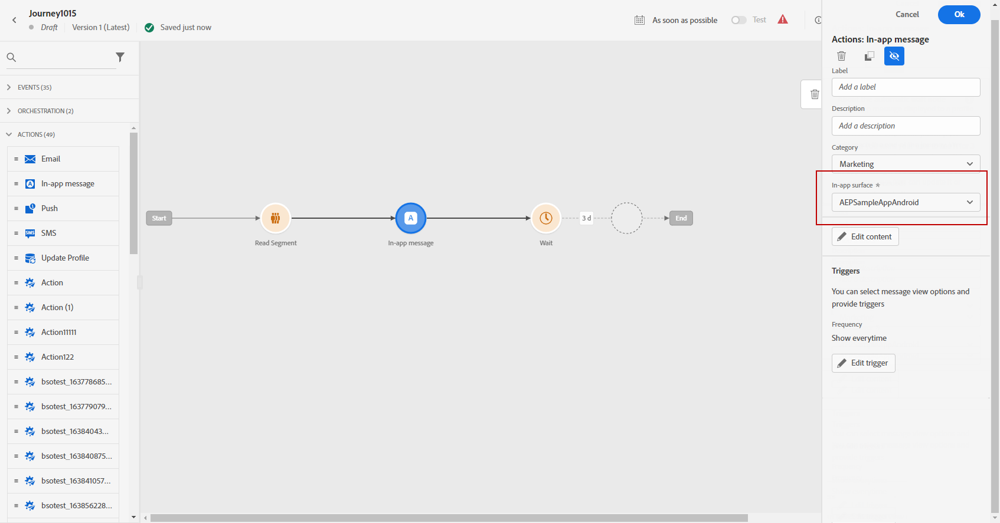
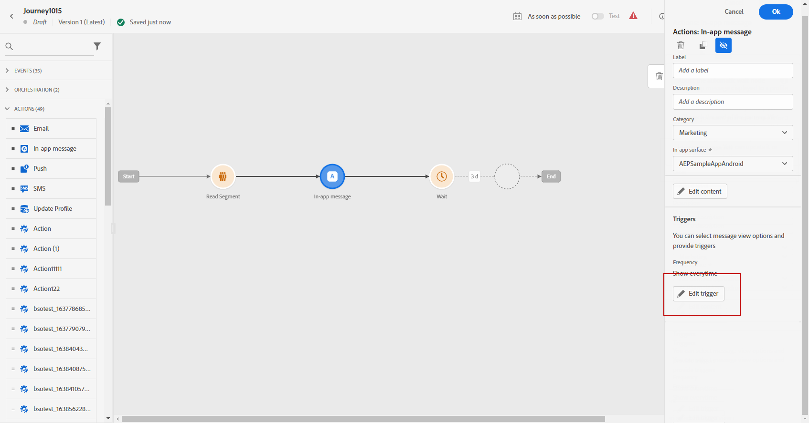
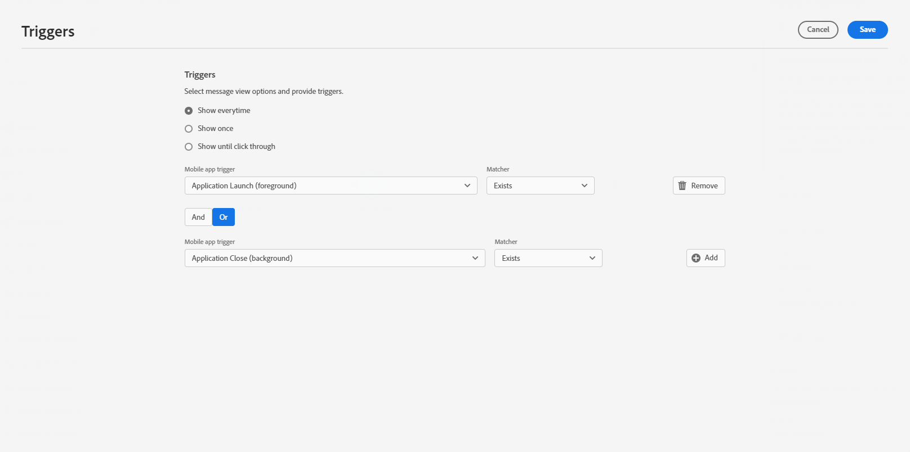

# Create an In-app message in a journey {#create-in-app-journey}

To add an In-app message in a journey, follow these steps:

1. Open your journey, then drag and drop an **[!UICONTROL In-app]** activity from the **[!UICONTROL Actions]** section of the palette.

    When a profile reaches the end of their journey, any in-app messages displayed to them will automatically expire. For that reason, a Wait activity is automatically added after your In-app activity to ensure proper timing.

    

1. Enter a **[!UICONTROL Label]** and **[!UICONTROL Description]** for your message.

1. Choose the [In-app surface](inapp-configuration.md) to use.

    

1. You can now start designing your content with the **[!UICONTROL Edit content]** button. [Learn more](design-in-app.md)

1. Click **[!UICONTROL Edit trigger]** to configure your Trigger. 

    

1. From the **[!UICONTROL In-app message trigger]** window, choose the event(s) and criteria that will trigger your message:

    1. Click **[!UICONTROL Add condition]** if you want the trigger to consider multiple events or criteria. 
    1. From the **[!UICONTROL Select an event]** drop-down, select the type of event for your trigger.
    1. Select how your events are linked, e.g. choose **[!UICONTROL And]** if you want **both** triggers to be true in order for a message to be shown or choose **[!UICONTROL Or]** if you want the message to be shown if **either** of the triggers are true.
    1. Click **[!UICONTROL Make group]** to group triggers together.

    

1. Choose the frequency your trigger when your In-app message is active:

    * **[!UICONTROL Every time]**: Always show the message when the events selected in the **[!UICONTROL Mobile app trigger]** drop-down occur.
    * **[!UICONTROL Once]**: Only show this message the first time the events selected in the **[!UICONTROL Mobile app trigger]** drop-down occur.
    * **[!UICONTROL Until click through]**: Show this message when the events selected in the **[!UICONTROL Mobile app trigger]** drop-down occur until an interact event is sent by the SDK with an action of "clicked".
    * **[!UICONTROL X number of times]**: Only show the message a specific number of times, determined by the value set in the **[!UICONTROL Times to display]** field.

1. Select the day of the week and the specific time when you want your In-app message to be triggered and click **[!UICONTROL Save]**.

1. If necessary, complete your journey flow by dragging and dropping additional actions or events. [Learn more](../building-journeys/about-journey-activities.md)

1. Once your In-app message is ready, finalize the configuration and publish your journey to activate it.

For more information on how to configure a journey, refer to [this page](../building-journeys/journey-gs.md).

## In-app report {#inapp-report}

From your Journey **[!UICONTROL Global report]**, the **[!UICONTROL In-app]** tab details the main information relative to the In-app deliveries sent in your journeys.

Learn more about [Journey global report](../reports/journey-global-report.md).

+++Learn more on the different metrics and widgets available for the In-app report.

The **[!UICONTROL In-app performance]** KPIs detail the main information relative to your visitors' engagement with your In-app messages, such as:

* **[!UICONTROL Unique impressions]**: number of unique users to whom the In-app message was delivered.

* **[!UICONTROL Impressions]**: total number of In-app messages delivered to all users.

* **[!UICONTROL Click rate]**: percentage of users who interacted with the buttons included in the In-app message compared to users who saw the message.

* **[!UICONTROL Dismiss rate]**: percentage of In-app messages that recipients dismissed.

The **[!UICONTROL In-app summary]** graph shows the evolution of your In-app impressions for the concerned period.

The **[!UICONTROL Clicks by button]** graphs and table contain the available data for recipient behavior per button:

* **[!UICONTROL Clicks]**: total number of recipients who interacted with the buttons included in the In-app message.

* **[!UICONTROL Click rate]**: percentage of users who interacted with the buttons included in the In-app message compared to users who saw the message.
+++

**Related topics:**

* [Design In-app message](design-in-app.md)
* [Test and send your In-app message](send-in-app.md)
* [In-app report](../reports/campaign-global-report.md#inapp-report)
* [In-app configuration](inapp-configuration.md)
