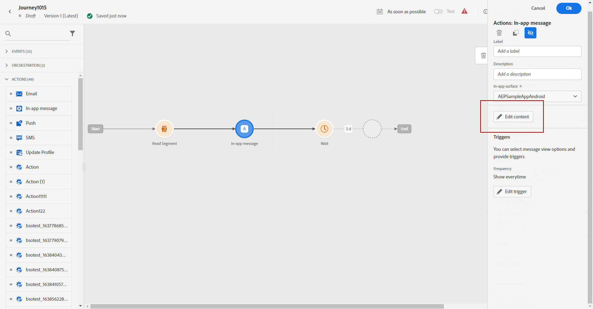
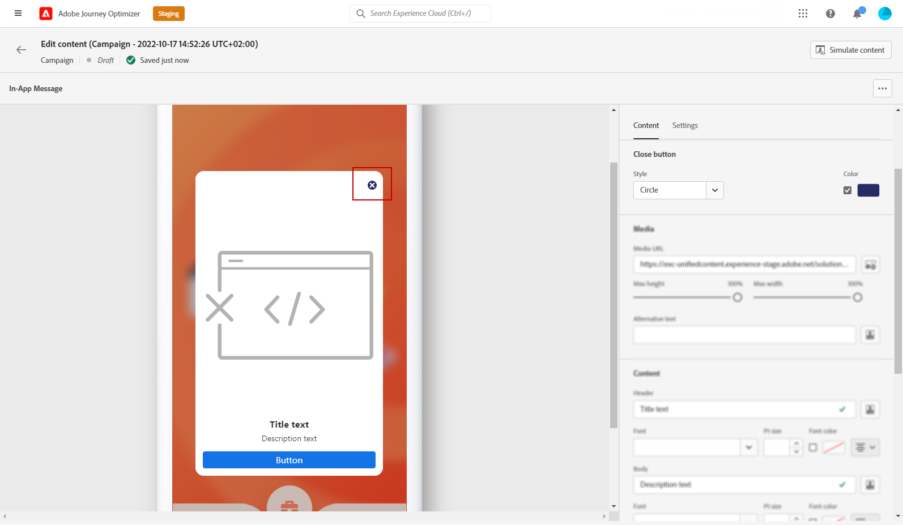
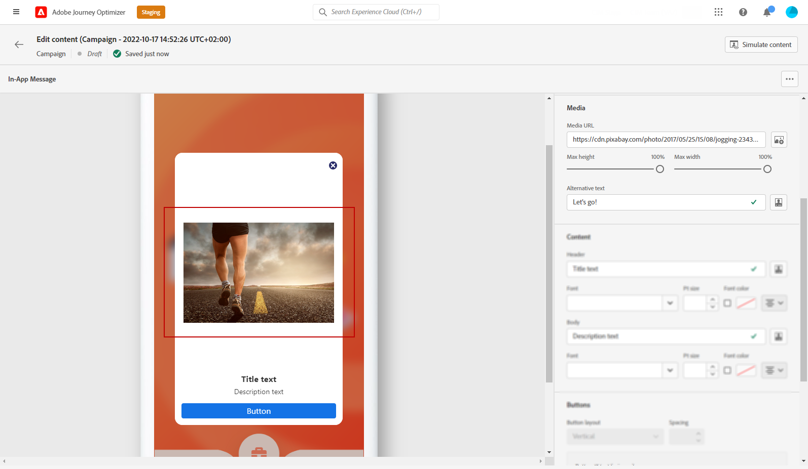
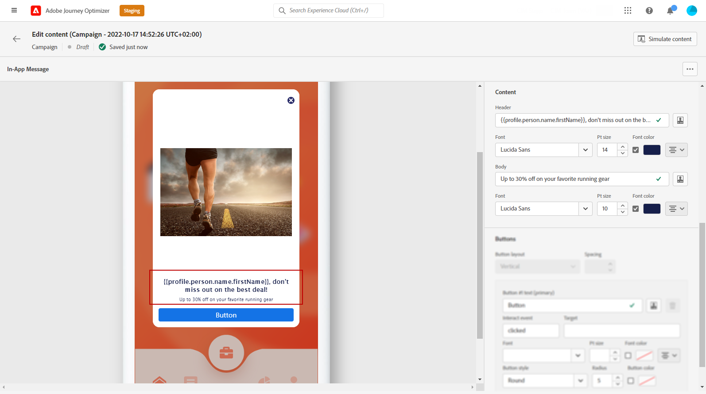
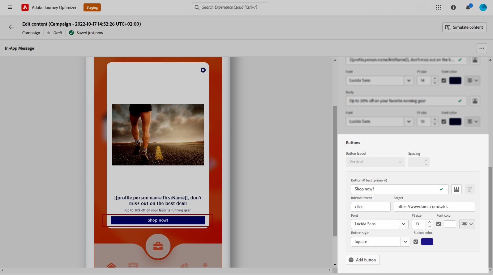
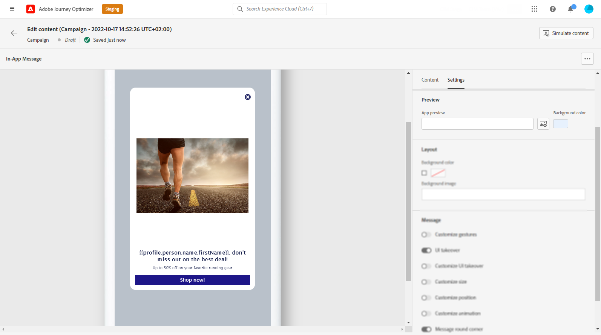
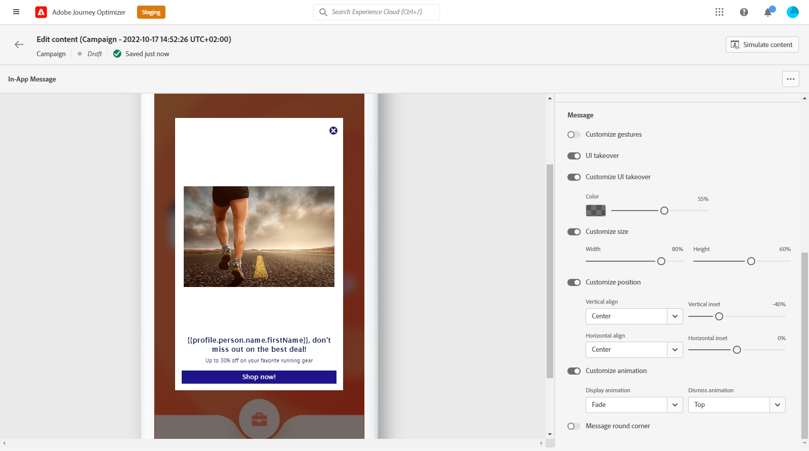

# Design your In-app content {#design-content}

>[!CONTEXTUALHELP]
>id="ajo_campaigns_inapp_content"
>title="Define your In-app content"
>abstract="Customize the content and style of your in-app messages. You can also add media and action buttons to make your messages more engaging and effective."

You can edit the In-app content to configure experience options:

* In a **[!UICONTROL Campaign]**, from the **[!UICONTROL Action]** menu,  to configure the message content click the **[!UICONTROL Edit content]** button.

    

* In a **[!UICONTROL Journey]**, from the advanced menu of your In-app **[!UICONTROL Action]**, you can start designing your content with the **[!UICONTROL Edit content]** button.
    
    

The **[!UICONTROL Advanced formatting]** toggle activates additional options to customize the experience.

Once your In-app message is created, and its content defined and personalized, you can review and activate it. Notifications will then be sent according to the campaign schedule. Learn more in [this page](send-in-app.md).

## Message layout {#message-layout}

>[!CONTEXTUALHELP]
>id="ajo_campaigns_inapp_authoring_message_layout"
>title="Define your In-app content"
>abstract="The message layout provides you with commonly used templates to frame your message. Custom layout provides options to upload or compose custom HTML messages."

From the **[!UICONTROL Message Layout]** section, select one of the four different layout options to choose from depending on your messaging needs. 

* **[!UICONTROL Fullscreen]**: This type of layout covers the entire screen of your audience devices.
    
    It supports media (image, video), text and button components.

* **[!UICONTROL Modal]**: This layout appears in a large alert-style window, your application is still visible in the background.

    It supports media (image, video), text and button components.

* **[!UICONTROL Banner]**: This type of layout appears as a native OS alert message.

    You can only add a **[!UICONTROL Header]** and a **[!UICONTROL Body]** to your message.

* **[!UICONTROL Custom]**: The custom message mode allows you to directly import and edit one of your pre-configured HTML messages.

    * Select **[!UICONTROL Compose]** to enter or paste your raw HTML code.
    
        Use the left pane to leverage Journey Optimizer personalization capabilities. For more on this, refer to [this section](../personalization/personalize.md).
    
    * Select **[!UICONTROL Import]** to import the HTML or .zip file containing your HTML content.

## Content tab {#content-tab}

From the **Content** tab, you can define and personalize the content of the notification and the style of the **Close** button. You can also add a media to your In-app notification, and add action buttons from this tab.

### Close button {#close-button}

>[!CONTEXTUALHELP]
>id="ajo_campaigns_inapp_authoring_close"
>title="Choose the Style of your Close button."
>abstract="The close button section gives you options to select variations of the message close button and an option to upload a custom image."

Choose the **[!UICONTROL Style]** of your **[!UICONTROL Close button]**.

Available styles are:

* **[!UICONTROL Simple]**
* **[!UICONTROL Circle]**
* **[!UICONTROL Custom image]** from a Media URL or your Assets.

+++More options with advanced formatting

If the **[!UICONTROL Advanced formatting mode]** is switched on, you can check the **[!UICONTROL Color]** option to choose the color and opacity of your button.

+++

### Media {#add-media}

>[!CONTEXTUALHELP]
>id="ajo_campaigns_inapp_authoring_media"
>title="Add media to your In-app message to create a compelling experience for end user."
>abstract="Provide either a direct link to content or use the asset selector to pick media in Asset Essentials to add to your message."

The **[!UICONTROL Media]** field allows you to add media to your In-app message to create a compelling experience for end user.

Type-in your Media URL or click the **[!UICONTROL Select Assets]** icon to directly add assets stored in your Assets library to your In-app message. [Learn more about asset management](../content-management/assets-essentials.md).
You can also add an **[!UICONTROL Alternative text]** for screen reading applications.

+++More options with advanced formatting

If the **[!UICONTROL Advanced formatting mode]** is switched on, you can customize the **[!UICONTROL Max height]** and **[!UICONTROL Max width]** of your media. 

+++

### Header and Body {#title-body}

>[!CONTEXTUALHELP]
>id="ajo_campaigns_inapp_authoring_content"
>title="To compose your message, enter the content in the Header and Body fields."
>abstract="Both header and body text can be added here. To include personalization tokens, open the personalization dialog."

To compose your message, enter the content in the **[!UICONTROL Header]** and **[!UICONTROL Body]** fields.

Use the **[!UICONTROL Personalization]** icon to add personalization. Learn more about personalization in Adobe Journey Optimizer Expression Editor [in this section](../personalization/personalize.md).

+++More options with advanced formatting

If the **[!UICONTROL Advanced formatting mode]** is switched on, you can choose for your **[!UICONTROL Header]** and **[!UICONTROL Body]**:

* the **[!UICONTROL Font]**
* the **[!UICONTROL Pt size]**
* the **[!UICONTROL Font Color]**
* the **[!UICONTROL Alignment]**
+++

### Buttons {#add-buttons}

>[!CONTEXTUALHELP]
>id="ajo_campaigns_inapp_authoring_buttons"
>title="Add buttons for users to interact with your In-app message."
>abstract="This section will allow you to add call-to-action buttons to your message. You can include custom text and targets for each button."

Add buttons for users to interact with your In-app message.

To personalize your button:

1. Edit the Button #1 text (primary) field. You can also use the **[!UICONTROL Personalization]** icon to define content and personalization data.

1. Choose your **[!UICONTROL Interact event]** which defines your button's action after users interacted with it.

1. Enter your web URL or deeplink in the **[!UICONTROL Target]** field.

1. To add multiple buttons, click **[!UICONTROL Add button]**.

+++More options with advanced formatting

If the **[!UICONTROL Advanced formatting mode]** is switched on, you can choose for your **[!UICONTROL Buttons]**:

* the **[!UICONTROL Font]**
* the **[!UICONTROL Pt size]**
* the **[!UICONTROL Font Color]**
* the **[!UICONTROL Alignment]**
* the **[!UICONTROL Button style]**
* the **[!UICONTROL Radius]**
* the **[!UICONTROL Button color]**

+++

## Settings tab {#settings-tab}

From the **Settings** tab, you can define the message layout and preview your In-app message. You can also access advanced formatting options.

### Preview {#preview-tab}

>[!CONTEXTUALHELP]
>id="ajo_campaigns_inapp_authoring_preview"
>title="Preview your In-app message."
>abstract="This is the preview image that will be displayed when your message is sent to the device's message summary."
    

The **[!UICONTROL App Preview]** allows you to add a background behind your In-app message:

* A media from an URL link.

* An asset from your Assets library.

* A background color.

### Layout {#layout-options}

>[!CONTEXTUALHELP]
>id="ajo_campaigns_inapp_authoring_layout"
>title="Define the message layout of your In-app message."
>abstract="This section allows you to add a background to your In-app message. This requires the UI takeover to be enabled."

The **[!UICONTROL Background image]** field allows you to add a background to your In-app message:

* A media from an URL link.

* A background color.

### Message {#message-tab}

>[!CONTEXTUALHELP]
>id="ajo_campaigns_inapp_authoring_message_advanced"
>title="Define the message advanced settings."
>abstract="This section empowers you to enhance the personalization of your in-app content, especially when you have Advanced Formatting enabled."

The UI takeover option, enabled by default, allows you to darken the background behind your In-app message to emphasize the focus on your content.

+++More options with advanced formatting

If the **[!UICONTROL Advanced formatting mode]** is switched on, you can further personalize your message with the following options:

* **[!UICONTROL Customize gestures]**: allows you to customize what the user swipe interaction is. If dismiss is selected, you can add a custom interact event and/or target destination.

* **[!UICONTROL Customize UI takeover]**: allows you to select a color to display in the background and its opacity.

* **[!UICONTROL Customize size]**: allows you to adjust your In-app notification's width and height.

* **[!UICONTROL Customize position]**: allows you to customize the position of your In-app messages on your users' screen. You can change the Vertical and Horizontal alignments.

* **[!UICONTROL Customize animation]**: allows you to customize your Display and Dismiss animations, e.g. if you In-app notification appears from the left or top of your user's device.

* **[!UICONTROL Message round corner]**: allows you to add round corner to your In-app notification by changing the **[!UICONTROL Corner radius]**.

+++

**Related topics:**

* [Create In-app message](create-in-app.md)
* [In-app report](../reports/campaign-global-report.md#inapp-report)
* [In-app configuration](inapp-configuration.md)

## How-to video{#video}

The video below shows how to author and test your In-app messages.

>[!VIDEO](https://video.tv.adobe.com/v/3410471?quality=12&learn=on)
