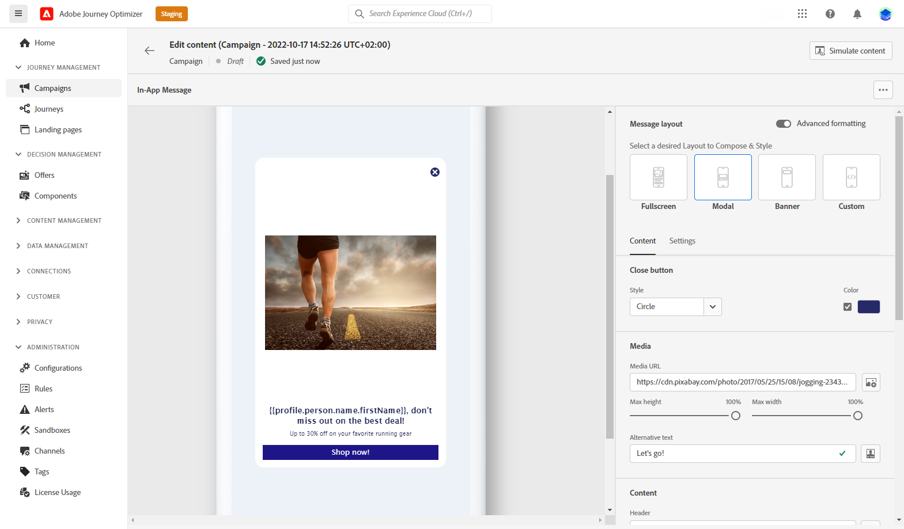

# Get started with In-app channel {#gs-in-app}

In-app messages are notifications you can send to users inside your app to direct them toward specific points of interest. In-app notifications can be used to propose a service, promote a new feature, a special offer, or onboard a new user. 

Use Journey Optimizer to create In-app notifications, and configure experience options, including the message layout and display, text, and button options.

## Prerequisites{#prerequisites-in-app}

Before sending In-app messages, you need to:

* Configure the In-app channel. [Learn more](inapp-configuration.md)

* Make sure you have the correct permissions on Journey Optimizer campaigns before starting. [Learn more](../campaigns/get-started-with-campaigns.md#campaign-prerequisites)

Once done, you can create, configure and sent your first In-app message. Learn how to achieve this in [this section](create-in-app.md).

**Related topics:**

* [Create In-app message](create-in-app.md)
* [Design In-app message](design-in-app.md)
* [In-app report](inapp-report.md)
* [In-app configuration](inapp-configuration.md)
