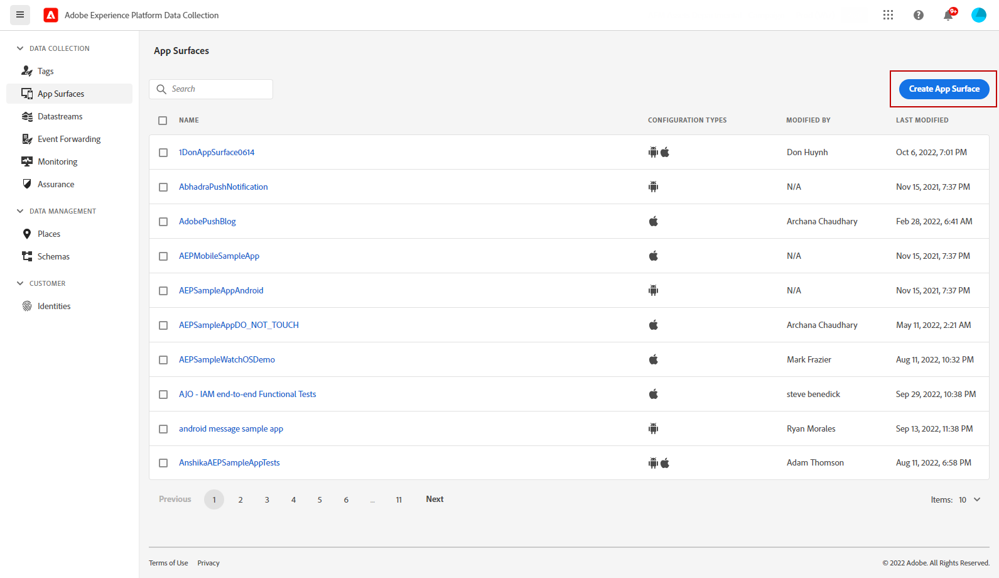

# Configure In-app channel {#inapp-configuration}

>[!IMPORTANT]
>
>The In-app feature is currently available as a beta to select users only. 

Before sending In-app messages, you need to configure your in-App channel in [!DNL Adobe Experience Platform Data Collection].

1. From your [!DNL Adobe Experience Platform Data Collection] account, access the **[!UICONTROL Datastream]** menu and click **[!UICONTROL New datastream]**. For more information on datastream creation, refer to [this page](https://aep-sdks.gitbook.io/docs/getting-started/configure-datastreams).

1. Select the [!DNL Adobe Experience Platform] service.

    [!DNL Edge Segmentation], [!DNL Offer Decisioning] and [!DNL Adobe Journey Optimizer] must be selected.

    

1. Then, access the **[!UICONTROL App surfaces]** menu, then click **[!UICONTROL Create App surface]**.

    

1. Add a name to your **[!UICONTROL App surface]**.

1. From the Apple iOS drop-down, type-in your **iOS Bundle ID**. Refer to [Apple documentation](https://developer.apple.com/documentation/appstoreconnectapi/bundle_ids) for more information on **Bundle ID**.

    

1. From the Android drop-down, type-in your **Android package name**. Refer to [Android documentation](https://support.google.com/admob/answer/9972781?hl=en#:~:text=The%20package%20name%20of%20an,supported%20third%2Dparty%20Android%20stores) for more information on **Package name**.

1. Click **[!UICONTROL Save]** when you finished the configuration of your **[!UICONTROL App surface]**.

    

    Your **[!UICONTROL App surface]** will now be available when creating a new campaign with an In-app message. [Learn more](create-in-app.md)

1. After creating your app surface, you now need to create a mobile property. 

    Refer to [this page](https://experienceleague.adobe.com/docs/experience-platform/tags/admin/companies-and-properties.html#for-mobile) for the detailed procedure.

    

1. From the Extensions menu of your newly created property, install the following extensions:

    * Adobe Experience Platform Edge Network
    * Adobe Journey Optimizer
    * AEP Assurance
    * Consent
    * Identify
    * Mobile Core
    * Profile

    Refer to [this page](https://experienceleague.adobe.com/docs/experience-platform/tags/ui/extensions/overview.html?lang=en#add-a-new-extension) for the detailed procedure.

    

The In-app channel is now configured. You can start sending In-app messages to your users.

**Related topics:**

* [Create an In-app message](create-in-app.md)
* [Create a campaign](../campaigns/create-campaign.md)
* [Design In-app message](design-in-app.md)
* [In-app report](../reports/campaign-global-report.md#inapp-report)
