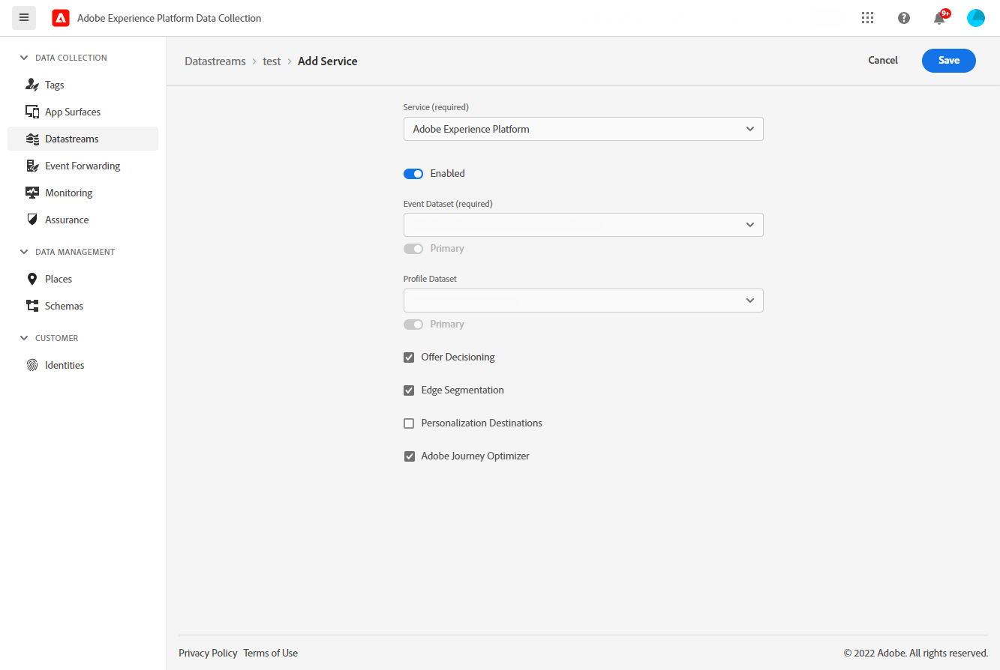
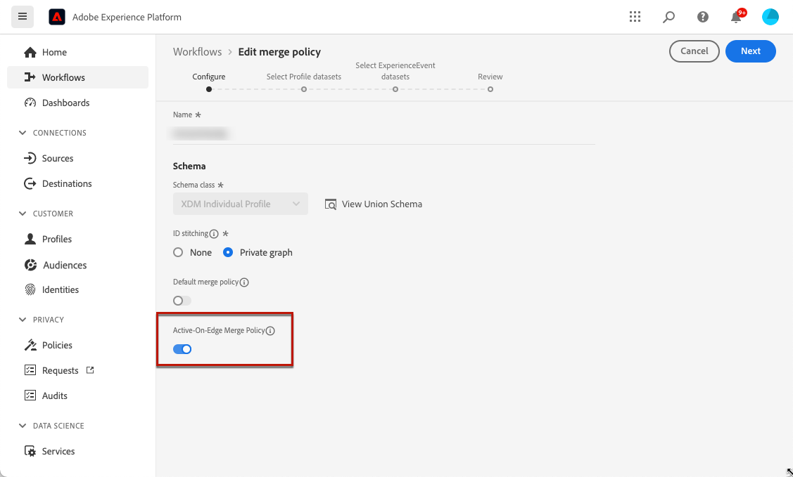
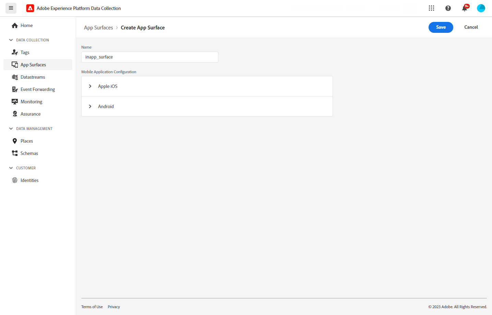
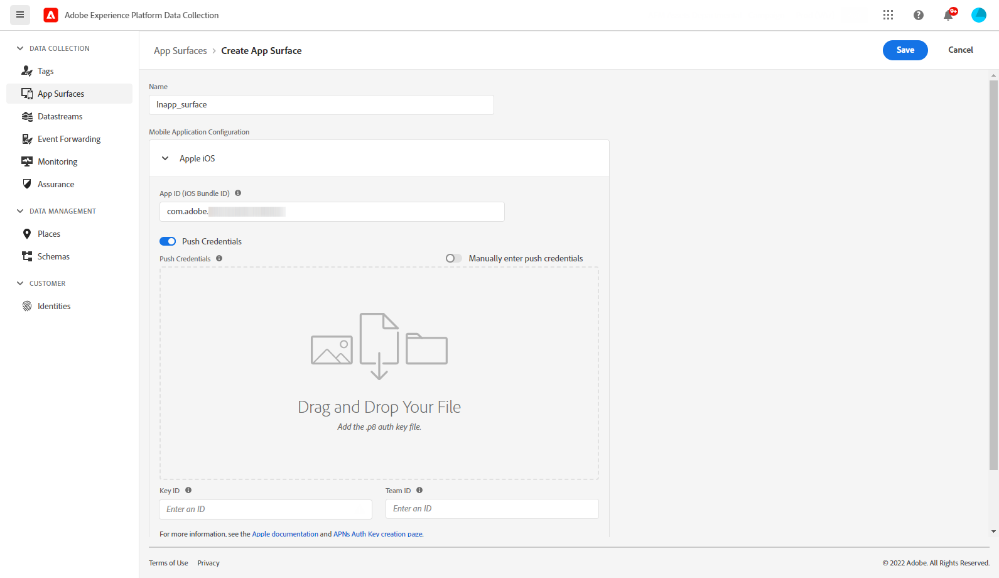
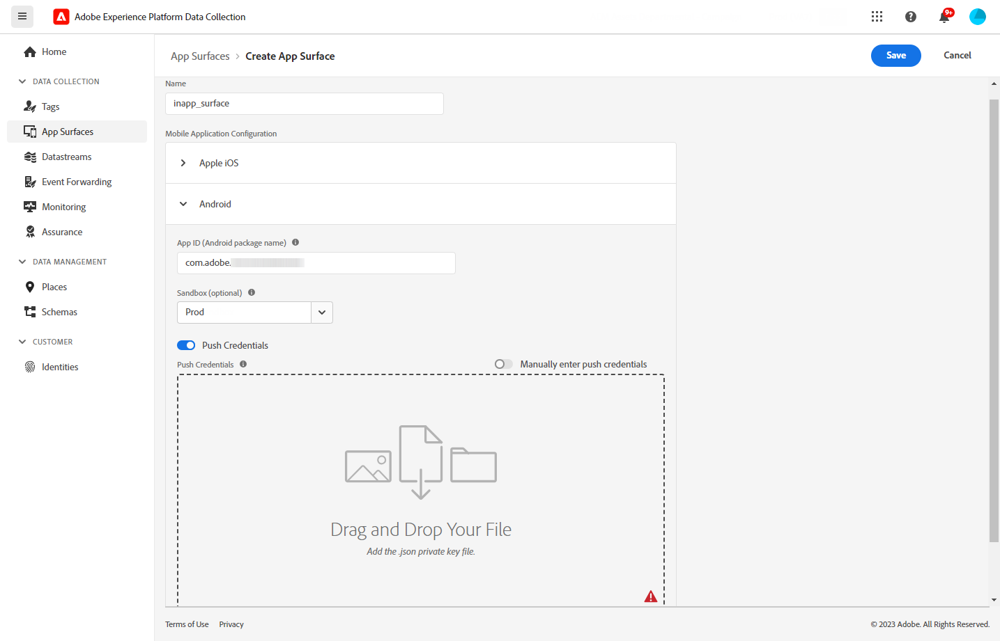
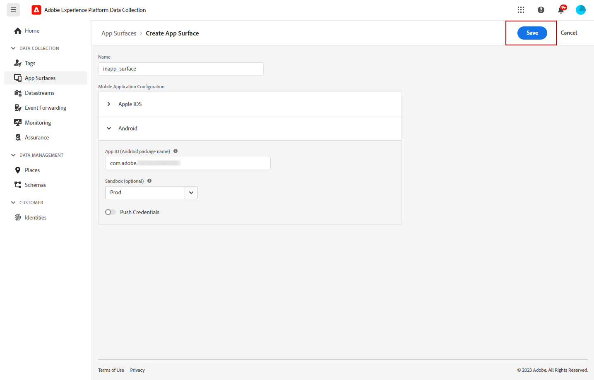
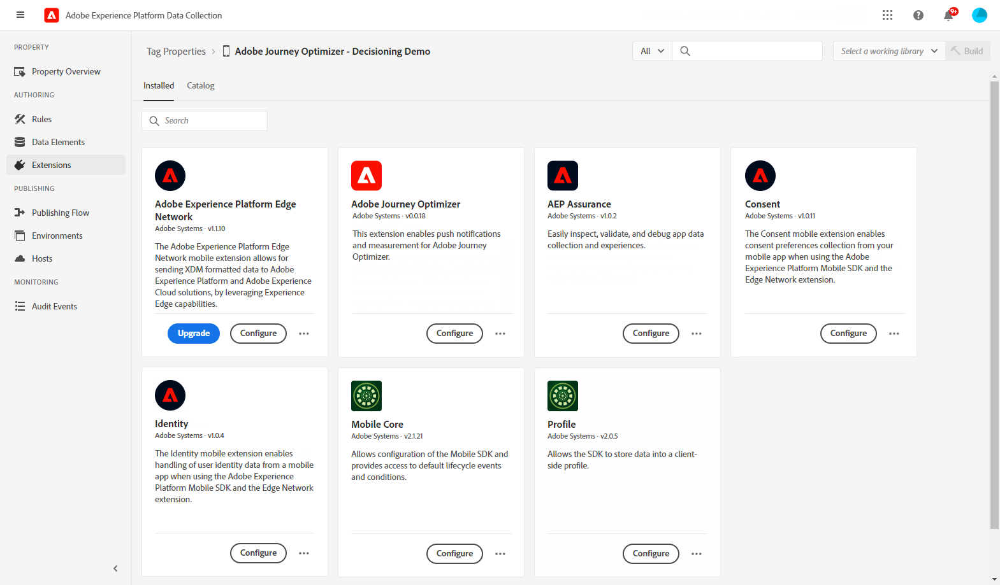

# In-app channel prerequisites {#inapp-configuration}

## Delivery prerequisites {#delivery-prerequisites}

For the In-app messages to be delivered correctly, the following settings must be defined:

* In the [Adobe Experience Platform Data Collection](https://experienceleague.adobe.com/docs/experience-platform/edge/datastreams/overview.html){target="_blank"}, make sure you have a datastream defined such as under the **[!UICONTROL Adobe Experience Platform]** service you have the Adobe Experience Platform Edge and **[!UICONTROL Adobe Journey Optimizer]** option enabled.

    This ensures that the Journey Optimizer inbound events are correctly handled by the Adobe Experience Platform Edge. [Learn more](https://experienceleague.adobe.com/docs/experience-platform/edge/datastreams/configure.html){target="_blank"}

    

* In [Adobe Experience Platform](https://experienceleague.adobe.com/docs/experience-platform/profile/home.html){target="_blank"}, make sure you have the default merge policy with the **[!UICONTROL Active-On-Edge Merge Policy]** option enabled. To do this, select a policy under the **[!UICONTROL Customer]** > **[!UICONTROL Profiles]** > **[!UICONTROL Merge Policies]** Experience Platform menu. [Learn more](https://experienceleague.adobe.com/docs/experience-platform/profile/merge-policies/ui-guide.html#configure){target="_blank"}

    This merge policy is used by [!DNL Journey Optimizer] inbound channels to correctly activate and publish inbound campaigns on the edge. [Learn more](https://experienceleague.adobe.com/docs/experience-platform/profile/merge-policies/ui-guide.html){target="_blank"}
    
    >[!NOTE]
    >
    >When using a custom **[!UICONTROL Dataset preference]** merge policy, make sure to add the **[!UICONTROL Journey Inbound]** dataset within the specified merge policy.

    

## Channel configuration prerequisites {#channel-prerequisites}

1. Access the **[!UICONTROL App surfaces]** menu and click **[!UICONTROL Create App surface]**.

1. Add a name to your **[!UICONTROL App surface]**.

    

1. From the **[!UICONTROL Apple iOS]** drop-down, configure your mobile application for Apple iOS.

    +++ Learn more
    
    1. Type-in your **[!UICONTROL iOS Bundle ID]**. Refer to [Apple documentation](https://developer.apple.com/documentation/appstoreconnectapi/bundle_ids) for more information on **Bundle ID**.

    1. (optional) Choose the **[!UICONTROL Sandbox]** where you want to send push notifications from. Note that choosing a specific Sandbox requires the necessary access permissions.

        For more information on sandbox management, refer to [this page](../administration/sandboxes.md#assign-sandboxes).

    1. Enable the **[!UICONTROL Push credentials]** option to drag and drop your .p8 auth key file if needed.

        You can also enable the **[!UICONTROL Manually enter push credentials]** option to copy and paste your APNs auth key directly.

    1. Enter your **[!UICONTROL Key ID]** and **[!UICONTROL Team ID]**.

        

    +++

1. From the **[!UICONTROL Android]** drop-down, configure your mobile application for Android.

    +++ Learn more

    1. Type-in your **[!UICONTROL Android package name]**. Refer to [Android documentation](https://support.google.com/admob/answer/9972781?hl=en#:~:text=The%20package%20name%20of%20an,supported%20third%2Dparty%20Android%20stores) for more information on **Package name**.

    1. (optional) Choose the **[!UICONTROL Sandbox]** where you want to send push notifications from. Note that choosing a specific Sandbox requires the necessary access permissions.

        For more information on sandbox management, refer to [this page](../administration/sandboxes.md#assign-sandboxes).

    1. Enable the **[!UICONTROL Push credentials]** option to drag and drop your .json private key file if needed.

        You can also enable the **[!UICONTROL Manually enter push credentials]** option to copy and paste your FCM private key directly.

        

1. Click **[!UICONTROL Save]** when you finished the configuration of your **[!UICONTROL App surface]**.

    

    Your **[!UICONTROL App surface]** will now be available when creating a new campaign with an In-app message. [Learn more](create-in-app.md)

1. After creating your app surface, you now need to create a mobile property. 

    Refer to [this page](https://experienceleague.adobe.com/docs/experience-platform/tags/admin/companies-and-properties.html#for-mobile) for the detailed procedure.

    

1. From the Extensions menu of your newly created property, install the following extensions:

    * Adobe Experience Platform Edge Network
    * Adobe Journey Optimizer
    * AEP Assurance
    * Consent
    * Identity
    * Mobile Core
    * Profile

    Refer to [this page](https://experienceleague.adobe.com/docs/experience-platform/tags/ui/extensions/overview.html#add-a-new-extension) for the detailed procedure.

    

The In-app channel is now configured. You can start sending In-app messages to your users.

## Content experiment prerequisites {#experiment-prerequisites}

To enable content experiments for In-app channel, you need to make sure the [dataset](../data/get-started-datasets.md) used in your In-app implementation [datastream](https://experienceleague.adobe.com/docs/experience-platform/datastreams/overview.html){target="_blank"} is also included in your reporting configuration.

In other words, when configuring experiment reporting, if you add a dataset that is not present in your web datastream, web data will not display in the content experiment reports.

Learn how to add datasets for content experiment reporting in [this section](../campaigns/reporting-configuration.md#add-datasets).

>[!NOTE]
>
>The dataset is used read-only by the [!DNL Journey Optimizer] reporting system and doesn't affect data collection or data ingestion.

If you are **not** using the following pre-defined [field groups](https://experienceleague.adobe.com/docs/experience-platform/xdm/tutorials/create-schema-ui.html#field-group){target="_blank"} for your dataset schema: `AEP Web SDK ExperienceEvent` and `Consumer Experience Event` (as defined in [this page](https://experienceleague.adobe.com/docs/platform-learn/implement-web-sdk/initial-configuration/configure-schemas.html#add-field-groups){target="_blank"}), make sure to add the following field groups: `Experience Event - Proposition Interactions`, `Application Details`, `Commerce Details`, and `Web Details`. These are needed by the [!DNL Journey Optimizer] content experiment reporting as they are tracking which experiments and treatments each profile is participating in.

>[!NOTE]
>
>Adding these field groups doesn't impact the normal data collection. It is additive only for the pages where an experiment is running, leaving all the other tracking untouched.

## How-to videos{#video}

* The video below shows how to assign the **Manage app configuration** permission to access the App surfaces menu.
    
    +++See video

    >[!VIDEO](https://video.tv.adobe.com/v/3421607)

    +++

**Related topics:**

* [Create an In-app message](create-in-app.md)
* [Create a campaign](../campaigns/create-campaign.md)
* [Design In-app message](design-in-app.md)
* [In-app report](../reports/campaign-global-report.md#inapp-report)

