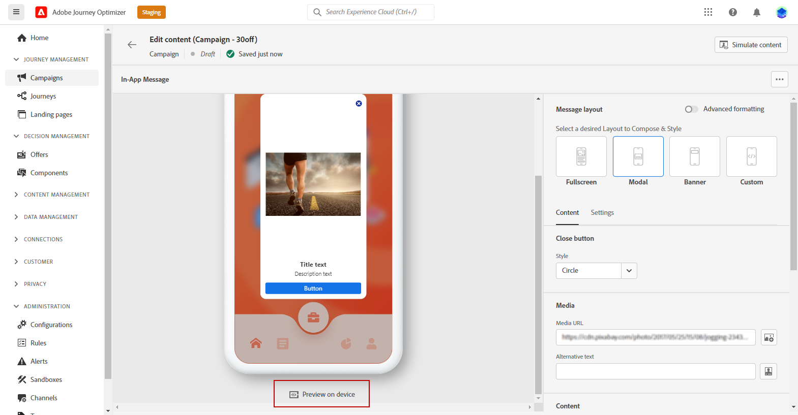
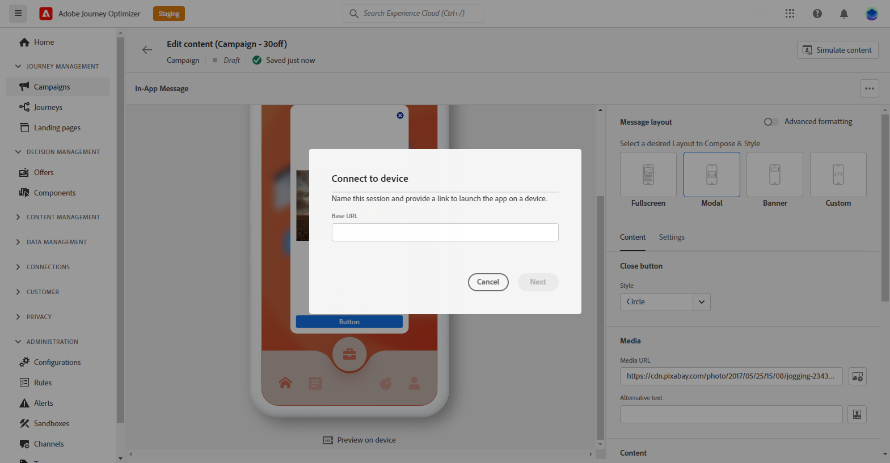
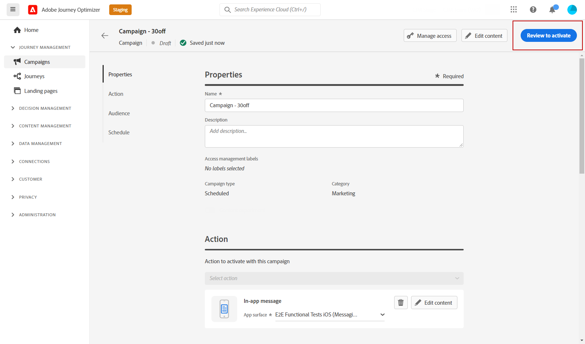

# Test and send your In-app notification {#create-in-app}

## Preview on device {#preview-device}

Once you [created the In-app message](create-in-app.md) and [defined its content](design-in-app.md), you can preview the In-app notification in a specific device.

To perform this, follow the steps below: 

1. Click **[!UICONTROL Preview on device]**.

    

1. From the **[!UICONTROL Connect to device]** window, click **[!UICONTROL Start]**.

1. Type in the **[!UICONTROL Base URL]** of your application and click **[!UICONTROL Next]**.

    

1. Scan the QR code with your device and enter the PIN code displayed. 

Your In-app message can now be triggered directly on your device allowing you to preview and review your message on an actual device. 

## Review and activate your In-App notification{#in-app-review}

Once your In-App message is ready, you can review and activate it.

To perform this, follow the steps below:

1. Use the **[!UICONTROL Review to activate]** button to display a summary of your message.

    The summary allows you to modify your campaign if necessary, and to check if any parameter is incorrect or missing.

    

1. Check that your campaign is correctly configured, then click **[!UICONTROL Activate]**.

Your campaign is now activated. The In-App notification configured in the campaign is sent immediately, or on the specified date.

Once sent, you can measure the impact of your In-App messages within the Campaign or Journey reports. For more on reporting, refer to [this section](../reports/campaign-global-report.md#inapp-report).

**Related topics:**

* [Create an In-app message](create-in-app.md)
* [Design In-app message](design-in-app.md)
* [In-app report](../reports/campaign-global-report.md#inapp-report)
* [In-app configuration](inapp-configuration.md)
