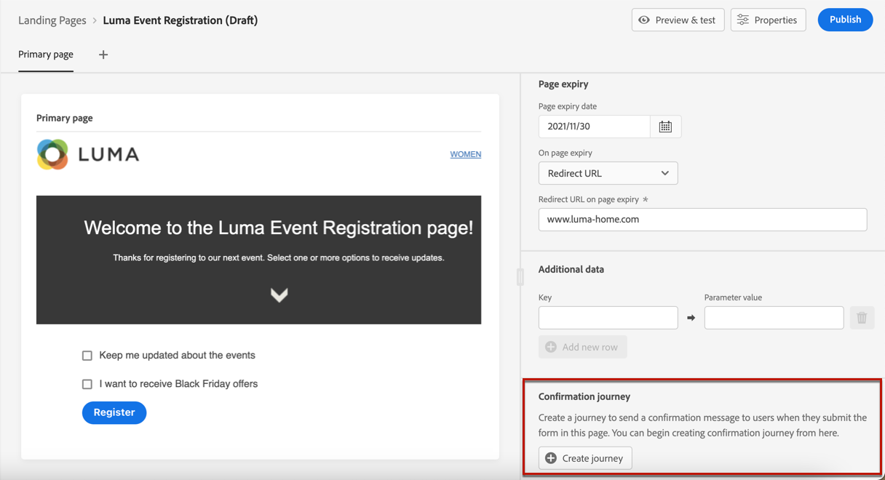

# Create and publish landing pages {#create-lp}

To access the landing page list, select **[!UICONTROL Journey Management]** > **[!UICONTROL Landing pages]** from the left menu.

>[!CAUTION]
>
>The use of landing pages is currently available in early access to select users only. If you want to leverage this feature, contact your Adobe account executive.

The **[!UICONTROL Landing Pages]** list displays all the created items. You can filter them based on their status or modification date.

## Create a landing page

The steps to create a landing page are as follows.

1. From the landing page list, click **[!UICONTROL Create landing page]**.

    

1. Add a title. You can add a description if needed.

    

1. Click **[!UICONTROL Create]**.

1. The primary page and its properties display. Learn how to configure the page settings [here](#configure-primary-page).

    

1. Click the + icon to add a subpage. Learn how to configure its settings [here](#configure-subpages).

    

## Configure the primary page {#configure-primary-page}

The primary page is the page that is immediately displayed to the users when they click the link to your landing page, such as from an email or a website.

To define the primary page settings, follow the steps below.

1. You can change the page name, which is **[!UICONTROL Primary page]** by default.

1. Edit the content of your page using the content designer. Learn how to design landing page content [here](#design-lp-content).

    

1. Define your landing page URL.

    

    >[!NOTE]
    >
    >The first part is pre-filled and cannot be edited through the user interface. To set it up, contact your Adobe account representative or the [Adobe Customer Care Support Team](https://helpx.adobe.com/enterprise/admin-guide.html/enterprise/using/support-for-experience-cloud.ug.html){target="_blank"}.

1. You can define an expiry date for your page. In that case, you must select an action upon page expiry:

    * **[!UICONTROL Redirect URL]**: Enter the URL of the page the users will be redirected to when the page expires.
    * **[!UICONTROL Custom page]**: [Configure a subpage](#configure-subpages) and select it from the drop-down list that displays.
    * **[!UICONTROL Browser error]**: Type the error text that will be displayed instead of the page.

    

1. In the **[!UICONTROL Additional data]** section, define a **[!UICONTROL Key]** and the corresponding **[!UICONTROL Parameter value]**.<!--you can define how the data entered in the landing page is managed once it has been submitted by a user??-->

1. From the landing page, you can directly create a journey that will send a confirmation message to users when they submit the form.

    

    Click **[!UICONTROL Create journey]** to start [configuring this journey](../building-journeys/journey-gs.md#jo-build). You will be redirected to the **[!UICONTROL Journey Management]** > **[!UICONTROL Journeys]** list.

## Configure subpages {#configure-subpages}

You can add as many subpages as needed. For example, you can create a thank you page that will displayed once the users submit the form. You can also define an error page that will be called when an error occurs with the landing page.

To define a subpage settings, follow the steps below.

1. You can change the page name, which is **[!UICONTROL Subpage 1]** by default.

1. Edit the content of your page using the content designer. Hover the mouse over the primary page content and click **[!UICONTROL Open Designer]**, or click the corresponding button from the right palette. Learn how to design landing page content [here](#design-lp-content).

1. Define your landing page URL.

    >[!NOTE]
    >
    >The first part is pre-filled and cannot be edited through the user interface. To set it up, contact your Adobe account representative or the [Adobe Customer Care Support Team](https://helpx.adobe.com/enterprise/admin-guide.html/enterprise/using/support-for-experience-cloud.ug.html){target="_blank"}.

## Validate the landing page

### Check alerts

### Preview and test

## Publish the landing page

Once your message has been created, you can publish it to make it available.

>[!CAUTION]
>
>Before publishing, check and resolve alerts. [Learn more](alerts.md)

Once your landing page is published, it is added to the landing page list with the **[!UICONTROL Published]** status.

It is now live and the link to it ready to be used in a message.

***

**Questions**

* Please clarify what Additional data section is for. What do you need to add in the Key and Parameter value fields?

* Alerts > please provide the list of alerts (warnings and information) that can be displayed for a LP

