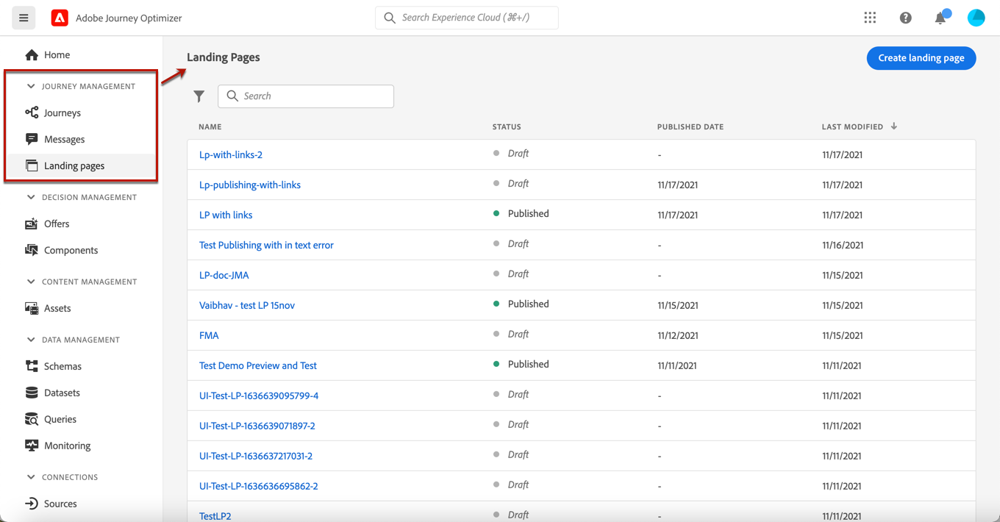
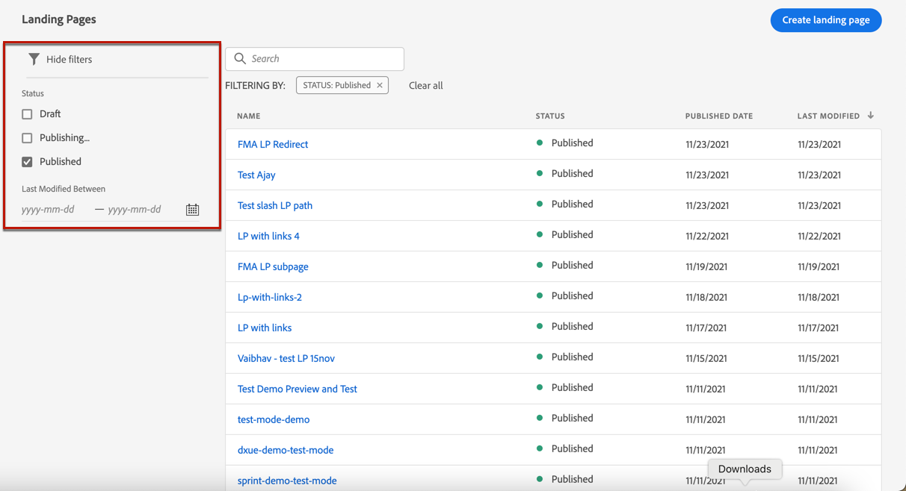
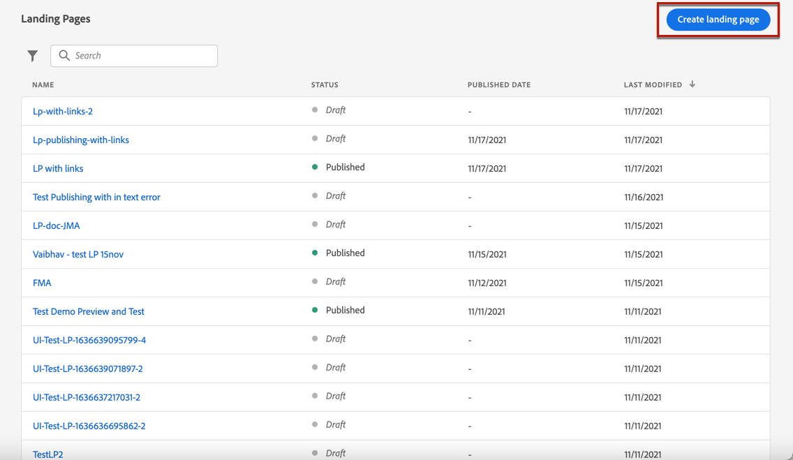
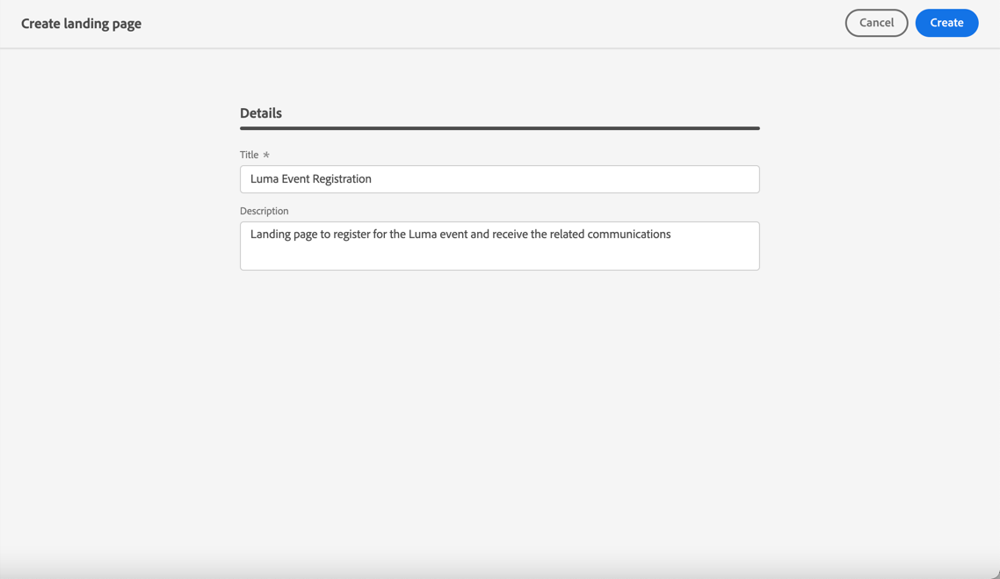
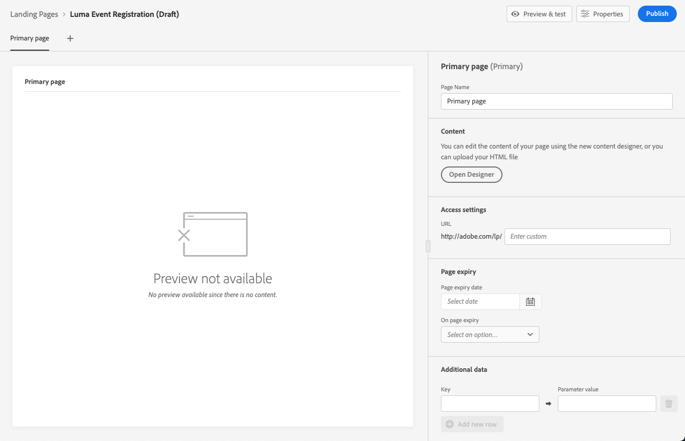
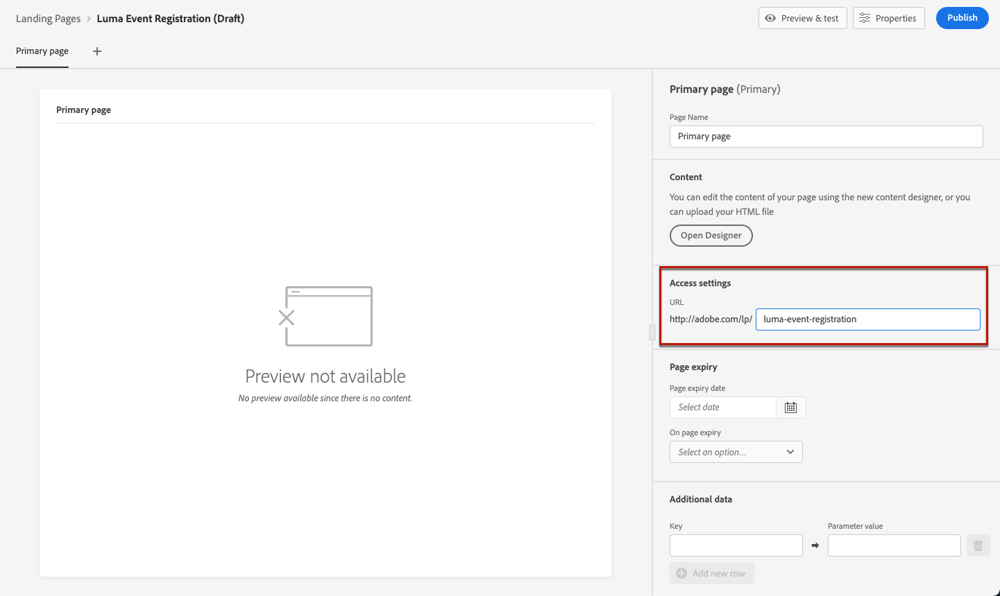

# Create a landing page {#create-lp}

To access the landing page list, select **[!UICONTROL Journey Management]** > **[!UICONTROL Landing pages]** from the left menu.

>[!CAUTION]
>
>The use of landing pages is currently available in early access to select users only. If you want to leverage this feature, contact your Adobe account executive.

The **[!UICONTROL Landing Pages]** list displays all the created items. You can filter them based on their status or modification date.

## Create the landing page

The steps to create a landing page are as follows.

1. From the landing page list, click **[!UICONTROL Create landing page]**.

    

1. Add a title. You can add a description if needed.

    

1. Click **[!UICONTROL Create]**.

1. The primary page and its properties display. Configure the page settings. Learn more [here](#design-lp-content)

    

1. Click the + icon to add a subpage. Learn more [here](#design-lp-content)

## Configure the primary page {#configure-primary-page}

The primary page is the page that is immediately displayed to the users when they click the link to your landing page, such as from an email or a website.

The steps to define the primary page settings are detailed below.

1. You can change the page name, which is **[!UICONTROL Primary page]** by default.

1. Edit the content of your page using the content designer. Hover the mouse over the primary page content and click **[!UICONTROL Open Designer]**, or click the corresponding button from the right palette. Learn how to design landing page content [here](#design-lp-content).

    

1. Define your landing page URL.

    

    >[!NOTE]
    >
    >The first part is pre-filled and cannot be edited through the user interface. To set it up, contact your Adobe account representative or the [Adobe Customer Care Support Team](https://helpx.adobe.com/enterprise/admin-guide.html/enterprise/using/support-for-experience-cloud.ug.html){target="_blank"}.

1. You can define an expiry date for your page. In that case, you must select an action upon page expiry:

    * **[!UICONTROL Redirect URL]**: Enter the URL of the page the users will be redirected to when the page expires.
    * **[!UICONTROL Custom page]**: Configure a subpage and select it from the drop-down list that displays. Learn more [here](#configure-subpages)
    * **[!UICONTROL Browser error]**: Type the error text that will be displayed instead of the page.

    

1. In the **[!UICONTROL Additional data]** section, (you can define how the data entered in the landing page is managed once it has been submitted by a user)??

1. You can create a journey to send a confirmation message to users when they submit the form from this page. Click **[!UICONTROL Create journey]** to start configuring this journey from here. You will be redirected to the **[!UICONTROL Journey Management]** > **[!UICONTROL Journeys]** list. Learn more on [building journeys](../building-journeys/journey-gs.md#jo-build).

## Configure subpages {#configure-subpages}

## Design the landing page content {#design-lp-content}

1. Click **[!UICONTROL Open Designer]** to start creating content for your landing page. [Learn more](../design-emails.md) on designing content with [!DNL Journey Optimizer]. You can:

    * **Design your landing page from scratch** through the content designer's interface and leverage images from [Adobe Experience Manager Assets Essentials](assets-essentials.md). Learn how to design your content or use built-in templates [in this section](../create-email-content.md).

    * **Code or paste raw HTML** directly into the content designer. Learn how to code your own content [in this section](../existing-content.md#import-raw-html-code).

    * **Import existing HTML content** from a file or a .zip folder. Learn how to import content [in this section](../existing-content.md#import-html-content-from-file).

1. Drag and drop the landing page-specific **[!UICONTROL Form]** component from the left palette into the main workspace.

    

1. Select it. The **[!UICONTROL Form content]** tab displays in the right palette to let you to edit the different fields of the form.

    

1. From the **[!UICONTROL Checkbox 1]** section, you can edit the label corresponding to this checkbox.

1. Define if this checkbox is to opt users in or out. This means that if they check the box, do they agree to receive communications or do they ask not to be contacted any more?

    

1. Choose what will be updated between the three following options:

    

    * **[!UICONTROL Subscription list]**: You must select the subscription list that will be updated if the profile selects the checkbox.

        

    * **[!UICONTROL Channel (email)]**: applies to the whole channel. For example, if a profile that opts out has two email addresses, both addresses will be excluded from your communications.

    * **[!UICONTROL Email entity]**: only applies to the email address that was used to access the landing page. For example, if a profile has two email addresses, only the one that was used to opted in will receive communications from your brand.

1. Click **[!UICONTROL Add field]** > **[!UICONTROL Checkbox]** to add another checkbox. Repeat the steps above to define its properties.

    

1. Click **[!UICONTROL Call to action]** to expand the corresponding section. It enables you to define the behavior of the button of the **[!UICONTROL Form]** component.

    

1. Define what will happen upon clicking the button:

    * **[!UICONTROL Redirect URL]**: Enter the URL of the page the users will be redirected to.
    * **[!UICONTROL Confirmation text]**: Type the confirmation text that will be displayed.
    * **[!UICONTROL Link to a subpage]**: Configure a subpage and select it from the drop-down list that displays. Learn more [here](#configure-subpages)

    

1. Define what will happen upon clicking the button in case an error occurs:

    * **[!UICONTROL Redirect URL]**: Enter the URL of the page the users will be redirected to.
    * **[!UICONTROL Error text]**: Type the error text that will be displayed. You can preview the error text by selection the corresponding checkbox.

        

    * **[!UICONTROL Link to a subpage]**: Configure a subpage and select it from the drop-down list that displays. Learn more [here](#configure-subpages)

1. If you want to make additionnal updates upon submitting the form, select **[!UICONTROL Opt in]** or **[!UICONTROL Opt out]**, and define if you want to update a subscription list, the channel or just the email address used.

***

**Questions**

* Will the name Email Designer be kept if you can also design LP with the same tool? > Modify 
