# Create and publish landing pages {#create-lp}

## Access landing pages {#access-landing-pages}

To access the landing page list, select **[!UICONTROL Journey Management]** > **[!UICONTROL Landing pages]** from the left menu.

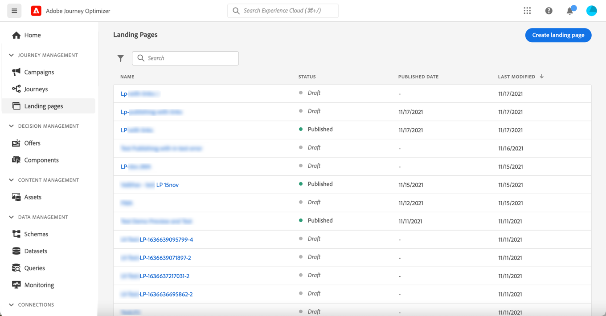

The **[!UICONTROL Landing Pages]** list displays all the created items. You can filter them based on their status or modification date.

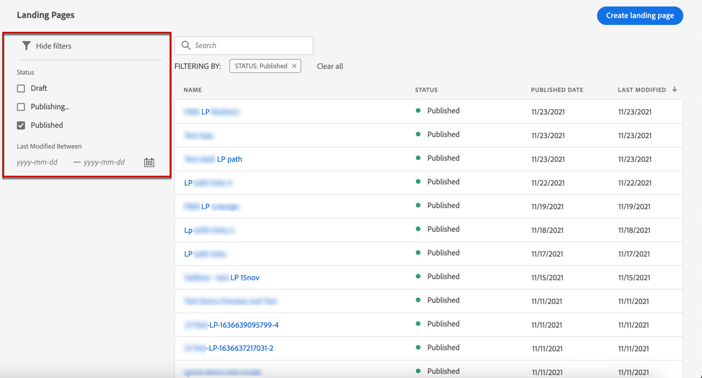

From this list, you can access the [landing page Live report](../reports/lp-report-live.md) or [landing page Global report](../reports/lp-report-global.md) for published items.

You can also delete, duplicate, and unpublish a landing page.

>[!CAUTION]
>
>If you unpublish a landing page which is referenced in a message, the link to the landing page will be broken and an error page will be displayed.

Click the three dots next to a landing page to select the desired action.

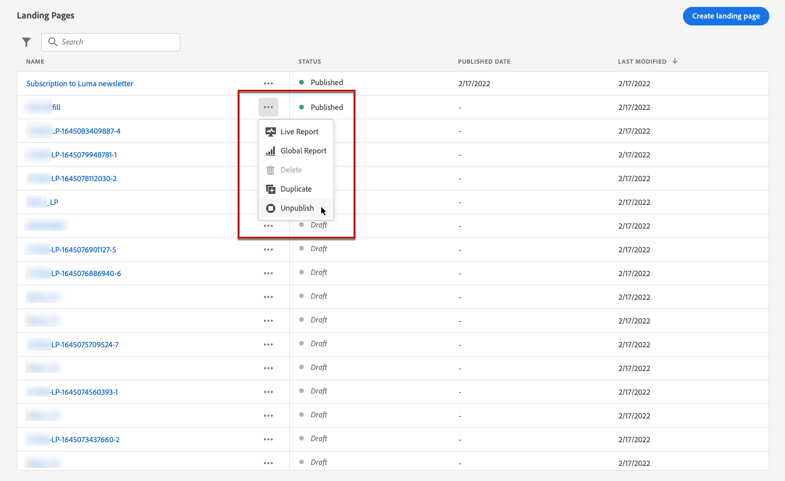

>[!NOTE]
>
>You cannot delete a [published](#publish-landing-page) landing page. To delete it, you must first unpublish it.

## Create a landing page {#create-landing-page}

>[!CONTEXTUALHELP]
>id="ajo_lp_create"
>title="Define and configure your landing page"
>abstract="To create a landing page, you need to select a preset, then configure the primary page and subpages, and finally test your page before publishing it."
>additional-url="https://experienceleague.adobe.com/docs/journey-optimizer/using/configuration/lp-configuration/lp-presets.html#lp-create-preset" text="Create landing page presets"
>additional-url="https://experienceleague.adobe.com/docs/journey-optimizer/using/landing-pages/create-lp.html#publish-landing-page" text="Publish the landing page"

The steps to create a landing page are as follows.

1. From the landing page list, click **[!UICONTROL Create landing page]**.

    

1. Add a title. You can add a description if needed.

    

1. To assign custom or core data usage labels to the landing page, select **[!UICONTROL Manage access]**. [Learn more on Object Level Access Control (OLAC)](../administration/object-based-access.md)

    <!--You can add a tag. See AEP documentation?-->

1. Select a preset. Learn how to create landing page presets in [this section](../configuration/lp-presets.md#lp-create-preset).

    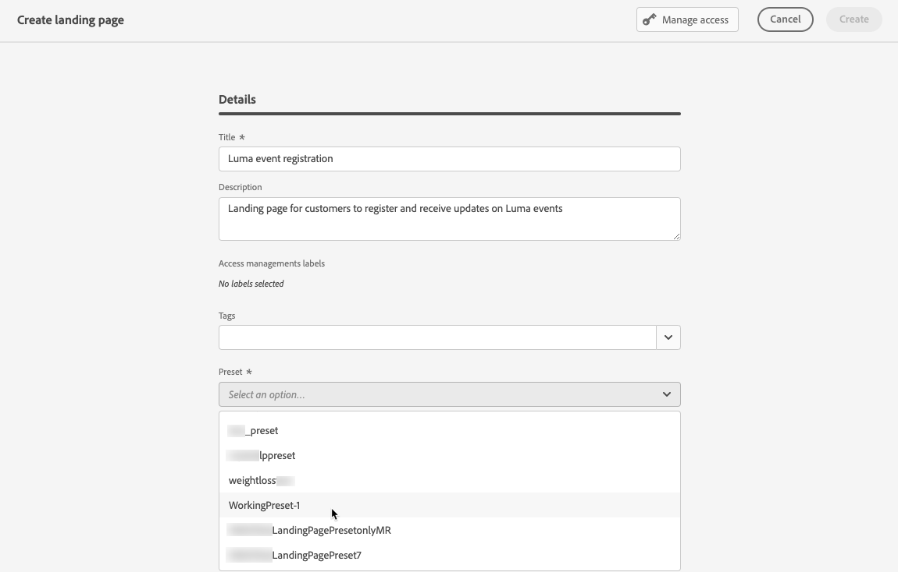

1. Click **[!UICONTROL Create]**.

1. The primary page and its properties display. Learn how to configure the primary page settings [here](#configure-primary-page).

    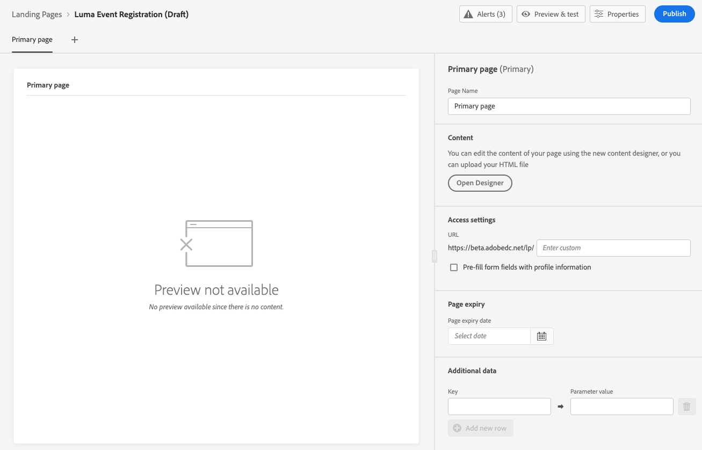

1. Click the + icon to add a subpage. Learn how to configure the subpage settings [here](#configure-subpages).

    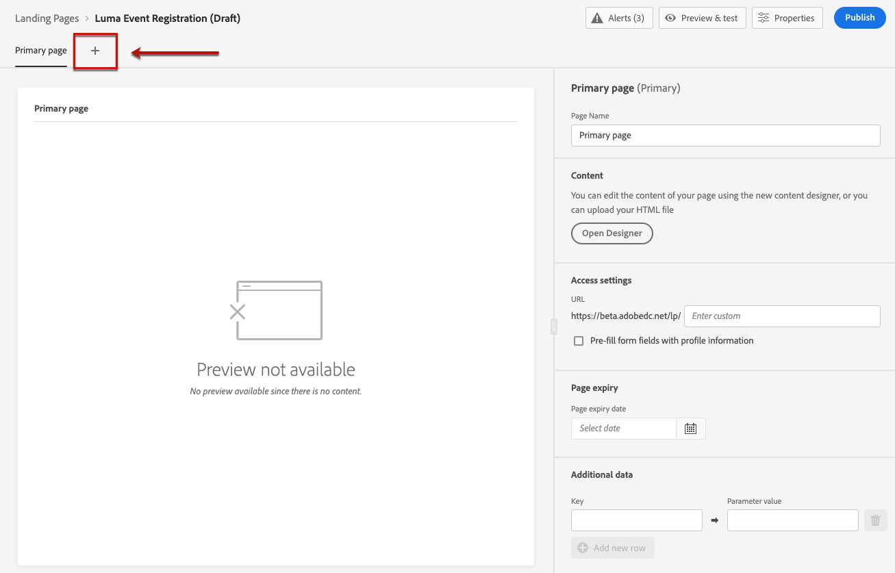

Once you configured and designed the [primary page](#configure-primary-page), and the [subpages](#configure-subpages) if any, you can [test](#test-landing-page) and [publish](#publish-landing-page) your landing page.

## Configure the primary page {#configure-primary-page}

>[!CONTEXTUALHELP]
>id="ajo_lp_primary_page"
>title="Define your primary page settings"
>abstract="The primary page is immediately displayed to the users after they click the link to your landing page, such as from an email or a website."
>additional-url="https://experienceleague.adobe.com/docs/journey-optimizer/using/landing-pages/landing-pages-design/design-lp.html" text="Design the landing page content"

>[!CONTEXTUALHELP]
>id="ajo_lp_access_settings"
>title="Define your landing page URL"
>abstract="In this section, define a unique landing page URL. The first part of the URL requires you previously set up a landing page subdomain as part of the preset you selected."
>additional-url="https://experienceleague.adobe.com/docs/journey-optimizer/using/configuration/lp-configuration/lp-subdomains.html" text="Configure landing page subdomains"
>additional-url="https://experienceleague.adobe.com/docs/journey-optimizer/using/configuration/lp-configuration/lp-presets.html#lp-create-preset" text="Create landing page presets"

The primary page is the page that is immediately displayed to the users after they click the link to your landing page, such as from an email or a website.

To define the primary page settings, follow the steps below.

1. You can change the page name, which is **[!UICONTROL Primary page]** by default.

1. Edit the content of your page using the content designer. Learn how to define landing page content [here](design-lp.md).

    

1. Define your landing page URL. The first part of the URL requires you previously set up a landing page subdomain as part of the [preset](../configuration/lp-presets.md#lp-create-preset) you selected. [Learn more](../configuration/lp-subdomains.md)

    >[!CAUTION]
    >
    >The landing page URL must be unique.  

    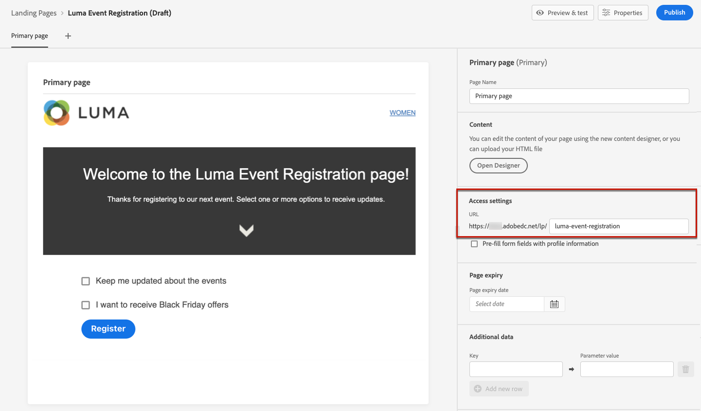

    >[!NOTE]
    >
    >You cannot access your landing page by simply copy-pasting this URL into a web browser, even if published. Instead you can test it using the preview function such as described in [this section](#test-landing-page).

1. If you want the landing page to preload the form data that is already available, select the **[!UICONTROL Pre-fill form fields with profile information]**.

    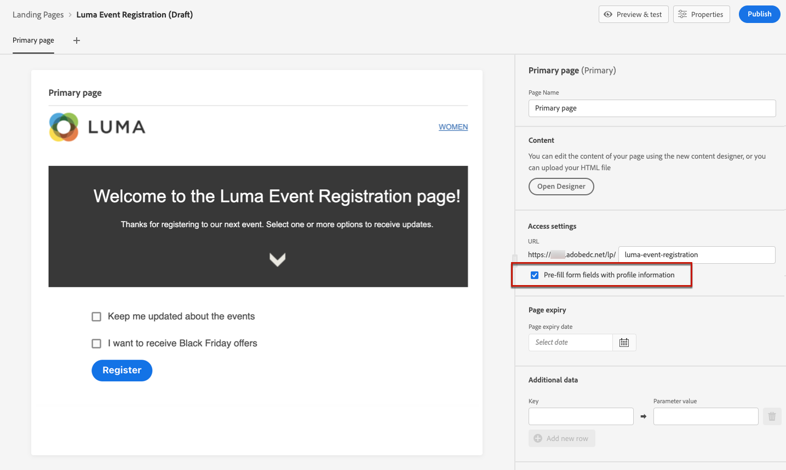

    When this option is enabled, if a profile has already opted in/out or was already added to a subscription list, their choices will be reflected upon displaying the landing page.

    For example, if a profile has opted in to receive communications about future events, the corresponding checkbox will be already selected the next time the landing page is displayed to that profile.

    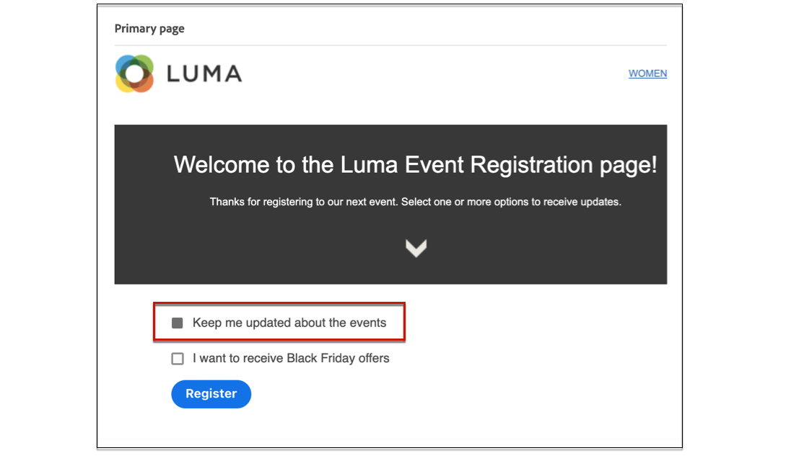

1. You can define an expiry date for your page. In that case, you must select an action upon page expiry:

    * **[!UICONTROL Redirect URL]**: Enter the URL of the page the users will be redirected to when the page expires.
    * **[!UICONTROL Custom page]**: [Configure a subpage](#configure-subpages) and select it from the drop-down list that displays.
    * **[!UICONTROL Browser error]**: Type the error text that will be displayed instead of the page.

    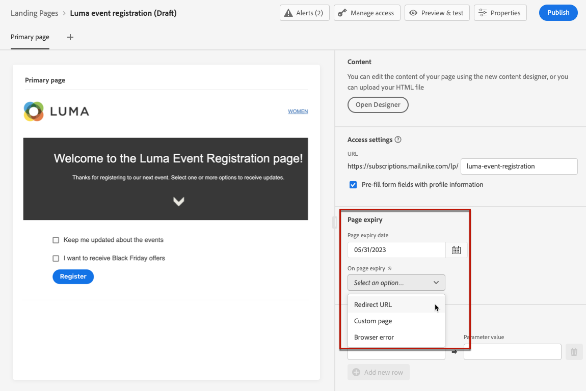

1. In the **[!UICONTROL Additional data]** section, define one or more keys and their corresponding parameter values. You will be able to leverage these keys in the content of your primary page and subpages using the [Expression editor](../personalization/personalization-build-expressions.md). Learn more in [this section](lp-content.md#use-form-component#use-additional-data).

    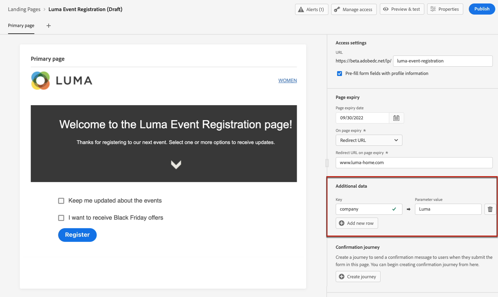

1. If you selected one or more subscription lists when [designing the primary page](design-lp.md), they display in the **[!UICONTROL Subscription list]** section.

    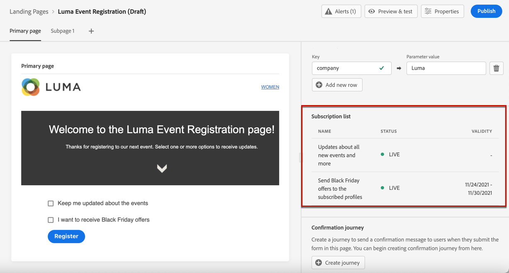

1. From the landing page, you can directly [create a journey](../building-journeys/journey-gs.md#jo-build) that will send a confirmation message to users when they submit the form. Learn how to build such a journey at the end of this [use case](lp-use-cases.md#subscription-to-a-service).

    

    Click **[!UICONTROL Create journey]** to be redirected to the **[!UICONTROL Journey Management]** > **[!UICONTROL Journeys]** list.

## Configure subpages {#configure-subpages}

>[!CONTEXTUALHELP]
>id="ajo_lp_subpage"
>title="Define the subpage settings"
>abstract="You can add up to 2 subpages. For example, you can create a 'thank you' page that will display once the users submit the form, and you can define an error page that will be called if a problem occurs with the landing page."
>additional-url="https://experienceleague.adobe.com/docs/journey-optimizer/using/landing-pages/landing-pages-design/design-lp.html" text="Design the landing page content"

>[!CONTEXTUALHELP]
>id="ajo_lp_access_settings-subpage"
>title="Define your landing page URL"
>abstract="In this section, define a unique landing page URL. The first part of the URL requires you previously set up a landing page subdomain as part of the preset you selected."
>additional-url="https://experienceleague.adobe.com/docs/journey-optimizer/using/configuration/lp-configuration/lp-subdomains.html" text="Configure landing page subdomains"
>additional-url="https://experienceleague.adobe.com/docs/journey-optimizer/using/configuration/lp-configuration/lp-presets.html#lp-create-preset" text="Create landing page presets"

You can add up to 2 subpages. For example, you can create a 'thank you' page that will display once the users submit the form, and you can define an error page that will be called if a problem occurs with the landing page.

To define the subpage settings, follow the steps below.

1. You can change the page name, which is **[!UICONTROL Subpage 1]** by default.

1. Edit the content of your page using the content designer. Learn how to define landing page content [here](design-lp.md).

    >[!NOTE]
    >
    >You can insert a link to the primary page from any subpage of the same landing page. For example, to redirect users who made a mistake and want to subscribe again, you can add a link from the confirmation subpage to the subscription primary page. Learn how to insert links in [this section](../design/message-tracking.md#insert-links).

1. Define your landing page URL. The first part of the URL requires you previously set up a landing page subdomain. [Learn more](../configuration/lp-subdomains.md)

    >[!CAUTION]
    >
    >The landing page URL must be unique.

## Test the landing page {#test-landing-page}

Once your landing page settings and content have been defined, you can use test profiles to preview it. If you inserted [personalized content](../personalization/personalize.md), you will be able to check how this content is displayed in the landing page, leveraging test profile data.

>[!CAUTION]
>
>You must have test profiles available to be able to preview your messages and send proofs. Learn how to [create test profiles](../segment/creating-test-profiles.md).

1. From the landing page interface, click the **[!UICONTROL Preview & test]** button to access the test profile selection.

    

    >[!NOTE]
    >
    >The **[!UICONTROL Preview]** button is also accessible from the content designer.

1. From the **[!UICONTROL Preview & test]** screen, select one or more test profiles.

    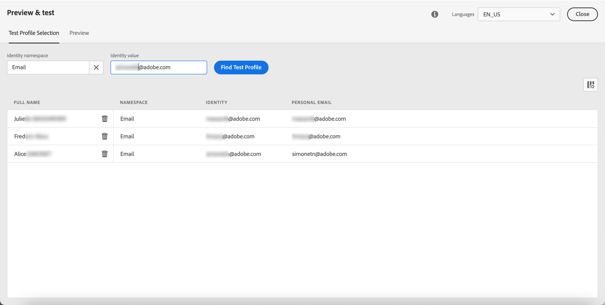

    The steps to select test profiles are the same as when testing a message. They are detailed in [this section](../design/preview.md#select-test-profiles).

1. Select the **[!UICONTROL Preview]** tab and click **[!UICONTROL Open preview]** to test your landing page.

    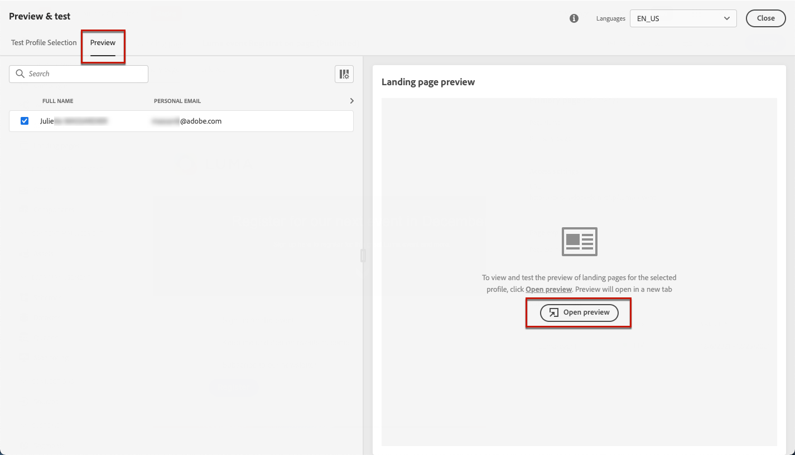

1. The preview of your landing page opens in a new tab. Personalized elements are replaced by the selected test profile data.

    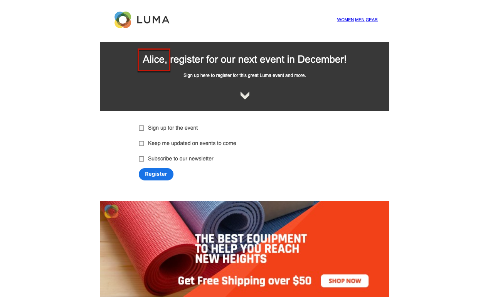

1. Select other test profiles to preview the rendering for each variant of your landing page.

## Check alerts {#check-alerts}

While you are creating your landing page, alerts warn you when you must take important actions before publishing.

Alerts are displayed on top right of the screen, as shown below:

>[!NOTE]
>
>If you do not see this button, no alert has been detected.

Two types of alerts can happen:

* **Warnings** refer to recommendations and best practices. <!--For example, a message will display if -->

* **Errors** prevent you from publishing the landing page as long as they are not resolved. For example, you will get a warning if the primary page URL is missing.

<!--All possible warnings and errors are detailed [below](#alerts-and-warnings).-->

>[!CAUTION]
>
> You must resolve all **error** alerts before publication.

<!--The settings and elements checked by the system are listed below. You will also find information on how to adapt your configuration to resolve the corresponding issues.

**Warnings**:

* 

**Errors**:

* 

>[!CAUTION]
>
> To be able to publish your message, you must resolve all **error** alerts.
-->

## Publish the landing page {#publish-landing-page}

Once your landing page is ready, you can publish it to make it available for use in a message.

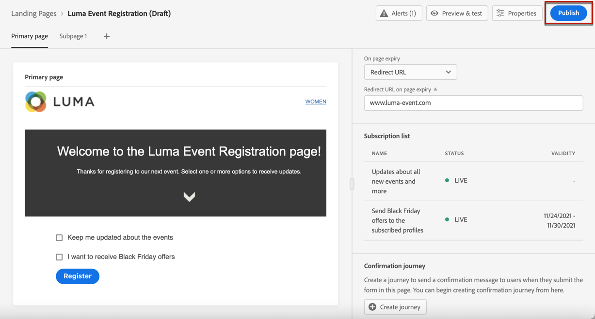

>[!CAUTION]
>
>Before publishing, check and resolve alerts. [Learn more](#check-alerts)

Once your landing page is published, it is added to the landing page list with the **[!UICONTROL Published]** status.

It is now live and ready to be used in a [!DNL Journey Optimizer] [message](../messages/get-started-content.md) that will be sent through a [journey](../building-journeys/journey.md).

>[!NOTE]
>
>You can monitor your landing page impacts through specific reports. [Learn more](../reports/lp-report-live.md)

