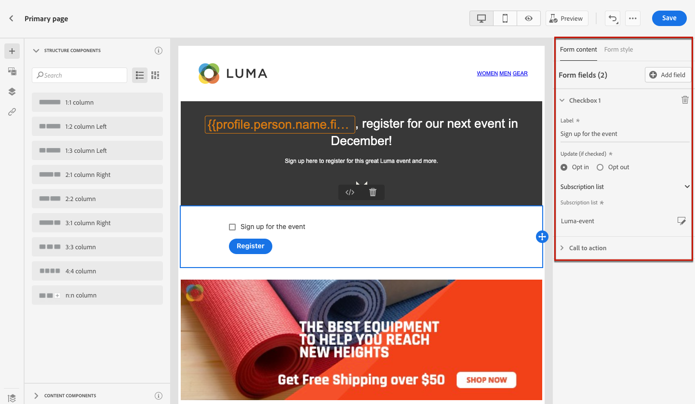
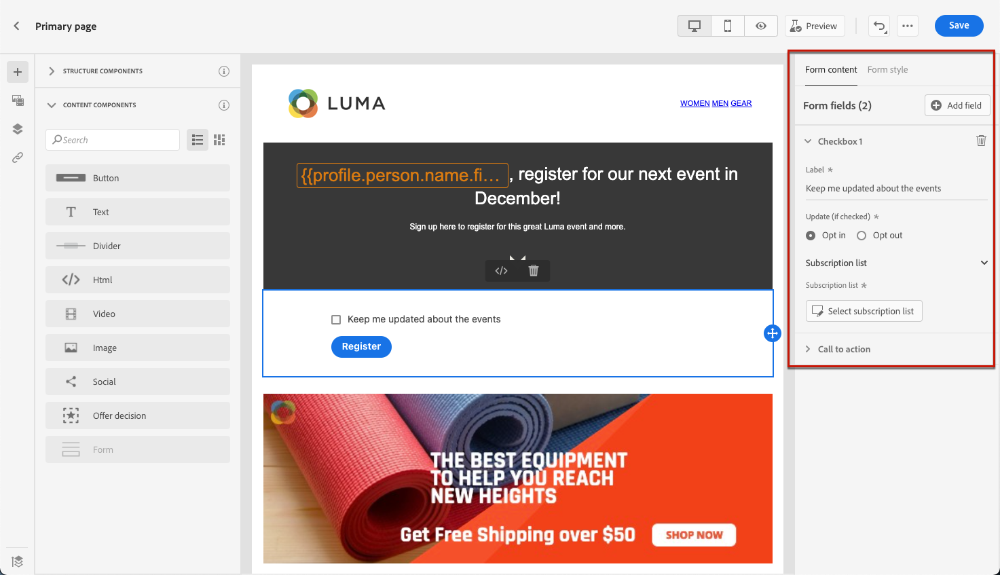
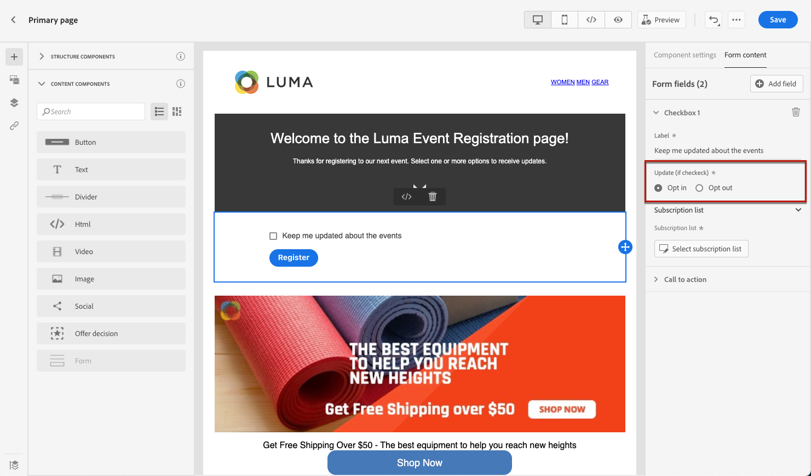
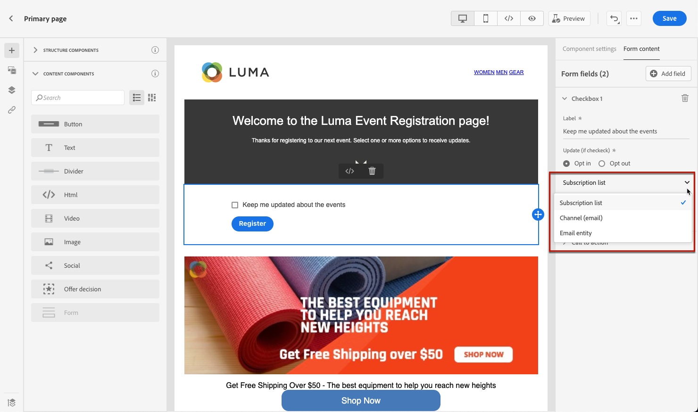
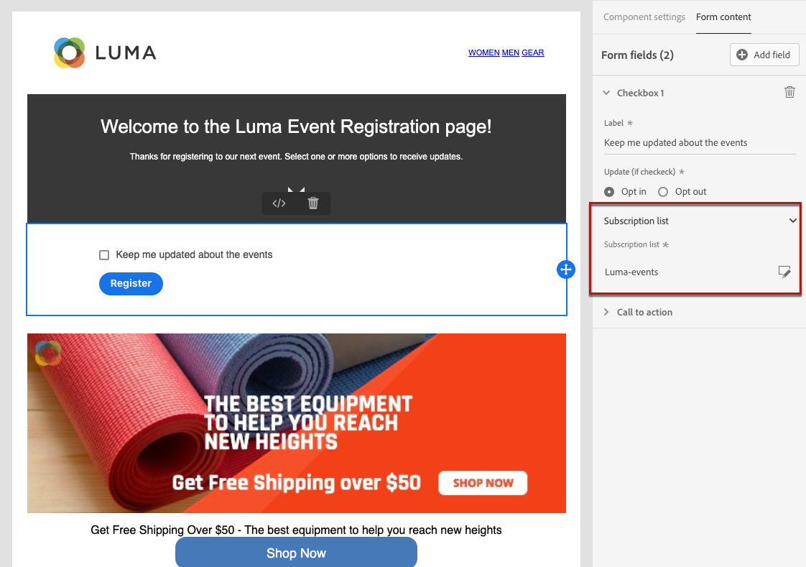
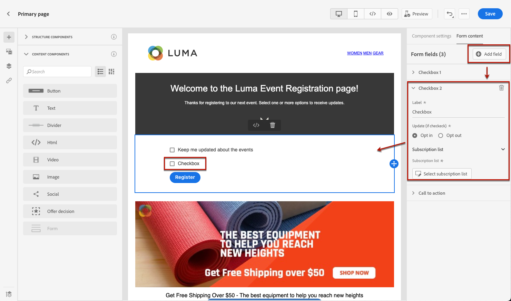
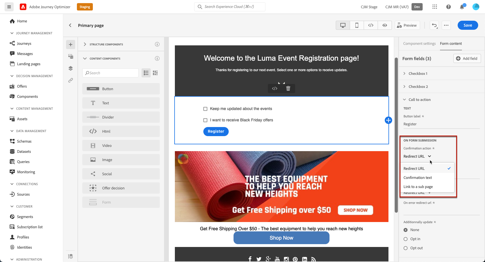
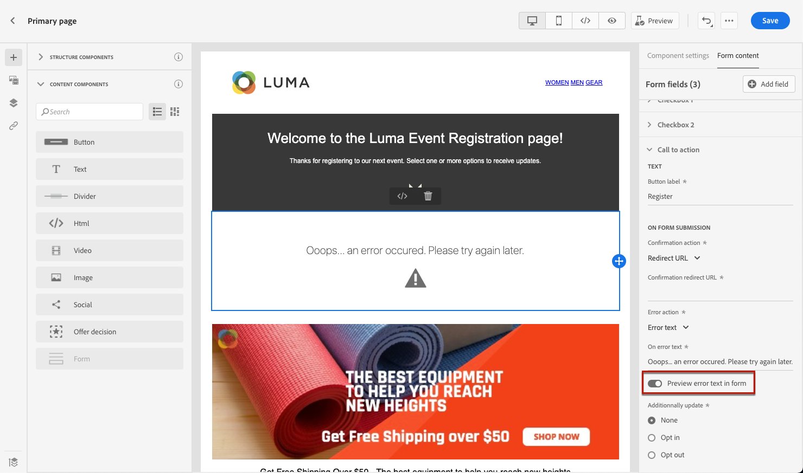
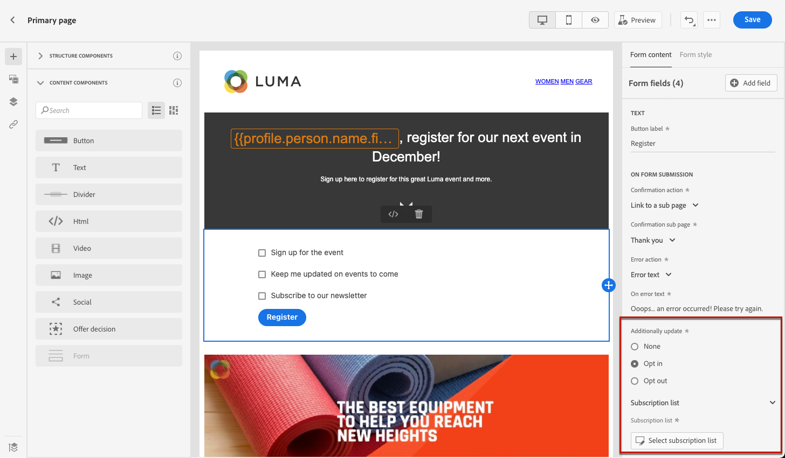

# Design the landing page content {#design-lp-content}

To start creating content from your landing [primary page](create-lp.md#configure-primary-page) or [subpage](create-lp.md#configure-subpages), hover the mouse over the primary page content and click **[!UICONTROL Open Designer]**, or click the corresponding button from the right palette.

From there, you can:

* **Design your landing page from scratch** through the content designer's interface and leverage images from [Adobe Experience Manager Assets Essentials](assets-essentials.md). Learn how to design your content or use built-in templates [in this section](../create-email-content.md).

* **Code or paste raw HTML** directly into the content designer. Learn how to code your own content [in this section](../existing-content.md#import-raw-html-code).

* **Import existing HTML content** from a file or a .zip folder. Learn how to import content [in this section](../existing-content.md#import-html-content-from-file).

>[!NOTE]
>
>Learn more on designing content with [!DNL Journey Optimizer] [here](../design-emails.md).
    
To define landing-page specific content, follow the steps below.

1. Drag and drop the landing page-specific **[!UICONTROL Form]** component from the left palette into the main workspace.

    

    >[!NOTE]
    >
    >The **[!UICONTROL Form]** component can only be used once on the same page.

1. Select it. The **[!UICONTROL Form content]** tab displays in the right palette to let you to edit the different fields of the form.

    

1. From the **[!UICONTROL Checkbox 1]** section, you can edit the label corresponding to this checkbox.

1. Define if this checkbox is to opt users in or out: do they agree to receive communications or do they ask not to be contacted any more?

    

1. Choose what will be updated between the three following options:

    

    * **[!UICONTROL Subscription list]**: You must select the [subscription list](using/landing-pages/subscription-list.md) that will be updated if the profile selects this checkbox.

        >[!NOTE]
        >
        >Learn how to create a subscription list in [this section](using/landing-pages/subscription-list.md#create-subscription-list).

        

    * **[!UICONTROL Channel (email)]**: The opt-in or opt-out applies to the whole channel. For example, if a profile that opts out has two email addresses, both addresses will be excluded from all your communications.

    * **[!UICONTROL Email entity]**: The opt-in or opt-out only applies to the email address that was used to access the landing page. For example, if a profile has two email addresses, only the one that was used to opt in will receive communications from your brand.

1. Click **[!UICONTROL Add field]** > **[!UICONTROL Checkbox]** to add another checkbox. Repeat the steps above to define its properties.

    

1. Click **[!UICONTROL Call to action]** to expand the corresponding section. It enables you to define the behavior of the button in the **[!UICONTROL Form]** component.

    

1. Define what will happen upon clicking the button:

    * **[!UICONTROL Redirect URL]**: Enter the URL of the page the users will be redirected to.
    * **[!UICONTROL Confirmation text]**: Type the confirmation text that will be displayed.
    * **[!UICONTROL Link to a subpage]**: Configure a [subpage](create-lp.md#configure-subpages) and select it from the drop-down list that displays.

    

1. Define what will happen upon clicking the button in case an error occurs:

    * **[!UICONTROL Redirect URL]**: Enter the URL of the page the users will be redirected to.
    * **[!UICONTROL Error text]**: Type the error text that will be displayed. You can preview the error text by selection the corresponding checkbox.

        

    * **[!UICONTROL Link to a subpage]**: Configure a [subpage](create-lp.md#configure-subpages) and select it from the drop-down list that displays.

1. If you want to make additionnal updates upon submitting the form, select **[!UICONTROL Opt in]** or **[!UICONTROL Opt out]**, and define if you want to update a subscription list, the channel or just the email address used.

    

1. Save your content and click the arrow next to the page name to go back to the [landing page properties](create-lp.md#configure-primary-page).

    

<!--Will the name Email Designer be kept if you can also design LP with the same tool? > To modify in Messages section > content designer or Designer-->

