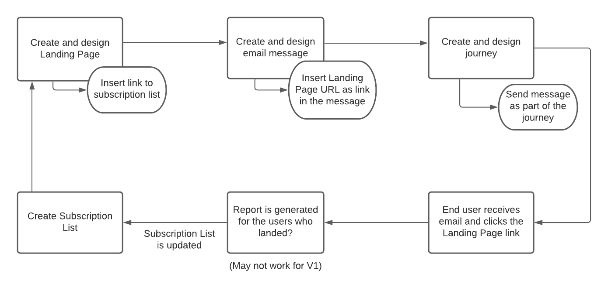

# Get started with landing pages {#get-sarted-lp}

>[!CAUTION]
>
>The use of landing pages is currently available in early access to select users only. If you want to leverage this feature, contact your Adobe account executive.

A landing page is a standalone web page that a user is directed to after clicking through from an email, a website, an ad, or any other digital location.

<!--The landing page is driven toward a business goal like joining a subscription list, buying products, get to know more, etc. If the user takes that desired action, the landing page has converted. Landing pages often contain online forms that are used by marketers to acquire new consumers or get to know better their existing customers and nurture them.-->

[!DNL Journey Optimizer] allows you to create and design landing pages to direct your users to online forms where they can opt in or opt out from receiving your communications, or subscribe to a specific service such as a newsletter.

<!--Landing pages are online forms that are used by marketers to capture information on audiences, offer subscriptions to a service, display data and grow your database. These can also be used for acquiring or updating existing profiles.-->

<!--[!DNL Journey Optimizer] now allows you to:
* Easily build landing pages to make users subscribe to your communications.
* Set up opt-in and opt-out flows quickly and seamlessly.
To move to RN-->

[!DNL Journey Optimizer] allows you to:

* Leverage [!DNL Journey Optimizer] content design capabilities to easily build responsive landing pages.
* Create subscription lists to enable users to subscribe to a service.
* Enable your customers to opt-in or opt-out from your communications.
* Provide your recipients with the capability to unsubscribe from receiving your communications.

<table>
<tr>
<td>
<a href="create-lp.md">Create landing pages</a>
</td>
<td>
<a href="subscription-list.md">Create subscription lists</a>
</td>
<td>
<a href="design-lp.md">Design landing pages</a>
</td>
<td>
<a href="manage-op-out.md">Manage opt-out</a>
</td>
</tr>
</table>

<!--Easily build attractive/efficient landing pages to drive the best conversion.-->

## Use cases

Below are examples of how you can use [!DNL Journey Optimizer] landing pages to have your customers opt in/out from receiving some or all of your communications.

<!--The main use cases are:
* Subscription to a service
* Opt-in
* Opt-out-->

### Subscription to a service {#subscription-to-a-service}

For example, let's say you organize an event next month and you want to launch an event registration campaign to keep your customers that are interested updated on that event.

1. Create the event registration's subscription list. [Learn more on subscription lists](subscription-list.md)

1. [Create a landing page](create-lp.md), which will enable your recipients to register to your event.

1. Configure and design the registration landing page, including the link to the subscription list. [Learn more on building primary landing page](create-lp.md#configure-primary-page)

1. Create a thank you page that will be displayed to your recipients once they submit the registration form. [Learn more on landing subpages](create-lp.md#configure-subpages)

1. Create an email message. [Learn more on creating messages](../create-message.md)

1. [Insert a link](../message-tracking.md#insert-links) to your message. Select **[!UICONTROL Landing page]** as the **[!UICONTROL Link type]** and choose the [landing page](landing-pages/create-lp.md#configure-primary-page) that you created for registration.

1. Save your content and [publish your message](../../help/using/publish-manage-message.md).

1. Send your message through a [journey](building-journeys/journey.md) to announce registration is now open for your event and to drive traffic to the registration landing page.

Once they receive the email, if your recipients click the link to the landing page, they will be directed to the thank you page and they will be added to the subscription list.

The event registration's subscription list tracks the profiles who registered and you can send them targeted event updates.

### Opting out {#opt-out}

To enable your recipients to unsubscribe from your communications, you can include a link to an unsubscription landing page into your emails.

The steps to implement this are detailed in [this section](manage-op-out.md#add-unsubscribe-link).

<!--**Questions**

* Can you leverage **Adobe Experience Manager Assets Essentials** to enrich your landing pages' content?

* Can you personalize LP ? > Enhance customers' experience by creating **personalized landing pages** based on their profile attributes.-->
