# Define landing page-specific content {#lp-content}

>[!CONTEXTUALHELP]
>id="ac_lp_components"
>title="Use content components"
>abstract="Content components are empty content placeholders that you can use to create the layout of a landing page. To define specific content that will enable users to select and submit their choices, use the form component."
>additional-url="https://experienceleague.adobe.com/docs/journey-optimizer/using/email/design-email/add-content/content-components.html#add-content-components" text="Add content components"
    
To design your landing page content, you can use the same components as for an email. [Learn more](../email/content-components.md#add-content-components)

To design specific content that will enable users to select and submit their choices, [use the form component](#use-form-component) and define its [landing page-specific styles](#lp-form-styles).

>[!NOTE]
>
>You can also create a click-through landing page without a **[!UICONTROL Form]** component. In that case, the landing page will be displayed to users, but they will not be required to submit any form. This can be useful if you only want to showcase a landing page without requiring any action from your recipients such as opt-in or opt out, or want to provide information that doesn't require user input.

Using the landing page content designer, you can also leverage contextual data coming from the primary page in a subpage. [Learn more](#use-primary-page-context)

## Use the form component {#use-form-component}

>[!CONTEXTUALHELP]
>id="ac_lp_formfield"
>title="Set the form component fields"
>abstract="Define how your recipients will see and submit their choices from your landing page."
>additional-url="https://experienceleague.adobe.com/docs/journey-optimizer/using/landing-pages/landing-pages-design/lp-content.html#lp-form-styles" text="Define landing page form styles"

>[!CONTEXTUALHELP]
>id="ac_lp_submission"
>title="What happens when clicking the button"
>abstract="Define what will happen upon users submitting the landing page form."

To define specific content that will enable users to select and submit their choices from your landing page, use the **[!UICONTROL Form]** component. To do so, follow the steps below.

1. Drag and drop the landing page-specific **[!UICONTROL Form]** component from the left palette into the main workspace.

    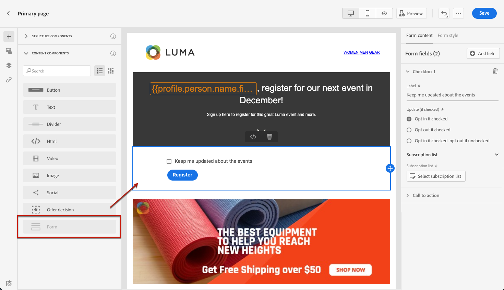

    >[!NOTE]
    >
    >The **[!UICONTROL Form]** component can only be used once on the same page.

1. Select it. The **[!UICONTROL Form content]** tab displays in the right palette to let you edit the different fields of the form.

    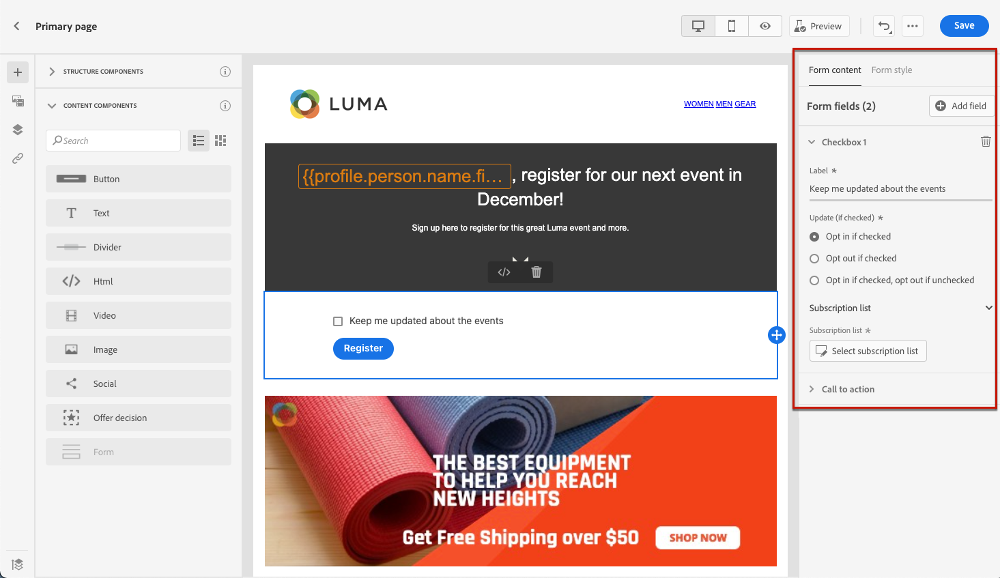

    >[!NOTE]
    >
    >Switch to the **[!UICONTROL Styles]** tab at any time to edit the styles of your form component content. [Learn more](#define-lp-styles)

1. From the **[!UICONTROL Checkbox 1]** section, you can edit the label corresponding to this checkbox.

1. Define if this checkbox is to opt users in or out: do they agree to receive communications or do they ask not to be contacted anymore?

    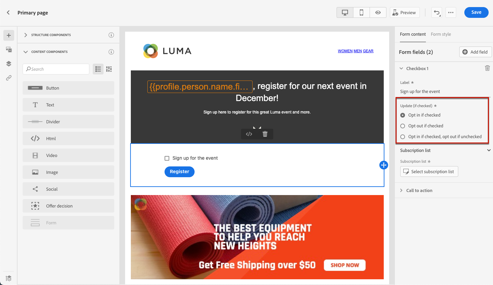

    Select amongst the three options below:

    * **[!UICONTROL Opt in if checked]**: users need to check the box to consent (opt-in).
    * **[!UICONTROL Opt out if checked]**: users need to check the box to remove their consent (opt-out).
    * **[!UICONTROL Opt in if checked, opt out if unchecked]**: this option enables you to insert a single checkbox for opt-in/opt-out. Users need to check the box to consent (opt-in), and uncheck it to remove their consent (opt-out).

1. Choose what will be updated between the three following options:

    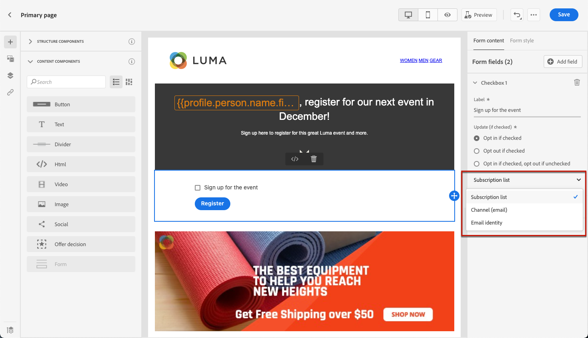

    * **[!UICONTROL Subscription list]**: You must select the subscription list that will be updated if the profile selects this checkbox. Learn more on [subscription lists](subscription-list.md).

        <!--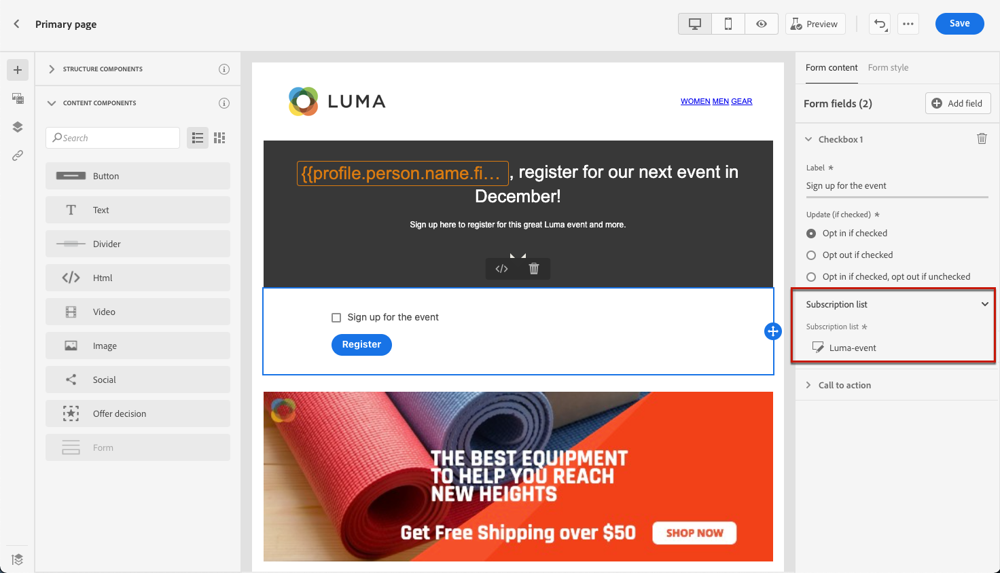-->

    * **[!UICONTROL Channel (email)]**: The opt-in or opt-out applies to the whole channel. For example, if a profile that opts out has two email addresses, both addresses will be excluded from all your communications.

    * **[!UICONTROL Email identity]**: The opt-in or opt-out only applies to the email address that was used to access the landing page. For example, if a profile has two email addresses, only the one that was used to opt in will receive communications from your brand.

1. Click **[!UICONTROL Add field]** > **[!UICONTROL Checkbox]** to add another checkbox. Repeat the steps above to define its properties.

    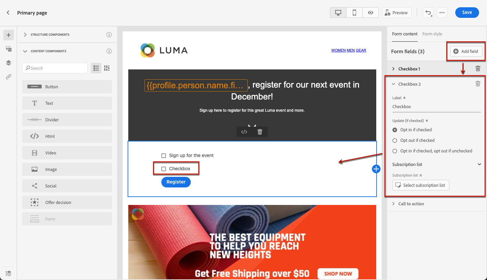

1. You can also add a **[!UICONTROL Text field]**.

    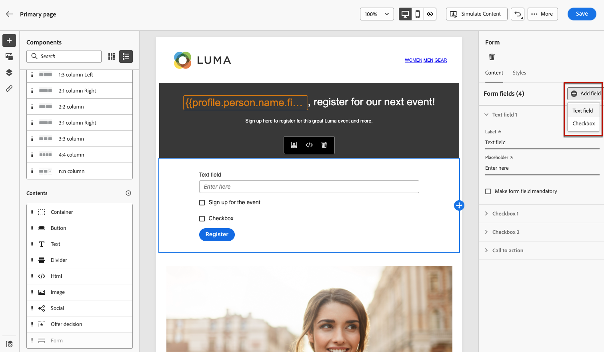

    * Enter the **[!UICONTROL Label]** that will be displayed on top of the field in the form.
    
    * Enter a **[!UICONTROL Placeholder]** text. It will be displayed inside the field before the user fills in the field.

    * Check the **[!UICONTROL Make form field mandatory]** option if needed. In that case, the landing page can only be submitted if the user has filled in this field. If a mandatory field is not filled in, an error message will display when the user submits the page.

    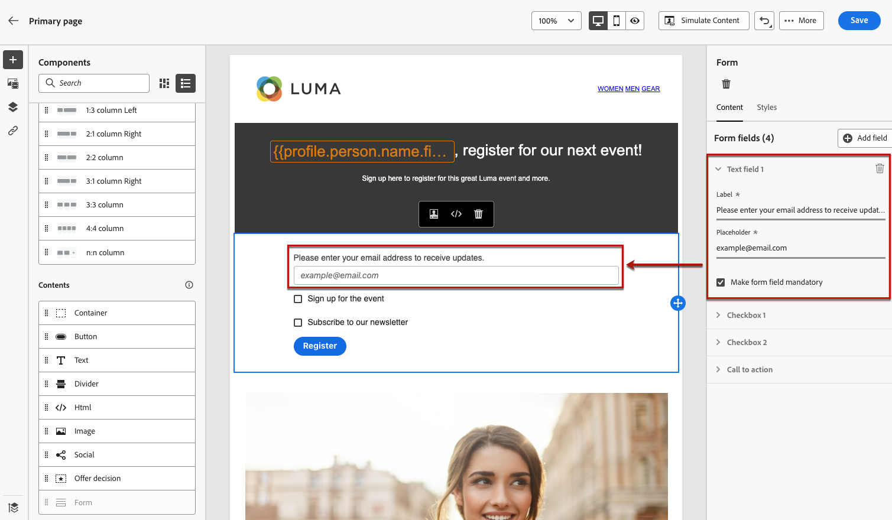

1. Once you added all the desired checkboxes and/or text fields, click **[!UICONTROL Call to action]** to expand the corresponding section. It enables you to define the behavior of the button in the **[!UICONTROL Form]** component.

    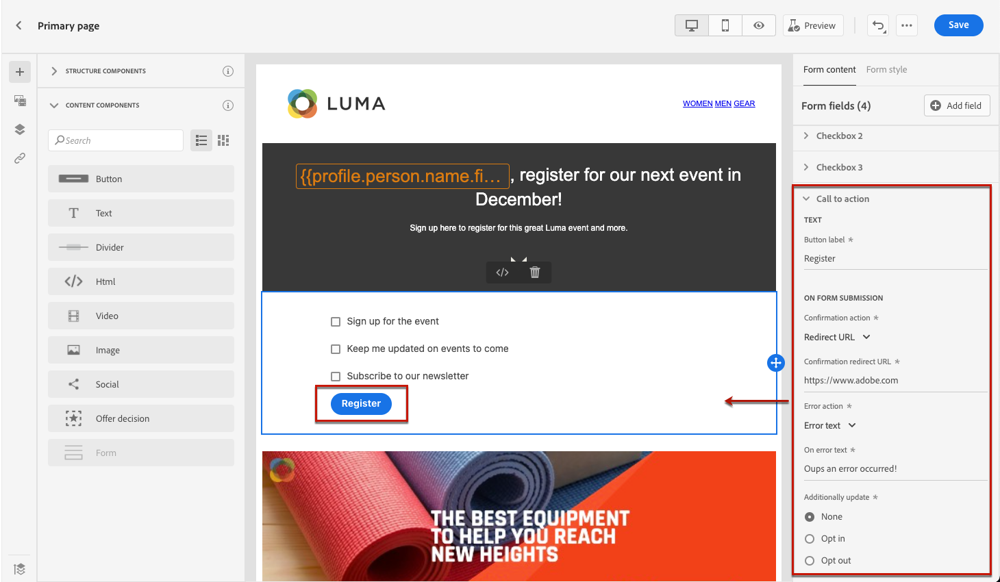

1. Define what will happen upon clicking the button:

    * **[!UICONTROL Redirect URL]**: Enter the URL of the page the users will be redirected to.
    * **[!UICONTROL Confirmation text]**: Type the confirmation text that will be displayed.
    * **[!UICONTROL Link to a subpage]**: Configure a [subpage](create-lp.md#configure-subpages) and select it from the drop-down list that displays.

    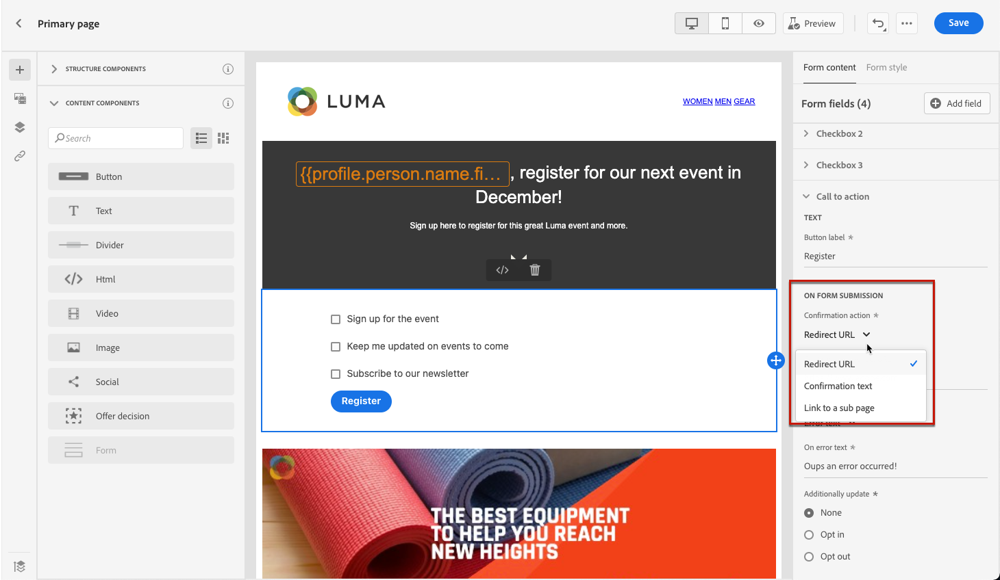

1. Define what will happen upon clicking the button in case an error occurs:

    * **[!UICONTROL Redirect URL]**: Enter the URL of the page the users will be redirected to.
    * **[!UICONTROL Error text]**: Type the error text that will be displayed. You can preview the error text when defining the [form styles](#define-lp-styles).

    * **[!UICONTROL Link to a subpage]**: Configure a [subpage](create-lp.md#configure-subpages) and select it from the drop-down list that displays.

    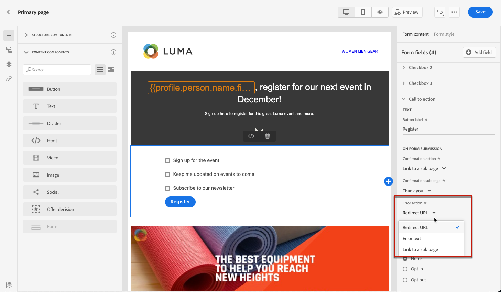

1. If you want to make additional updates upon submitting the form, select **[!UICONTROL Opt in]** or **[!UICONTROL Opt out]**, and define if you want to update a subscription list, the channel or just the email address used.

    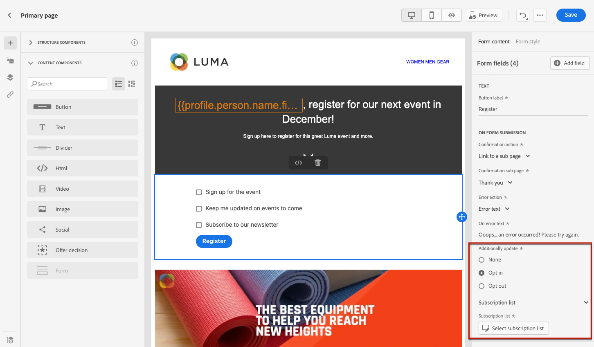

1. Save your content and click the arrow next to the page name to go back to the [landing page properties](create-lp.md#configure-primary-page).

    

## Define landing page form styles {#lp-form-styles}

1. To modify the styles of your form component content, switch at any time to the **[!UICONTROL Style]** tab.

    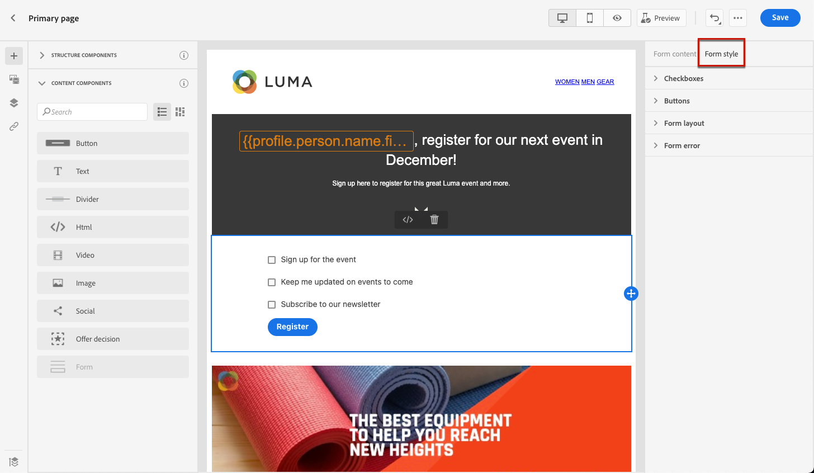

1. The **[!UICONTROL Fields]** section is expanded by default and enables you to edit the appearance of the text field, such as the label and placeholder font, the position of the label, the field background color, or the field border.

    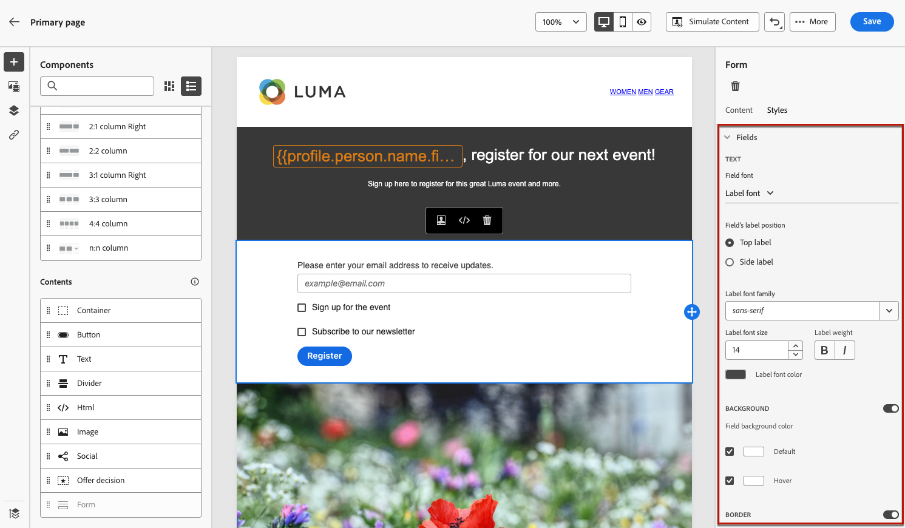

1. Expand the **[!UICONTROL Checkboxes]** section to define the appearance of the checkboxes and corresponding text. For example, you can adjust the font family or size, or the checkbox border color.

    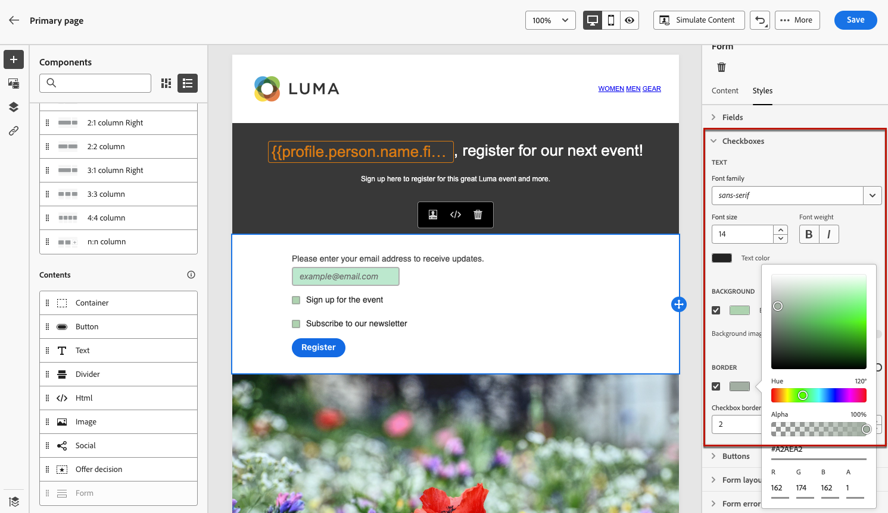

1. Expand the **[!UICONTROL Buttons]** section to modify the appearance of the button in the component form. For example, you can change the font, add a border, edit the label color on hover, or adjust the alignment of the button.

    

    You can preview some of your settings such as button label color on hover by using the **[!UICONTROL Simulate content]** button. Learn more on testing landing pages [here](create-lp.md#test-landing-page).

    <!---->

1. Expand the **[!UICONTROL Form layout]** section to edit the layout settings such as the background color, padding, or margin.

    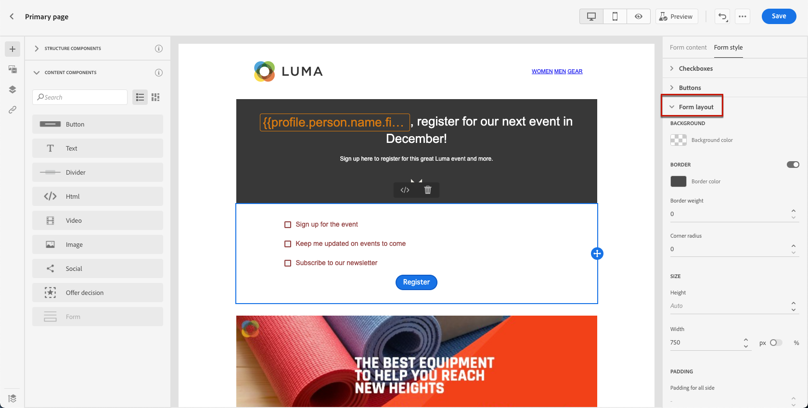

1. Expand the **[!UICONTROL Form error]** section to adjust the display of the error message that displays in case a problem occurs. Check the corresponding option to preview the error text on the form.

    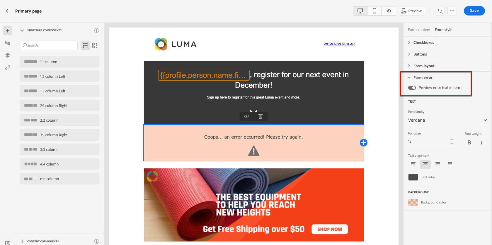

## Use primary page context {#use-primary-page-context}

You can use contextual data coming from another page within the same landing page.

For example, if you link a checkbox <!-- or the submission of the page--> to a [subscription list](subscription-list.md) on the primary landing page, you can use that subscription list on the "thank you" subpage.

Let's say you link two checkboxes on your primary page to two different subscription lists. If a user subscribes to one of these, you want to display a specific message upon submitting the form, depending on which checkbox they selected.

To do so, follow the steps below:

1. On the primary page, link each checkbox of the **[!UICONTROL Form]** component to the relevant subscription list. [Learn more](#use-form-component).

    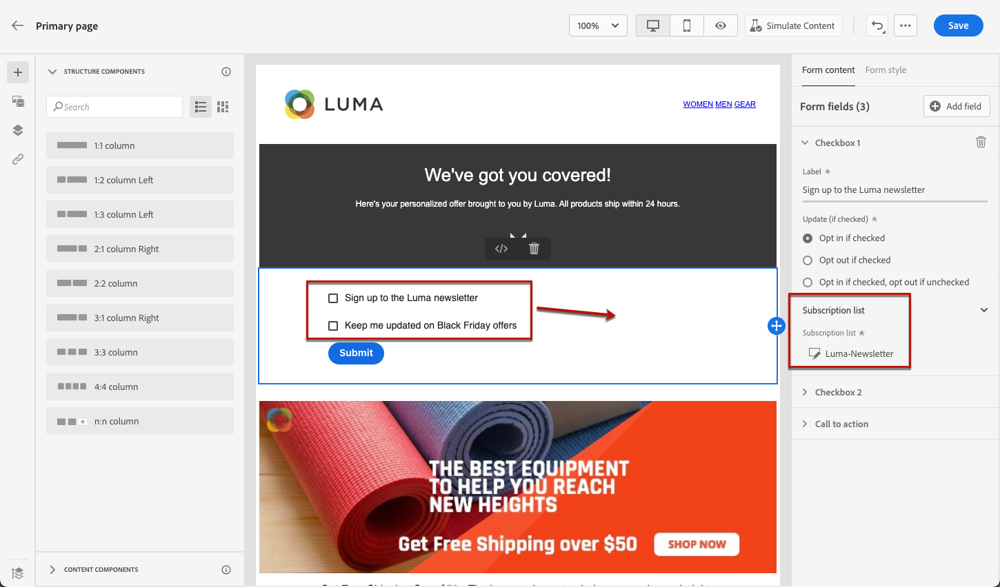

1. On the subpage, place the pointer of your mouse where you want to insert your text and select **[!UICONTROL Add personalization]** from the contextual toolbar.

    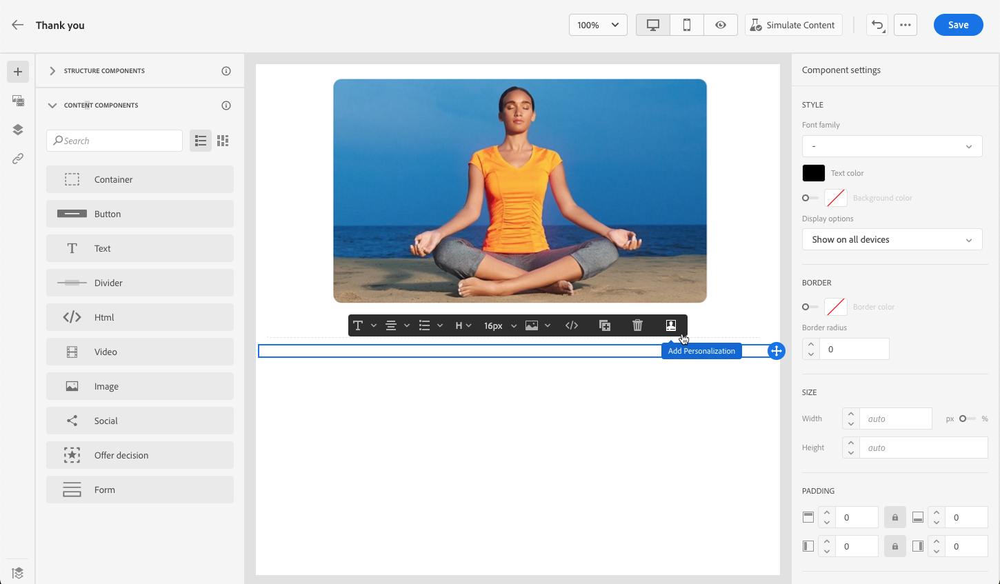

1. In the **[!UICONTROL Edit personalization]** window, select **[!UICONTROL Contextual attributes]** > **[!UICONTROL Landing Pages]** > **[!UICONTROL Primary Page Context]** > **[!UICONTROL Subscription]**.

1. All the subscription lists that you selected on the primary page are listed. Select the relevant items using the + icon.

    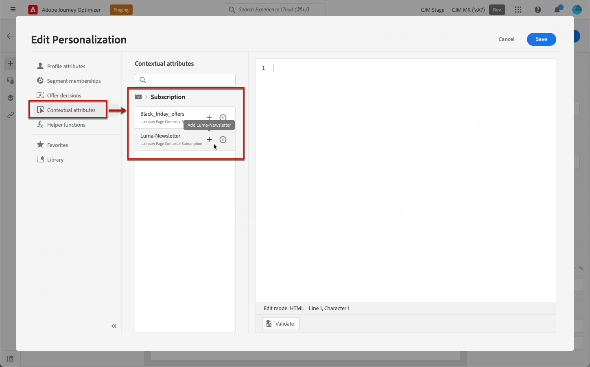

1. Add the relevant conditions using the Expression editor helper functions. [Learn more](../personalization/functions/functions.md)

    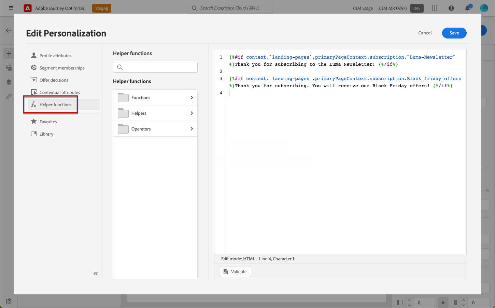

    >[!CAUTION]
    >
    >If there is a special character such as a hyphen in the expression, you must escape the text including the hyphen.

1. Save your changes.

Now when users select one of the checkboxes,

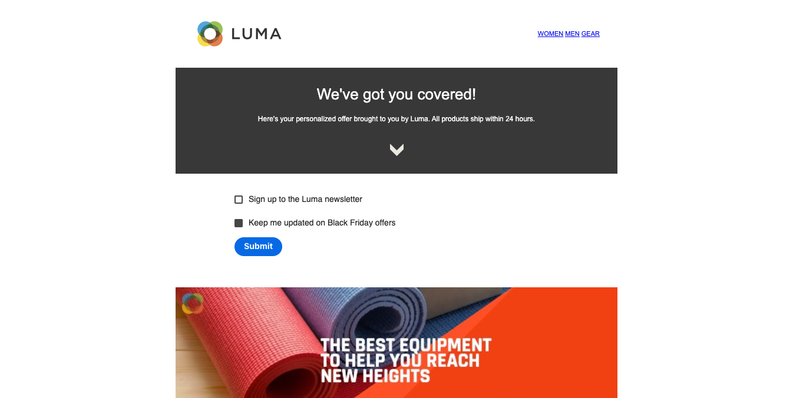

the message corresponding to the selected checkbox is displayed upon submitting the form.

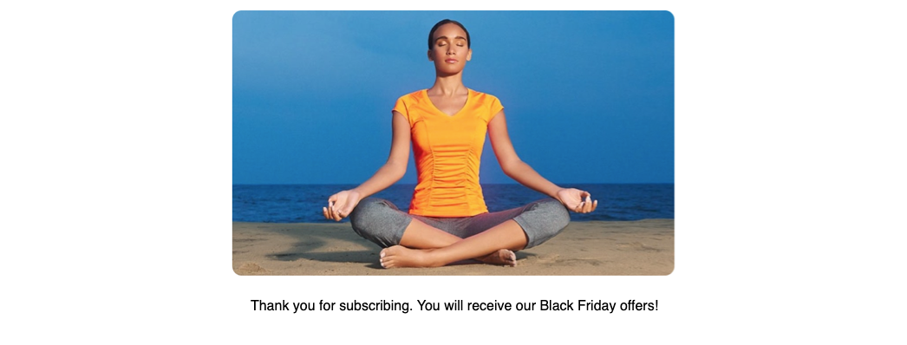

<!--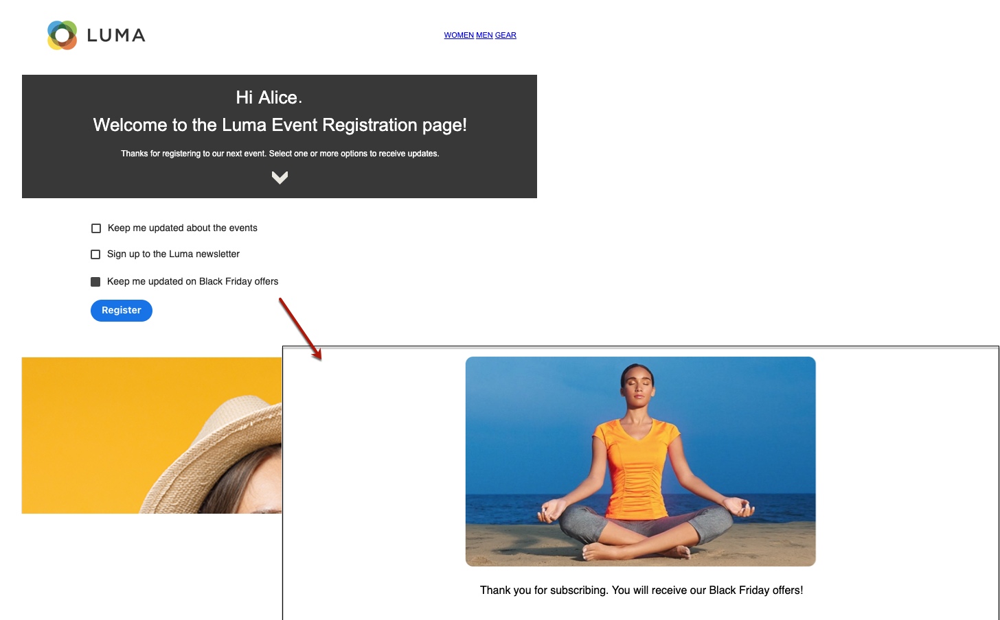-->

>[!NOTE]
>
>If a user selects the two checkboxes, both texts will display.

<!--
## Use landing page additional data {#use-additional-data}

When [configuring the primary page](create-lp.md#configure-primary-page), you can create additional data to enable storing information when the landing page is being submitted.

>[!NOTE]
>
>This data may not be visible to users who visit the page.

If you defined one or more keys with their corresponding values when [configuring the primary page](create-lp.md#configure-primary-page), you can leverage these keys in the content of your primary page and subpages using the [Expression editor](../personalization/personalization-build-expressions.md).

///When you reuse the same text on a page, this enables you to dynamically change that text if needed, without going through each occurrence.

For example, if you define the company name as a key, you can quickly update it everywhere (on all the pages of a given landing page) by changing it only once in the [primary page settings](create-lp.md#configure-primary-page).///

To leverage these keys in a landing page, follow the steps below:

1. When configuring the primary page, define a key and its corresponding value in the **[!UICONTROL Additional data]** section. [Learn more](create-lp.md#configure-primary-page)

    

1. When editing your primary page with the designer, place the pointer of your mouse where you want to insert your key and select **[!UICONTROL Add personalization]** from the contextual toolbar.

    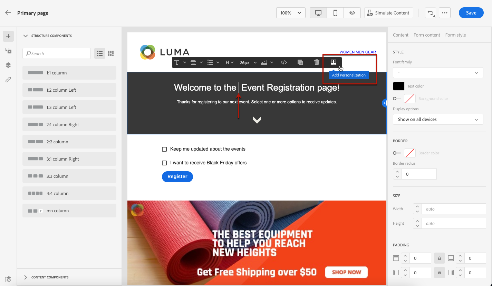

1. In the **[!UICONTROL Edit Personalization]** window, select **[!UICONTROL Contextual attributes]** > **[!UICONTROL Landing Pages]** > **[!UICONTROL Additional Context]**.

    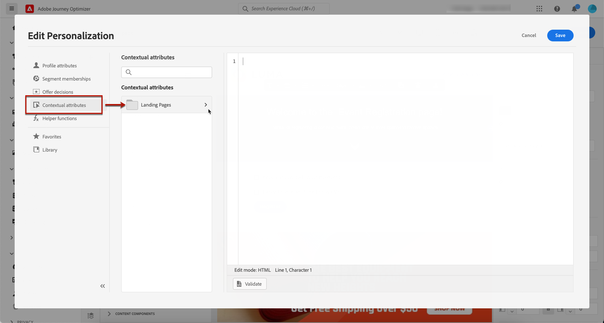

1. All the keys that you created when configuring the primary page are listed. Select the key of your choice using the + icon.

    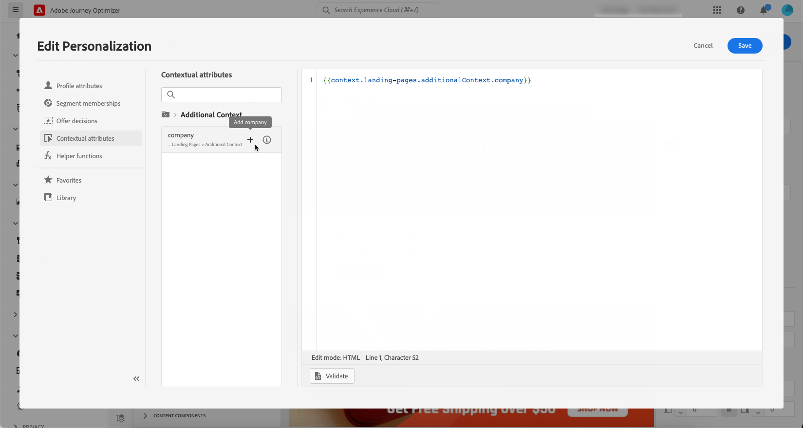

1. Save your changes and repeat the steps above as many times as needed.

    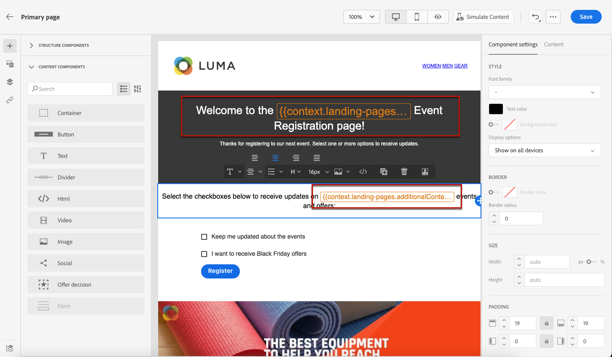

    You can see that the personalization item corresponding to your key is now displayed everywhere you inserted it.
-->