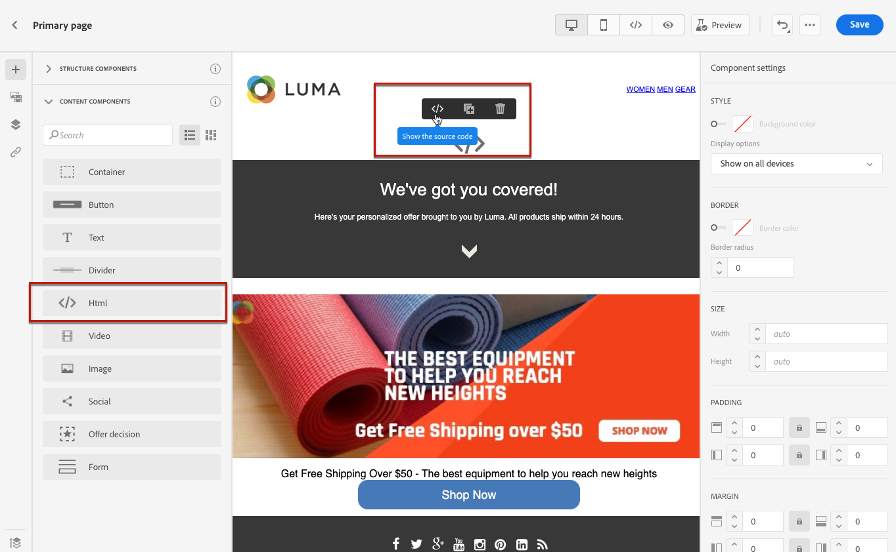

# Use custom JavaScript in a landing page {#lp-custom-js}

You can define your landing page content using custom JavaScript. For example, if you need to perform advanced styling or if you want to add custom behaviors to your landing pages, you can build your own controls and execute them in [!DNL Journey Optimizer].

## Insert JavaScript code into a landing page

To insert custom JavaScript into landing page content, you can either do the following:

* Import existing HTML content when starting to create your content, and select the file which includes your custom JavaScript code. Learn how to import content [in this section](../email/existing-content.md).

* Design your landing page from scratch or from a saved template. Drag and drop the **[!UICONTROL HTML]** content component into the canvas and show the source code to add your JavaSCript into the component. Learn how to use the HTML component in [this section](../email/content-components.md#HTML). <!--You can also simply switch the whole landing page content to code view and enter or paste your JavaScript code.-->

    

* Enter or paste JavaScript code directly into the content designer. Learn how to code your own content [in this section](../email/code-content.md).

>[!NOTE]
>
>Currently you cannot display JavaScript in action when [previewing the landing page](create-lp.md#test-landing-page).

For the landing page to be correctly displayed, use the following syntax as described in the sections below.

## Code initialization

To initalize your JavaScript code, you must use the `lpRuntimeReady` event. This event will be triggered post successful initialization of the library. The callback will be executed with the `lpRuntime` object to expose the library method and hooks.

`LpRuntime` stands for "Landing page Runtime". This object is the main library identifier. It will expose hooks, form submission methods, and other utility methods that can be used in custom JavaScript.

**Example:**

```
if(window.lpRuntime){
    init(window.lpRuntime);
}else{
    window.addEventListener('lpRuntimeReady',function(e){
        init(e.detail);
    });
}
 
function init(lpRuntime){
    // Enter custom JavaScript here using methods from lpRuntime.
}
```

## Hooks

Using hooks, you can attach a method during the lifecycle of the form submission. For example, you can use hooks to perform some form validation before the form is actually submitted.

Here are the hooks you can use:

| Name | Description |
|--- |--- |
| addBeforeSubmitHook | Custom hook to be called before form submission. Returns true to continue submission, else returns false to block submission. |
| addOnFailureHook | Custom hook to be called on failed form submission. |
| addOnSuccessHook | Custom hook to be called on successful form submission. |

**Example:**

```
//LpRuntime hooks
lpRuntime.hooks.addBeforeSubmitHook(function(){
    // Add your validation logic here.
});
```

## Custom form submission

The methods listed below are used to perform custom form submissions. 

>[!NOTE]
>
>Since the form submission is handled by custom JavaScript, the default submission needs to be disabled explicitly by setting a global variable `disableDefaultFormSubmission` to `true`.

| Name | Description |
|--- |--- |
| submitForm | This method will submit the form, and handle the post submission flow. |
| submitFormPartial | This method will also submit the form but will skip the post submission flow. For example, if you have configured the redirect to success page post successful submission, that redirection will not happen in case of partial form submission. |

**Examples:**

```
//LpRuntime methods
window.disableDefaultFormSubmission = true        // Flag to disable the default submission flow.
 
lpRuntime.submitForm(formSubmissionData);         // This will trigger the default form submission handling like redirecting to error or success page.
  
lpRuntime.submitFormPartial(formSubmissionData,{   // This will not trigger the default submission handling.
    beforeSubmit : callback,
    onFailure : failureCallback,                   // Custom onFailureCallback - will be used in partial submission of form.
    onSuccess : successCallback                    // Custom onSuccessCallback - will be used in partial submission of form.
})
```

## Utility function

| Name | Description |
|--- |--- |
| getFormData | This method can be used to get the `formData` in the form of a JSON object. This object can be passed to `submitForm` for form submission. |

**Example:**

```
let formData = lpRuntime.getFormData();                           // Method to generate formdata
 
lpRuntime.submitForm(formData);
```

## Use cases

### Use case 1: Adding validation before form submission

```
<html>
<body>
// Enter HTML body here.
  
<script>
        if(window.lpRuntime){
          console.log('got runtime',lpRuntime);
          init(window.lpRuntime);
        }else{
          window.addEventListener('lpRuntimeReady',function(e){
            init(window.lpRuntime);
          });
        }
        
  
      // Here validate the function is checking if the checkbox is selected. This method should return true if you want form submission.
      function validateForm(){
        return document.querySelector('.spectrum-Checkbox-input').checked;
      }    
  
      function init(lpRuntime){
          lpRuntime.hooks.addBeforeSubmitHook(function(){
              return validateForm(); // This method should return true if you want to proceed with submission.
          })
      }
  
</script>  
  
</body>
</html>
```

### Use case 2: Partial form submission

For example, you have a form with multiple checkboxes on the page. On checking any checkbox, you want this data to be saved to the backend without waiting for the user to click the submit button.

```
<html>
<body>
    <form>
        <input type='checkbox' value="1" name="name1"/>
        <input type='checkbox' value="2" name="name2"/>
        <input type='checkbox' value="3" name="name3"/>
        <input type='checkbox' value="4" name="name4"/>
    </form>
  
<script>
      window.disableDefaultFormSubmission=true;
 
      window.addEventListener('lpRuntimeReady',function(e){        
        init(e.detail)
      }
 
     function init(lpRuntime){
        window.getElementByTagName('input').addEventListener('change',function(e){
            let formData = lpRuntime.getFormData();
            lpRuntime.submitFormPartial(formData);
        })
      }
    </script>
  
</body>
</html>
```

### Use case 3: Custom analytics tags

Using JavaScript you can add listeners of input fields and attach a custom analytics call trigger.

```
<html>
<body>
    <form>
        <input type='checkbox' value="1" name="name1"/>
        <input type='checkbox' value="2" name="name2"/>
        <input type='checkbox' value="3" name="name3"/>
        <input type='checkbox' value="4" name="name4"/>
    </form>
  
<script>
      window.disableDefaultFormSubmission=false;  
 
      window.addEventListener('lpRuntimeReady',function(e){        
        init(e.detail)
      }
 
     function init(lpRuntime){
         window.getElementByTagName('input').addEventListener('change',function(e){
            //trigger analytics events
        })
      }
        
    </script>
  
</body>
</html>
```

### Use case 4: Dynamic form

```
<html>
<body>
    <form>
        <input type='checkbox' value="1" name="name1"/>
        <div class="hiddenInput hidden">
            <input type='text' name="name2"/>
        </div>
    </form>
  
<script>
      window.disableDefaultFormSubmission=false;     
 
      window.addEventListener('lpRuntimeReady',function(e){        
        init(e.detail)
      }
 
      function init(lpRuntime){
        window.getElementByTagName('input').addEventListener('change',function(e){
            document.querySelector('.hiddenInput').toggleClass('hidden');
        })
      }
        
    </script>
  
</body>
</html>
```
