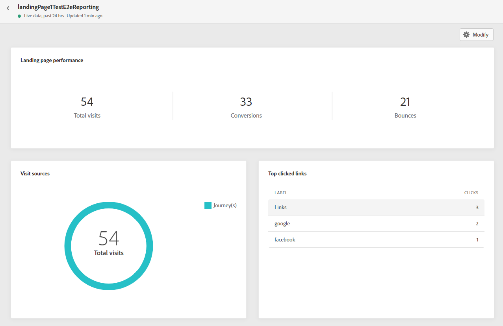
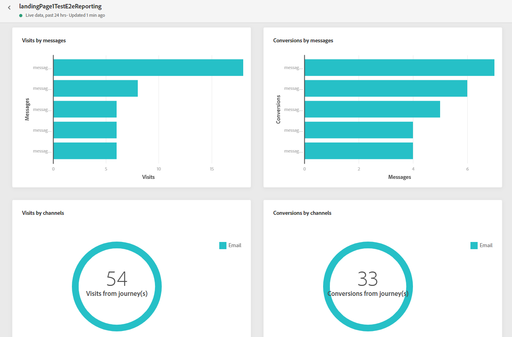
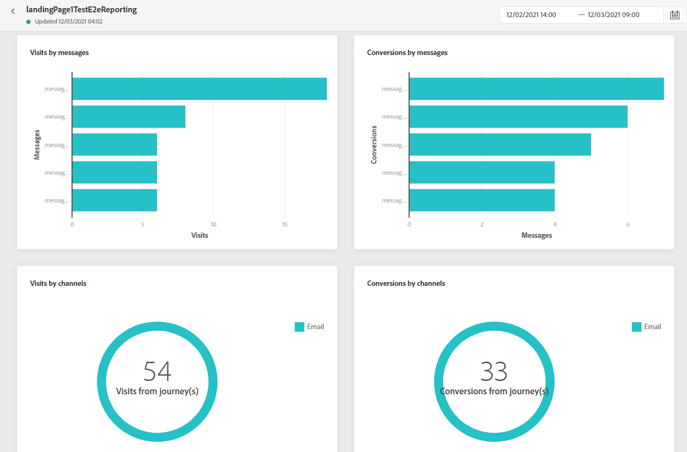

# Landing page report {#lp-report}

The landing page report displays details about the impact of your landing pages. Two report types are available:

* The **[!UICONTROL Live report]** to measure and visualize your landing pages' success over the last 24 hours only.

* The **[!UICONTROL Global report]** to measure and visualize your landing pages' success over a selected time period.

To access your reports, select **Live** or **[!UICONTROL Global report]** from the advanced menu of your selected landing page.

## Landing page live report {#lp-live}

The **[!UICONTROL Landing page performance]** widget details the main information relative to your message over the last 24 hours through KPIs:

* **[!UICONTROL Total visits]**: Total number of visits to your landing page from a journey or other sources, including multiple visits of one recipient. 

* **[!UICONTROL Conversions]**: Number of persons who interacted with the landing page, e.g. subscribed to a form. 

* **[!UICONTROL Bounces]**: Number of persons who didn't interact with the landing page and didn't complete the action of subscribing.

The **[!UICONTROL Visit sources]** widget represents how visitors are accessing your landing page:

* **[!UICONTROL Journey(s)]**: Number of visits to your landing page coming from a journey.

* **[!UICONTROL Other sources]**: Number of visits to your landing page coming from an external source instead of a journey.

The **[!UICONTROL Top clicked links]** identifies the visitors' interaction with the landing page:

* **[!UICONTROL Clicks]**: Number of times a content was clicked on in the landing page.

The **[!UICONTROL Journey(s)]** widget represents the number of visits to your landing page from a journey.

The **[!UICONTROL Other sources]** widget represents the number of visits to your landing page from an external source instead of a journey.

The **[!UICONTROL Visits by messages]** / **[!UICONTROL Conversions by messages]** graphs represent the total number of visits and persons who interacted successfully with your landing page in the last 24 hours depending on the sent messages.

The **[!UICONTROL Visits by channels]** / **[!UICONTROL Conversions by channels]** graphs represent the total number of visits and persons who interacted successfully with your landing page in the last 24 hours depending on the channels.

## Landing page global report {#lp-global}

The **[!UICONTROL Number of visits]** and **[!UICONTROL Number of visits over time]** widgets allow you to see the impact of your landing page over the selected time period through a graph and KPIs with the following metrics:

* **[!UICONTROL Total visits]**: Total number of visits to your landing page coming from journeys and external sources, including multiple visits of one recipient.

* **[!UICONTROL Unique visitors]**: Number of persons who visited your landing page, multiple visits of one recipient are not taken into account.

The **[!UICONTROL Landing page performance]** widget details the main information relative to your message through KPIs:

* **[!UICONTROL Conversion rate]**: Number of persons who interacted with the landing page, e.g. subscribed to a form, in relation to the total number of visits.

* **[!UICONTROL Bounce rate]**: Number of persons who didn't interact with the landing page and didn't complete the action of subscribing, in relation to the total number of visits.

The **[!UICONTROL Visit sources]** widget represents how visitors are accessing your landing page:

* **[!UICONTROL Journey(s)]**: Number of visits to your landing page coming from a journey.

* **[!UICONTROL Other sources]**: Number of visits to your landing page coming from an external source instead of a journey.

The **[!UICONTROL Top clicked links]** identifies the visitors' interaction with the delivery:

* **[!UICONTROL Clicks]**: Number of times a content was clicked on in the landing page.

* **[!UICONTROL Click rate]**: Percentage of clicks in the landing page.

The **[!UICONTROL Journey(s)]** widget represents the number of visits to your landing page from a journey: 

* **[!UICONTROL Visits]**: Number of visits to your landing page, including multiple visits of one recipient.

The **[!UICONTROL Other sources]** widget represents the number of visits to your landing page from an external source instead of a journey.

The **[!UICONTROL Visits by messages]** / **[!UICONTROL Conversions by messages]** graphs represent the total number of visits and persons who interacted successfully with your landing page for the concerned period depending on the sent messages.

The **[!UICONTROL Visits by channels]** / **[!UICONTROL Conversions by channels]** graphs represent the total number of visits and persons who interacted successfully with your landing page for the concerned period depending on the channels.
