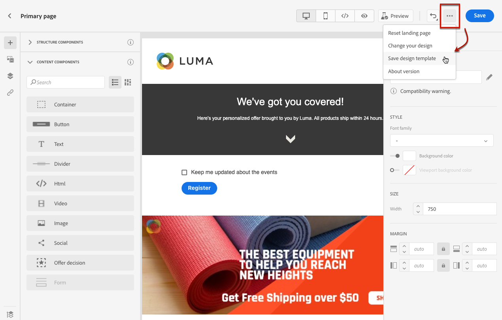
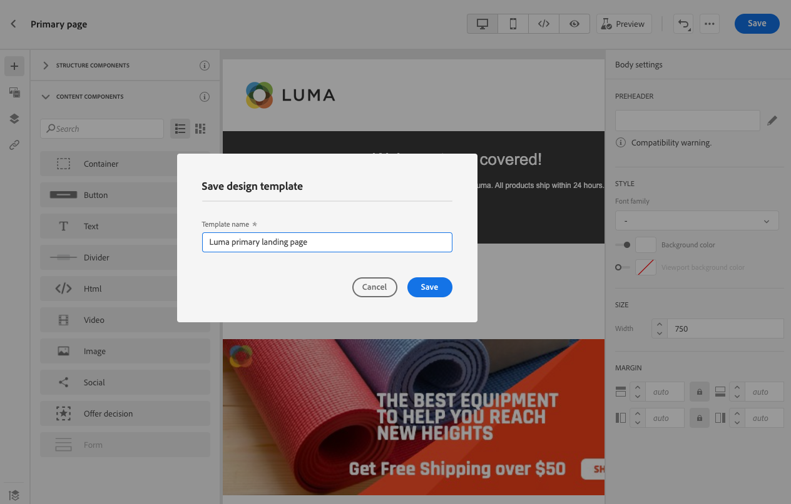
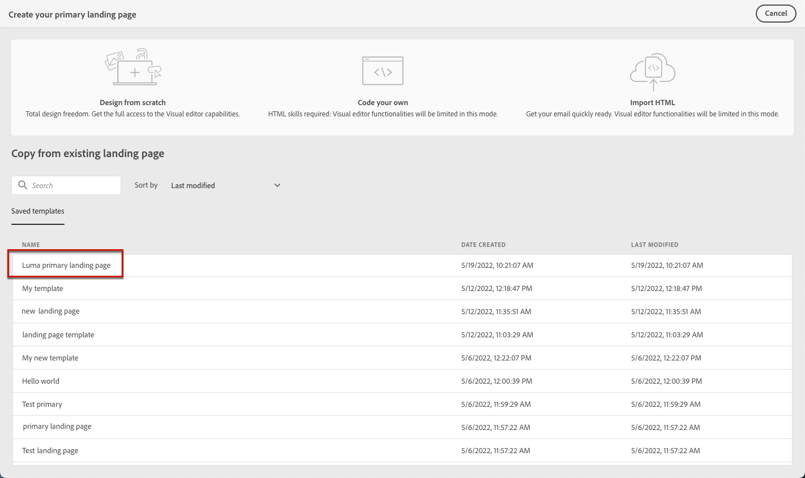
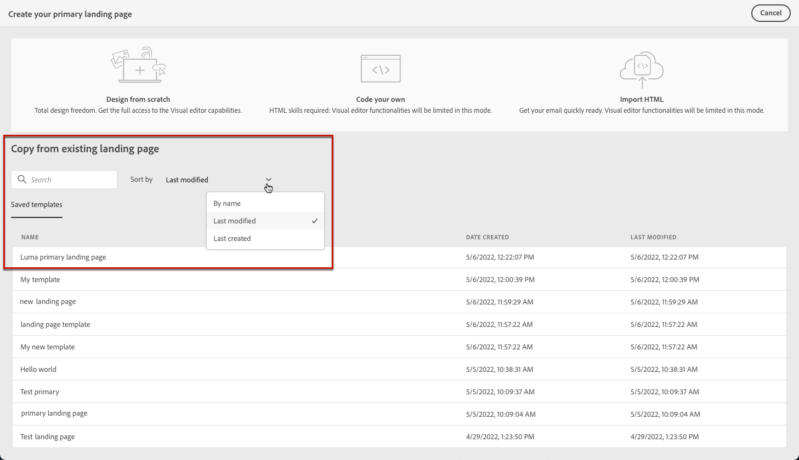
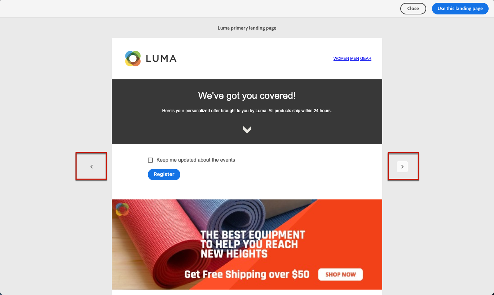

# Work with landing page templates {#work-with-templates}

## Save a page as template {#save-as-template}

Once you designed your [landing page content](lp-content.md), you can save it for future reuse. To do this, follow the steps below.

1. Click the ellipsis on top right of the screen.

1. Select **[!UICONTROL Save design template]** from the drop-down menu.

    

1. Add a name for this template.

    

1. Click **[!UICONTROL Save]**.

Next time you create a landing page, you can use this template to build your content. Learn how in the [section](#use-saved-template) below.

## Use a saved template {#use-saved-template}

1. Open the [landing page content designer](design-lp.md). The list of all previously saved templates displays.

1. You can sort them **[!UICONTROL By name]**, **[!UICONTROL Last modified]** and **[!UICONTROL Last created]**.

    

1. Select the template of your choice from the list.

1. Once selected, you can navigate between all the saved templates using the right and left arrrows.

    

1. Click **[!UICONTROL Use this landing page]**.

1. Edit your content as desired using the landing page designer.

>[!NOTE]
>
>Primary page templates and subpage templates are managed separately, meaning that you cannot use a primary page template to create a subpage, and vice versa.
