# Landing page use cases {#lp-use-cases}

Below are some examples of how you can use [!DNL Journey Optimizer] landing pages to have your customers opt in/out from receiving some or all of your communications.

## Subscription to a service {#subscription-to-a-service}

One of the most common use cases consists in inviting your customers to [subscribe to a service](subscription-list.md) (such as a newsletter or an event) through a landing page. The main steps are presented on the graph below:

For example, let's say you organize an event next month and you want to launch an event registration campaign<!--to keep your customers that are interested updated on that event-->. To do this, you're going to send an email including a link to a landing page that will enable your recipients to register for this event. The users who register will be added to the subscription list that you created for this purpose.

### Set up a landing page {#set-up-lp}

1. Create the event registration's subscription list, which will store the registered users. Learn how to create a subscription list [here](subscription-list.md#define-subscription-list).

    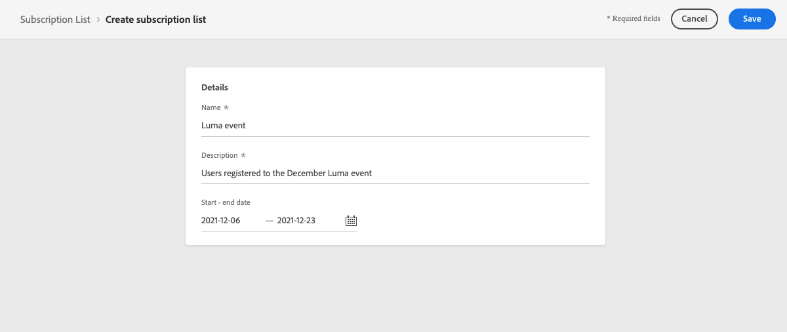

1. [Create a landing page](create-lp.md) to enable your recipients to register for your event.

    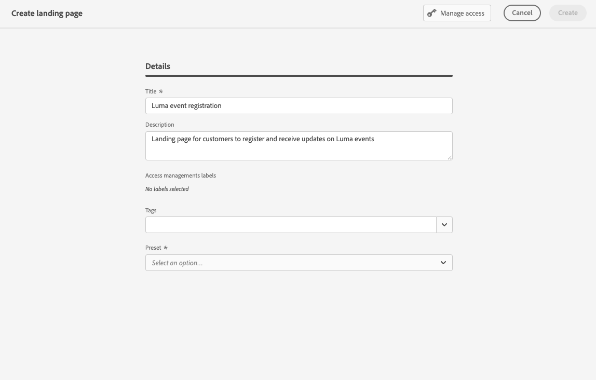

1. Configure the registration [primary landing page](create-lp.md#configure-primary-page).

1. When designing the [landing page content](design-lp.md), select the subscription list that you created to update it with the profiles who select the registration checkbox.

    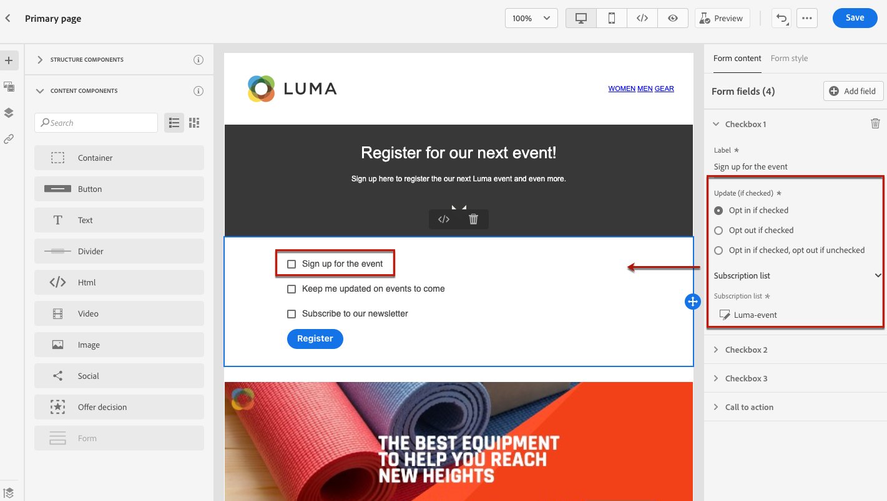

1. Create a 'thank you' page that will be displayed to your recipients once they submit the registration form. Learn how to configure landing subpages [here](create-lp.md#configure-subpages).

    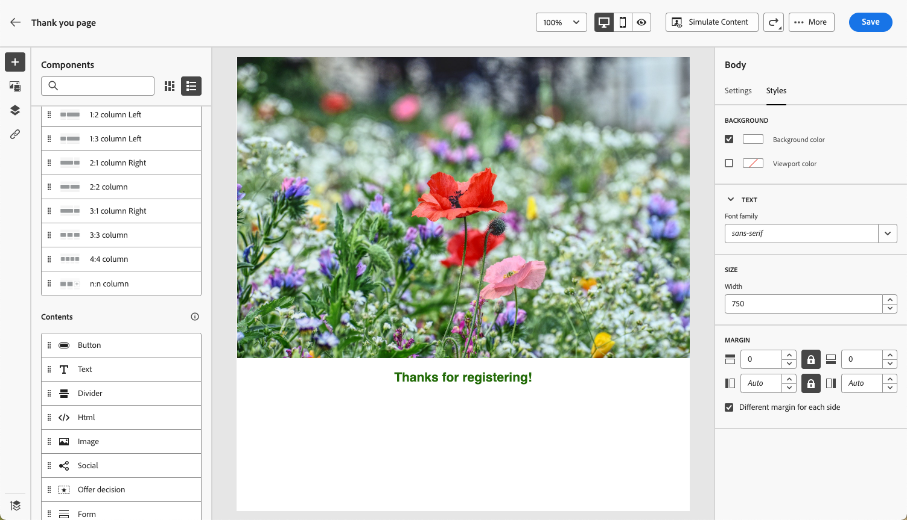

1. [Publish](create-lp.md#publish) the landing page.

1. In a [journey](../building-journeys/journey.md), add an **Email** activity to drive traffic to the registration landing page.

    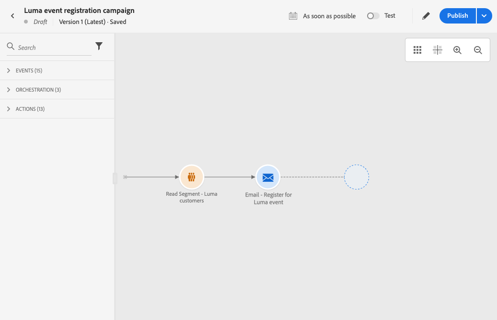

1. [Design the email](../messages/get-started-content.md) to announce that registration is now open for your event.

1. [Insert a link](../email/message-tracking.md#insert-links) into your message content. Select **[!UICONTROL Landing page]** as the **[!UICONTROL Link type]** and choose the [landing page](create-lp.md#configure-primary-page) that you created for registration.

    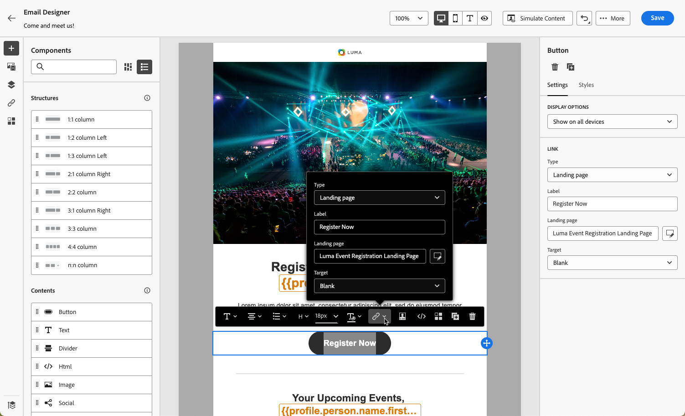

    >[!NOTE]
    >
    >To be able to send your message, make sure the landing page you select is not expired yet. Learn how to update the expiry date [in this section](create-lp.md#configure-primary-page).

    Once they receive the email, if your recipients click the link to the landing page, they will be directed to the 'thank you' page and they will be added to the subscription list.

### Send a confirmation email {#send-confirmation-email}

Additionally, you can send a confirmation email to the recipients who registered for your event. To do so, follow the steps below.

1. Create another [journey](../building-journeys/journey.md). You can do it directly from the landing page by clicking the **[!UICONTROL Create journey]** button. Learn more [here](create-lp.md#configure-primary-page)

    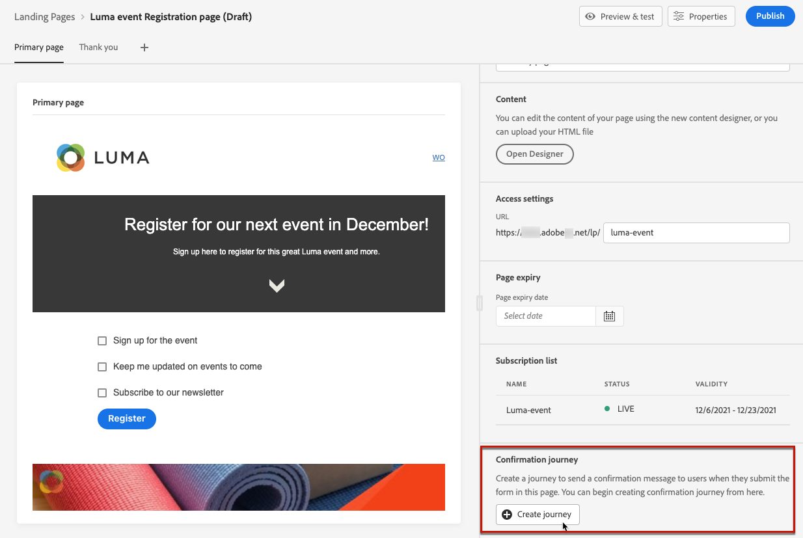

1. Unfold the **[!UICONTROL Events]** category and drop a **[!UICONTROL Segment Qualification]** activity into your canvas. Learn more [here](../building-journeys/segment-qualification-events.md)

1. Click in the **[!UICONTROL Segment]** field and select the subscription list that you created.

    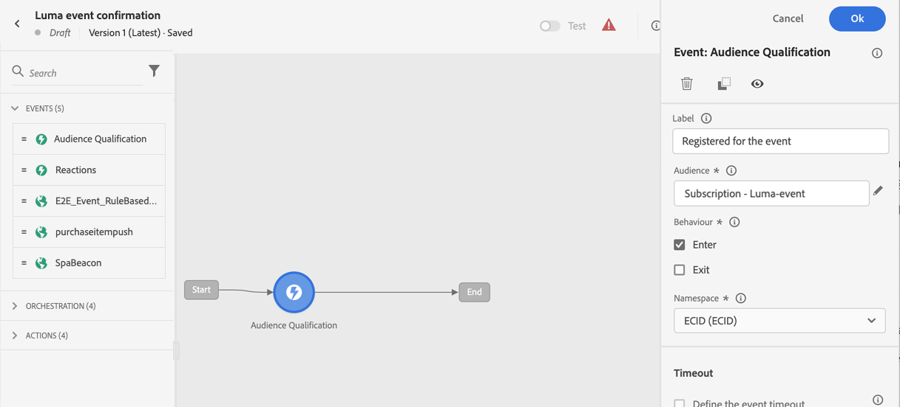

1. Add a confirmation email of your choice and send it through the journey.

    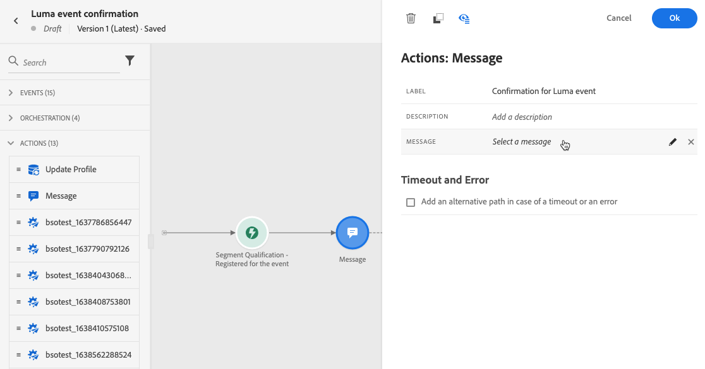

All the users who registered for your event will receive the confirmation email.

<!--The event registration's subscription list tracks the profiles who registered and you can send them targeted event updates.-->

## Opting out {#opt-out}

To enable your recipients to unsubscribe from your communications, you can include a link to an opt-out landing page into your emails.

Learn more on managing your recipients' consent and why this is important in [this section](../privacy/opt-out.md).

### Opt-out management {#opt-out-management}

Providing the capability to recipients to unsubscribe from receiving communications from a brand is a legal requirement. Learn more about the applicable legislation in the [Experience Platform documentation](https://experienceleague.adobe.com/docs/experience-platform/privacy/regulations/overview.html#regulations){target="_blank"}.

Therefore, you must always include an **unsubscribe link** in every email sent out to recipients:

* Upon clicking this link, the recipients will be directed to a landing page including a button to confirm opting out.
* Upon clicking the opt-out button, the profile data will be updated with this information.

### Configure opt-out {#configure-opt-out}

To enable the recipients of an email to unsubscribe from your communications through a landing page, follow the steps below.

1. Create your landing page. [Learn more](create-lp.md)

1. Define the primary page. [Learn more](create-lp.md#configure-primary-page)

1. [Design](design-lp.md) the primary page content: use the landing page-specific **[!UICONTROL Form]** component, define an **[!UICONTROL Opt-out]** checkbox and choose to update **[!UICONTROL Channel (email)]**: the profile that checks the opt-out box on your landing page will be opted out from all your communications.

    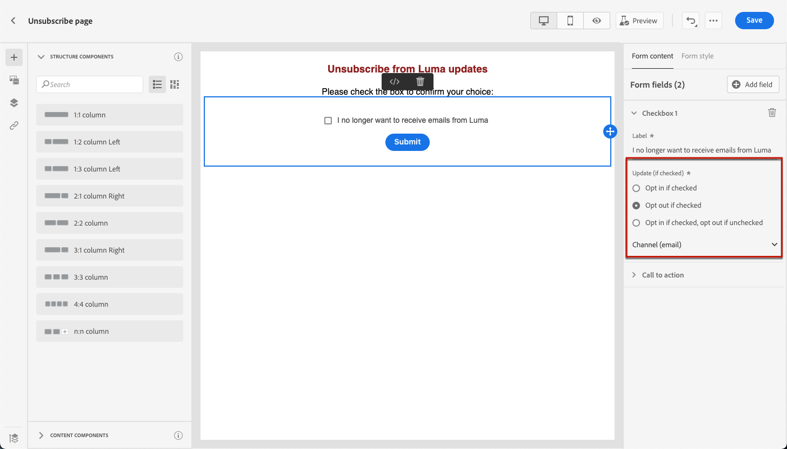

    <!--You can also build your own landing page and host it on the third-party system of your choice.-->

1. Add a confirmation [subpage](create-lp.md#configure-subpages) that will be displayed to the users who submit the form.

    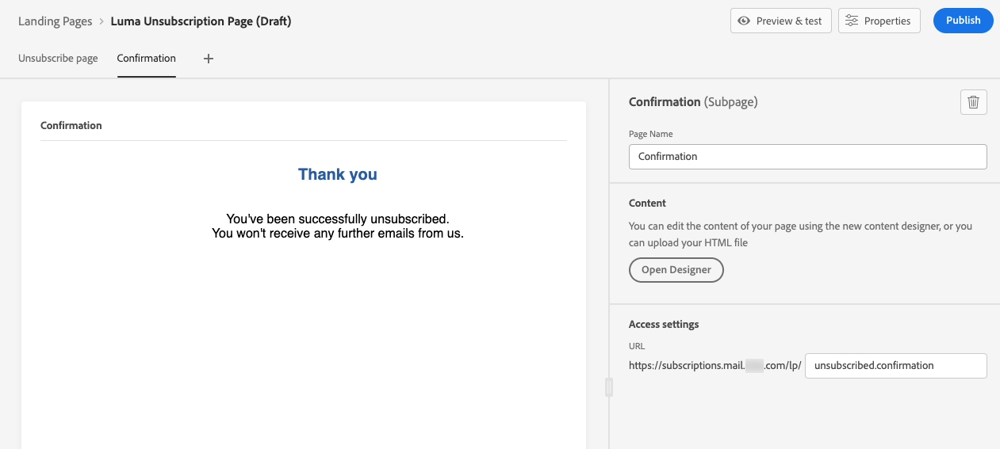

    >[!NOTE]
    >
    >Make sure you reference the subpage in the primary page's **[!UICONTROL Call to action]** section of the **[!UICONTROL Form]** component. [Learn more](design-lp.md)

1. Once you configured and defined the content of your pages, [publish](create-lp.md#publish) the landing page.

    

1. [Create an email message](../messages/get-started-content.md) in a journey.

1. Select text in your content and [insert a link](../email/message-tracking.md#insert-links) using the contextual toolbar. You can also use a link on a button.

    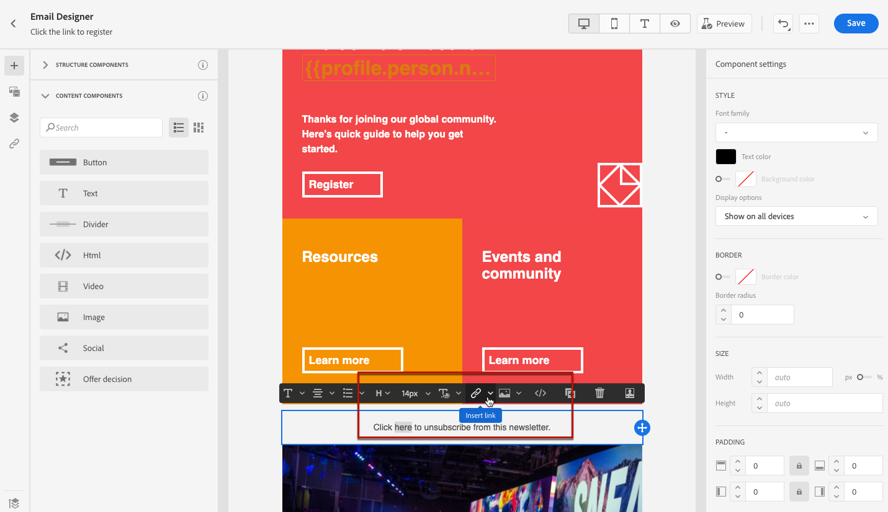

1. Select **[!UICONTROL Landing page]** from the **[!UICONTROL Link type]** drop-down list and select the [landing page](create-lp.md#configure-primary-page) that you created for opting out.

    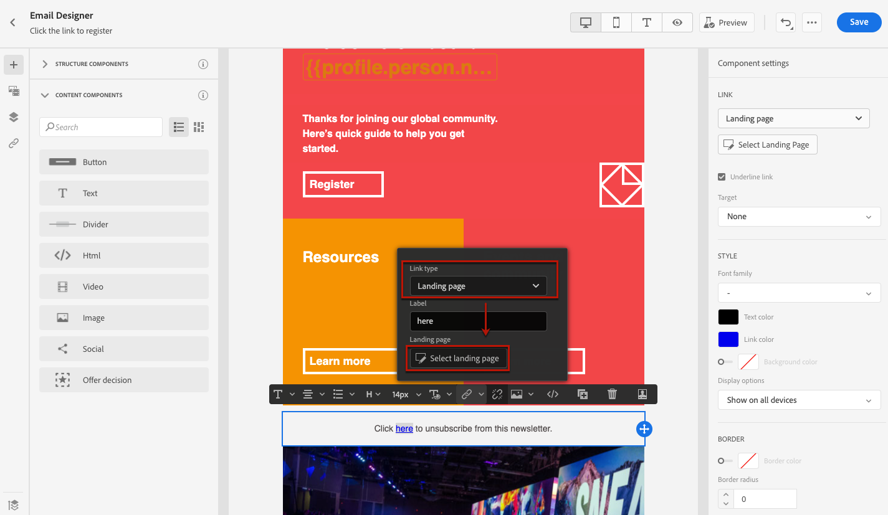

    >[!NOTE]
    >
    >To be able to send your message, make sure the landing page you select is not expired yet. Learn how to update the expiry date [in this section](create-lp.md#configure-primary-page).

1. Publish and run the journey. [Learn more](../building-journeys/journey.md).

1. Once the message is received, if a recipient clicks the unsubscribe link in the email, your landing page is displayed.

    

    If the recipient checks the box and submits the form:

    * The opted-out recipient is redirected to the confirmation message screen.

    * The profile data is updated and will not receive communications from your brand unless subscribed again.

To check that the corresponding profile's choice has been updated, go to Experience Platform and access the profile by selecting an identity namespace and a corresponding identity value. Learn more in the [Experience Platform documentation](https://experienceleague.adobe.com/docs/experience-platform/profile/ui/user-guide.html#getting-started){target="_blank"}.

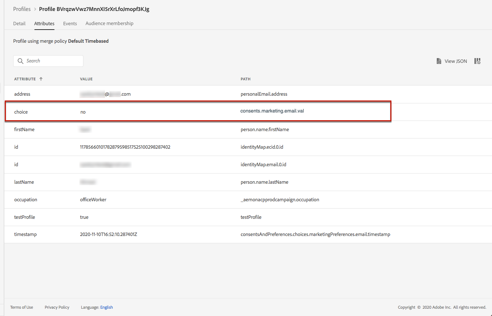

In the **[!UICONTROL Attributes]** tab, you can see that the value for **[!UICONTROL choice]** has changed to **[!UICONTROL no]**.

<!--

### Other ways to opt out

You can also enable your recipients to unsubscribe whithout using landing pages.

* **One-click opt-out**

    You can add a one-click opt-out link into your email content. This will enable your recipients to quickly unsubscribe from your communications, without being redirected to a landing page where they need to confirm opting out. [Learn more](../privacy/opt-out.md#one-click-opt-out-link)

* **Unsubscribe link in header**

    If the recipients' email client supports displaying an unsubscribe link in the email header, emails sent with [!DNL Journey Optimizer] automatically include this link. [Learn more](../privacy/opt-out.md#unsubscribe-header)

////////

## Leverage landing page submission event {#leverage-lp-event}

You can use information that was submitted on a landing page to send communications to your customers. For example, if a user subscribes to a given subscription list, you can leverage that information to send an email recommending other subscription lists to that user.

To do this, you need to create an event containing the landing page submission information and use it in a journey. Follow the steps below.

1. Go to **[!UICONTROL Administration]** > **[!UICONTROL Configurations]**, and in the **[!UICONTROL Events]** section, select **[!UICONTROL Manage]**.

    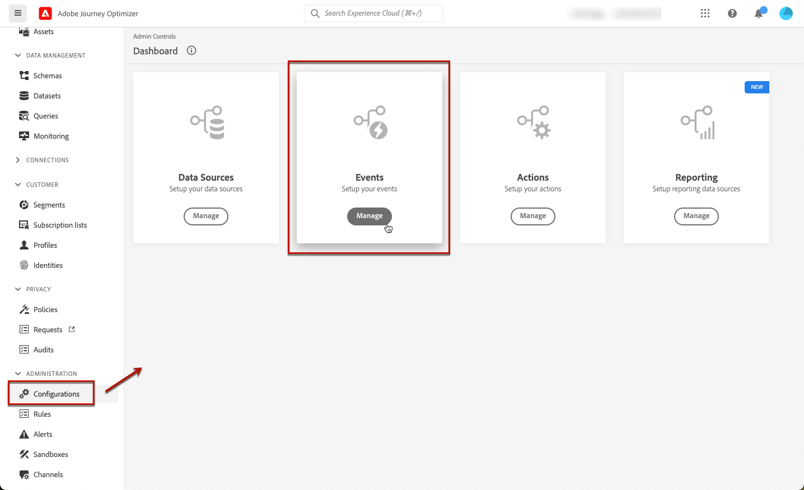

1. The list of events displays. Select **[!UICONTROL Create Event]**.

    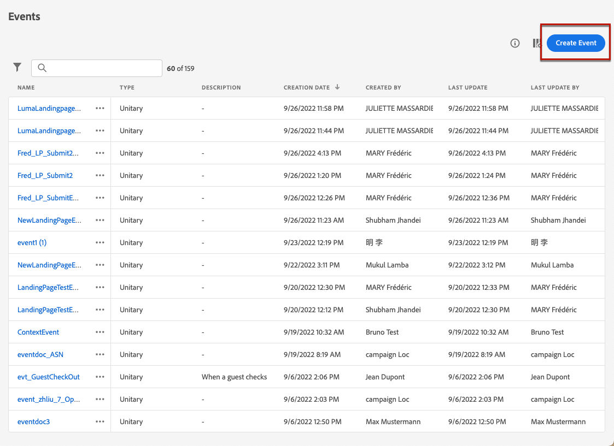

1. The event configuration pane opens on the right side of the screen. Configure a rule-based unitary event. [Learn more](../event/about-creating.md)

1. Define the schema: select **[!UICONTROL AJO Email Tracking Experience Event Schema v.1]** (available by default in [!DNL Journey Optimizer]).

    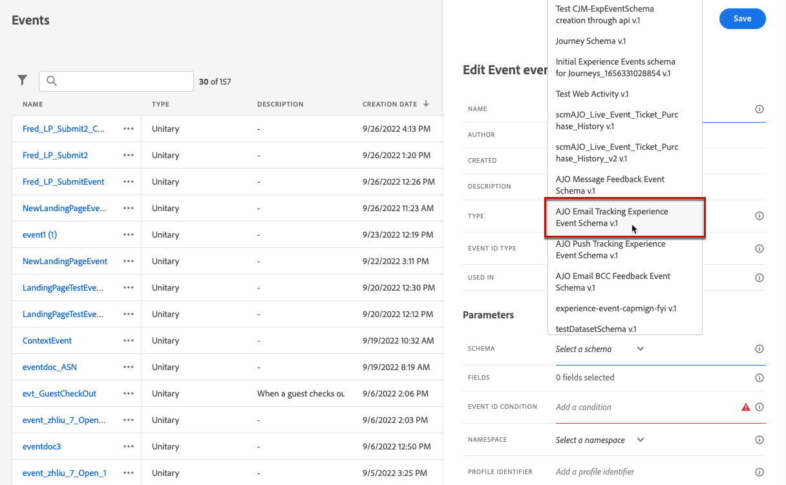

1. In the **[!UICONTROL Fields]** section, select the following elements:

    * **[!UICONTROL _experience]** > **[!UICONTROL customerJourneyManagement]** > **[!UICONTROL messageInteraction]** > **[!UICONTROL Interaction Type]**
    
    * **[!UICONTROL _experience]** > **[!UICONTROL customerJourneyManagement]** > **[!UICONTROL messageInteraction]** > **[!UICONTROL Landing Page Details]** > **[!UICONTROL Landing Page ID]**

    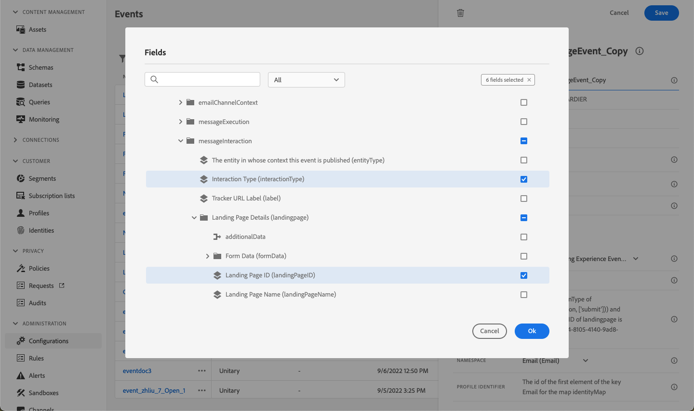

1. Click inside the **[!UICONTROL Event ID condition]** field. Using the simple expression editor, define the condition for the **[!UICONTROL Interaction Type]** and **[!UICONTROL Landing Page ID]** fields. This will be used by the system to identify the events that will trigger your journey.

    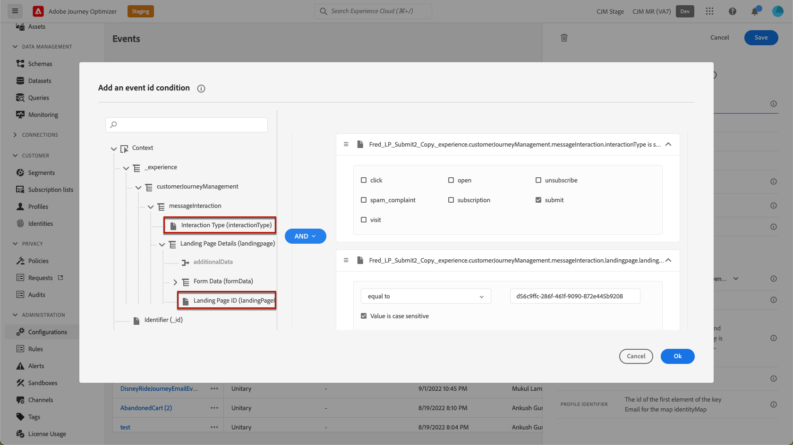

    >[!NOTE]
    >
    >To find the landing page ID, you can insert the landing page as a link into an email and select the source code from the contextual toolbar to display the landing page information.
    >
    >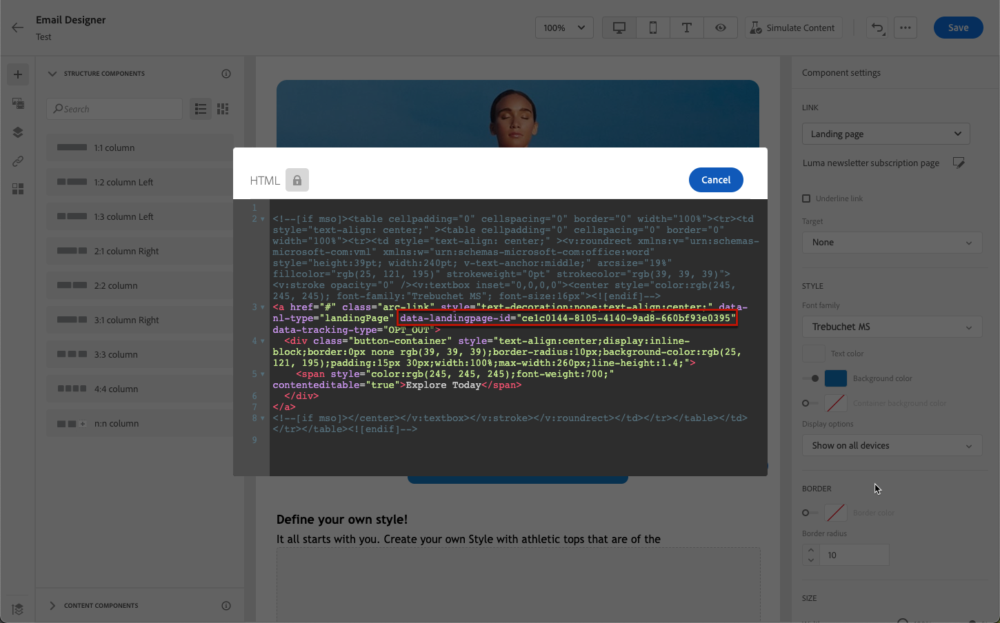

1. Save your changes.

1. Create a [journey](../building-journeys/journey.md). You can do it directly from the landing page by clicking the **[!UICONTROL Create journey]** button. Learn more [here](create-lp.md#configure-primary-page)

    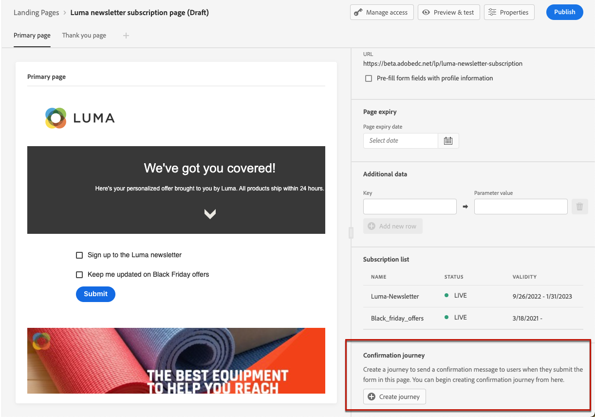

1. In the journey, unfold the **[!UICONTROL Events]** category and drop the event that you created into the canvas. Learn more [here](../building-journeys/segment-qualification-events.md)

    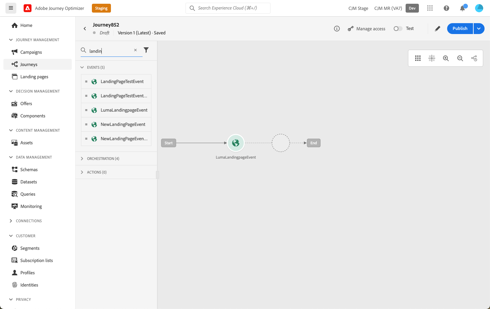

1. Unfold the **[!UICONTROL Actions]** category and drop an email action into the canvas.

    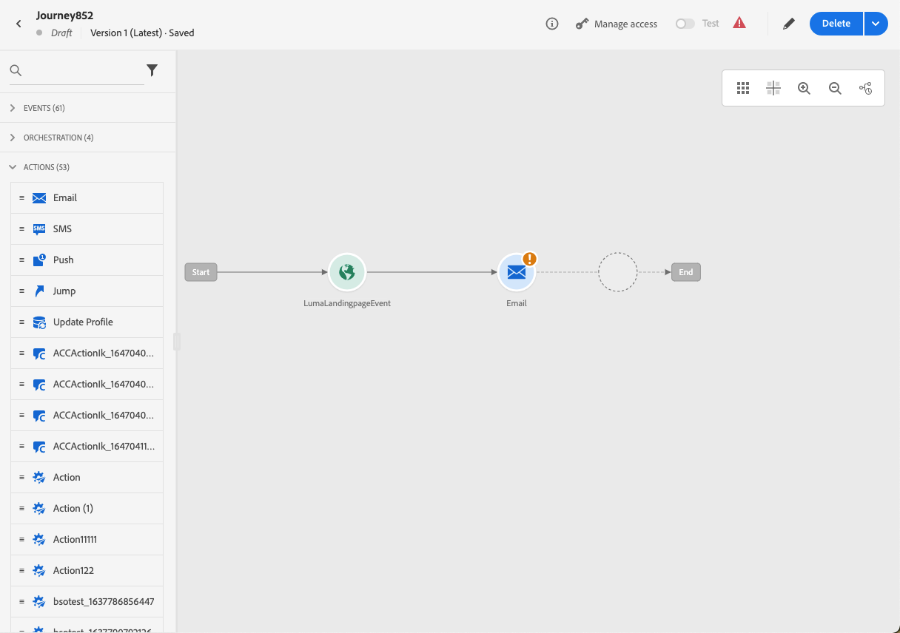

///How do you use the information from the event to send an email to the users? -->
