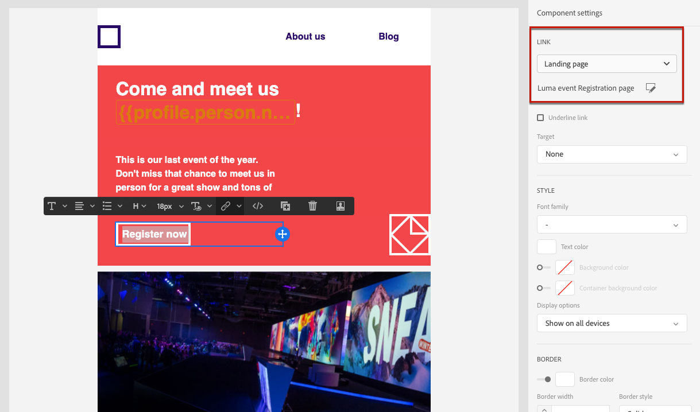

# Landing page use cases

Below are examples of how you can use [!DNL Journey Optimizer] landing pages to have your customers opt in/out from receiving some or all of your communications.

<!--The main use cases are:
* Subscription to a service
* Opt-in
* Opt-out-->

## Subscription to a service {#subscription-to-a-service}

The main steps to make your recipients subscribe to a service are presented below.

For example, let's say you organize an event next month and you want to launch an event registration campaign to keep your customers that are interested updated on that event.

1. Create the event registration's subscription list. Learn more on [subscription lists](subscription-list.md)

1. [Create a landing page](create-lp.md), which will enable your recipients to register to your event.

1. Configure and design the registration landing page, including the link to the subscription list. Learn more on building the [primary landing page](create-lp.md#configure-primary-page)

1. Create a thank you page that will be displayed to your recipients once they submit the registration form. Learn more on [landing subpages](create-lp.md#configure-subpages)

1. Create an email message. Learn more on [creating messages](../create-message.md)

1. [Insert a link](../message-tracking.md#insert-links) to your message. Select **[!UICONTROL Landing page]** as the **[!UICONTROL Link type]** and choose the [landing page](create-lp.md#configure-primary-page) that you created for registration.

    

1. Save your content and [publish your message](../publish-manage-message.md).

1. Send your message through a [journey](../building-journeys/journey.md) to announce registration is now open for your event and to drive traffic to the registration landing page.

    Once they receive the email, if your recipients click the link to the landing page, they will be directed to the thank you page and they will be added to the subscription list.

1. You can send a confirmation email to the recipients who registered for your event. To do so, send it through another journey using the **[!UICONTROL Segment qualification]** event and select the subscription list that you created as the segment.

<!--The event registration's subscription list tracks the profiles who registered and you can send them targeted event updates.-->

## Opting out {#opt-out}

To enable your recipients to unsubscribe from your communications, you can include a link to an opt-out landing page into your emails.

Learn more on managing your recipients' consent and why this is important in [this section](../consent.md).

### Opt-out management {#opt-out-management}

Providing the capability to recipients to unsubscribe from receiving communications from a brand is a legal requirement. Learn more about the applicable legislation in the [Experience Platform documentation](https://experienceleague.adobe.com/docs/experience-platform/privacy/regulations/overview.html#regulations){target="_blank"}.

Therefore, you must always include an **unsubscribe link** in every email sent out to recipients:

* Upon clicking this link, the recipients will be directed to a landing page including a button to confirm opting out.
* Upon clicking the opt-out button, the profile data will be updated with this information.

### Configure opt-out {#configure-opt-out}

To enable the recipients of a message to unsubscribe from your communications through a landing page, follow the steps below.

1. Build your [landing page](create-lp.md). Use the landing page-specific **[!UICONTROL Form]** component, define an **[!UICONTROL Opt-out]** checkbox and choose to update **[!UICONTROL Channel (email)]**: the profile that checks the opt-out box on your landing page will be opted out from all your communications. [Learn more](design-lp.md)

    <!--You can also build your own landing page and host it on the third-party system of your choice. To keep?-->

1. [Create a message](../create-message.md) in [!DNL Journey Optimizer].

1. Select text in your content and [insert a link](../message-tracking.md#insert-links) using the contextual toolbar. You can also use a link on a button.

    

1. Select **[!UICONTROL Landing page]** from the **[!UICONTROL Link type]** drop-down list.

1. Select the [landing page](create-lp.md#configure-primary-page) that you created for opting out.

    

1. Click **[!UICONTROL Save]**.

1. Save your content and [publish your message](../publish-manage-message.md).

1. Send your message through a [journey](building-journeys/journey.md).

1. Once the message is received, if the recipient clicks the unsubscribe link, your landing page is displayed.

    <!---->

1. If the recipient clicks the opt-out link in the landing page, the profile data is updated and will not receive communications from your brand unless subscribed again.

    <!--The opted-out recipient is then redirected to a confirmation message screen indicating that opting out was successful.-->

    <!---->

To check that the corresponding profile's choice has been updated, go to Experience Platform and access the profile by selecting an identity namespace and a corresponding identity value. Learn more in the [Experience Platform documentation](https://experienceleague.adobe.com/docs/experience-platform/profile/ui/user-guide.html#getting-started){target="_blank"}.

In the **[!UICONTROL Attributes]** tab, you can see the value for **[!UICONTROL choice]** has changed to **[!UICONTROL no]**.

<!--

### Other ways to opt out

You can also enable your recipients to unsubscribe whithout using landing pages.

* **One-click opt-out**

    You can add a one-click opt-out link into your email content. This will enable your recipients to quickly unsubscribe from your communications, without being redirected to a landing page where they need to confirm opting out. [Learn more](../message-tracking.md#one-click-opt-out-link)

* **Unsubscribe link in header**

    If the recipients' email client supports displaying an unsubscribe link in the email header, emails sent with [!DNL Journey Optimizer] automatically include this link. [Learn more](../consent.md#unsubscribe-email)
-->