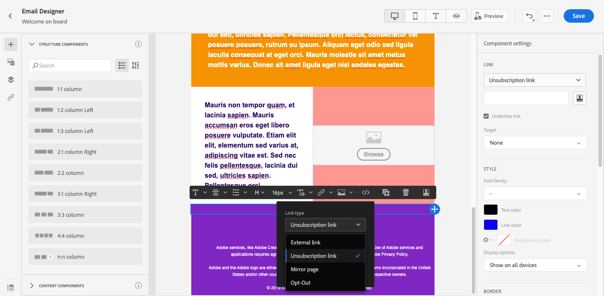
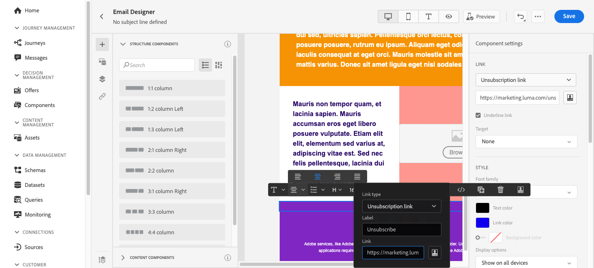
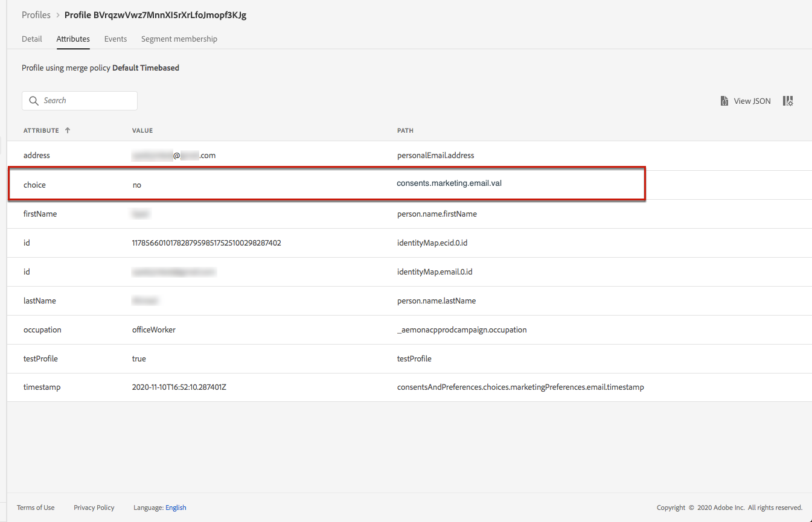

# Manage opt-out {#consent}

Use [!DNL Journey Optimizer] to track your recipients' consent for communication and understand how they want to engage with your brand by managing their preferences and subscriptions. <!--Their preferences and subscriptions are handled through Consent management.-->

Regulations such as GDPR state that you must comply with specific requirements before being able to use information from Data Subjects. Moreover, Data Subjects should be able to modify their consent at any time.

**Why is it important?**

* Failing to comply with these regulations introduces regulatory legal risks for your brand.
* It helps you avoid sending unsolicited communications to your recipients, which could make them mark your messages as spam and harm your reputation.

Learn more on managing Privacy and the applicable regulations in the [Experience Platform documentation](https://experienceleague.adobe.com/docs/experience-platform/privacy/home.html){target="_blank"}.

## Opt-out management {#opt-out-management}

Providing the capability to recipients to unsubscribe from receiving communications from a brand is a legal requirement. Learn more about the applicable legislation in the [Experience Platform documentation](https://experienceleague.adobe.com/docs/experience-platform/privacy/regulations/overview.html#regulations){target="_blank"}.

Therefore, you must always include an **unsubscribe link** in every email sent out to recipients:

* Upon clicking this link, the recipients will be directed to a landing page including a button to confirm opting out.
* Upon clicking the opt-out button, the profile data will be updated with this information. [Learn more about this](#consent-service-api).

## Add an unsubscribe link {#add-unsubscribe-link}

To add an unsubscribe link into your messages using a landing page, follow the steps below.

1. Build your unsubscription landing page. [Learn more](landing-pages/create-lp.md).

    >[!NOTE]
    >
    >You can also build your own landing page and host it on the third-party system of your choice.<!--to keep?-->

1. [Create a message](../../help/using/create-message.md) in [!DNL Journey Optimizer].

1. Select text in your content and insert a link using the contextual toolbar.

    

1. Select **[!UICONTROL Landing page]** from the **[!UICONTROL Link type]** drop-down list.

    

1. Select the [landing page](landing-pages/create-lp.md#configure-primary-page) that you created for opting out.

    

1. Click **[!UICONTROL Save]**.

1. Save your content and [publish your message](../../help/using/publish-manage-message.md).

1. Send your message through a [journey](building-journeys/journey.md).

1. Once the message is received, if the recipient clicks the unsubscribe link, your landing page is displayed.

    

1. If the recipient clicks the opt-out button in the landing page (here, the **Unsubscribe** button), the profile data is updated.

    The opted-out recipient is then redirected to a confirmation message screen indicating that opting out was successful.

    

    As a result, this user will not receive communication from your brand unless subscribed again.

To check that the corresponding profile's choice has been updated, go to Experience Platform and access the profile by selecting an identity namespace and a corresponding identity value. Learn more in the [Experience Platform documentation](https://experienceleague.adobe.com/docs/experience-platform/profile/ui/user-guide.html#getting-started){target="_blank"}.

In the **[!UICONTROL Attributes]** tab, you can see the value for **[!UICONTROL choice]** has changed to **[!UICONTROL no]**.

## Other ways to opt out

You can also enable your recipients to unsubscribe whithout using landing pages.

* **One-click opt-out**

    You can also add a one-click opt-out link into your email content. This will enable your recipients to quickly unsubscribe from your communications, without being redirected to a landing page where they need to confirm opting out. [Learn more](../message-tracking.md#one-click-opt-out-link)

* **Unsubscribe link in header**

    If the recipients' email client supports displaying an unsubscribe link in the email header, emails sent with [!DNL Journey Optimizer] automatically include this link. [Learn more](../consent.md#unsubscribe-email)
