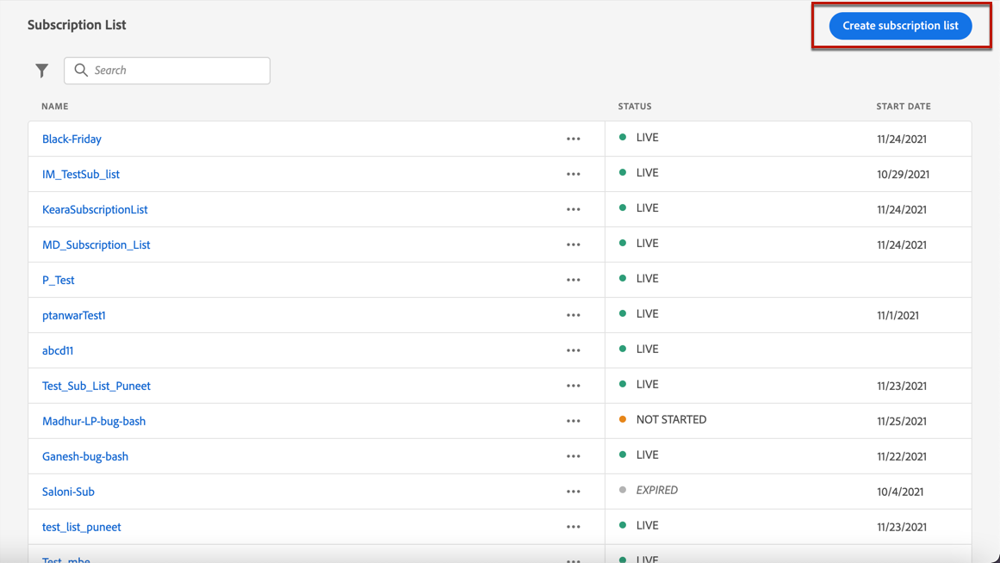
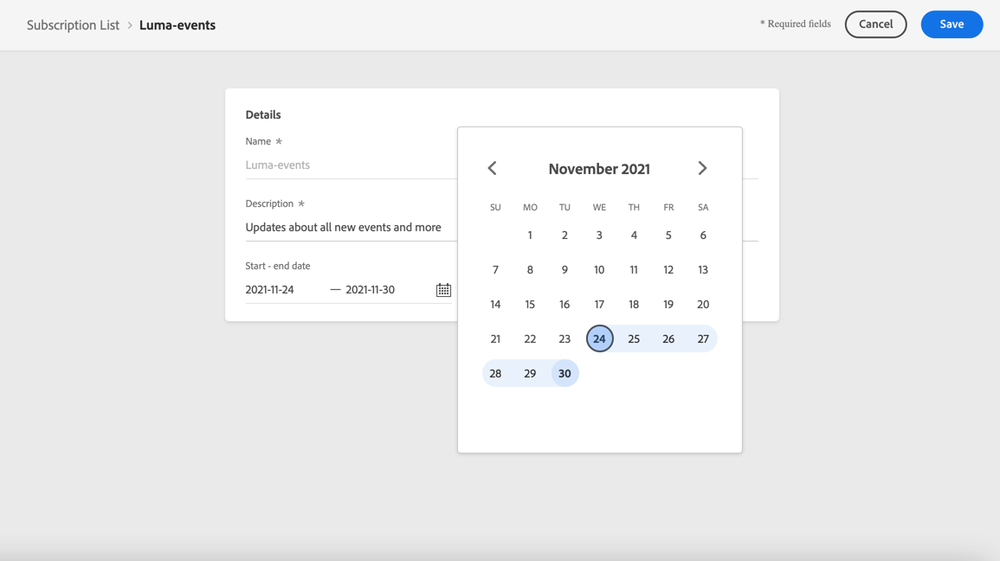
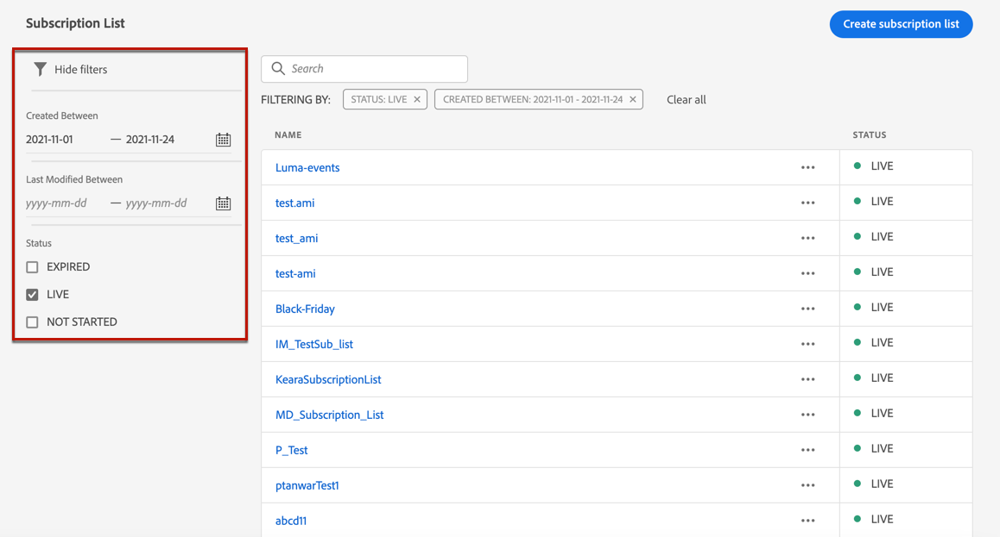

# Create a subscription list {#create-subscription-list}

## What is a subscription list?

A subscription service refers to marketing goods and services provided to customers who have opted in to receive communications on a specific subject/event/interest/etc. on an ongoing basis. In [!DNL Journey Optimizer], these opted-in customers are gathered into a subscription list.

A subscription service can be:

* a newsletter, for example “Running series”,
* an event, for example “Summit 2021”,
* a webinar, for example "Learn more about crypto",
* an interest on a particular product/sport/service/etc., for example "Interested to buy a house in the next 12 months",
* a preference on how to be notified, for example "Receive new song notifications on email"

The profiles can be added to a subscription list through a [landing page](create-lp.md). An example is presented in [this section](get-started-lp.md#subscription-to-a-service).

## Define a subscription list {#define-subscription-list}

To create a subscription list, follow the steps below.

1. To access the subscription lists, select **[!UICONTROL Customer]** > **[!UICONTROL Subscription list]**.

    

1. From the subscription list, click **[!UICONTROL Create subscription]** list.

    

1. Add a name and a description. These fields are mandatory.

1. You can define a start date and end date.

    

1. Click **[!UICONTROL Save]**.

The list displays all the subscription lists created. You can filter them based on the creation date or modification date.

The possible statuses are as follows:

* **[!UICONTROL Not started]**: You defined a start date that is later than the current day. The profiles subscribed to this list will not receive yet communications relating to this subscription list.
* **[!UICONTROL Live]**: The subscription list has a start date and end date that includes the current day, or you did not defined end/start dates, which means the subscription list is always live.
* **[!UICONTROL Expired]**: The end date is passed, the subscription list is not valid anymore. Any profile subscribed to this list will not receive any more communications relating to this subscription list.

Once the subscription list is created, you can use it in a landing page so that the profiles can opt in through a form and be added to the list. [Learn more](design-lp-content.md)

<!--

**Questions**

* Can't see the newly created subscription list in UI because their name included spacing > bug - to follow up (should be fixed for Dec. release)

* How do you handle the different statuses? Live, Not started, Expired? Is it only through start/end dates?

* What does it mean when a subscription list is expired or not started? You can't use it in a LP? And if a user is subscribed to this service, then he won't receive communications any more?

* What else can you currently do with subscription lists apart from attach them to a landing page?

* Can you update the subscription list in a way other than through a LP? Not in UI but with APIs > to follow up with Fred

-->