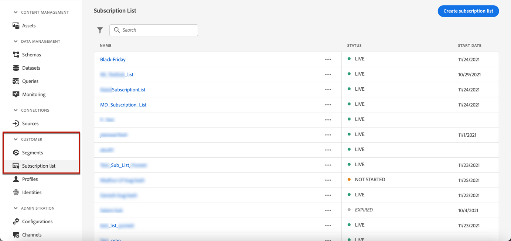
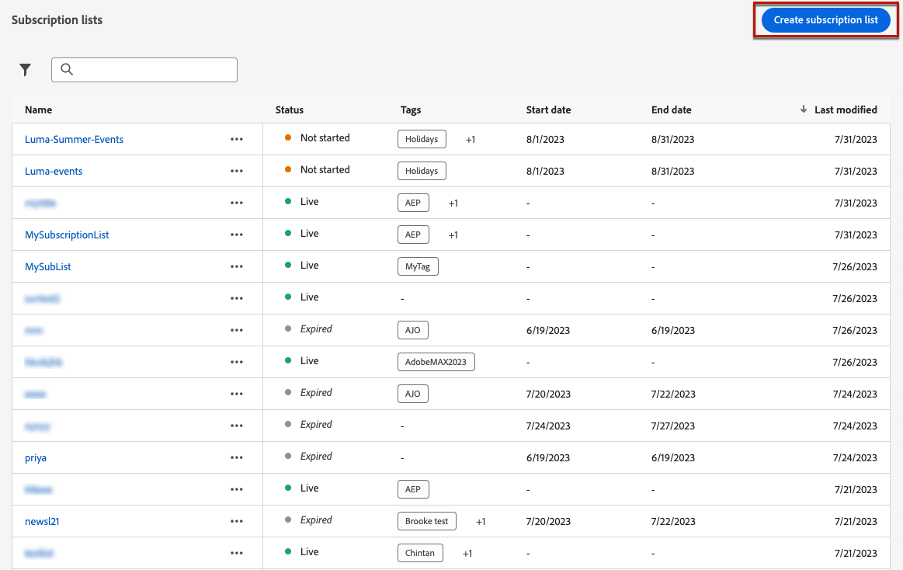
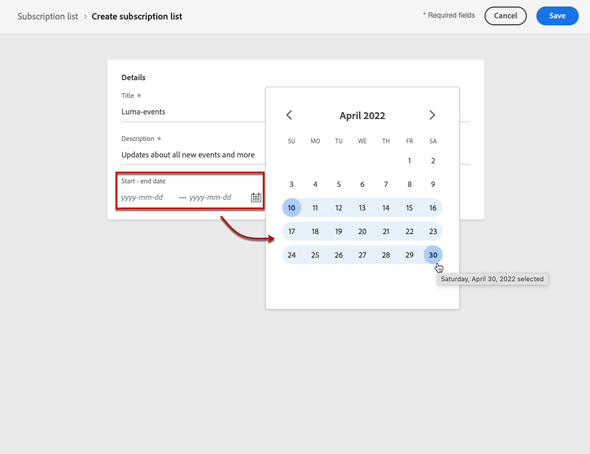
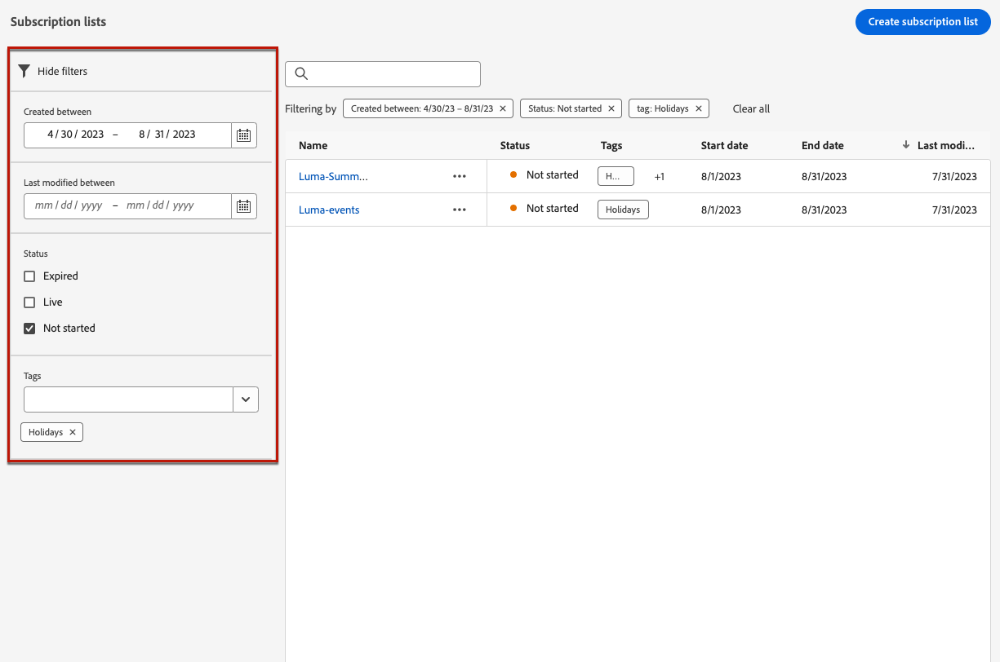

# Subscription lists {#create-subscription-list}

## What is a subscription list? {#subscription-list-definition}

A subscription service refers to marketing goods and services provided to customers who have opted in to receive communications on a specific subject/event/interest/etc. on an ongoing basis. In [!DNL Journey Optimizer], these opted-in customers are gathered into a subscription list.

A subscription service can be:

* a newsletter, for example: "Running series"
* an event, for example: "Summit 2021"
* a webinar, for example: "Learn more about crypto"
* an interest on a particular product/sport/service/etc., for example: "Interested to buy a house in the next 12 months"
* a preference on how to be notified, for example: "Receive new song notifications on email"

The profiles can be added to a subscription list through a [landing page](create-lp.md). An example is presented in [this section](lp-use-cases.md#subscription-to-a-service).

## Define a subscription list {#define-subscription-list}

To create a subscription list, follow the steps below.

1. To access the subscription lists, select **[!UICONTROL Customer]** > **[!UICONTROL Subscription list]**.

    

1. Select the **[!UICONTROL Create subscription list]** button.

    

1. Add a name and a description. These fields are mandatory.

1. You can define a start date and end date.

    

1. Click **[!UICONTROL Save]**.

The list displays all the subscription lists created. You can filter them based on the creation date or modification date, and their status.

The possible statuses are as follows:

* **[!UICONTROL Not started]**: You defined a start date that is later than the current day. The subscribed profiles will not receive yet communications relating to this subscription list.
* **[!UICONTROL Live]**: The current day is comprised between the subscription list start date and end date, or you did not defined end/start dates, which means the subscription list is always live.
* **[!UICONTROL Expired]**: The end date is passed, thus the subscription list is not valid anymore. Any subscribed profile will not receive any more communications relating to this subscription list.

Once the subscription list is created, you can use it in a landing page. The profiles who opt in through the landing page form will be added to the list. [Learn more](design-lp.md)

You can also use subscription lists as segments when [building journeys](../building-journeys/journey-gs.md#jo-build) and adding personalization.

>[!NOTE]
>
>You can monitor your subscription list impacts through specific reports. [Learn more](../reports/subscription-report-live.md)
