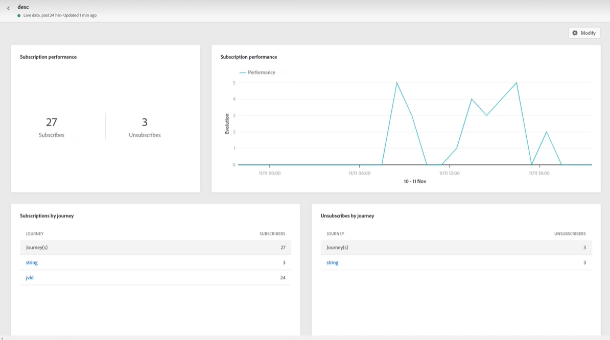
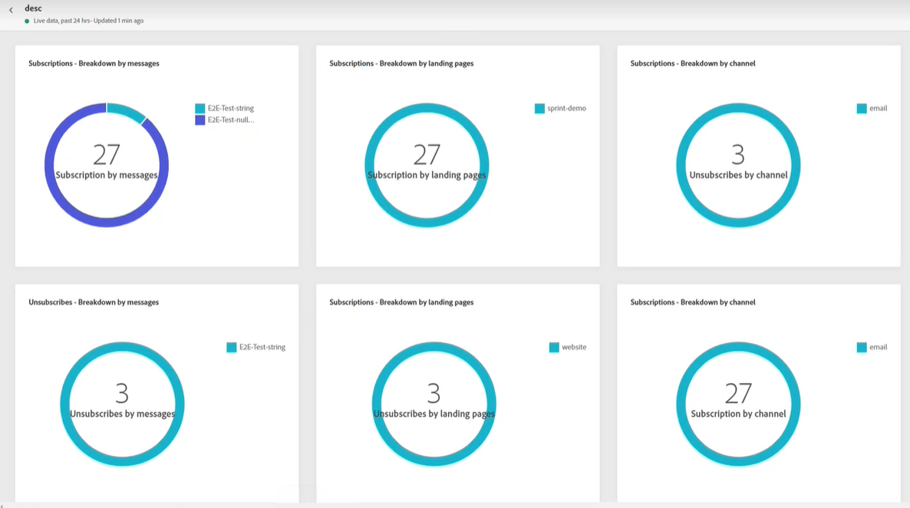
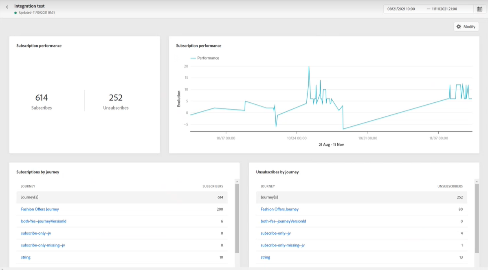
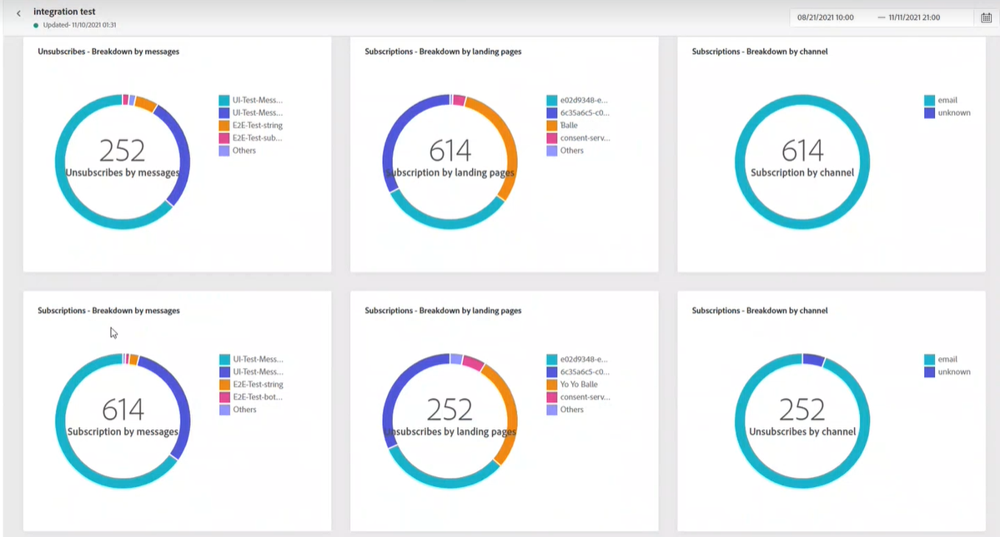

# Subscription report {#subscription-report}

The subscription report displays details about the activity of your subscribers. Two report types are available:

* The **[!UICONTROL Live report]** to measure and visualize your deliveries' subscriptions and unsubscriptions over the last 24 hours only.

* The **[!UICONTROL Global report]** to measure and visualize your deliveries' subscriptions and unsubscriptions over a selected time period.

To access your reports, select **Live** or **[!UICONTROL Global report]** from the advanced menu of your selected subscription list.

## Subscription live report {#subscription-live}

The **[!UICONTROL Subscription performance]** KPIs and the **[!UICONTROL Subscriptions by journey]**/**[!UICONTROL Unsubscribes by journey]** tables detail the main information relative to visitors' engagement with your landing page. The tables and KPIs contain the data available related to your landing page, such as:

* **[!UICONTROL Subscribes]**: Total number of subscriptions in the last 24 hours.

* **[!UICONTROL Unsubscribes]**: Total number of unsubscriptions in the last 24 hours.

The **[!UICONTROL Subscription performance]** graph shows the evolution of subscriptions in the last 24 hours.

The **Subscriptions - Breakdown** and **Unsubscribes - Breakdown** graphs represent the total number of persons who subscribed or unsubscribed in the last 24 hours depending on the messages, landing pages and channels.

## Subscription global report {#subscription-global}

The **[!UICONTROL Subscription performance]** KPIs and the **[!UICONTROL Subscriptions by journey]**/**[!UICONTROL Unsubscribes by journey]** tables detail the main information relative to your visitors' engagement with your landing page. The tables and KPIs contain the data available related to your landing page, such as:

* **[!UICONTROL Subscribes]**: Total number of subscriptions for the concerned period.

* **[!UICONTROL Unsubscribes]**: Total number of unsubscriptions for the concerned period.

The **[!UICONTROL Subscription performance]** graph shows the evolution of subscriptions for the concerned period.

The **Subscriptions - Breakdown** and **Unsubscribes - Breakdown** represent the total number of persons who subscribed or unsubscribed over the selected time period depending on the messages, landing pages and channels.

