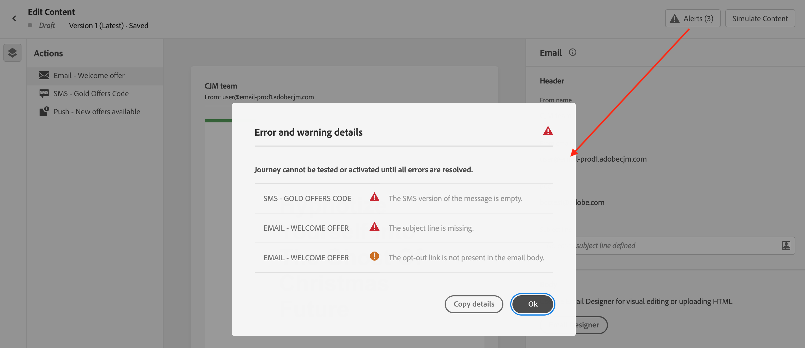

# Check alerts on your messages {#messages-alerts}

## Checks before sending {#message-alerting}

As you are designing your messages, alerts are displayed in the interface when key settings are missing.

Alerts are displayed on top right of the screen, when editing the message content.

>[!NOTE]
>
>If you do not see this button, no alert has been detected.

Two types of alerts can happen:

* **Warnings** refer to recommendations and best practices. For example, a message will display if the opt-out link is missing.

* **Errors** prevent you from testing or activating the journey as long as they are not resolved. For example, a message will warn you that the subject line is missing.

All possible warnings and errors are detailed [below](#alerts-and-warnings).

>[!CAUTION]
>
> You need to resolve all **error** alerts before testing or activating the journey using the message.

## List of warnings and errors {#alerts-and-warnings}

The settings and elements checked by the system are listed below. You will also find information on how to adapt your configuration to resolve the corresponding issues.

**Warnings**:

* **[!UICONTROL The opt-out link is not present in the email body]**: adding an unsubscription link into your email body is a best practice. Learn how to configure it in [this section](../privacy/opt-out.md#opt-out-management).

    >[!NOTE]
    >
    >Marketing-type email messages must include an opt-out link, which is not required for transactional messages. The message category (**[!UICONTROL Marketing]** or **[!UICONTROL Transactional]**) is defined at the [channel surface](../configuration/channel-surfaces.md#email-type) (i.e. message preset) level and when [creating the message](get-started-content.md#create-new-message).

* **[!UICONTROL Text version of HTML is empty]**: do not forget to define a text version of your email body, as it will be used when HTML content cannot be displayed. Learn how to create the text version in [this section](../email/text-version-email.md).

* **[!UICONTROL Empty link is present in email body]**: check that all the links in your email are correct. Learn how to manage content and links in [this section](../email/create-email-content.md).

* **[!UICONTROL Email size has exceeded the limit of 100KB]**: for optimal delivery, make sure the size of your email does not exceed 100KB. Learn how to edit email content in [this section](../email/create-email-content.md).

**Errors**:

* **[!UICONTROL The subject line is missing]**: email subject line is mandatory. Learn how to define and personalize it in [this section](../email/create-email.md).

    <!--HTML is empty when Amp HTML is present-->

* **[!UICONTROL The push version of the message is empty]**: this error is displayed when the push notification body or title is missing. Learn how to define push notification content in [this section](../push/create-push.md).

* **[!UICONTROL The email version of the message is empty]**: this error is displayed when the email content has not been configured. Learn how to design email content in [this section](../email/design-emails.md).

* **[!UICONTROL Surface doesn't exist]**: you cannot use your message if the surface you have selected is deleted after the message creation. If this error occurs, select another surface in the message **[!UICONTROL Properties]**. Learn more on channel surfaces in [this section](../configuration/channel-surfaces.md).

* **[!UICONTROL Push iOS/Android payload has exceeded limit of 4KB]**: the push notification size cannot exceed 4KB. To respect this limit, try to reduce the use of images or emojis. Learn how to manage your push notification content in [this section](../push/create-push.md).

>[!CAUTION]
>
> To be able to use your message, you need to resolve all **error** alerts.

<!--Other issues can stop publication such as:
* The push notification title is empty-->
