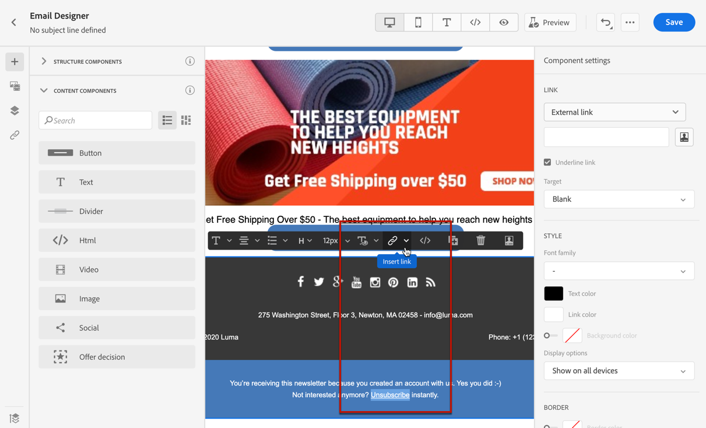
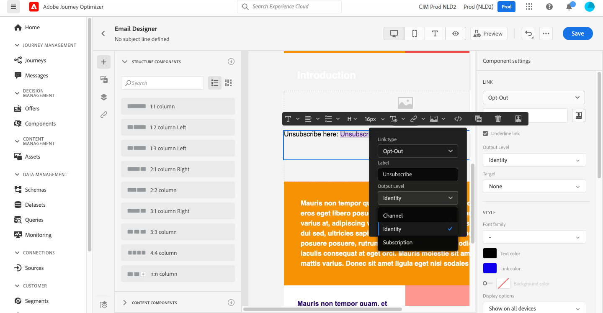
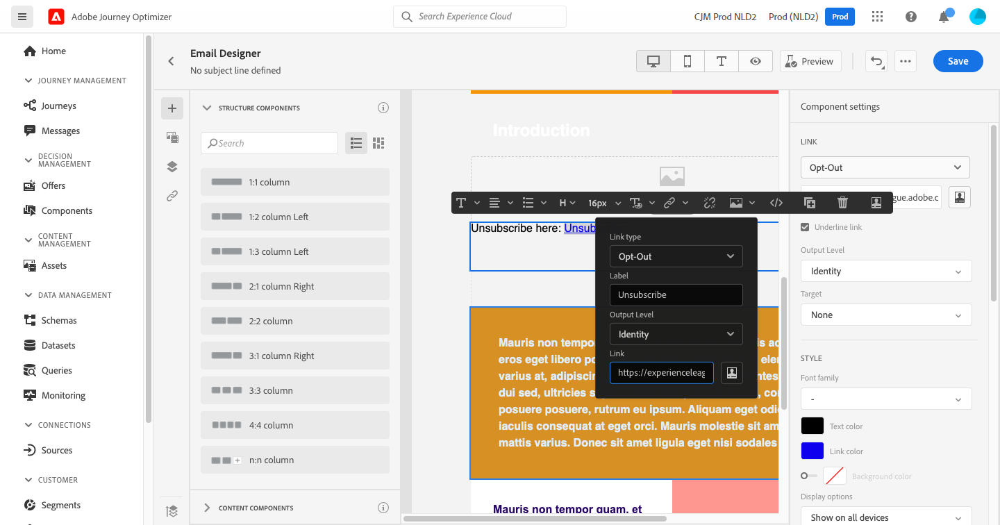

# Manage consent {#consent}

Use [!DNL Journey Optimizer] to track your recipients' consent for communication and understand how they want to engage with your brand by managing their preferences and subscriptions.

Regulations such as GDPR state that you must comply with specific requirements before being able to use information from Data Subjects. Moreover, Data Subjects should be able to modify their consent at any time.

**Why is it important?**

* Failing to comply with these regulations introduces regulatory legal risks for your brand.
* It helps you avoid sending unsolicited communications to your recipients, which could make them mark your messages as spam and harm your reputation.

Learn more on managing Privacy and the applicable regulations in the [Experience Platform documentation](https://experienceleague.adobe.com/docs/experience-platform/privacy/home.html){target="_blank"}.

>[!NOTE]
>
>In [!DNL Journey Optimizer], consent is handled by the Experience Platform [Consent schema](https://experienceleague.adobe.com/docs/experience-platform/xdm/field-groups/profile/consents.html){target="_blank"}. By default, the value for the consent field is empty and treated as consent to receive your communications. You can modify this default value while onboarding to one of the possible values listed [here](https://experienceleague.adobe.com/docs/experience-platform/xdm/data-types/consents.html#choice-values){target="_blank"}.

## Email opt-out management {#opt-out-management}

Providing the capability to recipients to unsubscribe from receiving communications from a brand is a legal requirement. Learn more about the applicable legislation in the [Experience Platform documentation](https://experienceleague.adobe.com/docs/experience-platform/privacy/regulations/overview.html#regulations){target="_blank"}.

Therefore, you must always include an **unsubscribe link** in every email sent out to recipients:

* Upon clicking this link, the recipients will be directed to a landing page to confirm opting out.
* After confirming their choice, the profiles' data will be updated with this information.

>[!NOTE]
>
>Marketing-type email messages must include an opt-out link, which is not required for transactional messages. The message category (**[!UICONTROL Marketing]** or **[!UICONTROL Transactional]**) is defined at the [channel surface](../configuration/channel-surfaces.md#email-type) (i.e. message preset) level and when [creating the message](get-started-content.md#create-new-message).

### External opt-out {#opt-out-external-lp}

To do this, you can insert a link to an external landing page into an email in order to enable users to unsubscribe from receiving communications from your brand.

#### Add an unsubscribe link {#add-unsubscribe-link}

You first need to add an unsubscribe link into a message. To do this, follow the steps below:

1. Build your own unsubscription landing page.

1. Host it on the third-party system of your choice.

1. [Create a message](get-started-content.md) in a journey.

1. Select text in your content and [insert a link](../design/message-tracking.md#insert-links) using the contextual toolbar.

    

1. Select **[!UICONTROL External Opt-out/Unsubscription]** from the **[!UICONTROL Link type]** drop-down list.

    

1. In the **[!UICONTROL Link]** field, paste the link to your third-party landing page.

    

1. Click **[!UICONTROL Save]**.

#### Implement an API call for opt-out {#opt-out-api}

To have your recipients opted out when they submit their choice from the landing page, you must implement a **Subscription API call** through [Adobe Developer](https://developer.adobe.com){target="_blank"} to update the corresponding profiles' preferences.

This POST call is as follows:

Endpoint: platform.adobe.io/journey/imp/consent/preferences

Query parameters:

* **params**: contains the encrypted payload
* **sig**: signature
* **pid**: encrypted profile ID

These three parameters will be included into the third-party landing page URL sent to your recipient:


Header requirements:

* x-api-key
* x-gw-ims-org-id
* x-sandbox-name 
* authorization (user token from your technical account)

Request body:

```
{
   "marketing": [
       {
            "type": "email",           
            "choice": "no",          
            "scope": "channel"       
        }
    ],
 
}
```

[!DNL Journey Optimizer] will use these parameters to update the corresponding profile's choice through the [Adobe Developer](https://developer.adobe.com){target="_blank"} API call.

#### Send the message with unsubscribe link {#send-message-unsubscribe-link}

Once you configured the unsubscribe link to your landing page and implemented the API call, your message is ready to be sent.

1. Send the message including the link through a [journey](../building-journeys/journey.md).

1. Once the message is received, if the recipient clicks the unsubscribe link, your landing page is displayed.

    

1. If the recipient submits the form (here, by hitting the **Unsubscribe** button in your landing page), the profile data is updated through the [API call](#opt-out-api).

1. The opted-out recipient is then redirected to a confirmation message screen indicating that opting out was successful.

    

    As a result, this user will not receive communication from your brand unless subscribed again.

1. To check that the corresponding profile's choice has been updated, go to Experience Platform and access the profile by selecting an identity namespace and a corresponding identity value. Learn more in the [Experience Platform documentation](https://experienceleague.adobe.com/docs/experience-platform/profile/ui/user-guide.html#getting-started){target="_blank"}.

    

    In the **[!UICONTROL Attributes]** tab, you can see the value for **[!UICONTROL choice]** has changed to **[!UICONTROL no]**.

### One-click opt-out {#one-click-opt-out}

As many customers look for an easier process to unsubscribe, you can also add a one-click opt-out link into your email content. This link will enable your recipients to quickly unsubscribe from your communications, without being redirected to a landing page where they need to confirm their choice, which speeds up the unsubscribe process.

To add an opt-out link in your email, follow the steps below.

1. [Insert a link](../design/message-tracking.md#insert-links) and select **[!UICONTROL One click Opt-out]** as the type of link.

    

1. Select how you want to apply the opting out: at the channel, identity, or subscription level.

    

    * **[!UICONTROL Channel]**: The opt-out applies to future messages sent to the profile's target (i.e. email address) for the current channel. If several targets are associated with a profile, the opt-out applies to all targets (i.e. email addresses) in the profile for that channel.
    * **[!UICONTROL Identity]**: The opt-out applies to future messages sent to the specific target (i.e. email address) being used for the current message.
    * **[!UICONTROL Subscription]**: The opt-out applies to future messages associated with a specific subscription list. This option can only be selected if the current message is associated with a subscription list.

1. Enter the URL of the landing page where the user will be redirected once unsubscribed. This page is only here to confirm that opting out was successful.

    >[!NOTE]
    >
    >If you enabled the **List-Unsubscribe** option at the channel surface level, this URL will also be used when users click the unsubscribe link in the email header. [Learn more](#unsubscribe-header)

    

    You can personalize your links. Learn more on personalized URLs in [this section](../personalization/personalization-syntax.md).

1. Save your changes.

Once your message is sent through a [journey](../building-journeys/journey.md), if a recipient clicks the opt-out link, their profile is immediately opted out.

### Unsubscribe link in email header {#unsubscribe-header}

>[!CONTEXTUALHELP]
>id="ajo_admin_preset_unsubscribe"
>title="Add unsubscribe link to email header"
>abstract="Enable List-Unsubscribe to add an unsubscribe link to the email header. To set an unsubscribe URL, insert a one-click opt-out link into the email content."
>additional-url="https://experienceleague.adobe.com/docs/journey-optimizer/using/messages/consent.html?lang=en#one-click-opt-out" text="One-click opt-out"

If the [List-Unsubscribe option](../configuration/channel-surfaces.md#list-unsubscribe) is enabled at the channel surface level, the corresponding emails sent with [!DNL Journey Optimizer] will include an unsubscribe link in the email header.

For example, the unsubscribe link will display like this in Gmail:


>[!NOTE]
>
>To display the unsubscribe link in the email header, the recipients' email client must support this feature.

The unsubscribe address is the default **[!UICONTROL Mailto (unsubscribe)]** address displayed in the corresponding channel surface. [Learn more](../configuration/channel-surfaces.md#list-unsubscribe).

To set a personalized unsubscribe URL, insert a one-click opt-out link into the email message content and enter the URL of your choice. [Learn more](#one-click-opt-out)

Depending on the email client, clicking the unsubscribe link from the header can have the following impacts:

* The unsubscribe request is sent to the default unsubscribe address.

* The recipient is directed to the landing page URL that you specified when adding the opt-out link to your message.

    >[!NOTE]
    >
    >If you do not add a one-click opt-out link into your message content, no landing page will be displayed.

* The corresponding profile is immediately opted out and this choice is updated in Experience Platform. Learn more in the [Experience Platform documentation](https://experienceleague.adobe.com/docs/experience-platform/profile/ui/user-guide.html#getting-started){target="_blank"}.

## Push opt-out management {#push-opt-out-management}

Push recipients can unsubscribe through their devices themselves.

For example, upon downloading or when using your app, they can select to stop notifications. Similarly, they can change the notification settings through the mobile operating system.

## SMS opt-out management {#sms-opt-out-management}

In accordance with the industry standards and regulations, SMS recipients can reply with opt-in and opt-out keywords.
Adobe Journey Optimizer automatically processes the following keywords in incoming messages: START, STOP, and UNSTOP. These keywords trigger automatic standard replies from the SMS provider.

For more information on SMS opt-out, refer to this [page](../messages/create-sms.md#opt-in-and-opt-out).