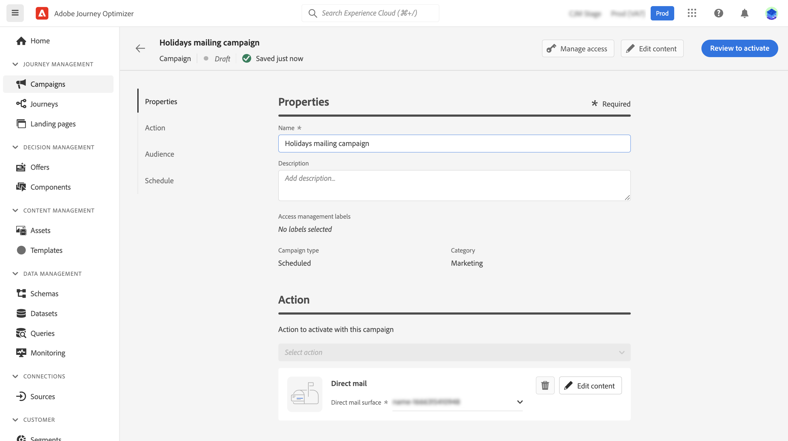
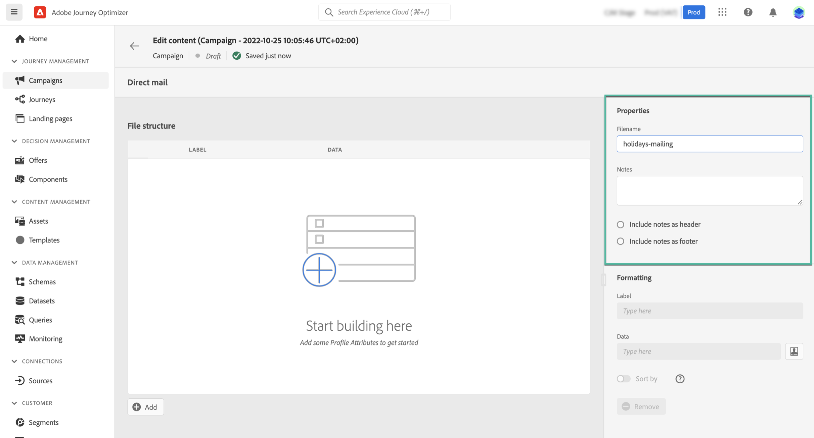
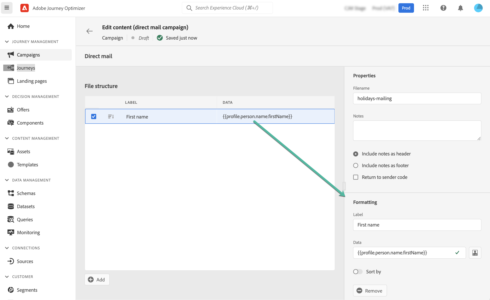

# Create a direct mail message {#create-direct}

>[!CONTEXTUALHELP]
>id="ajo_direct_mail"
>title="Direct mail creation"
>abstract="Create direct mail messages in scheduled campaigns and design the extraction files required by direct mail providers to send mail to your customers."

Direct mail is an offline channel that allows you to personalize and generate the extraction files required by direct mail providers to send mail to your customers.

When you create a direct mail, Journey Optimizer generates a file including all the targeted profiles and the chosen data (postal address, profile attributes for example). You will then be able to send this file to your direct mail provider who will take care of the actual sending.

Direct mail messages can only be created in the context of scheduled campaigns. They are not available for use in API-triggered campaigns or in journeys.

>[!IMPORTANT]
>
>Before sending a direct mail message, make sure you have configured:
>* A [file routing configuration](../configuration/direct-mail-configuration.md#file-routing-configuration) which specifies the server where the extraction file should be uploaded and stored,
>* A [direct mail message surface](../configuration/direct-mail-configuration.md#direct-mail-surface) which will reference the file routing configuration.

## Create your direct mail message {#create}

The steps to create and send a Direct mail message are as follows:

1. Create a new scheduled campaign, select **[!UICONTROL Direct mail]** as your action and choose the message surface to use.

	

1. Click **[!UICONTROL Create]** then define basic information on your campaign (name, description). [Learn how to configure a campaign](../campaigns/create-campaign.md)

	
	
1. Click the **[!UICONTROL Edit content]** button to configure the extraction file to send to your direct mail provider. 

1. Define the name of the extraction file in the **[!UICONTROL Filename]** field.

	Sometimes you may need to add information at the beginning or at the end of the extraction file. To do this, use the **[!UICONTROL Notes]** field then specify if you want to include the note as a header or footer.

	<!--Click on the button to the right of the Output file field and enter the desired label. You can use personalization fields, content blocks and dynamic text (see Defining content). For example, you can complete the label with the delivery ID or the extraction date.-->

	

1. Use the left hand-side area to define the information to be displayed as columns into the extraction file:

	1. Click the **[!UICONTROL Add]** button to add a new column, then select it from the list.

	1. In the **[!UICONTROL Formatting]** section, specify a label for the column then define the profile attributes to display using the [Expression Editor](../personalization/personalization-build-expressions.md).

		
		
	1. To sort the extraction file using the selected column, toggle the **[!UICONTROL Sort by]** option on. The **[!UICONTROL Sort By]** icon will then display next to the column's label in the file structure.

1. Repeat these steps to add as many columns as needed to build your extraction file. Note that you can add up to 50 columns.

	

	You can delete a column at any time by selecting it and clicking the **[!UICONTROL Remove]** button from the **[!UICONTROL Formatting]** section.

1. Once the direct mail content has been defined, complete the configuration of your campaign.

	When the campaign will start, the extraction file will be automatically generated and uploaded to the server specified in your [file routing configuration](../configuration/direct-mail-configuration.md).
