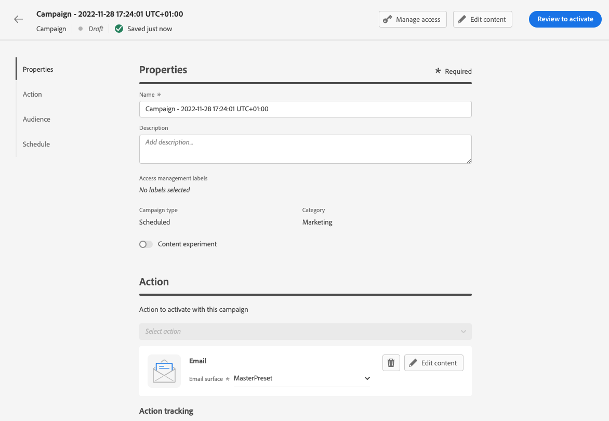
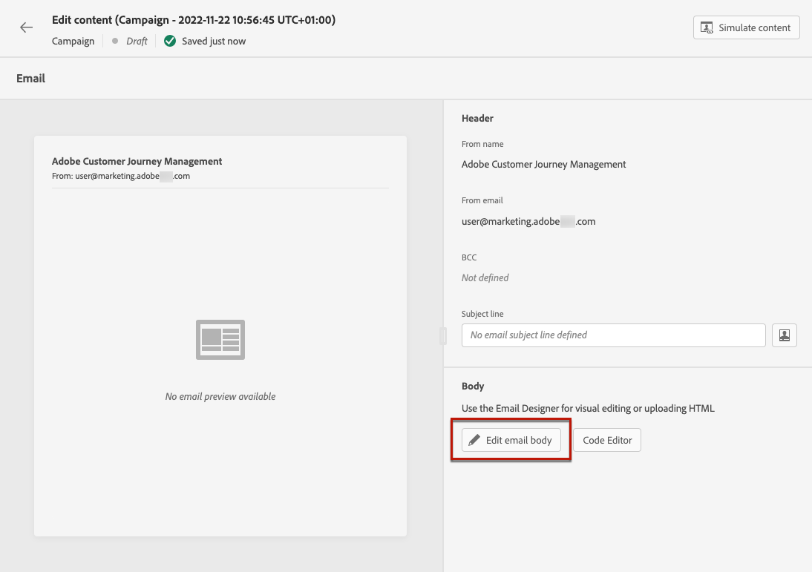
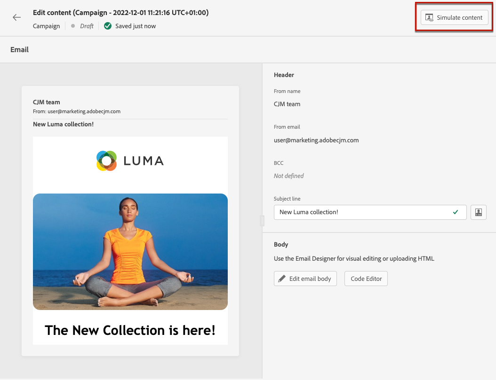

# Create an email {#create-email-bis}

To create an email, follow the steps below.

## 1. Create an email in a journey or a campaign

Add an **[!UICONTROL Email]** action to a journey or a campaign, and follow the steps below according to your case.

>[!BEGINTABS]

>[!TAB Add an email to a journey]

1. Open your journey, then drag and drop an **[!UICONTROL Email]** activity from the **[!UICONTROL Actions]** section of the palette.

1. Provide basic information on your message (label, description, category).

1. Choose the [email surface] to use.

    

For more information on how to configure a journey, refer to [this page](../building-journeys/journey-gs.md).

>[!TAB Add an email to a campaign]

1. Create a new scheduled or API-triggered campaign, and select **[!UICONTROL Email]** as your action.

1. Choose the [email surface] to use.

    

1. Click **[!UICONTROL Create]**.

1. Complete the steps to create an email campaign.

    

<!--
From the **[!UICONTROL Action]** section, specify if you want to track how your recipients react to your delivery: you can track email opens, and/or clicks on links and buttons in your email.

-->

For more information on how to configure a campaign, refer to [this page](../campaigns/get-started-with-campaigns.md).

>[!ENDTABS]

## Define your email content

1. From the journey or campaign configuration screen, click the **[!UICONTROL Edit content]** button to configure the email content. [Learn more]

    

1. In the **[!UICONTROL Header]** section of the **[!UICONTROL Edit content]** screen, the **[!UICONTROL From name]**, **[!UICONTROL From email]** and **[!UICONTROL BCC]** field come from the email surface that you selected. [Learn more] <!--check if same for journey-->

    

1. You can add a subject line. Type plain text directly into the corresponding field, or use the [Expression editor](../personalization/personalization-build-expressions.md) to personalize your subject line.

1. Click the **[!UICONTROL Edit email body]** button to start building your content using the [!DNL Journey Optimizer] Email Designer. [Learn more]

    

    You can also click the **[!UICONTROL Code Editor]** button to code your own content in plain HTML using the pop-up window that displays.

    

    >[!NOTE]
    >
    >If you already created or imported content through the Email Designer, this content will display in HTML.

## Preview your email

Once your message content has been defined, you can preview it to control the rendering of your email, and check personalization settings with test profiles. [Learn more]

You must also check alerts in the upper section of the editor.  Some of them are simple warnings, but others can prevent you from using the message. [Learn more](alerts.md).

## Validate your email content

When your email is ready, complete the configuration of your [journey](../building-journeys/journey-gs.md) or [campaign](../campaigns/create-campaign.md) and activate to send the message.

>[!NOTE]
>
>To track the behavior of your recipients through email openings and/or interactions, make sure that the dedicated options in the **[!UICONTROL Tracking]** section are enabled in the journey's [email activity](../building-journeys/journeys-message.md) or in the email [campaign](../campaigns/create-campaign.md).

You must also check alerts in the upper section of the editor.  Some of them are simple warnings, but others can prevent you from using the message. [Learn more](alerts.md)
