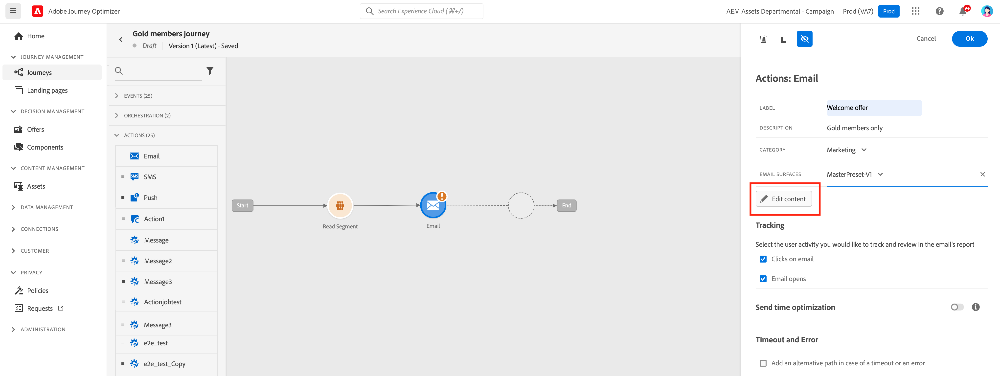

# Create an email {#configure-email}

>[!CONTEXTUALHELP]
>id="ajo_message_email"
>title="Email creation"
>abstract="Define your email parameters in just three simple steps."

Once you [added an email](get-started-content.md) in your journey <!--or a campaign--> and defined basic settings, your can configure the email and define its content.

## Define your email content{#email-content}

Click the **[!UICONTROL Edit content]** button to design your email. 

Use [!DNL Journey Optimizer] Email Designer to [design your email from scratch](../design/create-email-content.md). If you have an existing content, you can [import it in the Email Designer](../design/existing-content.md), or [code your own content](../design/code-content.md) in [!DNL Journey Optimizer]. 

[!DNL Journey Optimizer] comes with a set of [built-in templates](../design/email-templates.md) to halp you start. Any email can also be saved as a template.

Learn more about email design in [this section](../design/design-emails.md).

Use [!DNL Journey Optimizer] Expression editor to personalize your messages with profiles' data. For more on personalization, refer to [this section](../personalization/personalize.md).

## Email tracking{#email-tracking}

If you want to track the behavior of your recipients through openings and/or clicks on links, enable the following options: **[!UICONTROL Email opens]** and **[!UICONTROL Click on email]**. Learn more about tracking in [this section](../design/message-tracking.md).

## Validate your email content{#email-content-validate}

Control the rendering of your email, and check personalization settings with test profiles, using the preview section on the left-hand side. For more on this, refer to [this section](../design/preview.md).

You must also check alerts in the upper section of the editor.  Some of them are simple warnings, but others can prevent you from publishing the message. Learn more in [this section](alerts.md).

>[!NOTE]
>
>The **[!UICONTROL From email]** and **[!UICONTROL From name]** are determined by the **[!UICONTROL Surface]** that has been selected when [creating the message](get-started-content.md).

