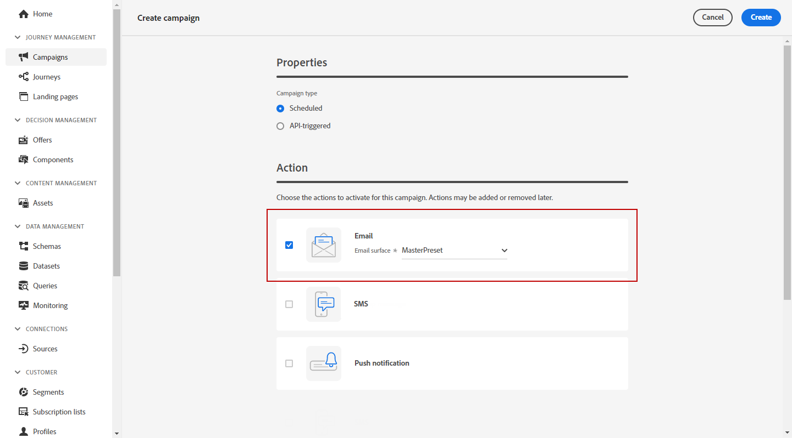

# Create an email {#configure-email}

>[!CONTEXTUALHELP]
>id="ajo_message_email"
>title="Email creation"
>abstract="Define your email parameters in just three simple steps."

Emails can be created:

* In a **Journey**: Once you added an Email activity in your journey, and defined basic settings, use the **[!UICONTROL Actions: Email]** right pane to create the content for the Push notifications. 

    For more information on how to configure your journey, refer to this [page](../building-journeys/journey-gs.md).

    

* In a **Campaign**: Once you created a campaign, select Email as your action and define basic settings. 

    For more information on how to configure your campaign, refer to this [page](../campaigns/create-campaign.md#configure).

   

## Define your email content{#email-content}

Use [!DNL Journey Optimizer] Email Designer to [design your email from scratch](../email/create-email-content.md). If you have an existing content, you can [import it in the Email Designer](../email/existing-content.md), or [code your own content](../email/code-content.md) in [!DNL Journey Optimizer]. 

[!DNL Journey Optimizer] comes with a set of [built-in templates](../email/email-templates.md) to help you start. Any email can also be saved as a template.

Use [!DNL Journey Optimizer] Expression editor to personalize your messages with profiles' data. For more on personalization, refer to [this section](../personalization/personalize.md).

Adapt the content of your messages to the targeted profiles by using [!DNL Journey Optimizer] dynamic content capabilities. [Get started with dynamic content](../personalization/get-started-dynamic-content.md)

## Email tracking{#email-tracking}

If you want to track the behavior of your recipients through openings and/or clicks on links, enable the following options: **[!UICONTROL Email opens]** and **[!UICONTROL Click on email]**. 

Learn more about tracking in [this section](../email/message-tracking.md).

## Validate your email content{#email-content-validate}

Control the rendering of your email, and check personalization settings with test profiles, using the preview section on the left-hand side. For more on this, refer to [this section](../email/preview.md).

You must also check alerts in the upper section of the editor.  Some of them are simple warnings, but others can prevent you from using the message. Learn more in [this section](alerts.md).

>[!NOTE]
>
>The **[!UICONTROL From email]** and **[!UICONTROL From name]** are determined by the **[!UICONTROL Surface]** that has been selected when [creating the message](get-started-content.md).

