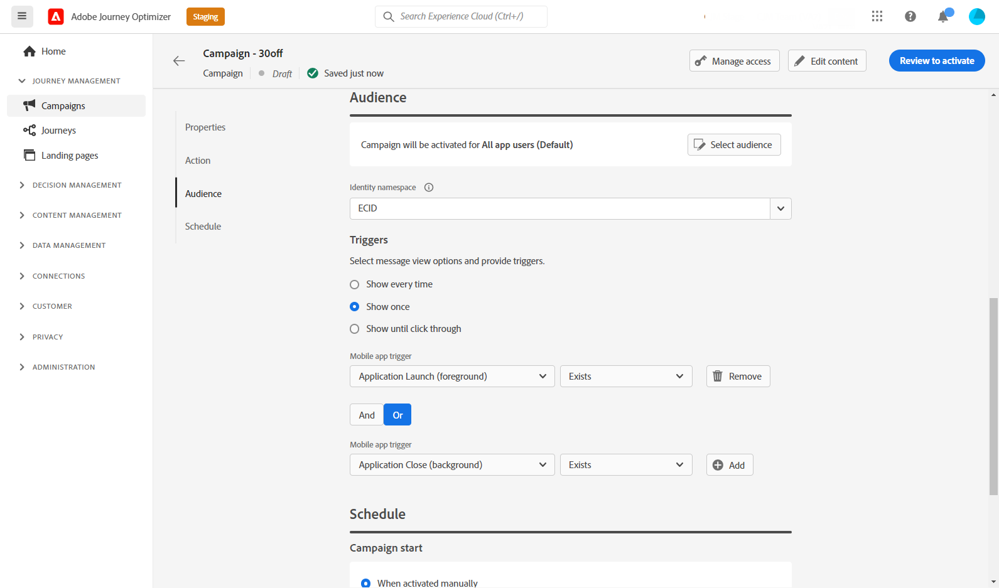
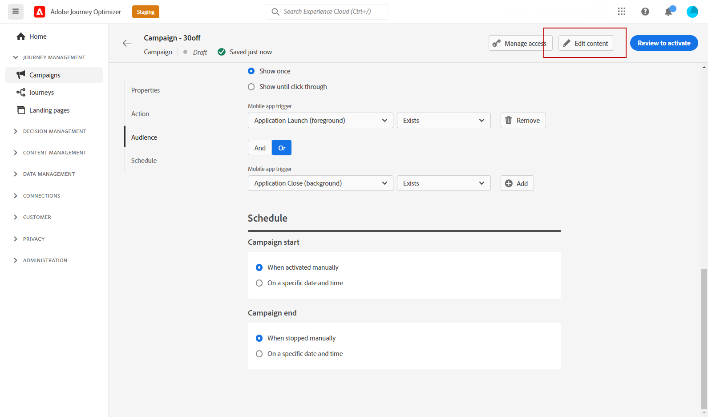
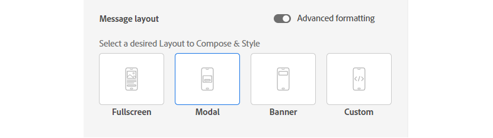
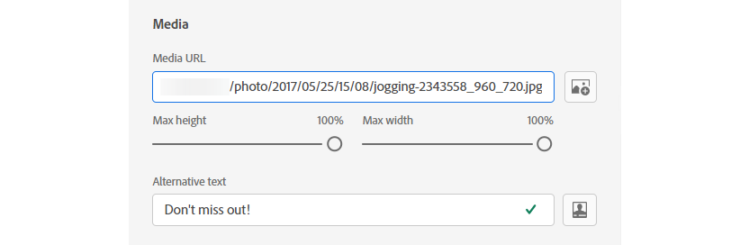
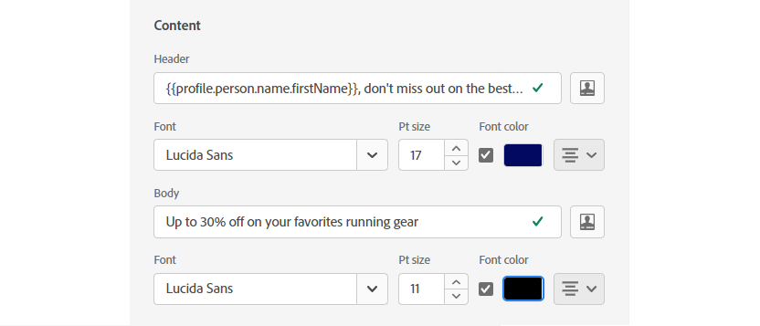

# Create an In-App message {#create-in-app}

## Create a campaign and an In-App message{#create-in-app-in-a-campaign}

To create an In-App notification, follow the steps below:

1. Access the **[!UICONTROL Campaigns]** menu, then click **[!UICONTROL Create campaign]**.

1. In the **[!UICONTROL Properties]** section, specify when you want to execute the campaign:

    * **[!UICONTROL Scheduled]**: execute the campaign immediately or on a specified date. Scheduled campaigns are aimed at sending marketing type messages.

    * **[!UICONTROL API-triggered]**: execute the campaign using an API call. API-triggered campaigns are aimed at sending transactional messages, i.e. messages sent out following an action performed by an individual: password reset, card abandonment etc. Learn how to [trigger a campaign using APIs](../campaigns/api-triggered-campaigns.md)

1. In the **[!UICONTROL Actions]** section, choose the **[!UICONTROL In-app message]** and the **[!UICONTROL Channel surface]** to use to send your message, then click **[!UICONTROL Create]**.

    For more information on surfaces, refer to [this page](../configuration/channel-surfaces.md).

    

1. From the **[!UICONTROL Properties]** section, edit your Campaign's **[!UICONTROL Title]** and **[!UICONTROL Description]**.

1. To assign custom or core data usage labels to the landing page, select **[!UICONTROL Manage access]**. Learn more on [Object Level Access Control (OLAC)](../administration/object-based-access.md).

1. Click the **[!UICONTROL Select audience]** button to define the audience to target from the list of available Adobe Experience Platform segments.  Learn more about segments [in this page](../segment/about-segments.md).

    

1. In the **[!UICONTROL Identity namespace]** field, choose the namespace to use in order to identify the individuals from the selected segment. Learn more on [namespaces](../event/about-creating.md#select-the-namespace).

1. Choose the frequency of your trigger when your In-App message will be active:

    * **[!UICONTROL Show every time]**
    * **[!UICONTROL Show once]**
    * **[!UICONTROL Show until click through]**

1. Choose the event that will trigger your message from the **[!UICONTROL Mobile app trigger]**
drop-down. 
    
    By choosing a trigger, you choose an action done by users which will cause the In-App message to be displayed.

    

1. To execute your campaign on a specific date or on a recurring frequency, configure the **[!UICONTROL Schedule]** section. 

    Learn how to schedule campaigns in [this page](../campaigns/create-campaign.md#schedule).

1. You can now start editing your content with the **[!UICONTROL Edit content]** button. 

    Learn more on content design in [this section](#design-content).

    

## Design your In-App content {#design-content}

Configure experience options for In-App messages, including the message layout (full screen, modal, banner or custom) and display, text, and button options.

You can also preview the experience directly from your browser.

### Message layout {#message-layout}

**[!UICONTROL Message Layout]** provides four different layout options to choose from depending on your messaging needs:

* **[!UICONTROL Fullscreen]**: This type of layout covers the entire screen of your audience devices.
    
    It supports media (image, video), text and button components.

* **[!UICONTROL Modal]**: This layout appears in a large alert-style window, your application is still visible in the background.

    It supports media (image, video), text and button components.

* **[!UICONTROL Banner]**: This type of layout appears as a native OS alert message.

    You can only add a **[!UICONTROL Header]** and a **[!UICONTROL Body]** to your message.

* **[!UICONTROL Custom]**: The custom message mode allows you to directly import and edit one of your pre-configured HTML message.

    * Select **[!UICONTROL Compose]** to enter or paste your raw HTML code.
    
        Use the left pane to leverage Journey Optimizer personalization capabilities. For more on this, refer to [this section](../personalization/personalize.md).
    
    * Select **[!UICONTROL Import]** to import the HTML or .zip file containing your HTML content.

### Content tab {#content-tab}

From the **Content** tab, you can define: the content of the notification and the style of the **Close** button. You can also add a media to your In-App notification, and add action buttons from this tab.

#### Close button {#close-button}

Choose the **[!UICONTROL Style]** of your **[!UICONTROL Close button]**:

* **[!UICONTROL Simple]**
* **[!UICONTROL Circle]**
* **[!UICONTROL Custom image]** from a Media URL or your Assets.

+++More options with advanced formatting

If the **[!UICONTROL Advanced formatting mode]** is switched on, you can:

Check the **[!UICONTROL Color]** option to choose the color and opacity of your button.

+++

#### Media {#add-media}

The **[!UICONTROL Media]** field allows you to add media to your In-app message to create a compelling experience for end user.

Type-in your Media URL or click the **[!UICONTROL Select Assets]** icon to directly add assets stored in your Assets library to your In-app message. [Learn more about asset management](../design/assets-essentials.md).
You can also add an **[!UICONTROL Alternative text]** for screen reading applications.

+++More options with advanced formatting

If the **[!UICONTROL Advanced formatting mode]** is switched on, you can customize the **[!UICONTROL Max height]** and **[!UICONTROL Max width]** of your media. 

+++

#### Header and Body {#title-body}

To compose your message, type your text in the **[!UICONTROL Header]** and **[!UICONTROL Body]** fields.

You can also use the **[!UICONTROL Personalization]** icon to define content and personalization data. Learn more about personalization in the Expression Editor [in this section](../personalization/personalize.md).

+++More options with advanced formatting

If the **[!UICONTROL Advanced formatting mode]** is switched on, you can choose for your **[!UICONTROL Header]** and **[!UICONTROL Body]**:

* the **[!UICONTROL Font]**
* the **[!UICONTROL Pt size]**
* the **[!UICONTROL Font Color]**
* the **[!UICONTROL Alignment]**

+++

#### Buttons {#add-buttons}

Add buttons for users to interact with your In-app message. To personalize your button:

1. Edit the Button #1 text (primary) field. You can also use the **[!UICONTROL Personalization]** icon to define content and personalization data.

1. Choose your **[!UICONTROL Interact event]** which will define your button's action after users interacted with it.

1. Enter your web URL or deeplink in the **[!UICONTROL Target]** field.

1. To add multiple buttons, click **[!UICONTROL Add button]**.

+++More options with advanced formatting

If the **[!UICONTROL Advanced formatting mode]** is switched on, you can choose for your **[!UICONTROL Buttons]**:

* the **[!UICONTROL Font]**
* the **[!UICONTROL Pt size]**
* the **[!UICONTROL Font Color]**
* the **[!UICONTROL Alignment]**
* the **[!UICONTROL Button style]**
* the **[!UICONTROL Radius]**
* the **[!UICONTROL Button color]**

+++

### Settings tab {#settings-tab}

#### Preview {#preview-tab}

With the URL provided in the App preview field, you can preview your In-app message directly from your browser.

#### Layout {#layout-options}

Choose your **[!UICONTROL Background color]** or **[!UICONTROL Background image]** 

#### Message {#message-tab}

UI takeover

+++More options with advanced formatting

If the **[!UICONTROL Advanced formatting mode]** is switched on, you can further personalize your message with the following options:

* **[!UICONTROL Customize gestures]**
* **[!UICONTROL UI takeover]**
* **[!UICONTROL Customize UI takeover]**
* **[!UICONTROL Customize size]**
* **[!UICONTROL Customize position]**
* **[!UICONTROL Customize animation]**
* **[!UICONTROL Message round corner]**
* **[!UICONTROL Corner radius]**

+++

### Preview on device {#preview-device}

You can preview the In-App notification in a specific device.

## Review and activate your In-App notification{#in-app-review}

Once your In-App message is created, and its content defined and personalized, you can review and activate it.

To perform this, follow the steps below:

1. Use the **[!UICONTROL Review to activate]** button to display a summary of your message.

    The summary allows you to modify your campaign if necessary, and to check if any parameter is incorrect or missing.

    

1. Check that your campaign is correctly configured, then click **[!UICONTROL Activate]**.

Your campaign is now activated. The In-App notification configured in the campaign is sent immediately, or on the specified date.

Once sent, you can measure the impact of your In-App messages within the Campaign report. For more on reporting, refer to [this section](../reports/campaign-global-report.md).

