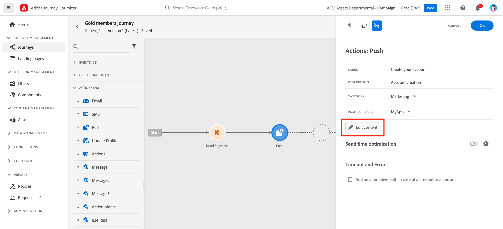
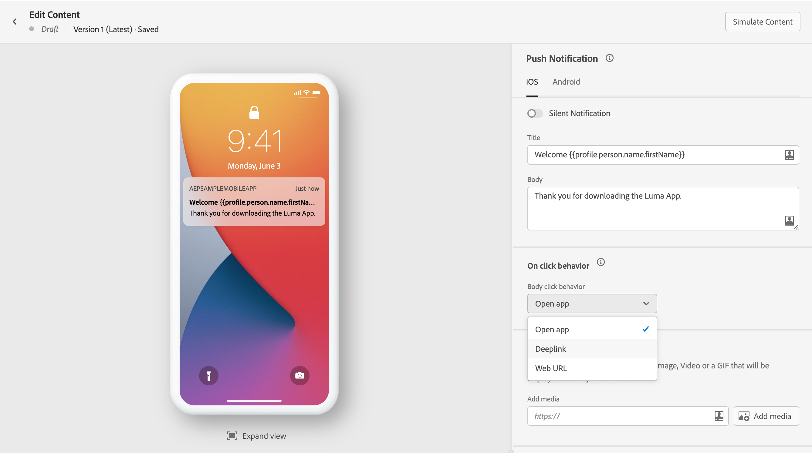
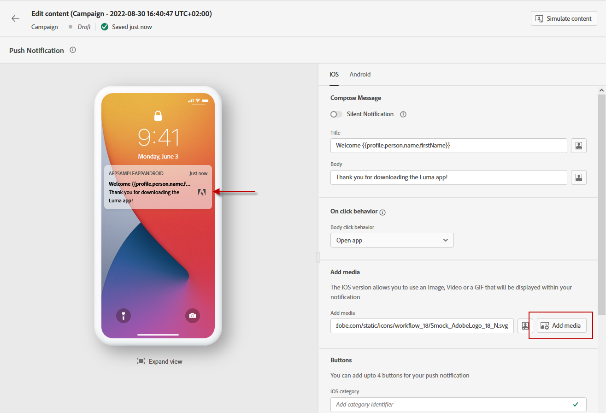
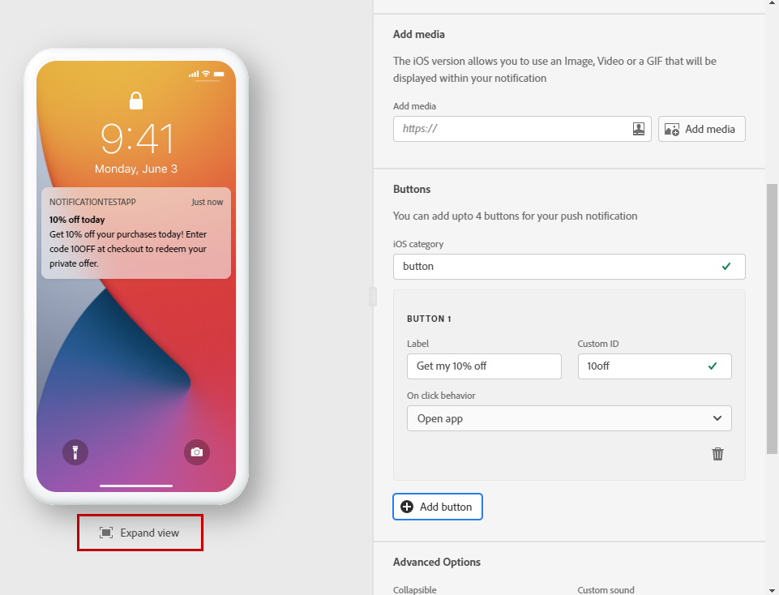

# Create a push notification {#create-push-notification}

>[!CONTEXTUALHELP]
>id="ajo_message_push"
>title="Push message creation"
>abstract="Add your push message and start personalizing it with the Expression Editor."

Push notifications help you reach your mobile app users at any time - especially when they are not actively using your app. Push notifications may help you achieve a variety of use cases such as providing updates about your service, ask a user to take action, alert the user to a new deal, etc. Device platforms require opt-in before end-users may receive or view your notifications. User opt-in may be received as early as after the app is launched for the first time post-install, or in a subsequent session or workflow as appropriate. 

[!DNL Journey Optimizer] supports push notifications and helps you send highly relevant notifications at industry-leading throughput rates. Push notifications may include personalization and Journey-based context in order to leverage data insights your brand has with Adobe Experience Cloud.

Once you [added a push](get-started-content.md) activity to your journey, and defined basic settings, use the **[!UICONTROL Actions: Push]** panel to create the content for the Push notification.

Use the dedicated tabs to define the push notification settings for **iOS** and **Android** operating systems.

If this is your first time creating an Push Notification, make sure the Push channel has been configured. [Learn more](../configuration/push-gs.md).

>[!NOTE]
>
>The **[!UICONTROL Compose Message]** section is common to both the **[!UICONTROL iOS]** and **[!UICONTROL Android]** tabs. Any change in this section will apply to both settings.

## Title and Body {#push-title-body}

To compose your message, click the **[!UICONTROL Title]** and **[!UICONTROL Body]** fields. Use the Expression Editor to define content and personalization data. Learn more about personalization in the Expression Editor in [this section](../personalization/personalize.md)
    
Use the device preview section to visualize how the push notification displays on iOS and Android devices.

## On click behavior {#on-click-behavior}

>[!CONTEXTUALHELP]
>id="ajo-message-push-onclick"
>title="About on click behavior"
>abstract="Select the behavior when a recipient clicks on the body of the push notification."

You can select the behavior when a user clicks on the body of the push notification.

* To open the app, select the **[!UICONTROL Open app]** option. The app associated with the notification is defined in the message **[!UICONTROL Preset]**. [Learn more](../configuration/message-presets.md) about message presets.
* To redirect the user to a specific piece of content within an app, select the **[!UICONTROL Deeplink]** option.  The specific content can be a specific view, a particular section of a page, or a certain tab. Once the option is selected, enter the deeplink in the associated field.
* To redirect the user to an external URL, use the **[!UICONTROL Web URL]** option. Once the option is selected, enter the URL in the associated field.

## Add media {#add-media-push}

In the iOS version of your push notification, you can add an image, a video or a GIF that will be displayed within your notification.

In the Android version, you can only add an image icon, and an image for expanded notifications. 

Two options are available. You can:

*  Use the **[!UICONTROL Add media]** button to select an asset in **[!DNL Adobe Experience Manager Assets Essentials]**.

    Learn how to use **[!DNL Adobe Experience Manager Assets Essentials]** in [this page](../design/assets-essentials.md).
    
* Or enter the URL of the media in the **[!UICONTROL Add media]** field. In that case, you can add personalization to the URL.

Once added, the media displays on the right of the notification body.

## Add buttons {#add-buttons-push}

Create an actionable notification by adding buttons to your push content. 

If the device screen is locked, these buttons are not displayed: only the the **Title** and the **Message** of the notification are visible. If their device is unlocked, recipients will see the buttons.

In the iOS version, you can add up to four buttons. In the Android version, you can add up to three buttons.

>[!NOTE]
>
>For iOS, use the **[!UICONTROL iOS category]** field to associate actions with a notification category.

1. Use the **[!UICONTROL Add button]** to define settings: the label and associated action. Possible actions are the same as for [on-click behavior](#on-click-behavior). 

1. Use the **[!UICONTROL Expand view]** icon under the central preview image to preview your personalized buttons.

## Send a silent notification {#silent-notification}

>[!CONTEXTUALHELP]
>id="ajo_message_push_silent_notification"
>title="About silent notification"
>abstract="Send notifications without disturbing the user, notifications are not shown in the notification center or notification bar."

A silent push notification (or background notification) is a hidden instruction that is delivered to the application. It is used for example to notify your application about the availability of new content or initiate a download in the background.

Select the **[!UICONTROL Silent Notification]** option to silently notify the application: in this case, the notification is transferred directly to the application. No alert is displayed on the device screen.

Use the **[!UICONTROL Custom data]** section to add key-value pairs.

## Custom data

In the **[!UICONTROL Custom data]** section, you can add custom variables to the payload, depending on your mobile application configuration. For more on how to set up push notifications in Adobe Experience Platform and Adobe Launch, refer to [this section](../configuration/push-gs.md)

## Advanced options {#advanced-options-push}

You can configure **[!UICONTROL Advanced options]** for your push notification. Available parameters are listed below:

|Parameter | Description |
|---------|---------|
|**[!UICONTROL Collapsible]** (iOS / Android) | A collapsible message is a message that may be replaced by a new message if it has become outdated. A common use cases of collapsible messages are messages used to tell a mobile app to sync data from the server. An example would be a sports app that updates users with the latest score. Only the most recent message is relevant. On the other hand, with non-collapsible message, very message is important to the client app and needs to be delivered. |
|**[!UICONTROL Custom sound]** (iOS / Android) | The sound to be played by the mobile terminal when the notification is received. The sound needs to be bundled in the app.|
|**[!UICONTROL Badges]** (iOS / Android) | A badge is used to display directly on the application icon the number of new unread information.  The badge value will disappear as soon as the user opens or reads the new content from the application. When a notification is received on a device, it can refresh or add a badge value for the related app. For example, if you are storing the number of unread articles of your customers, you can leverage personalization to send the unique unread articles badge value for each customer. For more personalization, refer to [this section](../personalization/personalize.md).|
|**[!UICONTROL Notification group]**  (iOS only) | Associate a notification group to the push notification. Starting with iOS 12, notification groups allow you to consolidate message threads and notification topics into thread IDs. For example, a brand might send marketing notifications under one group ID, while keeping more operational type notifications under one or more different IDs. To illustrate this, you can have groupID: 123 "check out the new spring collection of sweaters" and groupID: 456 "your package was delivered" notification groups. In this example, all delivery notifications would be bundled under group ID: 456.|
|**[!UICONTROL Notification channel]** (Android only) | Associate a notification channel to the push notification. Starting in Android 8.0 (API level 26), all notifications must be assigned to a channel in order to display. For more on this, refer to the [Android developer documentation](https://developer.android.com/guide/topics/ui/notifiers/notifications#ManageChannels).|
|**[!UICONTROL Add content-availability flag]** (iOS only) | Sends the content available flag in the push payload to ensure that the app is woken up as soon as it receives the push notification, meaning that the app will be able to access the payload data.  This works even if the app is running in the background and without needing any user interaction (e.g. tapping on Push notification). However, this does not apply if the app is not running. For more on this, refer to the [Apple developer documentation](https://developer.apple.com/library/content/documentation/NetworkingInternet/Conceptual/RemoteNotificationsPG/CreatingtheNotificationPayload.html). |
|**[!UICONTROL Add mutable-content flag]** (iOS only) | Sends the mutable-content flag in the push payload and will allow the push notification content to be modified by a notification service application extension provided in iOS SDK. For more on this, refer to [Apple developer documentation](https://developer.apple.com/library/content/documentation/NetworkingInternet/Conceptual/RemoteNotificationsPG/ModifyingNotifications.html). You can then leverage your mobile app extensions to further modify the content or presentation of arriving push notifications sent from [!DNL Journey Optimizer]. For example, users can leverage this option to decrypt data, change the body or title text of a notification, add a thread identifier to a notification etc.|
|**[!UICONTROL Notification visibility]** (Android only) | Defines the push notification's visibility.  <b>Private</b> will show the notification on all lockscreens, but conceal sensitive or private information on secure lockscreens.  <b>Public</b> will show the notification in its entirety on all lockscreens.  <b>Secret</b> will not reveal any part of the notification on a secure lockscreen.  For more on this, refer the [Android developer documentation](https://developer.android.com/reference/android/app/Notification).|
|**[!UICONTROL Notification priority]** (Android only) | Defines the push notification's importance from Low to Max. This determines how "intrusive" the push notification will be when it is delivered. For more on this, refer to the [Android developer documentation](https://developer.android.com/guide/topics/ui/notifiers/notifications#importance)|
|**[!UICONTROL Delivery priority]** (Android only) | Sets up a high or normal priority for your push notifications. For more information on message priority, refer to the [Google developer documentation](https://firebase.google.com/docs/cloud-messaging/concept-options#setting-the-priority-of-a-message).|

**Related topics**

<!--
* [Understand push notification flow](push-gs.md)
-->

* [Configure push channel](../configuration/push-gs.md)
* [Create a new message](get-started-content.md)
* [Add a message in a journey](../building-journeys/journeys-message.md)
