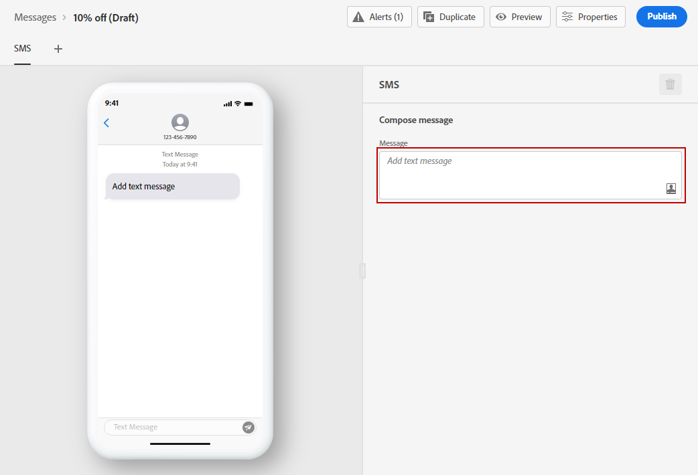
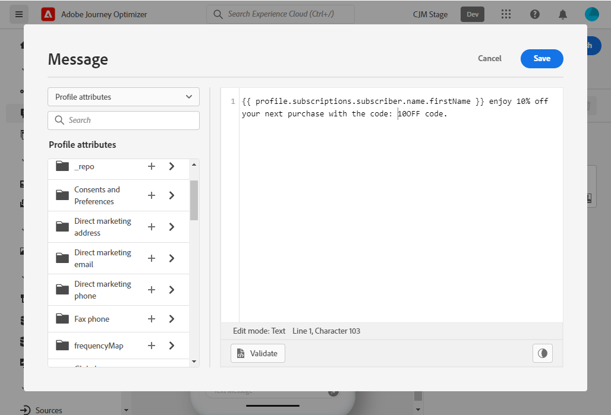

# Create an SMS message {#create-sms}

>[!CONTEXTUALHELP]
>id="ajo_message_sms"
>title="SMS creation"
>abstract="Add your text message and start personalizing it with the Expression Editor."

>[!AVAILABILITY]
>
>The SMS channel is currently only available for a set of organizations (Limited Availability). For more information, contact your Adobe representative.

Once you [created a message](get-started-content.md), use the **[!UICONTROL SMS]** tab to define the settings and content for the SMS channel.

To start personalizing your SMS message, follow these steps:

1. Click the **[!UICONTROL Add text message]** field to open the Expression editor.

    

1. Use the Expression Editor to define content and personalization data. Learn more about personalization in the Expression Editor in [this section](../personalization/personalize.md)

    >[!NOTE]
    >
    > SMS messages are limited to a length of 160 characters.

    

1. Click **[!UICONTROL Save]** when your personalized message is ready.

1. Click **[!UICONTROL Preview]** to visualize how your SMS message will be displayed on mobile devices. For more on this, refer to [this section](../design/preview.md).

1. Once your message is ready, you can publish it to make it available for execution with the **[!UICONTROL Publish]** button. This action will publish the new version of the message that will be used for the next executions in your journeys.

Your SMS message can now be used in a journey. [Learn how to create journeys](../building-journeys/journey-gs.md).

## Opt-in and opt-out{#sms-opt-in-out}

SMS recipients can reply with opt-in and opt-out keywords. In accordance with the industry standards and regulations, Adobe Journey Optimizer automatically processes the following keywords in incoming messages: START, STOP, and UNSTOP. These keywords trigger automatic standard replies from the SMS provider.

**Related topics**

* [Configure SMS channel](../configuration/sms-configuration.md)
* [SMS report](../reports/journey-global-report.md#sms-global)
* [Create a new message](get-started-content.md)
* [Add a message in a journey](../building-journeys/journeys-message.md)
